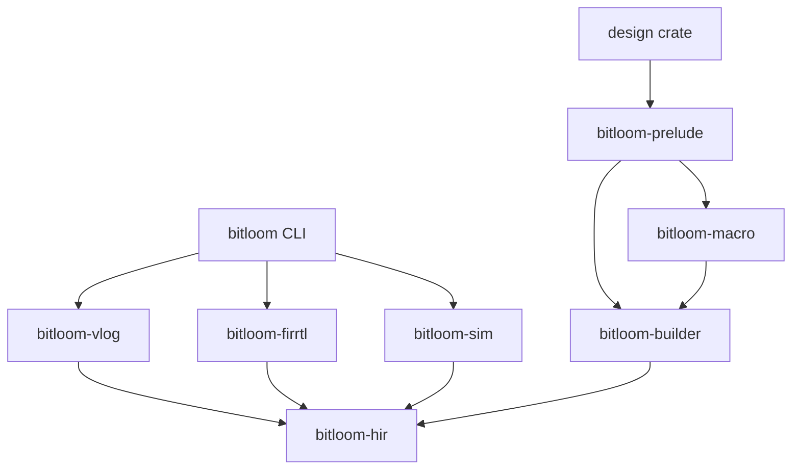
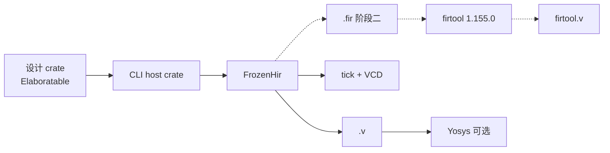

# Architecture Spine — rhdl

## Design Paradigm

**分阶段运行时展开**（Chisel 式）：设计是可执行的 Rust 生成器。`cargo bitloom build` 运行它、得到冻结 HIR、再降后端。过程宏只是 builder API 的语法糖。宏 crate 与 HIR crate 分离。

```text
bitloom (CLI)        → 生成 host crate、调后端、拉 firtool
rhdl-vlog / rhdl-firrtl / rhdl-sim  → 纯函数：&FrozenHir → Artifact
rhdl-hir             → 电路图与检查（唯一所有者）
rhdl-builder / rhdl-macro / **bitloom-prelude**（对外名；目录可暂 `rhdl-prelude/`）  → 设计 crate 只依赖 prelude
```

## Invariants & Rules

### AD-1 — 分阶段运行时展开 [ADOPTED]

- **Binds:** all
- **Prevents:** 一 epic 在 rustc 编译期抽 HIR、另一 epic 跑独立生成器进程；导入另开第三条出生路径
- **Rule:** 可分配 HIR 的只有两处，且都必须以同一私有 `freeze` 结束并返回 `FrozenHir`：(1) 生成器进程里对设计 crate 的 `Elaboratable::elaborate()`；(2) `rhdl-firrtl::import`（AD-3 子集）。设计 crate 的 `cargo test` 若要周期精确仿真，必须先 `elaborate()` 再 `tick`，不得在 rustc 中端旁路出网表。

### AD-2 — 发布身份 [ADOPTED]

- **Binds:** all crates, docs, CI
- **Prevents:** 向 crates.io 发布已被占用的名字 `rhdl` 或 `rhdl-bits`；文档把 samitbasu/rhdl 当成本仓库；设计 crate 依赖 CLI 当库
- **Rule:** Git 仓库可叫 `rhdl`。crates.io 发布名是 **`bitloom`**（公开 CLI；二进制 `cargo-bitloom`，实现见 Epic 11.2）。内部包目录可用 `rhdl-*`，但**对外** `[package].name` 须为 **`bitloom-*`**（发布前查 crates.io）；**禁止** `rhdl` 与 `rhdl-bits`（已被 samitbasu 占用）。**不得**以 `rhdl-rs` 为发布名。设计 crate `[dependencies]` 只依赖 **`bitloom-prelude`**（不得依赖 CLI 包 `bitloom`）。文档首页必须声明与 `samitbasu/rhdl` 无关。公开产品品牌为 **Bitloom**（2026-08-19 命名锁定）。
- **Revised:** 2026-08-19 — 发布身份由 `rhdl-rs` 改为 `bitloom`（FR43 / Story 11.1）。
- **Revised:** 2026-08-20 — 设计依赖由 `rhdl-prelude` 改为对外名 **`bitloom-prelude`**（FR49 / Story 13.1）；Cargo 包改名见 Epic 13.2。

### AD-3 — HIR ↔ FIRRTL 文本双向 [ADOPTED]

- **Binds:** rhdl-firrtl, CLI, 互转 epic
- **Prevents:** 一 epic 只 dump 无往返谓词的 `.fir`、另一 epic 把 FIRRTL 文本契约与 Chisel Scala 产品路径混为一谈
- **Rule:** **FIRRTL 互转契约**仍是 **本工具链的 FrozenHir ↔ 带 `FIRRTL version 6.0.0` 头的文本**。可从 FrozenHir 再生成 Bitloom/RHDL 源（调试用，NFR10）。**不**依赖 Chisel 解析 `.fir`（无 Scala FIRRTL Parser 要求）。导入子集：标量端口；无 property；无 CHIRRTL 特有 mem；无 Analog/InOut。导入必须把 last-connect 规范化成唯一驱动后再 `freeze`。往返谓词：HIR → `.fir` → HIR 在模块层次、公开端口名/宽/向、实例图、ground 运算、寄存器上必须相等；可丢注释、非子集 annotation、规范化前的语句顺序。源名字与参数以 annotation/元数据随 FrozenHir 与导出存活。**Chisel Scala 产品路径见 AD-27**（不替代本 AD）。
- **Revised:** 2026-08-21 — 与 Phase 7 / FR46 对齐：AD-3 专责 FIRRTL 文本；Scala 生成/导入升格为 AD-27。

### AD-4 — 冻结时唯一驱动 [ADOPTED]

- **Binds:** rhdl-hir freeze
- **Prevents:** 一 epic 用线性/所有权类型做门控、另一 epic 只在图上检查；一 epic 允许浮空输入
- **Rule:** 私有 `freeze()` 拒绝多驱动、位宽/方向不匹配、未驱动的输入（除非显式悬空标记）。Rust 所有权可引导 API（`Wire` 移动），**不是**声音性证明。

### AD-5 — 双模型仿真 [ADOPTED]

- **Binds:** rhdl-sim, 测试, 可选生成器
- **Prevents:** 一 epic 只实现 `tick`、另一 epic 发明无对照的第二套仿真语义；把 SystemC TLM-2.0 当成默认合同
- **Rule:** 周期精确仿真只从 `FrozenHir`（原生 `tick`）。`rhdl-sim` 必须能 dump VCD（同一记录器 API）。功能视图可为手写 `#[functional_model]` **或**工具链**生成的 Rust 功能模拟器 crate**（FR47；形态不强制 SystemC）。标 `#[functional_state]` 的字段不得进入 HIR/`freeze`。一致性用随机/对照/`equiv`，比较对象是 `PortValues`（AD-17）。**不**承诺 / **不**要求从 HIR 降低 **SystemC TLM-2.0**。阶段一 IP 仍是普通设计 crate。
- **Revised:** 2026-08-21 — 允许生成 Rust 功能模拟器；废止「禁止一切 HIR→功能模拟器生成」的旧读法（PRD ①C / Epic 19.2）。

### AD-6 — 依赖只准向下 [ADOPTED]

- **Binds:** all crates
- **Prevents:** 设计 crate 或宏依赖后端；两个后端互相依赖；宏直接写 HIR；`tick` 与「不得依赖后端」互相否决
- **Rule:** **后端** = `{bitloom-vlog, bitloom-firrtl, bitloom-sim}`（目录可仍为 `rhdl-*`）。依赖方向如下。箭头表示「允许依赖」。



设计 crate `[dependencies]` 只能是 `bitloom-prelude`。`[dev-dependencies]` 可额外只加 `bitloom-sim`（发布后；Epic 14）。prelude 不得依赖任何后端。`bitloom-macro` 只准依赖 `bitloom-builder`（或零依赖、展开为 builder 路径），禁止依赖 `bitloom-hir` 或后端。设计 crate 不得依赖 CLI。宏不得依赖 vlog/firrtl/sim。  
（工作区目录可暂为 `crates/rhdl-*`，直至 Story 13.2 将 `[package].name` 改为 `bitloom-*`。）

### AD-7 — HIR 所有权与可变性 [ADOPTED]

- **Binds:** rhdl-hir, 全部后端, 设计 crate
- **Prevents:** 未冻结 HIR 逃逸；freeze 只是同类型上的布尔；设计 crate 直接改图；后端成为第二所有者
- **Rule:** 未冻结 HIR 对 `rhdl-hir` 外部不可见。`elaborate()` 与 `import` 返回 `Result<FrozenHir, Diagnostics>`。`freeze` 是二者的私有末步，不是公开第二窗口。后端是纯函数：`fn(&FrozenHir) -> Artifact`。禁止后端回写。设计 crate 不得依赖 `rhdl-hir`；`FrozenHir` / `Diagnostics` 由 prelude 再导出。

### AD-8 — 阶段一 Verilog；HIR 语义对齐 FIRRTL 6 子集 [ADOPTED]

- **Binds:** rhdl-vlog, rhdl-hir, 阶段顺序
- **Prevents:** 阶段一把 FIRRTL 当唯一产物；HIR 语义与将来 `.fir` 出口分叉；两套 `.sv` 抢同一个名字
- **Rule:** 阶段一用户可见的 HDL 产物只有 **`rhdl-vlog` 写出的 Yosys 友好 Verilog**，扩展名 **`.v`**（`wire`/`reg`/`assign`/`always @(posedge …)`；无 packed array、无 `automatic` 局部变量、无作为阶段一契约的 `logic`/`always_ff`）。FIRRTL **导出**与 firtool 降 SV 是阶段二；阶段一 `rhdl-firrtl` 可存在为解析/AST，但不得写出用户面向 `.fir`，也不得调用 firtool。阶段二 firtool SV 写为 `<abi>.firtool.v`，永不覆盖 `<abi>.v`。HIR 节点语义现在就按 FIRRTL spec 6.0.0 可逆子集对齐。阶段一单时钟、无 `Mem`。

### AD-9 — 托管 firtool 钉死 [ADOPTED]

- **Binds:** CLI, rhdl-firrtl, CI
- **Prevents:** 系统 PATH 上的随机 firtool；Cement 式钉死过期 tarball 却当「当前」；两处各自下载
- **Rule:** 调用 firtool 必须是 **firtool-1.155.0**（Chisel 7.14.0 配对，2026-08-11）。这不是 CIRCT HEAD：firtool-1.156.0 已于 2026-08-16 发布，**在 Chisel 配对它之前不得采用**。**只有 CLI** 下载/缓存/调用。产物是该 tag 的 `firrtl-bin-linux-x64.tar.gz`，校验同 tag 发布的 `.sha256`。阶段一宿主：**linux-x64**。首次可联网；缓存命中后必须能离线。覆盖：`RHDL_FIRTOOL_PATH` 指向含 `firtool` 二进制的目录。禁止默认信任 `PATH`。

### AD-10 — 诊断 [ADOPTED]

- **Binds:** 宏, HIR, 后端, CLI
- **Prevents:** 用户输入触发 `panic`/`custom attribute panicked`；各 crate 自编错误枚举、同一码两种含义
- **Rule:** 唯一公开诊断类型是 `Diagnostics` 里的 `Diagnostic { span, code, en, zh }`（`rhdl-hir` 所有，prelude 再导出）。HIR 节点带 builder 传入的 `Span`。码段按 crate 划分，`rhdl::E0xxx`。过程宏对非法输入返回 `compile_error`/该类型，禁止 assert/panic。crate 边界不得另公开平行错误枚举。

### AD-11 — 运行环境 [ADOPTED]

- **Binds:** CLI, CI
- **Prevents:** 把工具链做成托管服务、或假定全局安装 Yosys/Verilator/firtool
- **Rule:** 无云端控制面。`cargo bitloom` 是本机 CLI。firtool 按 AD-9 缓存。Yosys/Verilator 是可选对照，不作为阶段一必装。设计是普通 Cargo 包。

### AD-12 — HIR 模式 [ADOPTED]

- **Binds:** rhdl-hir, 全部后端
- **Prevents:** 一 epic 把 HIR 做成 FIRRTL AST、另一 epic 做成无 Instance 的扁平 netlist
- **Rule:** `rhdl-hir` 的 FrozenHir 是 FIRRTL 6.0.0 可逆子集的**层次 AST**（`Circuit` / `Module` / 语句：Connect、DefNode、DefRegister、DefRegisterWithReset、Instance、Conditionally）。阶段一 ground 类型：`UInt`、`SInt`、`Clock`、`Reset`。无 Bundle/Vector/Analog。展平若发生，只在后端私有视图，不得成为第二种公开 `Hir`。

### AD-13 — 电路唯一所有者 [ADOPTED]

- **Binds:** rhdl-hir, rhdl-builder, rhdl-macro
- **Prevents:** builder 另持一张可变图、freeze 只检查 dump；宏直接构造 HIR 节点
- **Rule:** 电路实体只有 HIR。builder 持有展开会话（`&mut` 未冻结 HIR），没有平行 `CircuitBuilder` 图。`Wire`/`Reg` 不得在 `elaborate()` 返回后仍作为电路所有者存活。宏只展开到 builder API。

### AD-14 — 展开宿主 [ADOPTED]

- **Binds:** CLI, 设计 crate, 后端调用
- **Prevents:** JSON dump vs 进程内链接两套 CLI 协议；设计 crate 为调后端而违反 AD-6
- **Rule:** `cargo bitloom build` 生成 host/shim crate（`target/` 下），该 crate 依赖设计 crate **和** 后端，在同一进程调用 `Elaboratable::elaborate()` 再 `emit`。阶段一禁止把 FrozenHir 序列化当作 CLI 协议。序列化若出现，必须是 `rhdl-hir` 版本化模式，且不是第二套 CLI。

### AD-15 — 阶段一时序契约 [ADOPTED]

- **Binds:** rhdl-hir, rhdl-vlog, rhdl-sim, 功能模型
- **Prevents:** 隐式 `clk` 与显式端口分叉；`tick` 元数不一致；emit 发明端口
- **Rule:** 每个模块在 FrozenHir 上恰好一个 `Clock` 端口和一个同步、高有效 `Reset` 端口。`Reg` 是该时钟上升沿 + 同步复位。`tick` 是该时钟的一个 posedge，复位按端口采样。Verilog 为 `always @(posedge clock)`。禁止 emit 补隐式端口。

### AD-16 — Artifact 与 ABI 名 [ADOPTED]

- **Binds:** rhdl-hir freeze, 全部后端, CLI
- **Prevents:** 后端返回无主 `String`；文件名/mangling 各写一套
- **Rule:** `Artifact` 由 `rhdl-hir` 定义：`{ files: Vec<EmittedFile>, filelist: Vec<String> }`。`freeze` 分配 `abi_name`：每次 elaborate 恰好一个公开 top；私有模块在 freeze 时 mangling。后端必须以 `abi_name` 为文件茎。阶段一 Verilog 文件是 `<abi_name>.v`。

### AD-17 — 双模型值 [ADOPTED]

- **Binds:** rhdl-hir, rhdl-sim, `#[functional_model]`
- **Prevents:** `tick` 用字符串 HashMap、功能模型用另一套字段、对照测试无法比较
- **Rule:** `rhdl-hir` 拥有 `PortValues`（按 FrozenHir 端口表：名 + 运行时宽度）。`tick(&FrozenHir, &mut PortValues)`。`#[functional_model]` 由 `rhdl-macro` 生成 `fn cycle(&mut self, ports: &PortValues) -> PortValues`。对照只比较 `PortValues`。prelude 的 `Bits<W>` 是 builder 门面，降低为运行时宽度。

### AD-18 — 阶段一语言表面 [ADOPTED]

- **Binds:** prelude, builder, macro, freeze
- **Prevents:** 推断 latch vs 显式 comb/seq；裸线 vs 方向包装；算术截断 vs FIRRTL 变宽；非法构造进网表
- **Rule:** `#[combinational]` / `#[sequential]` 强制，禁止推断。组合不完整赋值是错误（无隐式 latch）。组合不得写 `Reg.d`；时序不得驱动组合网。端口类型是 `Input<T>` / `Output<T>`，不是裸 `UInt`。表面算术与连接**严格同位宽**；扩展/截断必须是显式节点。FIRRTL `add` 的 n+1 位只允许由这些显式 pad/trunc 节点产生，禁止 prelude 静默截断而 `.fir` 变宽。周期精确路径拒绝堆（`Vec`/`Box`/`String`）、无界递归、`dyn Trait`、捕获闭包、文件/网络/线程、默认 `f32`/`f64`。`#[functional_state]` 不得进入 freeze/HIR。

### AD-19 — 生成器入口 [ADOPTED]

- **Binds:** prelude, CLI, 测试
- **Prevents:** `fn main` vs 约定文件 vs 属性 三种发现方式；测试找不到 `elaborate()`
- **Rule:** 设计 crate 用 `#[rhdl::top]` 标注实现 `rhdl_prelude::Elaboratable` 的类型。`fn elaborate() -> Result<FrozenHir, Diagnostics>`。`cargo bitloom build` 只发现该属性。测试调用 `T::elaborate()`，周期精确再 `rhdl_sim::tick`。禁止第二套入口。

### AD-20 — 阶段二单时钟语言表面加厚 [ADOPTED]

- **Binds:** prelude, builder, macro, freeze, examples
- **Prevents:** 用阶段一骨架 fixture 冒充「可写真实小设计」；复合类型无宽度/方向门控
- **Rule:** 在不上多时钟/HLS 的前提下，表面必须支持：强制 comb/seq 下的 `if`/`match`（或等价分支）、严格同位宽二元运算与连接、显式 pad/trunc、同步复位 `Reg` 的复位赋值语义，且组合完整赋值检查（AD-18）仍生效。验收以文档化构造清单 + 计数器与单时钟 FIFO 形 fixture 为准（阶段二 PRD FR22）。**`Bundle` 与 `Vec<T,N>`（或文档等价）允许进入可综合路径（FR51）**：位宽/方向不匹配必须在 emit 前失败；不得 silently 可用却无检查。HIR ground 是否扩展 Bundle/Vector 节点由实现选择，但公开表面与 emit 语义须一致。
- **Revised:** 2026-08-21 — 取消「Bundle/Vec 禁止」；由 FR51 / Epic 19.3–19.4 交付。

### AD-21 — Mem 语义 [ADOPTED]

- **Binds:** rhdl-hir, rhdl-vlog, rhdl-firrtl, rhdl-sim, prelude
- **Prevents:** 用户只能写晦涩的规范 `mem` 而无友好表面；以 CHIRRTL 方言文本为互转契约；裸双时钟 `mem` 当默认可综合路径
- **Rule:** **语言表面必须暴露 CHIRRTL 友好名**（对齐 Chisel：`Mem` / `SyncReadMem`；文档可说明与 `cmem`/`smem` 的对应）。语义与降级锚定 **FIRRTL 规范 `mem`**（读延迟等）；导出/导入的互转合同仍是 `firrtl.mem` / 规范子集，**不是**把 CHIRRTL 方言当作 FrozenHir↔`.fir` 契约。双口跨时钟存储 **仅**允许经命名 CDC FIFO（AD-22），不得以未封装的双时钟 `mem` 作为默认可综合路径。

### AD-22 — 多时钟与语言级 CDC [ADOPTED]

- **Binds:** prelude, builder, freeze, sim
- **Prevents:** 一 epic 用 phantom、一 epic 用图分析、一 epic 仅库级且无门控；与 AD-15 单时钟默认打架却无规则
- **Rule:** 时钟域以 **Clash 式 phantom 类型参数**（如 `Signal<D, T>` / 等价 ZST 域标记）进入类型系统；非法跨域在 **freeze** 拒绝（`rhdl::E0xxx`）。合法跨越 **仅**语言级 `DoubleFlop` / `SyncFIFO`（或同名原语）。AD-15 仍是**默认**：未声明多时钟的模块恰好一个 `Clock` + 同步高有效 `Reset`。多时钟模块显式声明域与端口，不得隐式全局时钟。

### AD-23 — 异步复位与时钟使能 [ADOPTED]

- **Binds:** hir, vlog, sim, prelude
- **Prevents:** emit 各写一套复位极性；enable 与门控语义分叉
- **Rule:** 在 AD-15 同步复位之外，阶段二允许模块选用 **异步复位** 与/或 **clock enable / 门控** 作为时序包络选项。语义必须在 HIR 上唯一表示，并在 Verilog/`tick` 上一致。默认模块仍是 AD-15。

### AD-24 — 可选 FST；VCD 默认 [ADOPTED]

- **Binds:** rhdl-sim, CLI
- **Prevents:** 自研 FST writer 与 Verilator 路径两套真相；去掉 VCD
- **Rule:** VCD 仍是默认波形（AD-5）。FST 为可选：允许经 **Verilator `--trace-fst`** 或文档化的 **vcd2fst**；不要求自研 FST writer。开关关闭时必须仍能 dump VCD。

### AD-25 — HLS 仅外挂 [ADOPTED]

- **Binds:** 可选 HLS 前端, CLI
- **Prevents:** 树内自研调度器；把 Handshake/动态数据流当默认 RTL 语义；「永久 unsupported」冒充产品 HLS
- **Rule:** `#[hls]`（或等价）只允许 **发射** 宿主工具接受的 IR/C，并调用 **Bambu 或 XLS**（启用时钉死**一个**后端）。禁止 bitloom/rhdl crate 实现 scheduling/allocation。当产品合同要求 HLS 路径（PRD FR35/FR50 / Phase 7）时：**默认文档路径必须可用**，并有 CI/烟测；禁止以「未启用则永久 unsupported」交差。后端缺失须失败可读，不得 silent 成功。
- **Revised:** 2026-08-21 — 产品化默认路径；仍禁止自研调度。

### AD-26 — 产品合同海拔 [ADOPTED]

- **Binds:** 文档, epic 拆解, agents
- **Prevents:** SPEC / later-product / 阶段二 PRD 三套无 ID 真相
- **Rule:** **阶段一**权威：`SPEC.md` CAP-1…CAP-9。**阶段二及以后**权威：`prd-rhdl-2026-08-19`（含 amendment `overview-literal-C`：**FR21–FR40、FR46–FR52**、NFR3、NFR10–NFR14）。`later-product.md` 仅为索引。本脊柱 AD 不改编号；能力映射见 Capability 表。历史 Phase-3 文档别名：**FR46-tp**（Trusted Publishing）、**NFR14-crates**（crates.io FCFS）≠ 本 PRD 的 FR46 / NFR14。
- **Revised:** 2026-08-21 — 纳入概述字面升格与 NFR14 风险门禁。

### AD-27 — Bitloom ↔ Chisel 产品互操作 [ADOPTED]

- **Binds:** firrtl, CLI (`import` 等), 可选 Scala 生成
- **Prevents:** 一 epic 仍以「尽力失败」交差、另一 epic 要求 idiomatic 手写 Chisel；依赖已删除的 Scala FIRRTL Parser；用调试用 HIR→源码再生冒充 Chisel 双向
- **Rule:** 在 AD-3 FIRRTL 文本契约之外，产品路径（PRD FR28/FR46）要求：(1) FrozenHir/`.fir` → **可编译** Chisel Scala（钉死 Chisel + firtool 配对，见 Stack）；验收=编译通过 + 公开端口名/宽/向与实例层次往返谓词；**允许机械/生成风格**（不要求手写 idiomatic）。(2) `.fir`（及文档化 Chisel 工作流输出）→ FrozenHir / Bitloom 表面 → emit/tick，满足对称往返谓词。(3) **不**要求恢复 Chisel 5 前的 Scala `firrtl.Parser` API；生成器/导入器属于本工具链。(4) NFR10 调试再生 **不得**冒充本 AD 完成。
- **[ASSUMPTION]** 生成器实现可放在 `rhdl-firrtl` 扩展或 `bitloom` CLI 子命令；具体包边界不钉死。

### AD-28 — Phase 7 风险门禁（NFR14）[ADOPTED]

- **Binds:** epic ready, implementation-artifacts
- **Prevents:** 无记录开工 FR46/47/48/49/50；静默把合同降回「尽力/deferred」
- **Rule:** FR46/47/48/49（及适用的 FR50）在 epic/story 标 `ready` **之前**，须有风险记录：上游约束、粗工期带、禁止静默降级清单、负责人。缺记录不得开工。与历史 **NFR14-crates** 无关。

## Consistency Conventions

本表与 AD 同等约束。

| Concern | Convention |
| --- | --- |
| 包名 | 发布 CLI **`bitloom`**；对外库 **`bitloom-hir`**、**`bitloom-vlog`**、**`bitloom-firrtl`**、**`bitloom-sim`**、**`bitloom-prelude`**、**`bitloom-builder`**、**`bitloom-macro`**（目录可暂 `rhdl-*` 直至 13.2） |
| 文件 | 阶段一 `<abi_name>.v`；阶段二另加 `<abi_name>.fir` 与 `<abi_name>.firtool.v` |
| HIR 标识 | 稳定字符串模块名；私有模块 mangling 发生在 freeze（FIRRTL ABI） |
| 错误 | 结构化码 `rhdl::E0xxx`；英文码 + 中文说明 |
| 配置 | `RHDL_FIRTOOL_PATH`；无其它隐式全局 |
| 状态 | 仅 elaborate/import 内部可变；其后只读 `FrozenHir` |
| 日志 | CLI 用 tracing 0.1.x（钉 0.1.44）；生成器库默认安静 |
| 许可 | 工具链 crate：Apache-2.0 OR MIT。生成 HDL 不强制 SPDX |

## Stack

| Name | Version |
| --- | --- |
| rustc (MSRV) | 1.97.1 |
| Rust edition | 2024 |
| FIRRTL language spec | 6.0.0 |
| CIRCT firtool（Chisel 7.14.0 配对，非 CIRCT HEAD） | 1.155.0 |
| firtool 阶段一资产 | firrtl-bin-linux-x64.tar.gz @ firtool-1.155.0 |
| Chisel (interop 对照，非依赖) | 7.14.0 |
| Yosys (可选综合) | 0.68 |
| Verilator (可选对照 sim) | 5.050 |
| tracing (CLI) | 0.1.44 |

## Structural Seed

```text
rhdl/
  crates/
    rhdl-hir/        # FrozenHir AST；freeze；Artifact；PortValues；Diagnostics
    rhdl-builder/    # 运行时会话 API（&mut 未冻结 HIR）
    rhdl-macro/      # 语法糖 → builder；#[rhdl::top] / comb·seq / functional_model
    rhdl-prelude/    # 对外包名 bitloom-prelude；设计 crate 唯一依赖；再导出 FrozenHir
    rhdl-vlog/       # FrozenHir → .v
    rhdl-firrtl/     # FrozenHir ↔ .fir（阶段一：解析/AST）
    rhdl-sim/        # FrozenHir → tick + VCD
    bitloom/         # CLI cargo-bitloom；host crate；firtool 缓存
  examples/          # 生成器 crate，非库内部测试替身
```



## Capability → Architecture Map

| Area | Lives in | Governed by |
| --- | --- | --- |
| 类型 / 模块 / comb·seq / 端口方向 / 位宽 | prelude, builder, macro, freeze | AD-18, AD-4, AD-15 |
| 生成器发现 / elaborate | prelude, CLI | AD-1, AD-19, AD-14 |
| 多驱动 / 未驱动 / ABI 名 | rhdl-hir freeze | AD-4, AD-16 |
| HIR 模式 / FrozenHir | rhdl-hir | AD-7, AD-12, AD-13 |
| Verilog 后端 | rhdl-vlog | AD-8, AD-10, AD-16 |
| FIRRTL 导入导出 | rhdl-firrtl | AD-3, AD-8, AD-9 |
| Chisel 产品互操作 | firrtl / CLI | AD-27, AD-3, AD-9 |
| 周期精确仿真 / VCD | rhdl-sim | AD-5, AD-17 |
| 功能视图（手写或生成 Rust） | 设计 crate / 生成器 | AD-5, AD-17 |
| CLI / firtool / host | bitloom (`crates/bitloom`, bin `cargo-bitloom`) | AD-2, AD-9, AD-11, AD-14 |
| 阶段二表面加厚 + Bundle/Vec | prelude, builder, macro | AD-20, AD-18 |
| Mem | hir, vlog, firrtl, sim | AD-21 |
| 多时钟 / CDC | prelude, freeze, sim | AD-22, AD-15 |
| 异步复位 / enable | hir, vlog, sim | AD-23 |
| FST（可选） | rhdl-sim | AD-24, AD-5 |
| HLS 外挂（产品路径） | 可选前端 + CLI | AD-25 |
| 产品合同海拔 / NFR14 门禁 | docs / PRD / SPEC / impl-artifacts | AD-26, AD-28 |
| IP / 可视化 / formal / float / Analog | 产品 FR；脊柱不钉实现形状 | Deferred（实现形状） |

## Deferred

- **所有权作声音性证明**：永不作为 freeze 门控；若做，独立 epic。
- **SystemC TLM-2.0**：不作为合同；Rust 功能模拟器生成见 AD-5。
- **Chisel idiomatic 手写风格**：非验收条；机械可编译即可（AD-27）。
- **手写 `#[bridge]` / `#[abstraction]` / mixed `both`；形式化等价引擎细节；C ABI / cdylib；覆盖率**（产品 FR 已定，脊柱不钉实现形状）。
- **IP / 可视化 / LSP / 黑盒 / formal/SVA / float / Analog** 的**实现形状**（产品 FR 已定；不在此钉 crate 切分）。
- **interp vs 编译版 `tick` 引擎**（产品 FR32；脊柱不选引擎）。
- **`cargo bitloom` 其余动词**形态细节（FR40；`import`/`visualize`/`wave` 为 Phase 7 必需能力，名称可调）。
- **macos / windows / linux-aarch64 firtool 资产**（NFR11；机制同 AD-9）。
- **firtool-1.156.0**：等 Chisel 正式配对后再改 AD-9 / Stack 表（NFR12）。
- **更高 MSRV（>1.97.1）**：须另改 PRD/NFR13；当前 NFR13 = **1.97.1**。
- **AD-22 phantom 选型的替代**：若推翻，须修订 AD-22，不得 silently 分叉。
- **AD-27 Scala 生成器所在 crate**：`[ASSUMPTION]` 可 firrtl 或 CLI。
