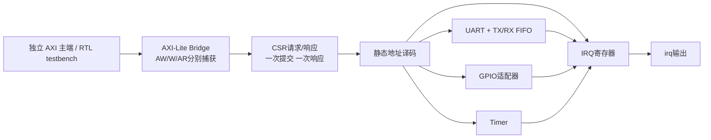

# Bitloom 可组合 IP 库实施计划

建议采用“先修协议底座，再交付外设子系统，同时做一个外部 RTL 接入试点”的路线。第一版成果是可由独立 AXI4-Lite 主端驱动的 UART + GPIO + Timer + IRQ 子系统，配套可复用基础组件、真实 RTL 验证和维护记录。IP 数量不是验收指标。

本文件是详细实施提案；用户本轮批准的是研究与计划。下述 API、目录、命令、数值上限、地址分配、工时和服务节奏均为**拟定值**，不是已交付能力或行业统计。正式 FR/Epic 编号、公共 API 和新阶段合同在启动实施时登记；本文 IP-* 仅为可追踪临时故事 ID。研究依据见 [research.md](research.md)，项目约束和执行探针见 [project-audit.md](imports/project-audit.md)。

## 1. 为什么调整原建议的顺序

本地审计 L4 的两个探针复现：现有 AXI4-Lite 在已接受分离 AW/W 后未形成 B 响应，读写同时接受时可能丢 R 响应。探针只在当前 native Sim 执行，不是外部 RTL 证明；第一阶段必须生成真实 RTL 复现再修复。它们说明当前从接口不能直接充当新互联的可信底座，历史 FR 的有限验收也不能代替这组新场景。

其他前置条件：现有 IP::elaborate() 各自冻结 session，缺统一可组合模块定义入口（L7）；native/generated 仿真明确不支持层级（L5）；FIRRTL 文本内存尚未获得行为证明（L6）；ExtBlackBox 只有端口壳（L8）。因此不把拼接几个类型、源码文本测试或空黑盒计为交付。

## 2. 第一版范围及明确排除

**交付范围：**单内部时钟、32-bit AXI4-Lite 数据、16-bit 字节地址、单一 CSR 执行端；UART 8N1 TX/RX、8-bit GPIO、32-bit Timer、最多8路事件 IRQ；可配置寄存器 FIFO、两槽 ready/valid 注册切片、CSR 描述及静态地址译码；一个固定版本外部 RTL 小核的试点。

**保留现有路径：**设计正式依赖仍仅 bitloom-prelude；库实现在 prelude 内部分文件；CLI/测试层调后端与外部工具。复用 FrozenHir 和 builder，在 freeze 前完成模块构造与参数消解，不另立硬件 IR，不修改 firtool/Chisel 产品钉。已有 SyncFifo::elaborate()、UART/SPI/I2C 的入口保持；新参数化功能优先增加命名 API，不悄悄改变原端口/延迟。

**首版不包含：**CPU、软件 SDK 全栈、AXI4 burst/ID、多主 crossbar、多时钟仿真器、异步 FIFO 新实现、DMA、DDR/PCIe/Ethernet 原生重写、任意宽度仿真、物理签核、发布或商店上架。公开 API 的增加须登记表面及 minor 版本策略。FR189 未交付和 NFR91 未清空的事实保持。

### 启动门槛与规模

先将研究与本计划转成正式范围合同，更新PRD/架构触点，再分配正式epic/story及每epic的NFR14。研究完成不自动改变历史closeout或sprint状态。

M0=5–8，M1=8–12，M2=12–18，M3=10–16，M4=6–10人日；核心系统合计41–64人日。M5另5–8，总46–72人日。按一名工程师每周投入5个有效工作日折算，46–72人日约为9–15周；另预留25%集成不确定性后约58–90人日（约12–18周）。这是范围估算，依据工作分解，**没有历史速度或用户效益数据校准**；2名工程师可并行M1/M3/M5，不能据此直接把工期除2。

**首个迭代只启动M0**，完成真实RTL上的失败复现与修复验证、修订估算后再排M1/M2。若M0发现协议修复影响超出现有API/状态模型，单独评估变更，不能掩盖为加IP。若模块工厂无法在现有builder所有权下实现，IP-101需先小型原型再冻结公共API。

## 3. 模块架构与新增代码位置



拟新增 `crates/bitloom-prelude/src/ip/{stream,csr,timer,irq,uart_buffered}.rs`，扩充 `axi.rs`、`sync_fifo.rs`，GPIO复用现有目录；`examples/peripheral_subsystem/` 只依赖 prelude。外部 RTL 试点描述放 `ip-catalog/`，解析/获取/编排放 CLI 层；不得使 prelude 网络获取依赖或调用后端。

验证放 `crates/bitloom/tests/ip_*`、`tests/rtl/ip/`、`scripts/ip-rtl-check.sh`；后者是拟新增严格入口。Python BFM/RTL仿真工具作为测试环境依赖精确锁定，不进入设计 crate 的运行依赖。功能参考模型若产品化，放 sim 层并通过现有视图接口提供；独立验收 scoreboard 不复用 DUT 的地址译码和下一状态函数。

### 3.1 可组合模块定义 API 草案

```rust
// 示意：名称和类型须经过 IP-001 合同评审，不是可直接编译的已发布API。
UartTx::define_module(&mut session, "UartTx_baud", &config)?;
Timer::define_module(&mut session, "Timer32", &timer_config)?;
// 顶层与子模块在同一session完成定义，最终只finish一次。
let hir = session.finish()?;
```

`define_module` 与已有 `elaborate` 共用实现；旧入口创建 session、调用定义函数、finish。模块定义不得在另一个尚未 end_module 的定义内隐式覆盖 current；顶层可先定义并结束，再定义子模块。顶层名显式等于电路名。相同参数可复用一种模块定义，不同参数得到不同受控标识；参数指纹冲突、重复模块名、缺模块、实例环、端口宽向错误在 freeze 前给出诊断。

仅修复新组合路径必需的层级校验，不顺带交付通用 native 层级仿真。native/generated 接到此多模块系统继续明确拒绝；系统验收依靠真实生成 RTL。若未来需要统一 Rust 层级仿真，另立范围和成本，不以名字前缀替换实现伪装完成。

### 3.2 Ready/valid 与参数 FIFO 合同

| 项目 | 首版拟定合同 |
|---|---|
| 传输 | 上升沿 valid && ready 接受一次；受阻保持 valid 与 payload；reset 丢弃在途数据并明确计数边界 |
| RvRegSlice | 两槽，输出valid/data和输入ready均由寄存状态驱动，无输入到输出组合路径；稳态可每拍一笔，满后恢复允许一个等待拍，不宣称所有情况下零气泡 |
| ParamSyncFifo | WIDTH=1..64、DEPTH=1..16；覆盖非2次幂；无空直通，入队后最早下一周期可出队；首版用寄存器存储，暂不承诺块RAM推断 |
| 满/空 | 满时 input_ready=0，即使同拍有pop也不接受push；空时 output_valid=0；一般非满非空支持同拍pop+push |
| reset/flush | reset优先，其次flush，再正常传输；清占用与有效状态，不承诺清零全部payload；无效时payload不作为功能结果 |
| 非法参数 | WIDTH=0/>64、DEPTH=0/>16显式报错；不是裁剪或panic后继续生成 |
| 旧 FIFO | SyncFifo原API和8×4行为保留；如共用内部实现须以旧向量证明延迟、full/empty及输出行为兼容 |

限制小深度是首版设计取舍：消除未证明的FIRRTL内存路径对首个组合系统的依赖，不是性能结论。深FIFO/BRAM版另立存储器延迟、输出预取、碰撞与目标器件推断合同；不得更换实现后偷偷改变ready/valid可见时序。

### 3.3 CSR 内部接口与提交点

内部请求：`req_valid/req_ready, write, addr[15:0], wdata[31:0], wstrb[3:0]`；响应：`rsp_valid/rsp_ready, rdata[31:0], error[1:0]`。全系统最多一个已向CSR提交、尚未消费响应的请求；AXI端的AW/W/AR分别有捕获槽，槽占用不等于CSR已提交。

CSR `req_valid && req_ready` 是唯一提交点。由CSR访问触发的寄存器写入、RX FIFO弹出、TX FIFO推入和W1C清除，只在该提交点执行；`rsp_valid` 在受阻时保持，不能因多拍BREADY/RREADY为0重复副作用。读数据在提交点形成快照并锁存。首版仅固定有限延迟的片上CSR，不允许叶节点无限等待；未来接外部可等待设备时另加超时/取消协议，不能简单超时后忽略迟到响应。

描述采用 Rust 静态配置（寄存器偏移、field mask、reset、访问类型、事件映射），同源导出地址文档和C头文件。先不设计新的描述语言、远程插件机制或另一个运行时IR。独立测试中的关键黄金地址和副作用期望手写，避免生成器与测试共享同一错误。

| 场景 | 规定 |
|---|---|
| RW | WSTRB逐字节作用；保留位读0写忽略 |
| RO | 写返回SLVERR，无副作用 |
| W1C | 只对被WSTRB选中的写1位清除；本项目事件寄存器规定硬件set优先：`next=(old & ~clear)|event` |
| 同拍事件 | 这是本项目选择，不宣称来自OpenTitan通用RW1C；相同事件多次发生只保留pending，不保证计数 |
| 零WSTRB | RW/W1C/TX_DATA合法写返回OKAY但无副作用；RO写仍SLVERR，错误优先于mask |
| 地址空洞 | 不在任何窗口：DECERR；已映射窗口内未定义/未对齐/不支持访问：SLVERR；全部无副作用 |
| RX空读/TX满写 | SLVERR，RX不pop、TX不push，不以无限总线等待隐藏状态 |

### 3.4 AXI桥与仲裁

端口保留AWPROT/ARPROT（各3位），首版不实现权限域并明确忽略，不宣称安全隔离；BRESP/RRESP仅产生OKAY(00)、SLVERR(10)、DECERR(11)。AW与W独立捕获，AW先/W先/同拍均能完成；每种最多一笔，写事务收齐两部分才可进入CSR。AR单独捕获。外部ready/valid由寄存状态控制，禁止组合依赖对端valid/ready。B/R响应各有保持状态，在形成响应前预留对应空间，避免响应覆盖。

读请求和完整写请求采用轮转仲裁；不完整AW或W不得阻塞读。首版对全CSR只有一笔执行中请求，明确这是实现容量限制而非AXI-Lite协议要求。BREADY/RREADY可长期为0；安全性仍成立，完成时限只在显式ready公平性/上界假设下验收。

系统顶层接`aresetn`，首版要求板级复位控制器已将复位断言（aresetn=0）和释放（aresetn=1）均同步到ACLK，内部转换成同步高有效reset，bridge和所有leaf同域复位；异步置位的板级reset同步器作为独立适配层，不把未保留async元数据的FIRRTL路径冒称支持。清AW/W/AR槽和待回响应；复位前已触发的UART物理发送不能承诺回滚。首版禁止只复位bridge而保留外设继续执行。针脚反相不等于完成复位同步化，输入前提、释放时序和外部控制器约束必须单独记录并验证。

### 3.5 外设寄存器草案

地址为首版相对基址，范围均0x100字节；编译时拒绝重叠和超界。外设ID与版本值在IP-001固化。

| 窗口 | 偏移 | 寄存器与语义 |
|---|---|---|
| UART 0x0000 | 00/04/08/0C/10/14 | CTRL、BAUD_DIV、STATUS(RO)、TX_DATA(WO低8位)、RX_DATA(RO且成功读pop)、EVENT(W1C) |
| GPIO 0x0100 | 00/04/08/0C/10/14 | DIR、OUT、IN(RO)、SET(WO)、CLEAR(WO)、RISE_EVENT(W1C)；首版上升沿事件，禁称完整pad/电气实现 |
| Timer 0x0200 | 00/04/08/0C | CTRL(enable/periodic)、COUNT(RW)、COMPARE(RW)、EVENT(W1C) |
| IRQ 0x0300 | 00/04/08/0C | PENDING(W1C)、ENABLE(RW)、TEST(WO置事件)、RAW(RO)；保留未使用位读0 |

#### IRQ事件与清除

IRQ编号建议：0 Timer、1 UART RX到达、2 UART TX腾出空间事件、3 UART溢出/错误、4 GPIO聚合，其余保留。须明确外设原始事件脉冲与本地EVENT状态分开：IRQ pending接事件脉冲，不接粘滞EVENT电平，避免清IRQ后因本地状态高而不断重触发。每层W1C同拍新事件均set优先；mask只影响输出，不清pending。IRQ输出为`|(pending & enable)`。

#### 复位与UART配置

所有首版CSR的复位值为0，CTRL关闭；GPIO的输出数据寄存器为0，方向配置为输入；UART idle输出高，不由TX_DATA复位值推导线路电平。UART忙时写BAUD_DIV返回SLVERR；组合wrapper计划限定BAUD_DIV>=3（配置前保持关闭），作为同步延迟预算的起点，必须由IP-304边界测试确认，不能直接宣称板级可靠性。

#### Timer计数合同

Timer使用32位模计数；CTRL关闭时保持，写COUNT优先于自动计数；软件写CTRL/COUNT/COMPARE的该拍不做match判定；普通使能拍先形成next_count，`next_count==COMPARE`产生一次event。periodic命中后COUNT置0，one-shot命中后enable清0。COMPARE=0定义为回绕时命中，不能隐含每拍触发；软件要求立即触发使用IRQ TEST。测试包括最大值回绕、写比较值越过当前计数及同拍W1C。

#### 异步输入与板级边界

UART RX、GPIO、外部IRQ针脚属于异步输入，即使内部单时钟也要列CDC假设。首版wrapper提供同步输入路径并测试串行采样边界；实际波特率配置需给出同步延迟预算，不能把原有baud_div=0实验直接当板级可用。GPIO双级同步不滤毛刺；开漏、pad、驱动强度和板级约束不由逻辑测试证明。

## 4. 阶段、故事、依赖及验收

每故事一个提交；正式启动后替换为分配的Story N.M并放入commit subject。下表工时为一名熟悉项目的工程师有效人日，包含本故事测试与评审，不是承诺；依赖与退出条件优先于日期。

| 阶段/故事 | 具体交付 | 前置 | 可判定验收 | 人日估算 |
|---|---|---|---|---:|
| M0 / IP-001 | 新合同、当前能力表、API/地址/复位/错误策略、NFR14风险 | 本计划 | 排除项和拟改AD列清，FR189/NFR91不变；全部接口语义无“以后再定” | 1–2 |
| IP-002 | AXI失败序列→独立期望红测；BFM工具探针与RTL产物保存 | 001 | AW先/W先、并发AR+AW/W在当前真实RTL可复现；若结果不同先解释差异，不直接写修复 | 2–3 |
| IP-003 | 修复既有Axi4LiteSlave接收/响应状态 | 002 | 合法分拍/并发/背压/reset通过native与真实RTL；更新手写功能模型与兼容说明，保留端口和映射 | 2–3 |
| M1 / IP-101 | 共用模块定义入口、参数标识、顶层和实例图验证 | 001 | 两个相同/不同参数实例、同名局部信号正确；缺模块/环/重复定义诊断；旧elaborate行为通过 | 3–4 |
| IP-102 | 两槽注册切片 | 001、002 | 无输入输出组合路径；受阻稳定；不丢不重；满后恢复符合合同；小状态形式属性+RTL随机流 | 2–3 |
| IP-103 | 参数FIFO寄存器版与独立队列模型 | 101、102 | width 1/8/32/64 × depth 1/2/3/4/7/16；空/满/同拍/flush/reset；非法参数失败；旧FIFO兼容 | 3–5 |
| M2 / IP-201 | CSR描述、字段语义、寄存器/文档/C头文件生成 | 001、101 | 地址不重叠；RW/RO/W1C/零WSTRB/保留位/错误黄金序列；生成物deterministic | 4–6 |
| IP-202 | 可复用AXI-Lite→CSR桥 | 003、102、201 | 五通道独立时序，AW/W配对，每请求一次提交一次响应，通过原始通道驱动的未对齐地址访问、reset所有在途状态 | 5–7 |
| IP-203 | 单主静态CSR译码、读写仲裁、错误从端 | 202 | 未命中DECERR、窗口洞SLVERR、无双选、响应路由正确；部分AW不饿死读；不重复副作用 | 3–5 |
| M3 / IP-301 | Timer及参考模型 | 201 | 回绕、periodic/one-shot、软件写优先、COMPARE=0、reset、event与clear碰撞 | 2–3 |
| IP-302 | 事件IRQ聚合及CSR | 201 | 每路mask/pending/test、同拍set/clear、mask不丢事件、复位，不承诺对重复事件逐次计数 | 2–3 |
| IP-303 | GPIO CSR wrapper/同步输入说明 | 101、201、302 | DIR/OUT/IN/set/clear/事件可由总线驱动；同步延迟明确；旧GPIO接口回归 | 2–3 |
| IP-304 | UART buffered wrapper、TX/RX FIFO和事件 | 103、201、302 | 真实串行loopback、独立串行解码、FIFO溢出/空读/满写、baud边界、受阻读写不重复push/pop | 4–7 |
| M4 / IP-401 | peripheral_subsystem例子、初始化/收发/中断使用配方 | 203、301–304 | 从干净checkout一条命令运行；主端配置Timer、控制GPIO、UART收发、清中断；实际层级RTL通过 | 3–5 |
| IP-402 | 严格CI、属性/参数矩阵、能力文档与贡献模板 | 401 | direct/Chisel/FIRRTL寄存器子集实际RTL矩阵；formal结果分列；新增API SemVer检查，未运行不冒充通过 | 3–5 |
| M5 / IP-501 | 外部IP manifest/lock、来源/许可证证据、离线重放 | 001，可与M1并行 | 精确源闭包/校验/参数/工具清单；清缓存fetch后禁网构建；未声明文件或浮动依赖失败 | 2–3 |
| IP-502 | 一个外部小核真实封装试点 | 101、501 | 实際wrapper module binding、源文件关联与参数映射；上游测试+独立组合RTL测试；不能以空壳过关 | 3–5 |

## 5. 验证矩阵与完成定义

| 层级 | 实际执行内容 | 通过含义与边界 |
|---|---|---|
| 纯配置 | 参数/地址/接口宽向/环检查；生成物稳定 | 配置可接受，不证明RTL行为 |
| 单IP Rust | native两引擎、必要生成Rust、独立参考输入 | 指定单模块语义一致；不替代协议合规 |
| RTL单IP | direct Verilog、Chisel经JVM→RTL、可支持的FIRRTL→RTL；独立BFM/scoreboard | 编译并实际执行生成结果；明确列未支持后端/参数 |
| RTL组合 | 完整子系统、父子同名、重复参数实例、随机通道停顿 | 层级连接、路由和副作用在指定组合成立 |
| RTL属性 | FIFO守恒、stall稳定、AW/W恰好配对、一次提交、译码单选、错误无副作用、reset清槽 | 安全性不依赖最终ready；活性单列公平性假设/证明深度；保存cover轨迹 |
| 综合 | 至少一个固定版本开源综合器，检查latch/多驱动/不可综合结构，报告cells等 | 综合通过不是目标频率/面积达标；PPA须指定器件与约束另测 |
| CDC/复位 | 外部异步输入同步链、复位释放结构与约束检查 | 模拟不证明亚稳态安全；板级/STA结果不能由逻辑测试替代 |
| 兼容与发布 | 旧golden、workspace、API表面及SemVer；必要打包dry-run | 不上传；版本与工具通过范围单列 |

独立BFM候选已读到`master.write_if.aw_channel`、`w_channel`、`b_channel`和`master.read_if.ar_channel`、`r_channel`的`set_pause_generator`接口（见interfaces-r2-1摘要）。各通道用不同种子/相位；先锁定版本运行API探针再落脚本。高层调用会拆分/汇总字节事务，因此特殊WSTRB、只AW后reset等另用raw-channel；两种驱动不可同时接同一针脚。BFM复位返回None记取消，不记OKAY，也不回滚已经观察到的副作用。

建议每PR跑固定16个seed×1000个事务的代表配置，加必达定向场景；nightly跑参数全集和更长随机序列，种子/工具版本/波形失败工件保存。16/1000是起始测试预算，**不是概率置信度或完整证明**，由首轮CI耗时和缺陷检出结果调整。

AXI必达场景：AW早/W早/同时、间隔0/1/7/31拍、B/R停顿、并发读写、WSTRB所有16种、地址不命中/洞/误对齐、reset仅收AW/仅收W/待CSR/已提交待B/待R/响应停顿。scoreboard记录“接受、提交、响应、复位取消”四个计数，不将复位前已提交副作用算成未提交。

参数与复位的形式证明先在小配置展开；工具缺失时严格formal job失败，若决定推迟formal交付，必须在合同上保留降级级别，不能把纯Rust枚举称为SymbiYosys证明。大型随机测试与形式工具版本均在实施期锁定，本轮未执行这些未来门禁。

## 6. 外部开源 IP 接入与支持责任

采用“官方原生核心 + 经验证外部适配 + 仅收录目录”三种标识，互不替代。首个试点只验证一个小FIFO/stream核，复杂Ethernet/DDR/PCIe先保留候选信息，待明确用户/板卡需求再做适配。

manifest草案至少包含：upstream URL、tag意图、解析后commit、递归依赖commit、源码/归档SHA256、文件顺序/include/宏、顶层模块、参数、端口/clock/reset映射、许可证原文路径/hash与NOTICE、wrapper版本、生成器输入/版本、工具锁、已测参数、证据位置、维护人及最后通过时间。发布记录必须区分上游核和Bitloom适配层版本；默认不跟浮动master。

优先复用FuseSoC/Bender的源码闭包和构建描述，不重新实现完整包管理器；Bitloom额外证据清单补内容校验及已测矩阵。first-party prelude不直接依赖大型外部IP；外部源由CLI测试/构建层显式获取。第三方许可证仅记录上游事实，完整依赖和再分发要求需在引入前逐项核实；不能沿用同作者另一个仓库的许可证。

外部IP在native仿真中无行为模型时明确报unsupported；选择加Rust模型必须另外验证该模型与锁定RTL等价，不能以空blackbox输出0充当仿真。验证状态采用 `catalogued / locked / compiled / behavior-tested / maintained`，最后一级同时要求维护人、持续CI和支持范围，而非单次测试。

候选首选PULP common_cells稳定v1.40.0的FIFO方向，但稳定tag源码、完整commit与闭包尚未完成准入；本轮只实际读过master的cc_fifo。IP-501先核对稳定版fifo_v3实际路径/API，再决定是否继续；不能用已读master行为代替。备选Taxi taxi_axis_register用于下一步interface/侧带适配，不是自动替代；许可证与源闭包需重新核查。任何版本/源文件名变化必须重新解析，不把master源码套到stable tag。

## 7. 首版后续扩展（按采用证据排队）

| 候选 | 开始条件 | 最小交付与特有验收 | 初估新增人日 |
|---|---|---|---:|
| PWM | 已有Timer/CSR，并有输出控制需求 | duty/period边界、0%/100%、原子更新避免毛刺、reset安全电平；RTL独立脉宽测量 | 3–5 |
| Watchdog | 系统复位链与软件喂狗约定明确 | 超时、喂狗窗口/锁定、预警IRQ、复位请求保持和全系统恢复；不称安全认证 | 4–7 |
| SPI多CS | 有真实多器件场景 | CS合法选择/互斥/帧间间隔、busy改配置、四mode回归；从端模型独立 | 4–7 |
| I2C stretch | 有需要stretch的目标器件 | 采样实际SCL、开漏OE、stretch等待/超时/总线恢复；不自动包含多主仲裁 | 5–9 |
| 流式CRC | 有包/帧数据链 | poly/init/refin/refout/xorout/字节序/结束握手；标准已知向量+独立逐位参考 | 3–6 |
| 数据宽度转换 | 已有两种宽度的stream应用 | 字节顺序/keep/last/部分尾包/背压/flush明确，守恒与重组参考 | 4–7 |
| 简单DMA | 有真实内存主口和缓存一致性范围 | 先限定单拍/对齐/无scatter-gather；地址越界、错误、取消、完成IRQ；不能由AXI-Lite从接口直接推得 | 8–15，需先重估 |
| 深FIFO/BRAM | 实测资源或深度需求 | 明确读延迟/预取/碰撞，综合推断与参数角落回归；FIRRTL内存缺口单独关闭或明示不支持 | 5–10 |
| 原生层级仿真 | 外部RTL流程成为用户主要阻力 | 实例域、全局组合依赖、同时边沿、存储器/复位语义与三个后端对拍；须独立架构设计 | 未估算，先做范围研究 |

这里的工时沿用前述工程假设，不计入首版合计46–72人日（其中核心系统41–64人日，外部试点5–8人日）。没有用户场景的候选不因为列表存在而进入实施。

## 8. 生态维护、贡献入口和停止条件

维护者负责首版核心合同和required CI；第三方适配条目由明确owner负责跟踪。PR需提交配置合同、独立参考/真实RTL测试、组合示例、支持矩阵及许可证来源。教学例子可以较低成熟度进入目录，但不能标“官方支持”。API变更先说明兼容方案，旧参数/端口不静默变化。

建议节奏：每次PR做受影响矩阵；nightly跑扩展参数；每月审查上游候选升级和失效工具；每次发布重新做干净环境/缓存/禁网重放。先记录CI时长、修复工时、升级失败原因再调整节奏，不把这个频率当作经验证最佳值。

首版记录基线：首次从checkout到跑通示例所需步骤与人工工时、组合所需手工信号/地址代码、用户修改时涉及文件数、协议缺陷数、CI分钟、升级回归工时。至少用两个不同组合例子检验基础组件复用，再决定是否扩大目录；这些是未来测量，不在本轮编造收益百分比。

停止/降级条件：没有维护人；实际RTL行为未通过；依赖无法固定或禁网重放失败；许可证/源闭包不清；工具升级使支持矩阵失效且没有修复资源。保留最后可复现版本与证据，清晰标弃用/实验性，禁止默默换源。若新增IP持续增加维护负担而没有复用场景，暂停扩库，优先完善组合体验或转向外部适配。

## 9. 接续工作

先用本研究及计划完成一次 `bmad-correct-course`，把新增范围转成正式产品合同并更新PRD/架构触点；再建立正式epic/story及每epic的NFR14，按依赖启动M0。研究完成不自动改变历史closeout、sprint状态或批准代码实现。
