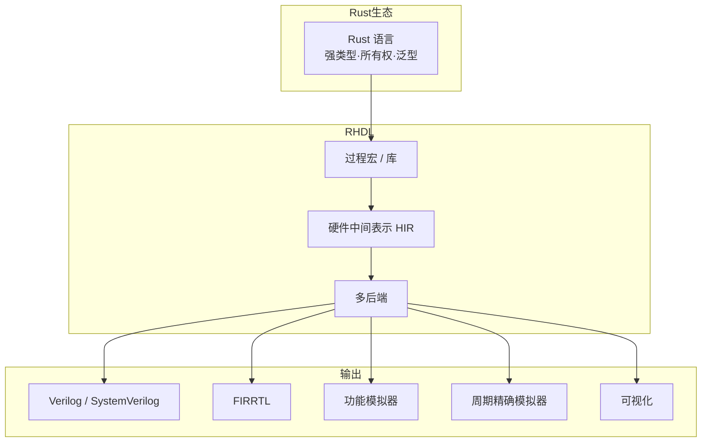
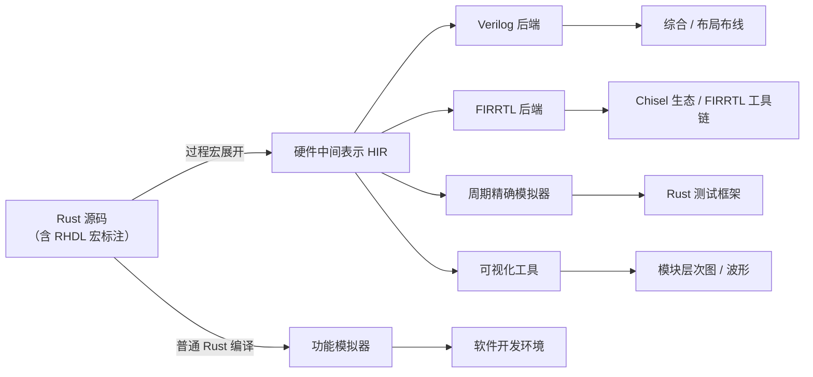
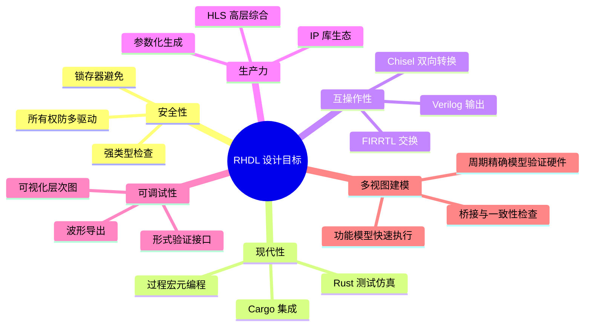
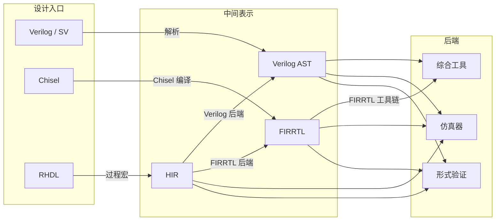
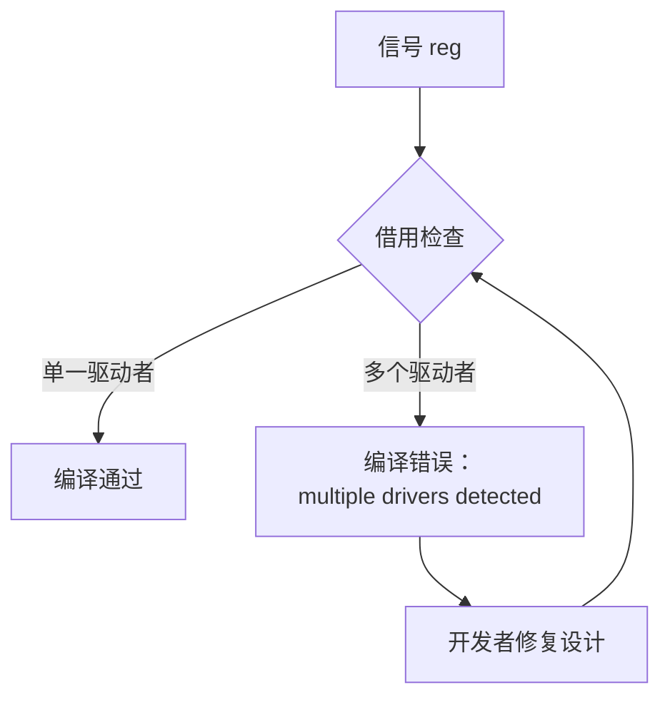
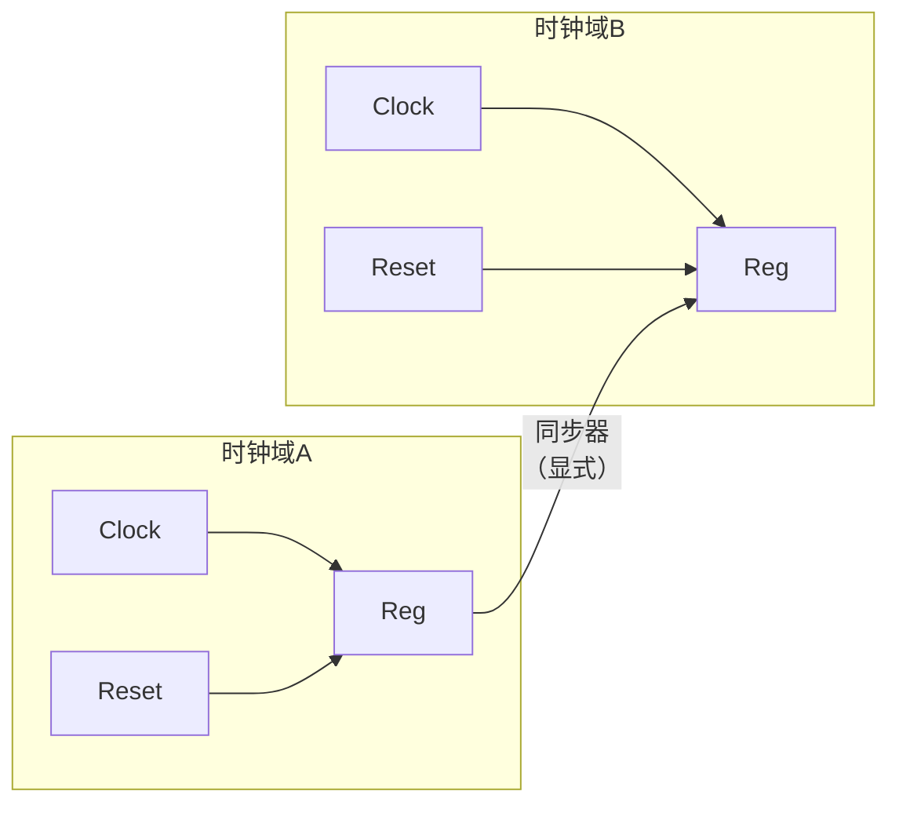
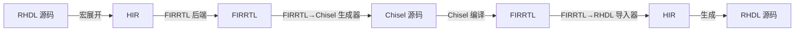
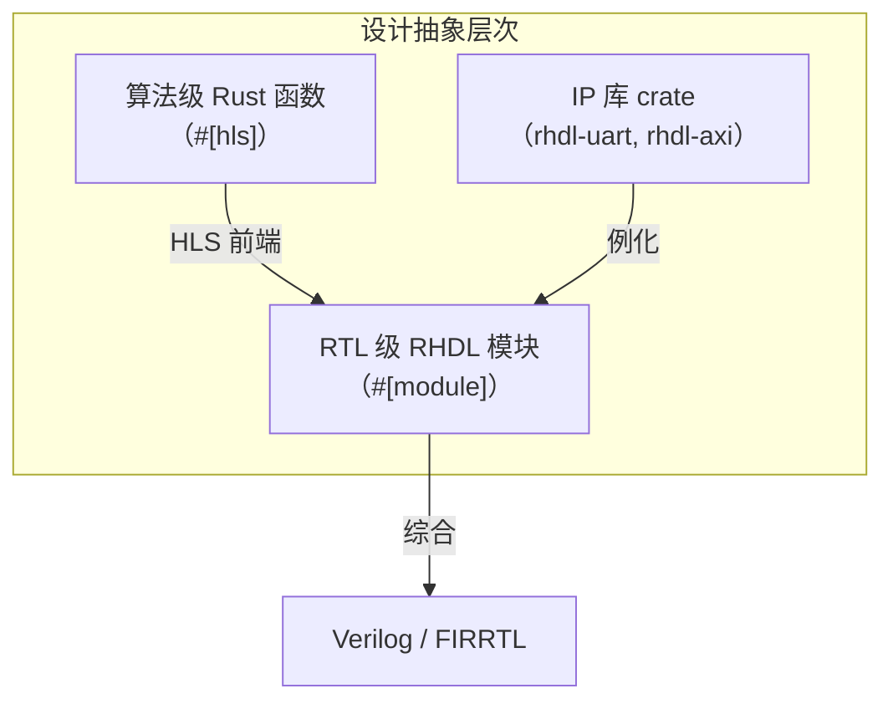
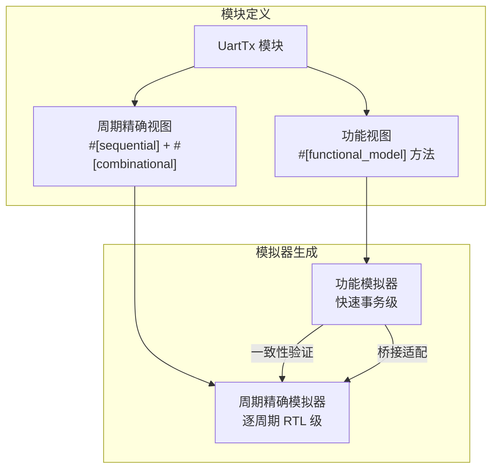

# 1. 项目概述

# 1. 项目概述

## 1.1 名称与定位

**RHDL**（Rust Hardware Description Language）是一种基于 Rust 的嵌入式 RTL 硬件描述语言。它不是一门独立的编程语言，而是以 **Rust 过程宏 + 库** 的形式实现，让硬件设计者直接使用 Rust 语言编写硬件描述，充分利用 Rust 的强类型系统、所有权模型、泛型与宏机制，在编译期完成硬件检查与优化。

RHDL 的定位介于传统 HDL（Verilog/SystemVerilog）与高层次硬件构造语言（如 Chisel）之间，既保留 RTL 的底层控制能力，又提供现代语言的安全性和生产力工具。此外，RHDL 引入**多视图建模**机制，允许同一个模块同时提供功能模型（事务级）和周期精确模型（RTL 级），从而简化功能模拟器与周期精确模拟器的生成。

## 1.2 核心思想

RHDL 的核心思想是：**硬件描述就是合法的 Rust 代码**。设计者使用 Rust 编写模块、组合逻辑、时序逻辑，通过 `#[module]`、`#[combinational]`、`#[sequential]` 等过程宏标注，编译器将这些代码展开为硬件中间表示（HIR）。HIR 经过多后端转换，可输出 Verilog、FIRRTL，或直接进入仿真器。

在此基础上，RHDL 进一步提出**多视图建模**：一个硬件模块可以同时拥有功能视图（算法级或事务级）和周期精确视图（RTL 级）。功能视图用于快速软件开发，周期精确视图用于硬件验证，两者通过桥接机制和一致性验证保证行为等价。

## 1.3 设计目标

RHDL 的设计目标可以概括为：**在保持底层硬件控制力的同时，提供现代软件开发的安全性与高效性，并支持多层次建模与模拟**。具体包括：

1.  **强类型安全**：位宽、端口方向、时钟域在编译期检查。
    
2.  **所有权模型适配硬件**：每个信号只能被单一驱动，防止多驱动冲突。
    
3.  **组合/时序逻辑显式分离**：避免隐式锁存器。
    
4.  **参数化与代码生成**：利用 Rust 泛型、const 泛型、宏生成可复用硬件。
    
5.  **与 Rust 生态无缝集成**：Cargo 管理项目，直接使用 Rust 测试框架进行仿真验证。
    
6.  **可综合子集明确**：保证描述可被综合为 Verilog/SystemVerilog。
    
7.  **互转为一级设计目标**：以 FIRRTL 为交换格式，实现与 Chisel 的双向转换。
    
8.  **支持高层次综合（HLS）**：从算法级 Rust 函数自动生成 RTL。
    
9.  **提供丰富硬件 IP 库**：UART、SPI、I2C、FIFO、AXI 等。
    
10.  **内置可视化工具**：模块层次图、时序图生成。
    
11.  **多视图建模**：允许模块同时提供功能视图与周期精确视图，降低功能模拟器与周期精确模拟器生成难度。
    

## 1.4 与现有 HDL 的关系

RHDL 并非要取代 Verilog 或 Chisel，而是提供一个更安全、更现代的选择，并打通与现有生态的互操作路径：

*   **与 Verilog/SystemVerilog**：RHDL 可生成可综合的 Verilog，作为最终交付格式，兼容现有综合与布局布线工具。
    
*   **与 Chisel**：RHDL 与 Chisel 共享 FIRRTL 中间表示，可实现双向转换，复用 Chisel 的 IP 和工具链。
    
*   **与传统 HDL 设计流程**：RHDL 生成的标准 RTL 可无缝嵌入现有 FPGA/ASIC 流程。
    

## 1.5 特色亮点

### 1.5.1 所有权模型天然防多驱动

Rust 的所有权系统要求每个值在任意时刻只能有一个可变引用。RHDL 利用这一特性，将硬件信号建模为带有所有权语义的实体，从而在编译期就杜绝了多驱动冲突——这是传统 HDL 中常见的错误来源。

### 1.5.2 显式时钟域与复位

RHDL 引入 `ClockDomain` 对象，将时钟、复位极性、复位方式（同步/异步）绑定在一起，并要求每个寄存器明确属于某个时钟域。跨时钟域必须使用显式同步器，从语言层面减少 CDC 问题。

### 1.5.3 与 Chisel 的深度互操作

RHDL 将互转设计为一等公民。通过 FIRRTL 中间表示，RHDL 模块可以转换为 Chisel 代码，Chisel 生成的 FIRRTL 也可以导入为 RHDL 模块，实现 IP 复用和混合设计。

### 1.5.4 内置 HLS 与 IP 库

RHDL 计划集成高层次综合（HLS），允许开发者用算法级 Rust 函数自动生成 RTL；同时提供丰富的硬件 IP 库（UART、SPI、I2C、FIFO、AXI 等），通过 Cargo 直接引入，加速设计。

### 1.5.5 多视图建模与模拟器生成

RHDL 允许模块同时提供功能视图和周期精确视图。功能视图使用普通 Rust 代码（事务级/算法级），周期精确视图使用 RHDL 的 RTL 描述。工具链可以分别生成功能模拟器（快速）和周期精确模拟器（精确），并通过桥接和一致性验证保证两者等价。

## 1.6 总结

RHDL 是一个充分利用 Rust 语言优势的现代硬件描述语言。它以嵌入式 DSL 的形式降低了使用门槛，通过编译期检查提升了设计可靠性，并以 FIRRTL 为桥梁实现了与 Chisel 生态的互操作。RHDL 的目标是成为 FPGA/ASIC 设计中安全、高效且生态友好的选择，同时通过多视图建模支持从快速软件开发到严格硬件验证的完整流程。