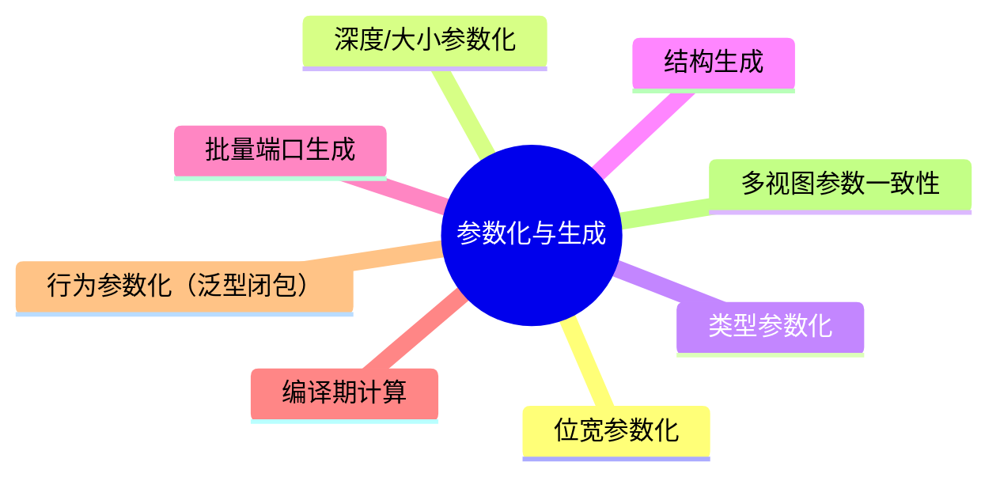
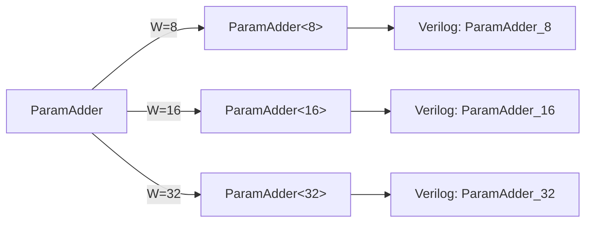
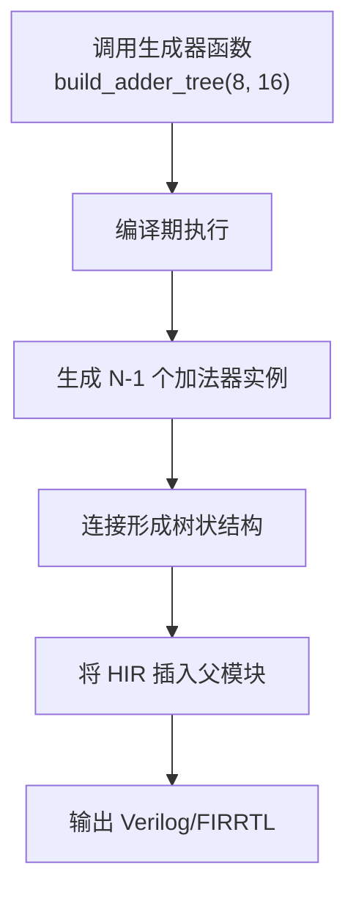
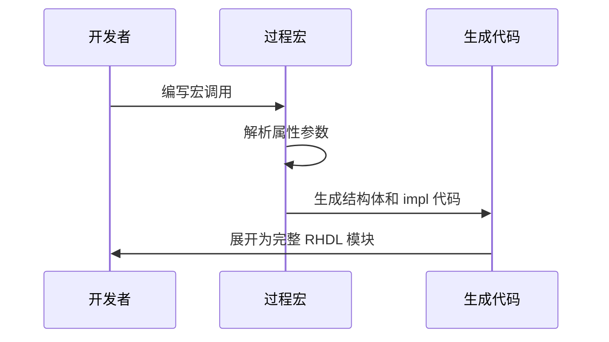
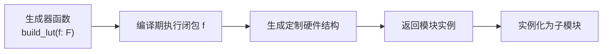
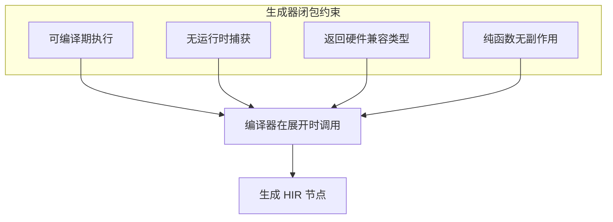
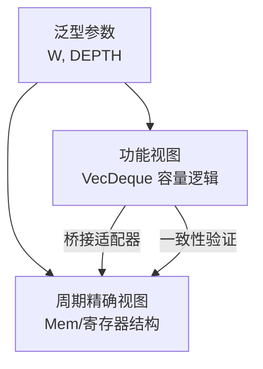

# 10. 参数化与生成

参数化与代码生成是 RHDL 实现硬件复用和设计自动化的核心机制。RHDL 深度利用 Rust 的泛型（包括类型泛型和 const 泛型）、函数、过程宏以及编译期计算，使设计者能够编写一次模块定义，生成适用于不同位宽、深度、数据类型甚至不同结构的硬件实例。这类似于 Chisel 的参数化生成器，但充分利用了 Rust 的编译期能力和现代包管理。在多视图建模中，参数化同时作用于功能视图和周期精确视图，并可通过桥接适配器保持两者参数一致。

**泛型闭包作为生成器参数**是 RHDL 新增的强大能力，它允许将行为逻辑（而非仅仅是数值参数）以闭包形式传入生成器，在编译期执行并生成定制硬件，从而进一步提升代码复用和设计灵活性。

## 10.1 参数化与生成的目的

硬件设计中，许多模块结构相同但参数不同，例如不同位宽的加法器、不同深度的 FIFO、不同数据类型的处理单元。传统 Verilog 使用 `parameter` 和 `generate` 实现有限参数化，但灵活性和类型安全不足。Chisel 通过 Scala 的泛型和函数式编程实现了强大的参数化生成器。RHDL 同样追求高度的参数化，同时利用 Rust 的编译期检查保证参数化模块的正确性。



## 10.2 基于 const 泛型的参数化

Rust 的 const 泛型允许在类型中使用编译期常量，非常适合硬件位宽、深度等参数的描述。RHDL 的基础硬件类型如 `UInt<N>` 已经使用了 const 泛型。模块定义可以进一步参数化。

### 10.2.1 参数化模块定义

```rust
#[module]
pub struct ParamAdder<const W: usize> {
    pub a: Input<UInt<W>>,
    pub b: Input<UInt<W>>,
    pub sum: Output<UInt<W>>,
    pub carry: Output<Bool>,
}
```

这里 `W` 是位宽参数，在实例化时确定。模块内部逻辑自动适应参数。

```rust
impl<const W: usize> ParamAdder<W> {
    #[combinational]
    fn compute(&mut self) {
        let (s, c) = self.a.get().overflowing_add(self.b.get());
        self.sum.set(s);
        self.carry.set(c);
    }
}
```

### 10.2.2 不同参数的实例化

```rust
let adder8: ParamAdder<8>;
let adder16: ParamAdder<16>;
let adder32: ParamAdder<32>;
```

每个实例都是一个独立的硬件模块（或同一模块的不同参数特化）。RHDL 编译器会为每个不同的参数组合生成对应的 Verilog 模块。



### 10.2.3 多参数模块

```rust
#[module]
pub struct Fifo<const W: usize, const DEPTH: usize> {
    pub clk: Clock,
    pub rst: Reset,
    pub push: Input<Bool>,
    pub pop: Input<Bool>,
    pub data_in: Input<UInt<W>>,
    pub data_out: Output<UInt<W>>,
    pub full: Output<Bool>,
    pub empty: Output<Bool>,
    // 内部使用 Mem<UInt<W>, DEPTH> 和寄存器
}
```

FIFO 可以根据数据宽度和深度任意实例化。

## 10.3 基于类型泛型的参数化

除了位宽和深度等数值参数，RHDL 还支持将数据类型本身作为泛型参数，例如处理不同数据类型的处理单元（如 CRC 计算器、滤波器）。这需要数据类型实现 `HardwareType` trait。

### 10.3.1 泛型类型约束

```rust
#[module]
pub struct PipelineStage<T: HardwareType> {
    pub clk: Clock,
    pub rst: Reset,
    pub data_in: Input<T>,
    pub data_out: Output<T>,
    reg: Reg<T>,
}

impl<T: HardwareType> PipelineStage<T> {
    #[sequential]
    fn update(&mut self) {
        self.reg.d = self.data_in.get();
    }
    #[combinational]
    fn drive_out(&mut self) {
        self.data_out.set(self.reg.q);
    }
}
```

这个模块可以用于 `UInt<8>`、`Bool`、`Bits<128>` 甚至自定义 Bundle 类型。

### 10.3.2 类型参数化实例

```rust
let stage_u8 = PipelineStage::<UInt<8>>::new();
let stage_bool = PipelineStage::<Bool>::new();
let stage_bundle = PipelineStage::<MyBundle>::new();
```

## 10.4 基于函数和方法的硬件生成器

RHDL 允许使用普通 Rust 函数在编译期生成硬件结构。这些函数接受参数，返回模块实例或连接信息，类似于 Chisel 中的生成器函数。

### 10.4.1 函数返回模块实例

```rust
fn make_adder<const W: usize>() -> ParamAdder<W> {
    ParamAdder::<W>::new()
}
```

### 10.4.2 递归/迭代生成硬件结构

例如生成一个加法器树：

```rust
fn build_adder_tree<const N: usize, const W: usize>(
    inputs: Vec<UInt<W>, N>,
) -> UInt<W> {
    // 递归生成二叉树加法器
    if N == 1 {
        inputs[0]
    } else {
        let left = build_adder_tree(inputs.slice(0, N/2));
        let right = build_adder_tree(inputs.slice(N/2, N));
        let mut adder = ParamAdder::<W>::new();
        adder.a = left;
        adder.b = right;
        adder.sum
    }
}
```

注意：这些函数在编译期执行，生成硬件连接。最终 HIR 中实例化了多个加法器并正确连线。递归在编译期展开，不涉及运行时递归。

### 10.4.3 生成器流程



## 10.5 过程宏驱动的代码生成

RHDL 的过程宏可以用于批量生成模块、端口列表或重复结构。例如，可以定义一个宏来自动生成总线接口的多个通道。

### 10.5.1 自定义过程宏示例

```rust
#[generate_bus(channels = 4, data_width = 32)]
struct MyBus;
```

宏展开后生成：

```rust
#[module]
pub struct MyBus {
    pub channel_0_data: Input<UInt<32>>,
    pub channel_0_valid: Input<Bool>,
    pub channel_0_ready: Output<Bool>,
    // ... 重复 4 次
}
```

### 10.5.2 宏展开流程



## 10.6 编译期计算与元编程

Rust 的 `const fn` 可以在编译期执行计算，用于生成常量、计算位宽、生成查找表等。RHDL 可以利用这些特性实现更高级的参数化。

### 10.6.1 const fn 计算参数

```rust
const fn addr_width(depth: usize) -> usize {
    (depth as f64).log2().ceil() as usize
}

#[module]
pub struct Ram<const DEPTH: usize> {
    // 地址宽度自动计算
    pub addr: Input<UInt<{ addr_width(DEPTH) }>>,
    pub data: Input<UInt<8>>,
    // ...
}
```

### 10.6.2 生成查找表

使用编译期数组初始化 ROM：

```rust
const fn generate_sin_table() -> [UInt<16>; 256] {
    let mut table = [0; 256];
    // 编译期计算正弦值
    table
}

#[module]
pub struct SineGen {
    // 使用 ROM 初始化
    rom: Mem<UInt<16>, 256>,
}
```

### 10.6.3 编译期计算与类型级编程

Rust 的类型级编程（通过 trait 和 const 泛型）可以实现在类型层面编码复杂约束，例如确保两个类型位宽相同、总线宽度匹配等。

## 10.7 泛型闭包作为生成器参数

这是 RHDL 受控闭包抽象在参数化与生成中的核心应用。与 const 泛型传递数值、类型泛型传递类型不同，**泛型闭包可以传递行为**。生成器函数接受闭包作为参数，在编译期调用闭包来生成硬件结构或初始化数据。这样，同一个生成器可以产生行为不同的硬件，例如不同的查找表内容、不同的运算单元组合、不同的算法系数等。

### 10.7.1 基本概念



闭包在编译期被调用多次，其返回值用于初始化 ROM、配置硬件连线或选择不同的硬件单元。闭包本身不进入 HIR，因此不影响综合。

### 10.7.2 示例 1：查找表（LUT）生成

```rust
fn build_lut<const N: usize, F>(f: F) -> LutModule<N>
where
    F: Fn(UInt<8>) -> UInt<8> + Copy,
{
    let mut table = [UInt::<8>::default(); 1 << N];
    for (i, entry) in table.iter_mut().enumerate() {
        *entry = f(UInt::<8>::from(i as u8));   // 编译期调用闭包
    }
    LutModule::<N>::new(table)
}

// 使用不同的闭包生成不同内容的查找表
let square_table = build_lut::<8, _>(|x| x * x);
let crc_table = build_lut::<8, _>(|x| crc8_step(x, 0x31));
```

`build_lut` 生成一个 `LutModule<N>`，其 ROM 初始化内容由闭包决定。闭包在编译期执行，生成确定的硬件初始化数据。

### 10.7.3 示例 2：滤波器系数生成

```rust
fn build_fir_filter<const TAPS: usize, F>(coef_fn: F) -> FirFilter<TAPS>
where
    F: Fn(usize) -> UInt<16> + Copy,
{
    let mut coeffs = [UInt::<16>::default(); TAPS];
    for (i, c) in coeffs.iter_mut().enumerate() {
        *c = coef_fn(i);
    }
    FirFilter::<TAPS>::new(coeffs)
}

// 使用闭包定义低通滤波器系数
let lowpass = build_fir_filter::<16, _>(|i| {
    // 计算 sinc 函数值（编译期）
    UInt::<16>::from((sinc(i as f64) * 65535.0) as u16)
});
```

### 10.7.4 示例 3：运算单元选择

```rust
fn build_alu<F>(op_fn: F) -> AluModule
where
    F: Fn(UInt<8>, UInt<8>) -> UInt<8> + Copy,
{
    // 使用闭包定义 ALU 的核心运算
    AluModule::new(op_fn)
}

let adder_alu = build_alu(|a, b| a + b);
let xor_alu = build_alu(|a, b| a ^ b);
```

这里闭包决定了 ALU 的具体运算，生成器根据闭包生成不同的硬件数据通路。闭包在编译期被内联或映射为硬件单元。

### 10.7.5 闭包约束与编译期执行

用于生成器的闭包不需要满足可综合闭包的严格约束（因为它们不在综合路径中），但必须满足：

- **可编译期执行**：闭包必须能在编译期调用，因此不能捕获运行时变量，但可以捕获编译期常量或 const 泛型。
- **返回硬件兼容值**：闭包返回值最终用于硬件初始化或连接，因此必须是硬件类型或可转换为硬件类型。
- **无副作用**：闭包应为纯函数，以保证编译期执行的确定性。



### 10.7.6 与 const fn 的对比

| 特性 | const fn | 泛型闭包生成器 |
|------|----------|----------------|
| 定义方式 | `const fn` 函数 | 普通函数接收 `Fn` 闭包参数 |
| 可传递行为 | 通过函数调用传递 | 通过闭包参数传递 |
| 灵活性 | 相对固定 | 高，可在调用处内联定义 |
| 捕获变量 | 不捕获 | 可捕获 const 泛型/编译期常量 |
| 可读性 | 需要定义多个 const fn | 内联闭包更简洁 |

泛型闭包生成器更适合需要高度定制且不希望定义大量具名函数的场景。

## 10.8 参数化与生成的组合示例

下面是一个更完整的例子：参数化的 N 通道多路选择器，其输入选择逻辑也可以由闭包定制。

### 10.8.1 定义

```rust
#[module]
pub struct Mux<const N: usize, const W: usize> {
    pub sel: Input<UInt<{ log2_ceil(N) }>>,
    pub inputs: Vec<Input<UInt<W>>, N>,
    pub output: Output<UInt<W>>,
}

const fn log2_ceil(n: usize) -> usize {
    // 计算 ceil(log2(n))
}

impl<const N: usize, const W: usize> Mux<N, W> {
    #[combinational]
    fn select(&mut self) {
        let idx = self.sel.get().resize(log2_ceil(N)); // 简化
        // 使用 match 或索引选择
        self.output.set(self.inputs[idx].get());
    }
}
```

### 10.8.2 实例化

```rust
let mux4_8 = Mux::<4, 8>::new();
let mux16_32 = Mux::<16, 32>::new();
```

编译器为每个特化生成独立的 Verilog 模块。

### 10.8.3 结合生成器闭包

可以定义生成器，使用闭包决定选择逻辑：

```rust
fn build_custom_mux<const N: usize, const W: usize, F>(sel_fn: F) -> Mux<N, W>
where
    F: Fn(UInt<{ log2_ceil(N) }>, Vec<UInt<W>, N>) -> UInt<W> + Copy,
{
    // 将闭包逻辑实例化到 Mux 内部（简化为直接调用）
    // 实际中可能需要特殊模块封装
}
```

虽然复杂，但展示了闭包可以进一步定制硬件行为。

## 10.9 参数化在功能视图和周期精确视图中的一致性

在多视图建模中，同一个参数化模块可能同时具有功能视图和周期精确视图。两者的参数（如位宽、深度）必须保持一致。RHDL 通过以下方式确保一致性：

- 参数定义在模块级别，功能视图和周期精确视图共享相同的泛型参数。
- 桥接适配器在编译期根据参数生成，确保类型匹配。
- 一致性验证框架可以使用相同的参数实例进行比对。

示例：参数化 FIFO

```rust
#[module]
#[abstraction(functional, cycle_accurate)]
pub struct SyncFifo<const W: usize, const DEPTH: usize> {
    // 周期精确视图端口
    pub clk: Clock,
    pub rst: Reset,
    pub push: Input<Bool>,
    pub pop: Input<Bool>,
    pub data_in: Input<UInt<W>>,
    pub data_out: Output<UInt<W>>,
    pub full: Output<Bool>,
    pub empty: Output<Bool>,

    // 功能视图状态
    #[functional_state]
    buffer: std::collections::VecDeque<UInt<W>>,
}

impl<const W: usize, const DEPTH: usize> SyncFifo<W, DEPTH> {
    // 功能模型方法
    #[functional_model]
    fn push_data(&mut self, data: UInt<W>) {
        self.buffer.push_back(data);
    }

    #[functional_model]
    fn pop_data(&mut self) -> Option<UInt<W>> {
        self.buffer.pop_front()
    }

    // 周期精确方法
    #[sequential]
    fn update(&mut self) { ... }
    #[combinational]
    fn outputs(&mut self) { ... }
}
```

参数 `W` 和 `DEPTH` 同时约束功能视图和周期精确视图，保证了两个视图行为的一致性基础。



## 10.10 与 Chisel 参数化的对比

| 特性 | Chisel (Scala) | RHDL (Rust) |
| --- | --- | --- |
| 参数化手段 | Scala 泛型、隐式参数、函数生成器、元编程 | Rust 泛型、const 泛型、函数生成器、过程宏、泛型闭包生成器 |
| 类型安全 | 编译期检查（Scala 类型系统） | 编译期检查（Rust 类型系统 + 所有权） |
| 位宽参数 | `UInt(width.W)` | `UInt<W>`（const 泛型） |
| 生成器风格 | 面向对象 + 函数式组合 | 函数式 + 过程宏 + 闭包 |
| 行为参数化 | Scala 函数对象、高阶函数 | Rust 泛型闭包（编译期执行） |
| 编译期计算 | Scala 编译期求值 | Rust const fn + 闭包 |
| 生态 | 成熟 IP 生成器（Diplomacy） | 新兴，但 Rust 生态强大 |
| 多视图参数一致性 | 需手动保证 | 语言层面共享参数 |

RHDL 的参数化能力与 Chisel 相当，且泛型闭包提供了更自然的编译期行为参数化方式，同时得益于 Rust 的所有权模型和 const 泛型，在表达编译期约束方面更加严格和安全。

## 10.11 总结

RHDL 的参数化与生成机制充分利用了 Rust 的现代语言特性：

- **const 泛型**：安全地参数化位宽、深度等数值。
- **类型泛型**：支持数据类型参数化，编写通用的数据通路模块。
- **函数生成器**：在编译期构建复杂硬件结构（如加法器树、互连网络）。
- **过程宏**：自动化批量生成重复代码，减少样板。
- **编译期计算**：通过 const fn 和类型级编程实现高级参数推导。
- **泛型闭包生成器**：将行为作为参数传递，在编译期执行以生成定制硬件，大幅提升生成器的灵活性和复用性。
- **多视图参数一致性**：功能视图和周期精确视图共享参数，保证模型等价性。

这些能力使 RHDL 能够高效地创建可复用的硬件 IP，同时保持强类型安全，避免了传统 HDL 中参数化带来的易错性。参数化与生成是 RHDL 实现高生产力硬件设计的关键支柱之一，而泛型闭包生成器则为其注入了更强的抽象能力。