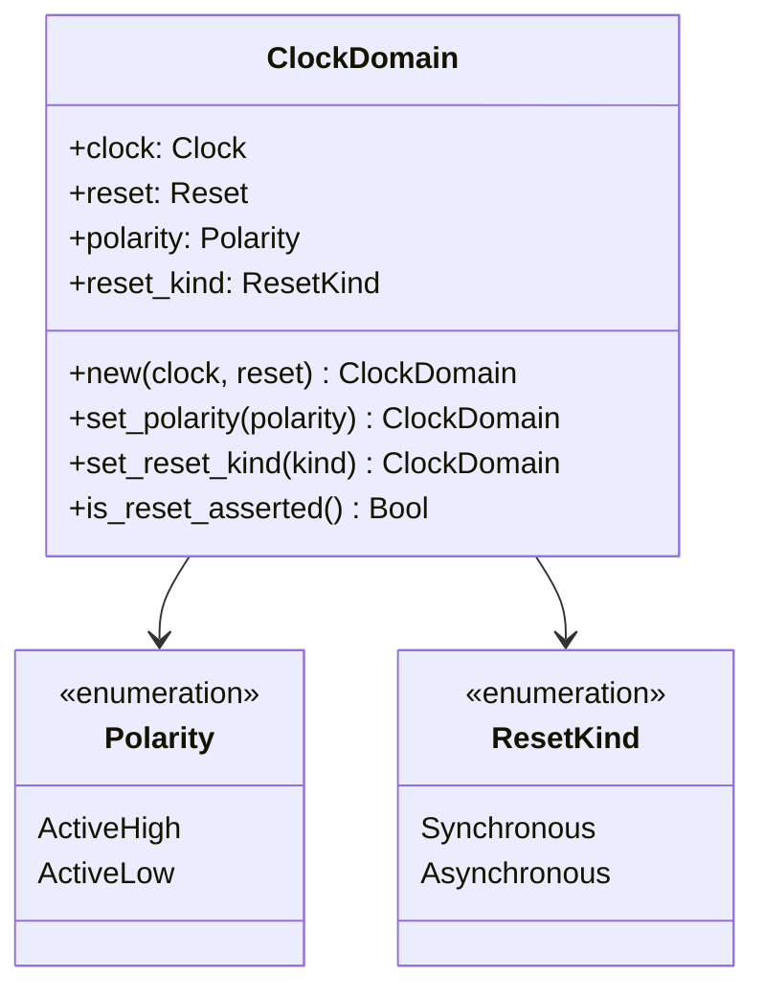
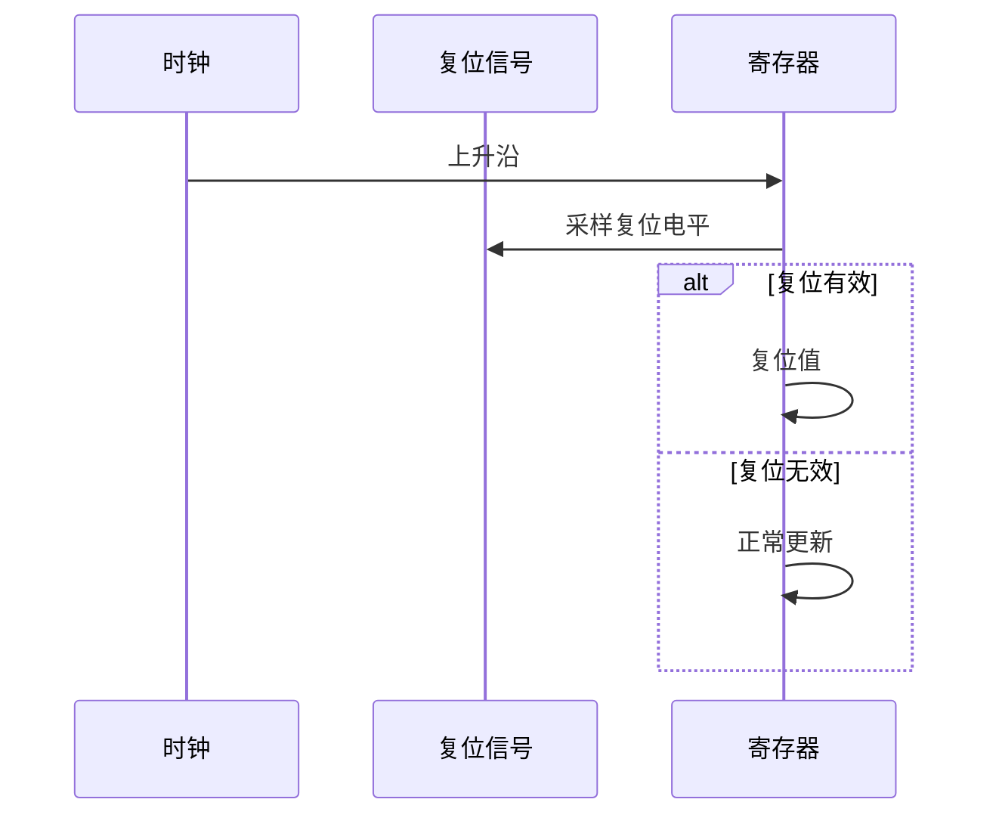
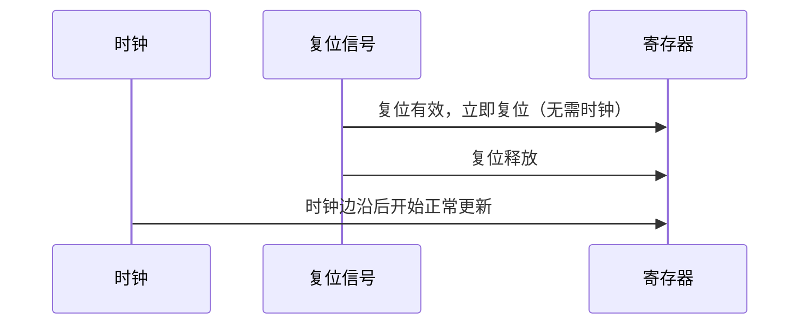
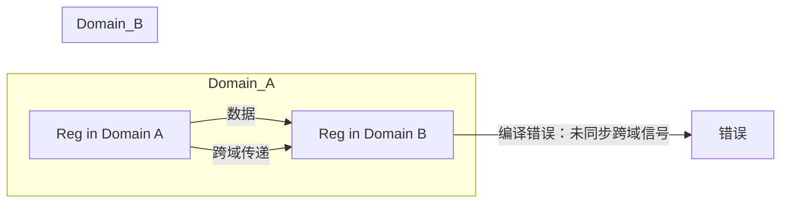
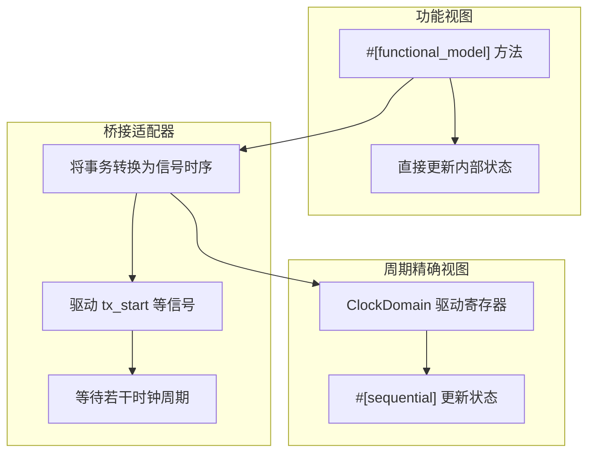

# 11. 时钟域与复位

# 11. 时钟域与复位

在数字电路设计中，时钟域与复位是可靠性和正确性的关键。错误的时钟域处理（如跨时钟域未同步）和复位设计不当（如复位释放冒险）会导致亚稳态、数据损坏甚至系统失效。RHDL 将时钟域和复位作为**一等公民**，通过类型系统和显式语法，在编译期就防止许多 CDC（Clock Domain Crossing）问题，并确保复位行为清晰可控。在多视图建模中，时钟域与复位仅存在于**周期精确视图**，功能视图使用无时钟的事务级模型，两者通过桥接适配器进行时序转换。

## 11.1 时钟域与复位的设计目标

*   **显式声明**：每个寄存器必须明确属于某个时钟域，不允许隐式全局时钟。
    
*   **复位可配置**：复位极性、同步/异步复位方式均可配置。
    
*   **跨域安全检查**：跨时钟域的信号传输必须通过显式同步器，否则编译报错。
    
*   **类型安全**：时钟、复位、数据信号在类型上严格区分，防止误用。
    
*   **可综合**：生成对应 Verilog 的 `always_ff` 和 `always_comb` 结构，确保正确综合。
    
*   **多视图隔离**：功能视图不涉及时钟域，保持事务级抽象；周期精确视图严格管理时钟域，确保硬件正确性。
    

## 11.2 ClockDomain 对象

`ClockDomain` 是 RHDL 中封装时钟、复位及其属性的核心类型。每个寄存器或时序逻辑块都与一个 `ClockDomain` 相关联。

### 11.2.1 ClockDomain 结构



*   `**clock**`：时钟信号，类型为 `Clock`。
    
*   `**reset**`：复位信号，类型为 `Reset`。
    
*   `**polarity**`：复位极性，高有效或低有效。
    
*   `**reset_kind**`：复位方式，同步或异步。
    

### 11.2.2 ClockDomain 的配置示例

```rust
let cd = ClockDomain::new(clk, rst)
    .set_reset_polarity(Polarity::ActiveHigh)
    .set_reset_kind(ResetKind::Synchronous);

```

或者使用 Builder 风格链式调用：

```rust
let cd = ClockDomain::new(clk, rst)
    .active_high()
    .synchronous();

```

### 11.2.3 ClockDomain 与寄存器绑定

寄存器通过所属时钟域初始化，通常在每个 `#[sequential]` 块中使用 `ClockDomain` 判断复位和时钟边沿。RHDL 编译器会检查寄存器与时钟域的一致性。

```rust
#[sequential]
fn update(&mut self) {
    // 隐含使用 self.clk_domain
    if self.clk_domain.is_reset_asserted() {
        self.reg.d = 0;
    } else {
        self.reg.d = self.reg.q + 1;
    }
}

```

或者更简洁地使用 `reset_if` 辅助宏（可选）：

```rust
#[sequential]
fn update(&mut self) {
    self.reg.d = self.clk_domain.reset_if(0, self.reg.q + 1);
}

```

## 11.3 复位极性

复位信号可能是高有效或低有效，这取决于硬件平台和设计习惯。RHDL 的 `Polarity` 枚举明确指定极性，生成的 Verilog 将正确映射。

*   **ActiveHigh**：复位信号为 `1` 时复位。
    
*   **ActiveLow**：复位信号为 `0` 时复位。
    

在 Verilog 生成中，复位条件会根据极性正确编写：

```verilog
// ActiveHigh, Synchronous
always_ff @(posedge clk) begin
    if (rst) begin
        reg <= 0;
    end else begin
        reg <= next;
    end
end

// ActiveLow, Asynchronous
always_ff @(posedge clk or negedge rst_n) begin
    if (!rst_n) begin
        reg <= 0;
    end else begin
        reg <= next;
    end
end

```

## 11.4 同步复位与异步复位

复位方式分为同步复位和异步复位。RHDL 通过 `ResetKind` 枚举明确指定，并在代码生成时区别对待。

### 11.4.1 同步复位

同步复位仅在时钟边沿采样复位信号，复位行为与时钟同步。优点是避免复位释放时的亚稳态，时序分析简单，但对复位信号的毛刺敏感（可以通过同步器消除）。



Verilog 生成示例：

```verilog
always_ff @(posedge clk) begin
    if (rst) reg <= 0;
    else reg <= next;
end

```

### 11.4.2 异步复位

异步复位不依赖时钟边沿，复位信号有效时立即复位。优点是复位响应快，即使时钟停止也能复位；但释放时可能产生恢复时间违规，需要小心设计。



Verilog 生成示例：

```verilog
always_ff @(posedge clk or posedge rst) begin
    if (rst) reg <= 0;
    else reg <= next;
end

```

### 11.4.3 复位方式选择建议

*   **同步复位**：推荐用于大多数 FPGA 设计，时序收敛容易。
    
*   **异步复位**：用于需要上电立即复位、或时钟失效也要复位的场景，但需注意复位释放同步。
    

RHDL 允许每个 `ClockDomain` 独立选择复位方式，例如一个设计可以同时存在同步复位域和异步复位域。

## 11.5 复位信号的生成与分发

复位信号通常由顶层输入或内部复位控制器生成。RHDL 中 `Reset` 类型是一个特殊信号，不能被普通数据逻辑驱动，但可以由专门的复位生成模块输出。

```rust
#[module]
pub struct ResetGen {
    pub clk: Clock,
    pub ext_rst_n: Input<Bool>,    // 外部低有效复位
    pub rst_out: Output<Reset>,    // 生成的复位信号
    // 内部同步器、计数器等
}

```

复位信号可以扇出到多个时钟域，但需注意跨域复位同步（如果复位异步释放）。

## 11.6 跨时钟域处理

RHDL 的时钟域是显式且类型化的，因此编译器可以检测跨时钟域的数据传输。直接在不同时钟域的寄存器之间传递信号（未同步）会导致编译错误。



跨时钟域必须使用显式同步器，RHDL 提供以下同步原语：

*   **DoubleFlop**（两级触发器同步器）：适用于单比特控制信号。
    
*   **SyncFIFO**：用于多比特数据流跨域。
    
*   **Handshake**：基于请求-应答的同步机制。
    

### 11.6.1 单比特同步器

```rust
let sync = DoubleFlop::new(src_clk_domain, dst_clk_domain);
let synced_signal = sync.synchronize(raw_signal);

```


### 11.6.2 多比特数据跨域

多比特数据通常使用异步 FIFO：

```rust
let fifo = AsyncFifo::<UInt<32>, 16>::new(src_cd, dst_cd);
fifo.push(data, src_cd);
let data_out = fifo.pop(dst_cd);

```

### 11.6.3 跨域检查

RHDL 编译器会分析信号连接，如果发现一个寄存器输出直接连接到另一个时钟域的寄存器输入，且未经过同步器，则报错。这需要信号携带时钟域信息，RHDL 类型系统可以为信号附加时钟域标签（可选功能）。

## 11.7 时钟门控与时钟使能

时钟门控用于低功耗设计，但需要小心处理。RHDL 暂不直接支持门控时钟，而是推荐使用**时钟使能**（Clock Enable）的方式，即在时序逻辑中使用条件判断来等效实现门控效果，这样更安全且易于综合。

```rust
#[sequential]
fn update(&mut self) {
    if self.clk_enable.get() {
        // 仅在使能时更新
        self.reg.d = next_value;
    } else {
        self.reg.d = self.reg.q; // 保持
    }
}

```

综合工具通常会将这种结构优化为门控时钟或使能触发器。

## 11.8 多视图建模中的时钟域与复位

在多视图建模中，时钟域与复位只影响**周期精确视图**。功能视图使用事务级抽象，没有时钟和复位概念，因此不需要处理时钟域问题。桥接适配器负责将事务级操作转换为信号级时序，从而驱动周期精确模型。

*   **功能视图**：模块的 `#[functional_model]` 方法不涉及时钟，它们使用普通 Rust 代码，可以自由调度。例如 `send_byte()` 可以直接更新内部缓冲区，无需等待时钟周期。
    
*   **周期精确视图**：所有寄存器绑定到 `ClockDomain`，时序逻辑遵循同步规则。
    
*   **桥接适配器**：在两者之间转换时，桥接器需要模拟时钟行为。例如，如果功能视图调用 `send_byte()`，桥接器可以驱动 `tx_start` 信号并等待 `tx_busy` 下降，期间需要调用多个 `tick()` 来推进时钟。
    



这种分离确保了功能模拟器的高效性（无需逐周期仿真），同时周期精确模拟器保持硬件精度。两者通过桥接适配器在需要时进行交互，并通过一致性验证确保行为等价。

## 11.9 总结

RHDL 的时钟域与复位设计通过以下机制确保了时序电路的可靠性：

*   `ClockDomain` 显式封装时钟、复位、极性和复位方式。
    
*   `Polarity` 和 `ResetKind` 枚举提供清晰配置。
    
*   跨时钟域传输强制使用显式同步器。
    
*   类型系统防止时钟、复位与数据信号混用。
    
*   生成后端代码正确处理同步/异步复位。
    
*   多视图建模将时钟域限定在周期精确视图，功能视图保持无时钟抽象，桥接适配器处理时序转换。
    

这些设计使 RHDL 在编译期就能避免许多常见的时钟域错误，提高了设计的正确性和可维护性，同时支持功能模拟与周期精确模拟的有效分离。