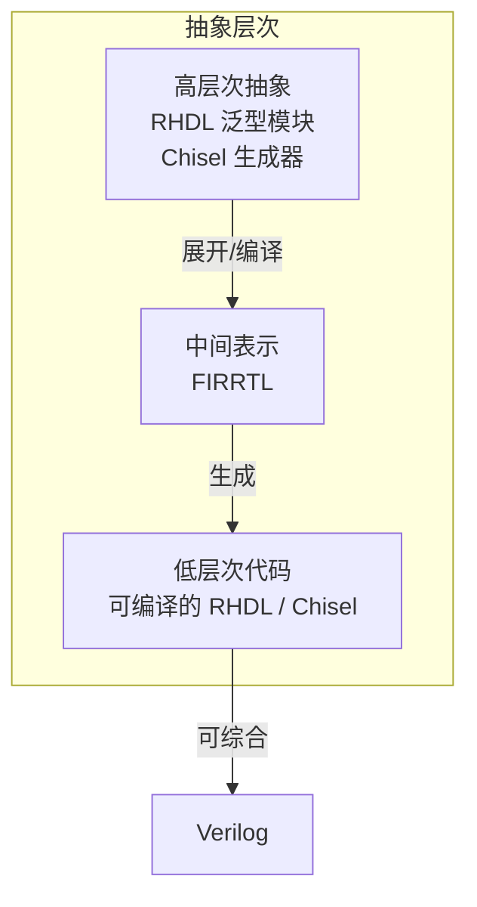
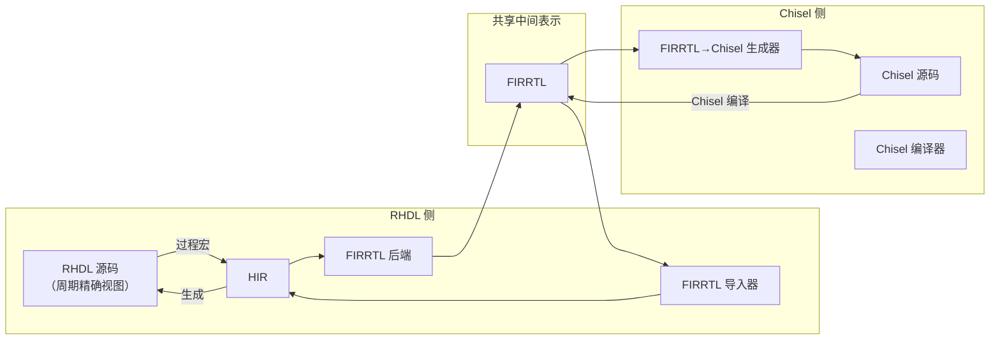
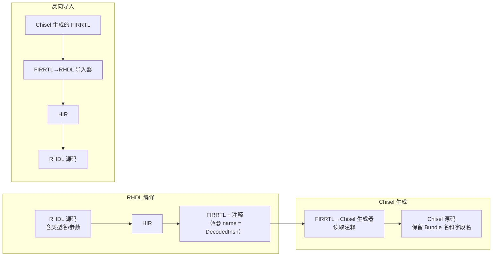
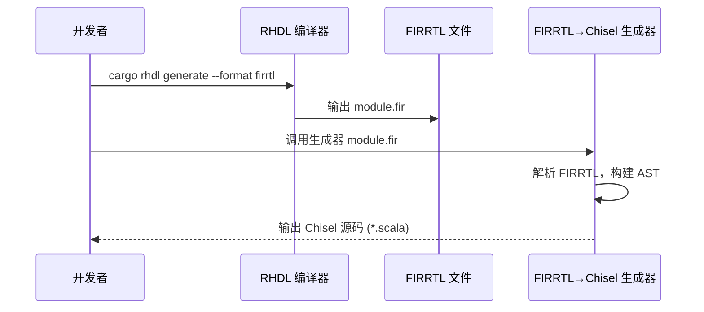
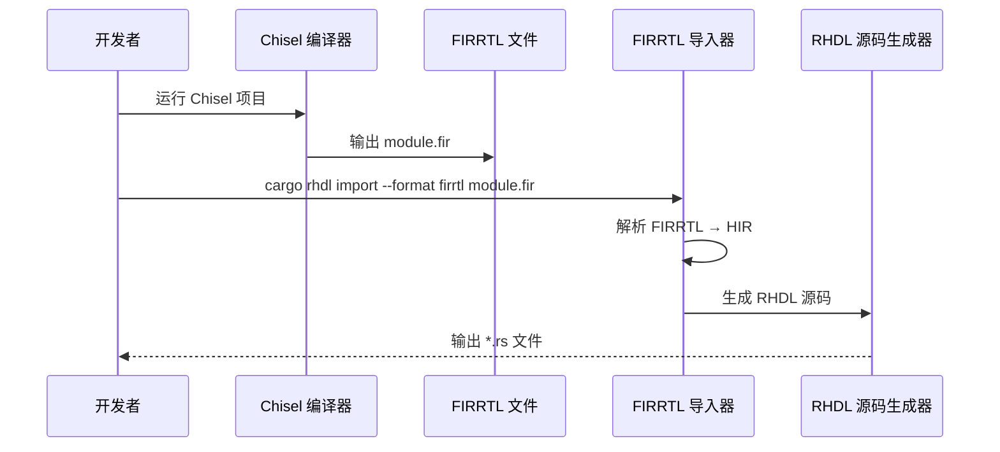
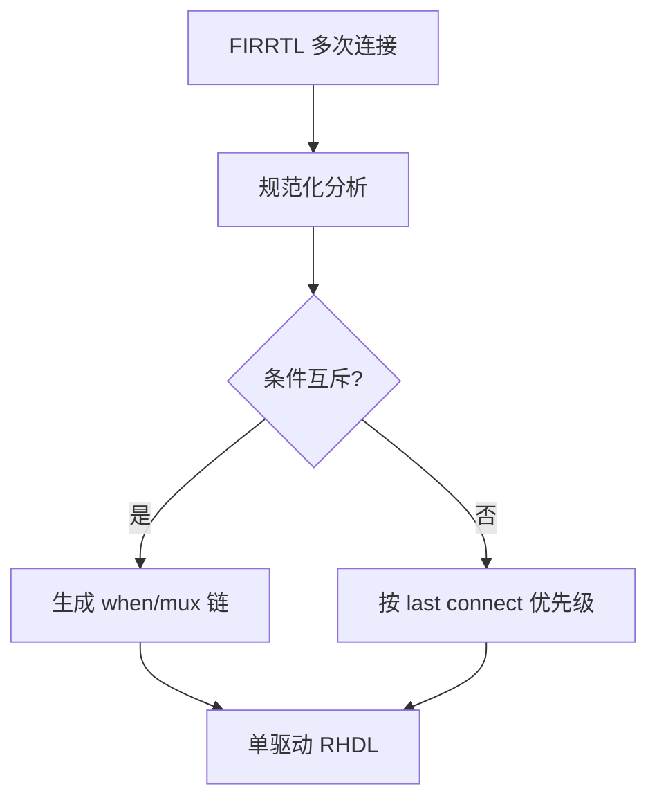
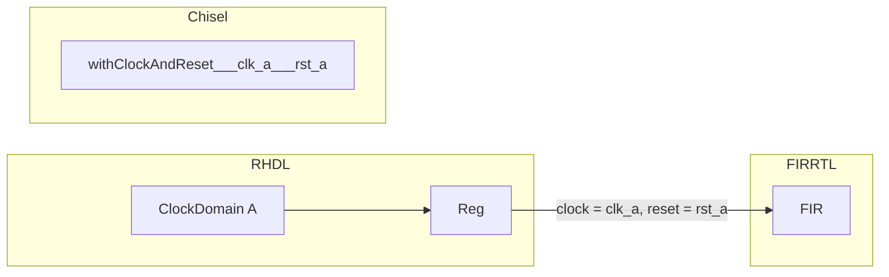
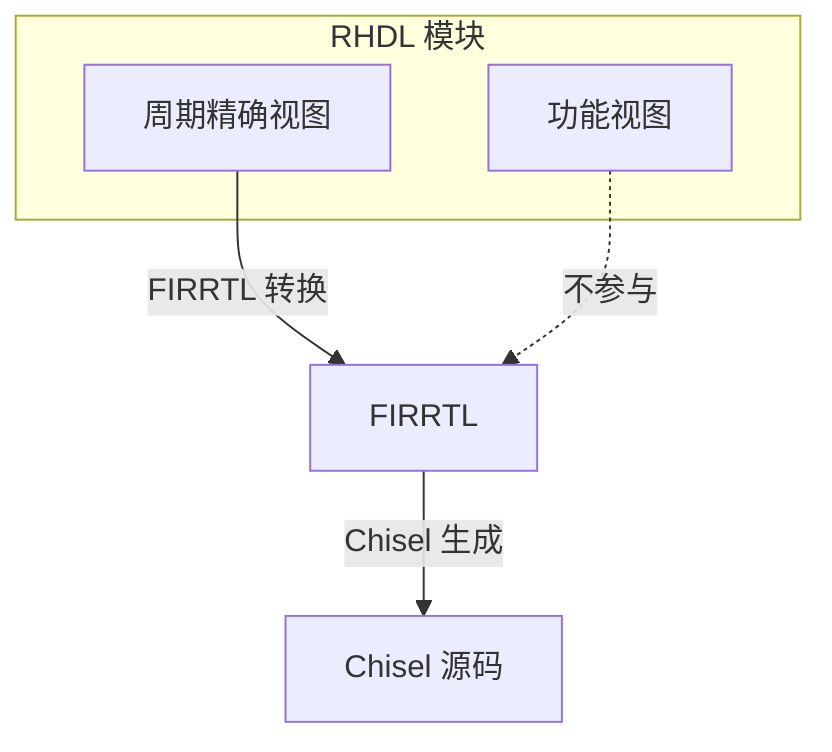

# 12. 与 Chisel 的互转设计

# 12. 与 Chisel 的互转设计

与 Chisel 的互操作是 RHDL 的一级设计目标。RHDL 通过 **FIRRTL** 作为标准交换格式，实现与 Chisel 生态的双向转换。这并非源码级自动翻译（由于宿主语言差异不可行），而是**中间表示级互操作**，即 RHDL 模块可以转换为 FIRRTL 并进一步生成 Chisel 源码，反之 Chisel 生成的 FIRRTL 也可以导入为 RHDL 模块。这种设计允许两个语言共享 IP、验证工具和综合后端，形成互补生态。

在多视图建模下，互转仅针对**周期精确视图**（RTL 描述）。功能视图（事务级/算法级）不进入 FIRRTL，因此不参与互转。桥接适配器和一致性验证仍然在 RHDL 内部处理。

## 12.1 互转目标与层次

互转可以在三个层次上理解：

| 层次 | 含义 | 可行性 |
| --- | --- | --- |
| **源码级** | 直接翻译 RHDL 源码到 Chisel 源码（或反之） | 极难，宿主语言抽象差异大 |
| **中间表示级** | 以 FIRRTL 为交换格式，转换硬件结构 | **可行，且为主推方案** |
| **网表级** | 生成 Verilog 后通过 Verilog 互转 | 可行但丢失高层信息 |

RHDL 选择**中间表示级**作为核心互转路径，并保留元数据以生成相对可读的代码。



## 12.2 设计策略

为实现有效的互转，RHDL 在设计上做了以下关键决策：

### 12.2.1 FIRRTL 作为共同交换格式

RHDL 的 HIR 被设计为与 FIRRTL 语义对齐，并实现 HIR ↔ FIRRTL 的双向序列化。FIRRTL 是公开的标准中间表示，Chisel 原生输出 FIRRTL，因此它是天然的桥梁。



### 12.2.2 HIR 与 FIRRTL 语义对齐

RHDL 的 HIR 在模块、端口、寄存器、连线、条件语句、存储器等核心概念上与 FIRRTL 一一对应。转换时只需做简单的语法映射，避免复杂语义转换。例如：

*   HIR `Module` ↔ FIRRTL `module`
    
*   HIR `Reg<T>` ↔ FIRRTL `reg`
    
*   HIR 组合逻辑 ↔ FIRRTL `connect` / `node`
    
*   HIR 条件语句 ↔ FIRRTL `when` / `mux`
    

### 12.2.3 元数据保留

在 RHDL 编译为 HIR 时，会保留原始类型名、字段名、参数化信息、层次结构注释等元数据。这些元数据可以嵌入 FIRRTL 作为注释（annotations）或旁路信息。当从 FIRRTL 导入并生成 Chisel/RHDL 代码时，这些元数据帮助恢复部分高层结构，提高生成代码的可读性。



### 12.2.4 可逆子集定义

并非所有 RHDL 特性都能无损映射到 FIRRTL。RHDL 定义了一个**可逆子集**，该子集内的描述可以双向转换。例如：基础类型运算、`if`/`match`、静态循环、泛型实例化、Bundle 等。不可逆特性（如动态内存、闭包、高阶函数、Rust 特有的所有权抽象）在硬件生成阶段被完全展开，转换后无法还原高层结构，只能生成低层次代码。

功能视图（事务级/算法级）不在可逆子集内，因为它们不映射为硬件结构。

## 12.3 转换流程

### 12.3.1 RHDL → Chisel

流程分为两步：

1.  **RHDL → FIRRTL**：利用 RHDL 的 FIRRTL 后端，将 HIR 转换为标准 FIRRTL 文本。
    
2.  **FIRRTL → Chisel**：使用一个独立的 **FIRRTL→Chisel 代码生成器**，解析 FIRRTL 并生成等价的 Chisel 源码。
    



生成的 Chisel 代码是低层次的，但可编译、可综合，并可作为子模块被其他 Chisel 设计例化。

**生成代码示例**：

```scala
class MyModule extends RawModule {
  val io = IO(new Bundle {
    val a = Input(UInt(8.W))
    val b = Input(UInt(8.W))
    val sum = Output(UInt(8.W))
  })
  val reg = RegInit(0.U(8.W))
  reg := io.a + io.b
  io.sum := reg
}

```

### 12.3.2 Chisel → RHDL

流程同样分为两步：

1.  **Chisel → FIRRTL**：由 Chisel 编译器（如 `firrtl` 或 `circt`）生成 FIRRTL。
    
2.  **FIRRTL → RHDL**：使用 RHDL 提供的 **FIRRTL 导入器**，将 FIRRTL 解析为 HIR，再由 HIR 生成 RHDL 源码（低层次）。
    



生成的 RHDL 代码同样为低层次，例如：

```rust
#[module]
pub struct MyModule {
    pub a: Input<UInt<8>>,
    pub b: Input<UInt<8>>,
    pub sum: Output<UInt<8>>,
    reg_0: Reg<UInt<8>>,
}

impl MyModule {
    #[sequential]
    fn update(&mut self) {
        self.reg_0.d = self.a.get() + self.b.get();
    }
    #[combinational]
    fn connect_outputs(&mut self) {
        self.sum.set(self.reg_0.q);
    }
}

```

## 12.4 关键挑战与应对

### 12.4.1 抽象层次不可逆

Chisel 的 Diplomacy 参数化框架、Scala 高阶函数、隐式参数等无法从 FIRRTL 还原。RHDL 的泛型生成器同样在编译时展开为具体模块。应对策略：

*   转换后的代码仅保留**已实例化的硬件结构**，不包含生成器逻辑。
    
*   对于需要参数化的模块，可在生成的代码中保留 `parameter` 风格（Verilog）或生成一组特化实例，但无法自动生成 Rust 泛型或 Scala 生成器。
    
*   文档明确：互转目标是**模块级互操作**，而非完整设计迁移。
    

### 12.4.2 多驱动语义差异

Chisel 允许对同一信号多次赋值（`last connect` 语义），而 RHDL 的所有权模型强制单驱动。导入 FIRRTL 时，如果存在同一信号被多次连接，导入器需要**规范化**为单驱动形式。

例如 FIRRTL 中的：

```plaintext
wire x : UInt<8>
x <= a
when cond:
    x <= b

```

导入器会将其转换为带优先级多路选择器的 RHDL 代码：

```rust
let x = if cond { b } else { a };

```

规范化算法会分析所有连接路径，合并为单个赋值表达式。



### 12.4.3 时钟域与复位语义差异

Chisel 的时钟和复位通常是隐式全局信号（通过 `withClockAndReset`），而 RHDL 要求显式 `ClockDomain`。导入 FIRRTL 时，所有寄存器会被分配一个默认时钟域（例如全局 `clk` 和 `rst`，同步高有效复位），并在生成的 RHDL 代码中显式声明。

RHDL → Chisel 时，每个 `ClockDomain` 对应一组时钟/复位信号，Chisel 生成的代码需要使用 `withClockAndReset` 块来保持正确绑定。



### 12.4.4 存储器建模差异

Chisel 的 `SyncReadMem` / `Mem` 和 RHDL 的 `Mem<T,DEPTH>` 在抽象上存在差异（如读取延迟、端口数量）。转换时需映射到 FIRRTL 的标准存储器原语（如 `cmem`, `smem`），并在两端分别适配。

### 12.4.5 工具链工作量

实现双向转换器需要开发两个工具：

*   **FIRRTL → Chisel 生成器**：可以基于现有 FIRRTL 解析库（如 `firrtl` Scala 库或 `firtool`）开发，工作量适中。
    
*   **FIRRTL → RHDL 导入器**：需要将 FIRRTL AST 映射到 RHDL HIR，然后从 HIR 生成 Rust 代码。这部分在 RHDL 内部实现，与 HIR 设计紧密相关。
    

好消息是 FIRRTL 规范公开，已有多种解析器，可以复用。

## 12.5 互转示例

### 12.5.1 RHDL 模块转 Chisel

假设有一个 RHDL 计数器：

```rust
#[module]
pub struct Counter {
    pub clk: Clock,
    pub rst: Reset,
    pub enable: Input<Bool>,
    pub count: Output<UInt<8>>,
    count_reg: Reg<UInt<8>>,
}
impl Counter {
    #[sequential]
    fn update(&mut self) {
        if self.rst.is_asserted() {
            self.count_reg.d = 0;
        } else if self.enable.get() {
            self.count_reg.d = self.count_reg.q + 1;
        } else {
            self.count_reg.d = self.count_reg.q;
        }
    }
    #[combinational]
    fn drive_count(&mut self) {
        self.count.set(self.count_reg.q);
    }
}

```

RHDL 生成 FIRRTL，再由 FIRRTL→Chisel 生成器输出：

```scala
class Counter extends RawModule {
  val io = IO(new Bundle {
    val clk = Input(Clock())
    val rst = Input(Bool())
    val enable = Input(Bool())
    val count = Output(UInt(8.W))
  })
  val count_reg = RegInit(0.U(8.W))
  when(io.rst) {
    count_reg := 0.U
  }.elsewhen(io.enable) {
    count_reg := count_reg + 1.U
  }.otherwise {
    count_reg := count_reg
  }
  io.count := count_reg
}

```

### 12.5.2 Chisel 模块转 RHDL

给定 Chisel 代码：

```scala
class Adder extends Module {
  val io = IO(new Bundle {
    val a = Input(UInt(8.W))
    val b = Input(UInt(8.W))
    val sum = Output(UInt(8.W))
  })
  io.sum := io.a + io.b
}

```

Chisel 编译输出 FIRRTL，导入 RHDL 生成：

```rust
#[module]
pub struct Adder {
    pub a: Input<UInt<8>>,
    pub b: Input<UInt<8>>,
    pub sum: Output<UInt<8>>,
}
impl Adder {
    #[combinational]
    fn compute(&mut self) {
        self.sum.set(self.a.get() + self.b.get());
    }
}

```

## 12.6 多视图建模对互转的影响

多视图建模中，只有周期精确视图参与互转。功能视图不转换为 FIRRTL，也不从 FIRRTL 导入。当 RHDL 模块同时具有功能视图和周期精确视图时，互转仅处理周期精确视图部分。功能视图可以独立于互转存在，桥接适配器和一致性验证在 RHDL 侧完成。这样保证了互转的清晰性和互操作性。



## 12.7 总结

RHDL 与 Chisel 的互转设计以 FIRRTL 为桥梁，通过 HIR 与 FIRRTL 的语义对齐、元数据保留和规范化处理，实现了中间表示级的双向转换。虽然无法自动还原高层抽象，但生成的代码可编译、可综合，支持模块级 IP 复用和混合设计。这种互操作性使 RHDL 能够融入现有 Chisel 生态，同时也为 Chisel 用户提供了引入 Rust 安全性和现代工具链的途径。多视图建模的引入并未干扰互转，反而明确了互转的边界——仅涉及周期精确视图，保持了功能模拟器的独立性。