# 13. 工具链与后端

# 13. 工具链与后端

RHDL 的工具链完全嵌入 Rust 生态，以 Cargo 为核心构建，提供从代码生成、仿真、验证到可视化的全流程支持。其核心是 **HIR（硬件中间表示）**，所有后端均从 HIR 生成，确保一致性和可扩展性。工具链包括命令行接口（`cargo rhdl`）、多个后端（Verilog、FIRRTL、仿真器、可视化、形式验证）以及与外部工具的集成接口。此外，多视图建模使得工具链可以分别生成**功能模拟器**和**周期精确模拟器**，满足软件开发和硬件验证的不同需求。

## 13.1 工具链架构总览

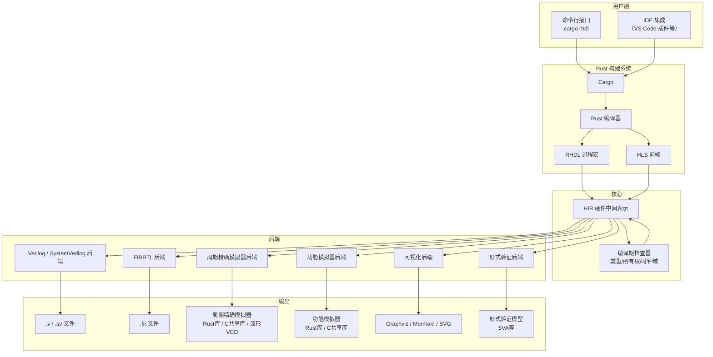

## 13.2 Cargo 集成与命令行接口

RHDL 以 Rust crate（`rhdl`）的形式提供核心库，并通过 Cargo 子命令扩展开发体验。所有工具链操作都通过 `cargo rhdl <子命令>` 触发。

### 13.2.1 项目结构

一个典型的 RHDL 项目与普通 Rust 项目结构一致：

```plaintext
my_uart/
├── Cargo.toml
├── src/
│   ├── main.rs         # 可选，用于仿真入口
│   └── lib.rs          # 硬件模块定义
└── tests/
    └── test_uart.rs    # 仿真测试

```

`Cargo.toml` 中添加依赖：

```toml
[dependencies]
rhdl = "0.1"

[dev-dependencies]
rhdl-sim = "0.1"   # 仿真器（也可包含在 rhdl 中）

```

### 13.2.2 主要子命令

| 命令 | 功能 |
| --- | --- |
| `cargo rhdl generate --top <module> --format <verilog\|firrtl>` | 生成硬件描述 |
| `cargo rhdl test` | 运行仿真测试（内部调用 `cargo test`） |
| `cargo rhdl visualize --top <module> --format <dot\|mermaid>` | 生成模块层次图 |
| `cargo rhdl wave --vcd <file>` | 导出仿真波形 |
| `cargo rhdl check` | 执行静态检查（位宽、多驱动、CDC 等） |
| `cargo rhdl import --format firrtl <file>` | 导入 FIRRTL 并生成 RHDL 源码 |
| `cargo rhdl doc` | 生成硬件设计文档（包含层次图和模块说明） |
| `cargo rhdl build-sim --kind functional\|cycle_accurate` | 构建指定类型的模拟器 |

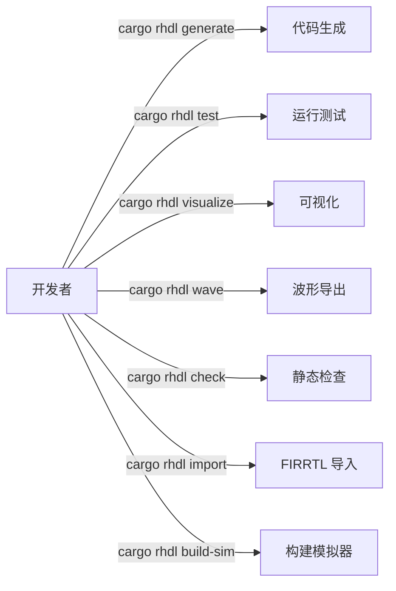

## 13.3 HIR 的核心作用

HIR 是工具链的中央数据结构，所有后端都从 HIR 读取信息。HIR 包含模块、端口、寄存器、组合逻辑块、时序逻辑块、连接关系以及元数据。

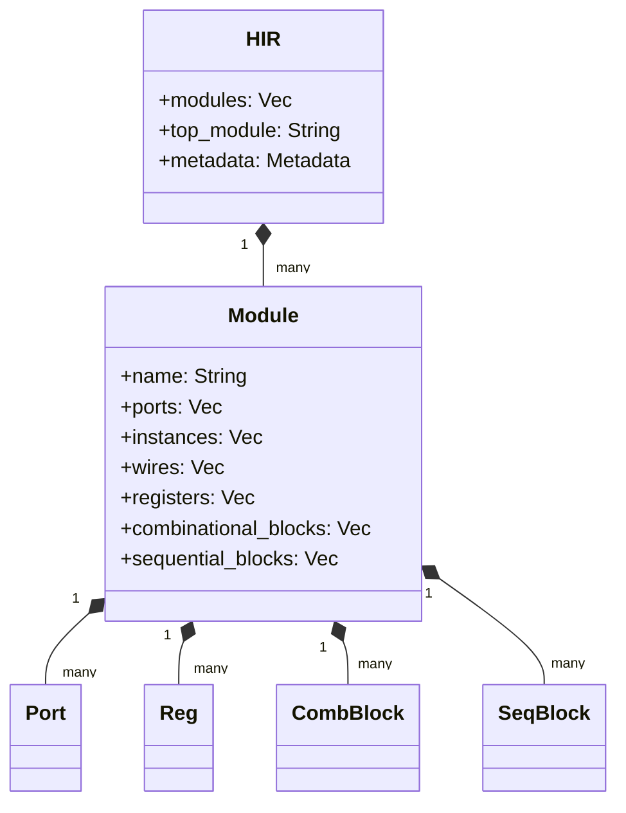

### 13.3.1 HIR 的来源

HIR 由 RHDL 过程宏在 Rust 编译期间生成。过程宏解析 `#[module]` 等标注，构建 HIR，并执行编译期检查。HIR 可以序列化为二进制或 JSON，供后续工具使用（例如 `cargo rhdl generate` 可以加载已构建的 HIR，避免重复编译）。

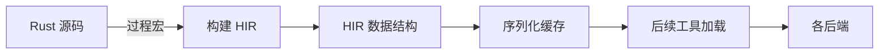

## 13.4 Verilog / SystemVerilog 后端

Verilog 后端是 RHDL 最核心的后端，生成可综合的 Verilog-2001 或 SystemVerilog-2017 代码。它遍历 HIR 模块，生成对应的硬件描述。

### 13.4.1 生成原则

*   **可综合**：输出的 Verilog 代码严格符合可综合子集，可以直接用于 FPGA/ASIC 工具。
    
*   **可读性**：保留原始名称和结构，添加注释。
    
*   **参数化**：对于参数化模块，生成 Verilog `parameter` 或直接生成特化实例（取决于配置）。
    
*   **时序逻辑**：使用 `always_ff`（SystemVerilog）或 `always @(posedge clk)`（Verilog-2001）。
    
*   **组合逻辑**：使用 `assign` 或 `always_comb`。
    
*   **层次保留**：默认保持模块层次，子模块实例化为独立模块。
    

### 13.4.2 生成流程

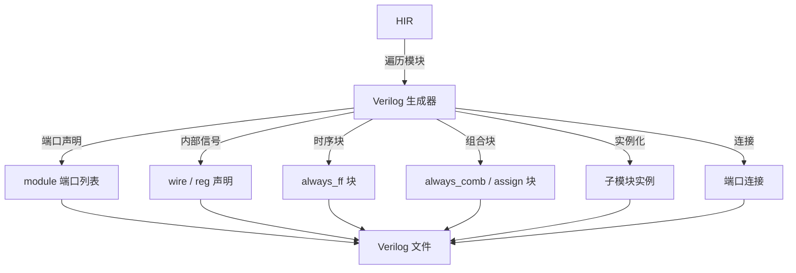

### 13.4.3 代码风格示例

对于 RHDL 计数器，生成的 Verilog：

```verilog
module Counter (
    input  wire        clk,
    input  wire        rst,
    input  wire        enable,
    output wire [7:0]  count
);
    reg [7:0] count_reg;

    always_ff @(posedge clk) begin
        if (rst) begin
            count_reg <= 8'h0;
        end else if (enable) begin
            count_reg <= count_reg + 1;
        end
    end

    assign count = count_reg;
endmodule

```

## 13.5 FIRRTL 后端

FIRRTL 后端生成标准 FIRRTL 文本，用于与 Chisel 生态以及其他 FIRRTL 工具（如 `firtool`）对接。

### 13.5.1 FIRRTL 生成

*   HIR 的模块、端口、寄存器、连接等直接映射到 FIRRTL 语法。
    
*   保留元数据作为 FIRRTL annotations。
    
*   支持 FIRRTL 3.0 规范。
    

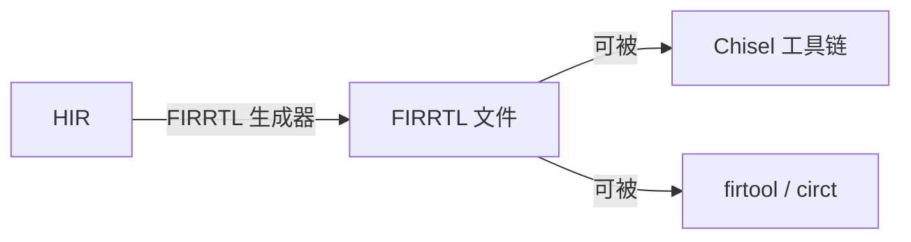

### 13.5.2 FIRRTL 示例

```plaintext
circuit Counter :
  module Counter :
    input clk : Clock
    input rst : UInt<1>
    input enable : UInt<1>
    output count : UInt<8>

    reg count_reg : UInt<8>, clk
    when rst :
      count_reg <= UInt<8>(0)
    else when enable :
      count_reg <= add(count_reg, UInt<1>(1))
    count <= count_reg

```

## 13.6 仿真器后端

RHDL 的仿真器后端分为两个独立的部分：**周期精确模拟器**和**功能模拟器**。两者从同一设计源生成，但执行模型不同。

### 13.6.1 周期精确模拟器后端

周期精确模拟器基于 HIR 构建，逐周期模拟硬件行为。支持两种执行方式：

*   **解释执行**：直接遍历 HIR 节点进行求值，适合调试和波形记录。
    
*   **编译执行**：将 HIR 编译为优化的 Rust/C 代码，速度更快。
    

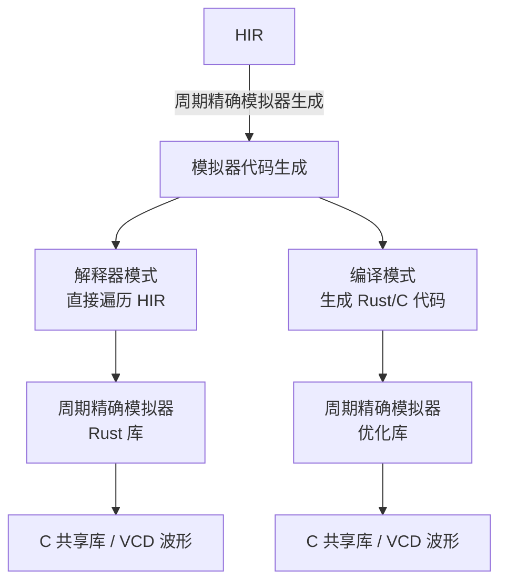

周期精确模拟器保证与最终硬件在**周期级一致**，可用于与硬件实现比对。

### 13.6.2 功能模拟器后端

功能模拟器直接使用模块的功能视图代码（普通 Rust 代码），不经过 HIR。工具链将 `#[functional_model]` 方法编译为独立的库，供软件调用。

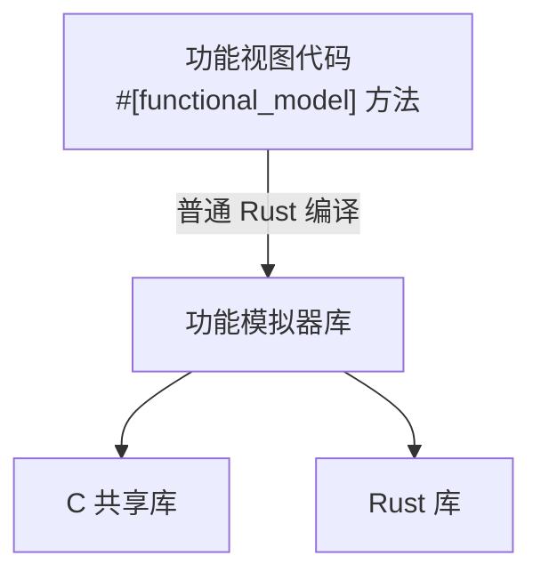

功能模拟器运行速度快，适合软件开发。

### 13.6.3 多视图模拟器生成配置

通过 Cargo feature 选择生成哪种模拟器：

```toml
[features]
functional = ["rhdl/functional"]          # 仅生成功能模拟器
cycle_accurate = ["rhdl/cycle_accurate"]  # 仅生成周期精确模拟器
both = ["functional", "cycle_accurate"]   # 两者都生成

```
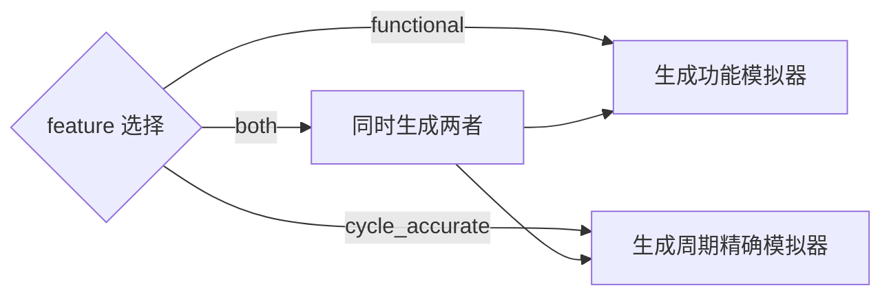

### 13.6.4 仿真 API 示例

周期精确模拟器：

```rust
let mut sim = Simulator::new(Counter::new());
sim.set_input("enable", true);
sim.tick();
assert_eq!(sim.get_output("count"), 1);
sim.dump_vcd("counter.vcd");

```

功能模拟器：

```rust
let mut model = UartTxFunctional::new();
model.send_byte(0x55);
let received = model.read_byte();

```

## 13.7 可视化后端

可视化后端从 HIR 和仿真数据生成图形描述，帮助开发者理解设计结构和时序行为。

### 13.7.1 模块层次图

从 HIR 中提取模块实例树，生成 Graphviz DOT 或 Mermaid 图。

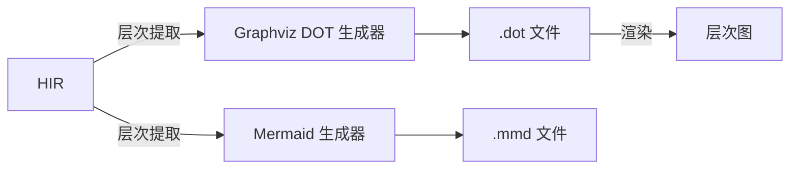

生成的层次图示例：

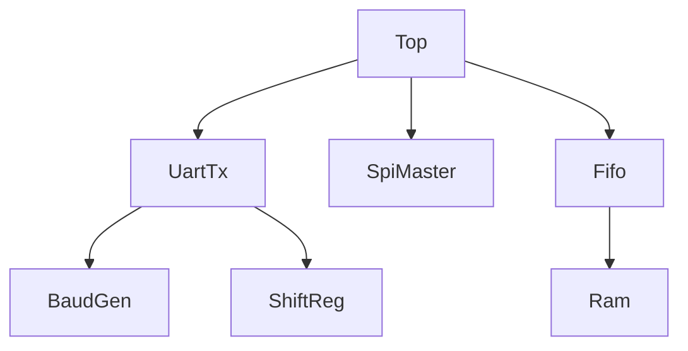

### 13.7.2 时序图

从仿真波形（VCD）或仿真器直接记录的数据生成时序图，展示信号随时间的变化。

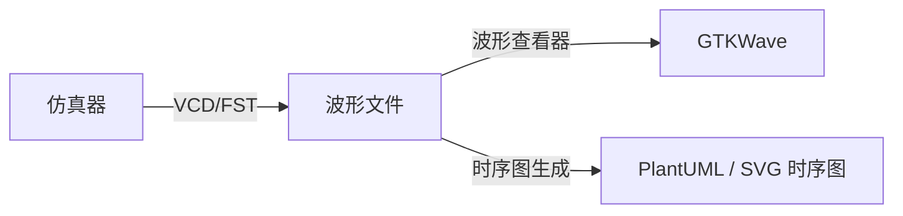

生成的时序图示例（示意）：

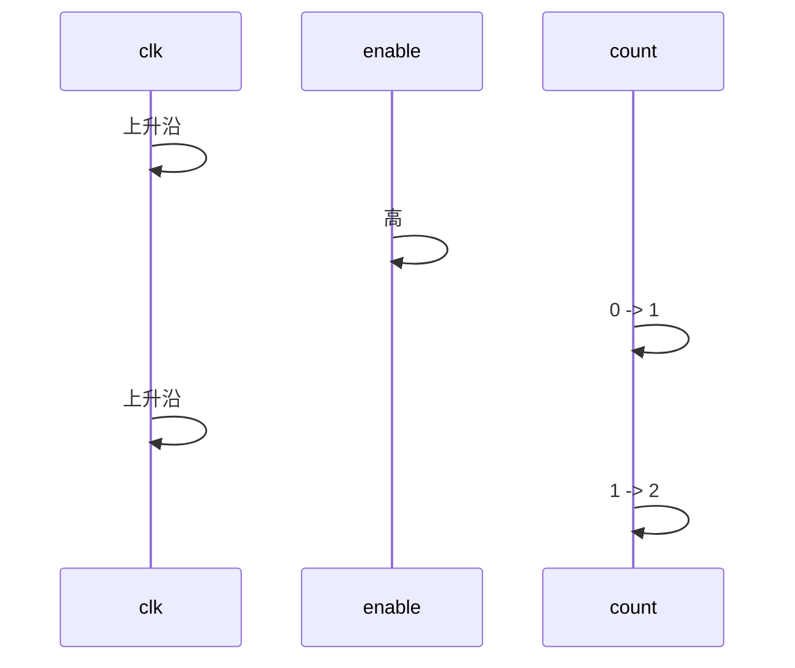

## 13.8 形式验证后端

形式验证后端生成用于形式验证工具的模型，如 SymbiYosys 的 SVA 属性或直接与 Rust 形式验证库（如 `creusot` 或 `krust`）集成。RHDL 计划提供接口，允许用户在模块上标注属性（assertions），生成可验证的模型。

### 13.8.1 属性标注

```rust
#[module]
pub struct Fifo {
    // ...
}

impl Fifo {
    #[property]
    fn no_overflow(&self) -> Bool {
        !(self.full.get() && self.push.get())
    }
}

```

### 13.8.2 生成流程


## 13.9 工具链工作流

### 13.9.1 标准开发流程

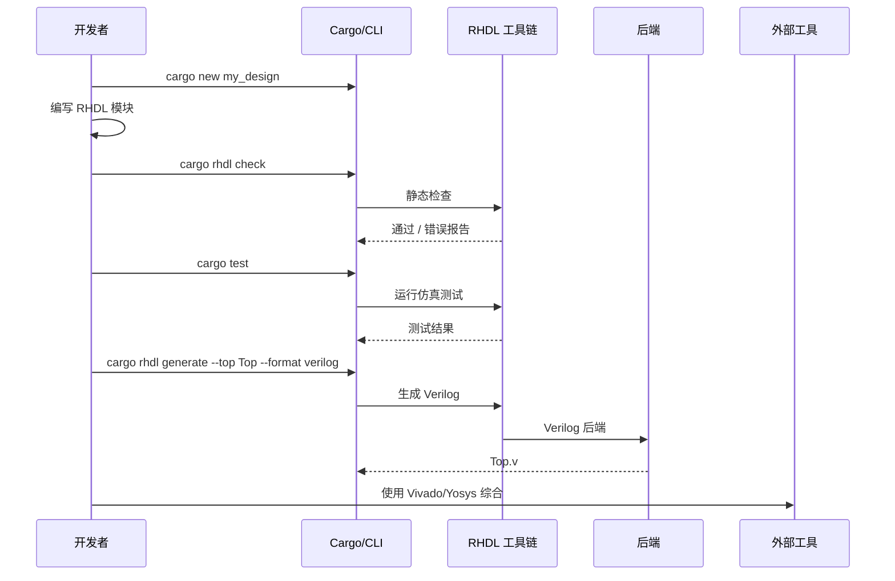

### 13.9.2 模拟器生成与使用流程

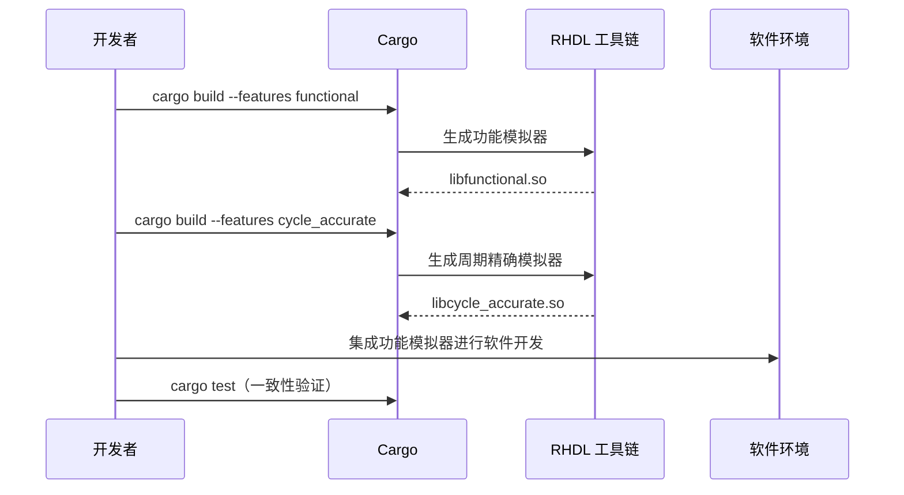

### 13.9.3 与 Chisel 互转工作流

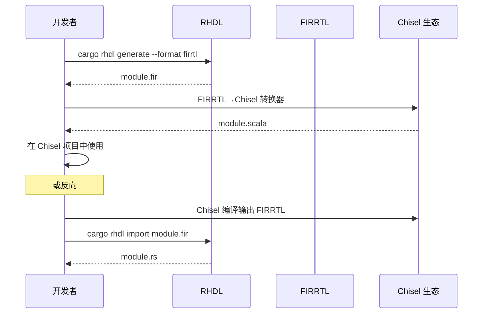

## 13.10 外部工具集成

RHDL 工具链设计为开放架构，可与众多外部工具集成：

*   **综合工具**：Yosys、Vivado、Quartus 等，直接使用生成的 Verilog。
    
*   **仿真工具**：Verilator、Icarus Verilog 等，也可直接使用生成的 Verilog 进行协同仿真。
    
*   **形式验证**：SymbiYosys、JasperGold 等，通过 SVA 或 FIRRTL。
    
*   **波形查看器**：GTKWave、Surfer 等，通过 VCD/FST。
    
*   **文档生成**：结合 `cargo doc` 和可视化图，自动生成设计文档。
    

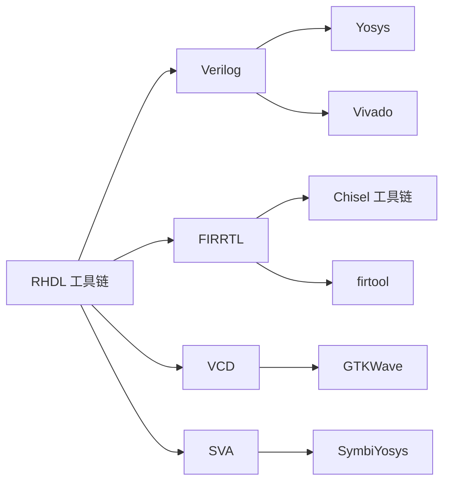

## 13.11 总结

RHDL 的工具链围绕 HIR 构建，通过 Cargo 提供一致且现代的开发体验。Verilog 后端确保可综合输出，FIRRTL 后端打通 Chisel 生态，原生仿真器支持周期精确模拟，功能模拟器支持快速软件开发，可视化工具提升设计理解，形式验证接口则为高可靠性需求铺路。工具链的开放架构允许与各种外部工具无缝协作，使 RHDL 不仅是一个语言，更是一个完整的硬件设计平台。多视图建模的集成使工具链能够同时生成功能模拟器和周期精确模拟器，覆盖从软件开发到硬件验证的全流程。