# 14. 验证与仿真

验证与仿真是硬件设计流程中不可或缺的环节。RHDL 充分利用 Rust 生态的测试基础设施，提供原生仿真器，支持在 `cargo test` 中直接实例化模块、驱动激励、断言输出，并生成 VCD/FST 波形用于调试。此外，RHDL 通过**多视图建模**实现了**功能模拟器**与**周期精确模拟器**的分离，并提供了两者的一致性验证机制，从而覆盖从软件开发到硬件验证的完整流程。

引入受控泛型闭包后，验证与仿真环节大量受益：闭包可用于封装测试模式、生成激励、定义属性、简化桥接适配器逻辑，使测试代码更简洁、更可复用。闭包在测试与桥接中属于非综合路径，因此完全自由，不受可综合性约束。

## 14.1 验证与仿真目标

- **无缝集成**：仿真测试就是普通的 Rust 测试，使用 `cargo test` 运行，无需额外工具。
- **快速反馈**：功能模拟器用于快速软件开发，周期精确模拟器用于硬件精确验证，各取所需。
- **波形可调试**：周期精确模拟器支持导出 VCD/FST 波形，可配合 GTKWave 等工具进行波形调试。
- **随机化验证**：借助 Rust 的 `proptest` 等库，实现基于属性的随机测试。
- **覆盖率驱动**：记录仿真过程中的代码覆盖率和功能覆盖率，指导测试完善。
- **多视图一致性**：自动验证功能模型与周期精确模型行为等价，确保软件开发与硬件实现一致。
- **可扩展**：仿真器支持插件，可集成形式验证或协同仿真。
- **测试代码高复用**：通过泛型闭包封装通用测试模式，减少重复样板代码。

## 14.2 仿真器架构与工作原理

RHDL 提供两种独立的模拟器：**周期精确模拟器**和**功能模拟器**。它们从同一设计源的不同视图生成，执行模型不同。

### 14.2.1 周期精确模拟器

周期精确模拟器基于 HIR 构建，逐周期模拟硬件行为，保证与最终硬件在周期级一致。它采用**事件驱动 + 同步时序模型**：每个 `tick()` 调用中，先求解组合逻辑，再在时钟边沿更新寄存器。

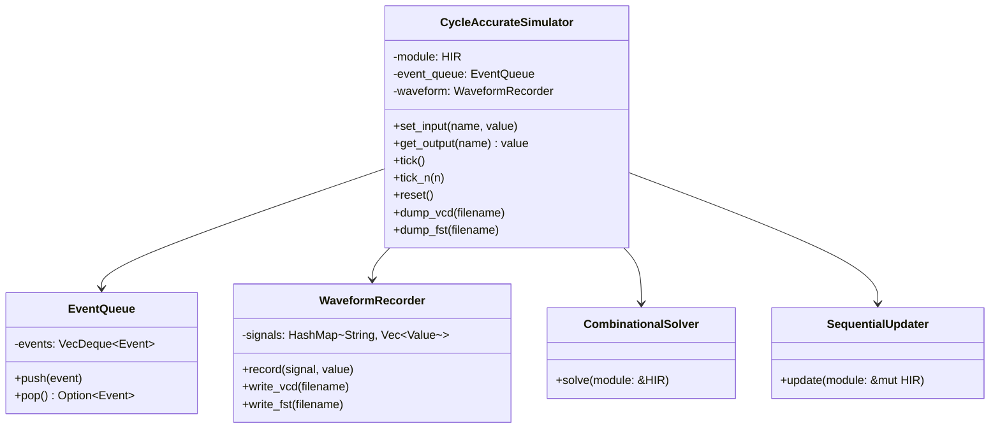

**执行模型**：

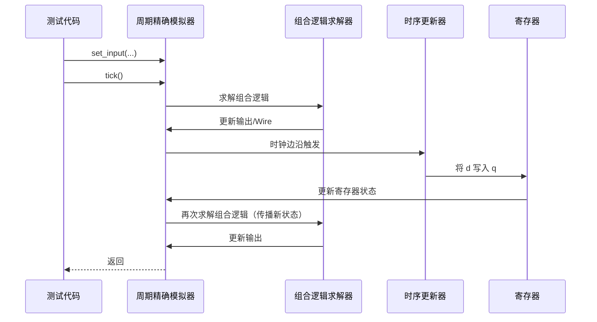

### 14.2.2 功能模拟器

功能模拟器直接执行模块的 `#[functional_model]` 方法（事务级代码），不经过 HIR，无时钟概念。它运行速度快，适合软件开发。闭包在功能模型方法中可以自由使用。

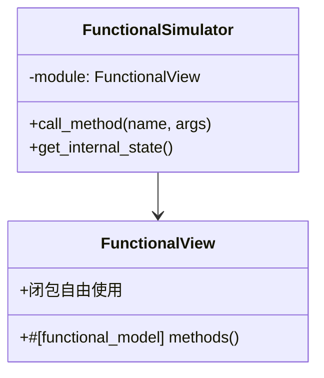

**执行模型**：

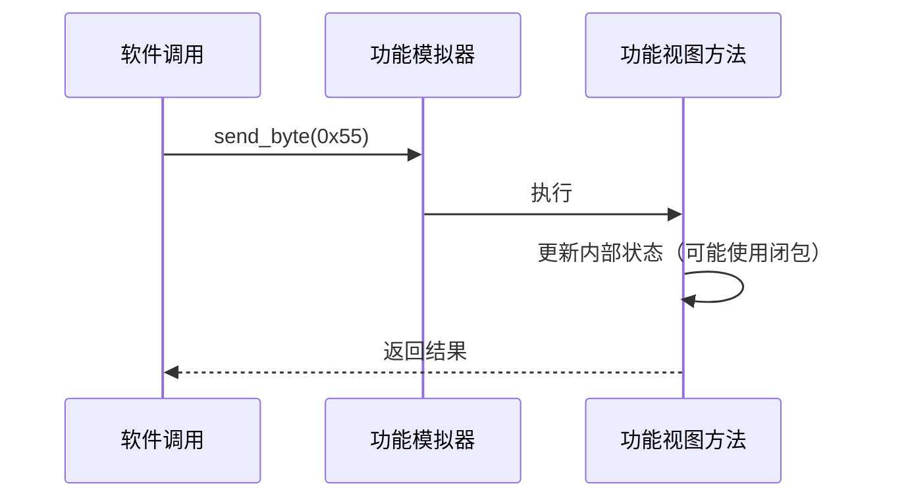

### 14.2.3 两种模拟器对比

| 特性 | 周期精确模拟器 | 功能模拟器 |
| --- | --- | --- |
| 执行模型 | 逐周期，事件驱动 | 事务级，直接调用 |
| 时序精度 | 周期精确（无门延迟） | 无时序概念 |
| 速度 | 中等（可编译优化） | 快（接近软件） |
| 波形支持 | VCD/FST | 不产生波形 |
| 使用场景 | 硬件验证、波形比对 | 软件开发、架构探索 |
| 闭包支持 | 测试代码中自由使用 | 功能模型和测试中自由使用 |
| 生成方式 | HIR 解释/编译执行 | 普通 Rust 编译 |

## 14.3 测试框架集成

RHDL 测试就是普通的 Rust 单元测试或集成测试，使用 `#[test]` 属性标注。周期精确模拟器和功能模拟器都可以在测试中直接使用。闭包可以用于封装通用的测试辅助函数，减少重复代码。

### 14.3.1 周期精确模拟器测试

```rust
#[test]
fn test_counter_increments() {
    let mut sim = Simulator::new(Counter::new()); // 周期精确模拟器
    sim.set_input("enable", true);
    sim.tick();
    assert_eq!(sim.get_output("count"), 1);
    sim.tick();
    assert_eq!(sim.get_output("count"), 2);
}
```

### 14.3.2 功能模拟器测试

```rust
#[test]
fn test_uart_functional() {
    let mut model = UartTxFunctional::new();
    model.send_byte(0x55);
    assert_eq!(model.get_tx_buffer_len(), 0); // 假设发送后缓冲区空
}
```

### 14.3.3 使用闭包封装测试模式

```rust
// 定义通用测试辅助函数
fn with_counter_sim<F>(test_fn: F)
where
    F: FnOnce(&mut Simulator<Counter>),
{
    let mut sim = Simulator::new(Counter::new());
    test_fn(&mut sim);
}

#[test]
fn test_counter_with_closure() {
    with_counter_sim(|sim| {
        sim.set_input("enable", true);
        sim.tick();
        assert_eq!(sim.get_output("count"), 1);
    });
}
```

### 14.3.4 运行测试

`cargo test` 自动发现并运行所有测试，包括周期精确和功能模拟器测试。

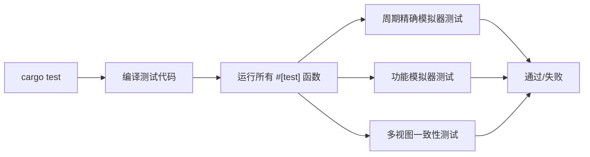

## 14.4 仿真 API 与使用模式

### 14.4.1 周期精确模拟器 API

| 方法 | 说明 |
| --- | --- |
| `Simulator::new(module)` | 创建周期精确模拟器实例 |
| `set_input(name, value)` | 设置输入端口的值 |
| `get_output(name)` | 读取输出端口的值 |
| `tick()` | 执行一个时钟周期（上升沿+组合逻辑） |
| `tick_n(n)` | 执行 n 个时钟周期 |
| `reset()` | 触发复位 |
| `dump_vcd(filename)` | 导出 VCD 波形 |
| `dump_fst(filename)` | 导出 FST 波形 |
| `set_clock_period(ps)` | 设置时钟周期（用于波形时间轴） |

### 14.4.2 功能模拟器 API

功能模拟器 API 由模块的 `#[functional_model]` 方法定义，例如 `send_byte()`、`read_byte()` 等，直接调用。

### 14.4.3 典型测试模式

#### 定向测试

手动构造激励序列，检查输出。

```rust
let mut sim = Simulator::new(MyModule::new());
sim.set_input("a", 10);
sim.set_input("b", 20);
sim.tick();
assert_eq!(sim.get_output("sum"), 30);
```

#### 随机测试

使用 `proptest` 生成大量随机输入。

```rust
use proptest::prelude::*;

proptest! {
    #[test]
    fn test_adder_random(a in 0u8..255, b in 0u8..255) {
        let mut sim = Simulator::new(Adder::new());
        sim.set_input("a", a);
        sim.set_input("b", b);
        sim.tick();
        assert_eq!(sim.get_output("sum"), a.wrapping_add(b));
    }
}
```

#### 脚本化激励

使用循环和条件生成复杂时序波形。

```rust
for i in 0..100 {
    sim.set_input("data", i as u8);
    sim.tick();
    assert_eq!(sim.get_output("result"), expected(i));
}
```

#### 闭包封装激励生成

```rust
fn apply_stimulus<F>(sim: &mut Simulator<MyModule>, stim_fn: F)
where
    F: Fn(usize) -> u8,
{
    for i in 0..100 {
        sim.set_input("data", stim_fn(i));
        sim.tick();
    }
}

// 使用
apply_stimulus(&mut sim, |i| (i * 2) as u8);
```

## 14.5 波形导出与调试

周期精确模拟器支持 VCD/FST 波形导出，便于硬件调试。

### 14.5.1 波形记录

可以配置记录哪些信号，以减少文件大小。

```rust
sim.record_signal("count");
sim.record_all(); // 记录所有信号
```

### 14.5.2 VCD 导出流程

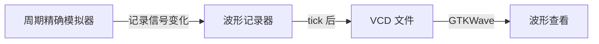

### 14.5.3 自动波形导出（失败时）

```rust
Simulator::set_auto_dump_on_failure(true);
```

测试失败时自动生成 VCD，便于事后分析。

## 14.6 随机测试与属性测试

RHDL 与 Rust 的 `proptest` 库无缝集成，支持属性驱动测试（PBT）。这对于验证硬件功能正确性非常有效。闭包可用于定义属性或封装验证逻辑。

### 14.6.1 属性测试示例

```rust
proptest! {
    #[test]
    fn test_fifo_order(data in proptest::collection::vec(any::<u8>(), 0..100)) {
        let mut sim = Simulator::new(Fifo::<8, 16>::new());
        for byte in data {
            sim.set_input("push", true);
            sim.set_input("data_in", byte);
            sim.tick();
        }
        // 验证 FIFO 输出顺序
    }
}
```

### 14.6.2 使用闭包定义属性

```rust
proptest! {
    #[test]
    fn test_commutative(a in any::<u8>(), b in any::<u8>()) {
        let check = |sim: &mut Simulator<Adder>| {
            sim.set_input("a", a);
            sim.set_input("b", b);
            sim.tick();
            sim.get_output("sum") == a.wrapping_add(b)
        };
        assert!(check(&mut Simulator::new(Adder::new())));
    }
}
```

### 14.6.3 属性测试流程

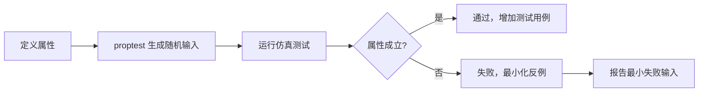

## 14.7 覆盖率分析

覆盖率分析帮助评估验证充分性。RHDL 支持：

- **代码覆盖率**：利用 Rust 工具（如 `cargo-tarpaulin`）统计测试对功能视图代码的覆盖率。
- **硬件功能覆盖率**：用户可定义覆盖组，统计周期精确模拟器中特定信号组合是否被触发。

### 14.7.1 功能覆盖率定义

```rust
#[covergroup]
struct MyCoverage {
    #[coverpoint(signal = "state", bins = ["Idle", "Busy", "Error"])]
    state_cp: Coverpoint,
}
```

### 14.7.2 覆盖率报告

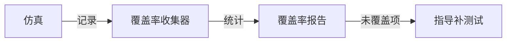

## 14.8 断言与形式验证接口

RHDL 允许在模块中定义断言，这些断言在仿真中检查，并可导出为 SVA 供形式验证工具使用。

### 14.8.1 仿真断言

```rust
#[module]
pub struct Fifo {
    // ...
}

impl Fifo {
    #[assert]
    fn no_overflow(&self) -> Bool {
        !(self.full.get() && self.push.get())
    }
}
```

仿真时，每个时钟周期后检查断言，失败则报告。

### 14.8.2 与形式验证的衔接


## 14.9 多视图一致性验证

多视图建模的核心优势之一是能够自动验证功能模型与周期精确模型的行为等价性。RHDL 提供两种机制，且均可使用闭包简化测试代码。

### 14.9.1 随机测试比对

利用 `proptest` 生成随机输入序列，分别运行功能模拟器和周期精确模拟器，比对输出。这是最直接的一致性验证方法。

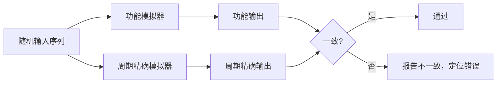

**示例测试代码（含闭包）**：

```rust
proptest! {
    #[test]
    fn test_uart_models_agree(data in proptest::collection::vec(any::<u8>(), 0..100)) {
        let mut func_model = UartTxFunctional::new();
        let mut cycle_model = Simulator::new(UartTxCycleAccurate::new());
        for byte in data {
            // 功能模型：直接调用
            func_model.send_byte(byte);
            // 周期精确模型：驱动信号并等待
            cycle_model.set_input("tx_data", byte);
            cycle_model.set_input("tx_start", true);
            while cycle_model.get_output("tx_busy") {
                cycle_model.tick();
            }
            cycle_model.set_input("tx_start", false);
            // 比对输出
            assert_eq!(func_model.get_last_tx_byte(), cycle_model.get_output("last_tx_byte"));
        }
    }
}
```

可以使用闭包封装周期模型的发送过程：

```rust
fn send_byte_cycle(sim: &mut Simulator<UartTxCycleAccurate>, byte: u8) {
    let send = |s: &mut Simulator<UartTxCycleAccurate>| {
        s.set_input("tx_data", byte);
        s.set_input("tx_start", true);
        while s.get_output("tx_busy") {
            s.tick();
        }
        s.set_input("tx_start", false);
    };
    send(sim);
}
```

### 14.9.2 桥接协同仿真

通过桥接适配器，在同一测试中让功能模拟器驱动周期精确模拟器（或反之），进行端到端验证。桥接适配器使用泛型闭包封装转换逻辑。

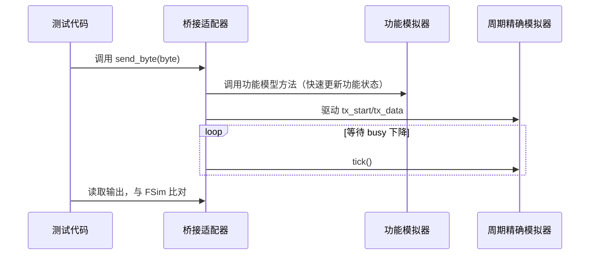

桥接适配器示例（使用闭包）：

```rust
impl UartTx {
    #[bridge]
    fn send_byte_to_rtl(&mut self, byte: u8) {
        let start = |s: &mut Self| {
            s.tx_data.set(byte);
            s.tx_start.set(true);
        };
        start(self);
        while self.tx_busy.get() {
            self.tick();
        }
        self.tx_start.set(false);
    }
}
```

### 14.9.3 形式化等价验证（可选）

对于关键模块，RHDL 可以生成形式化断言，证明功能模型与周期精确模型在接口上等价。这需要将功能模型转换为某种形式化表示，RHDL 预留接口。

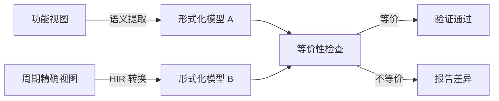

## 14.10 验证与仿真流程总结

RHDL 的验证与仿真覆盖从单元测试到系统级验证，并充分利用多视图建模实现分层验证，闭包在其中扮演了提升复用性和可读性的角色。

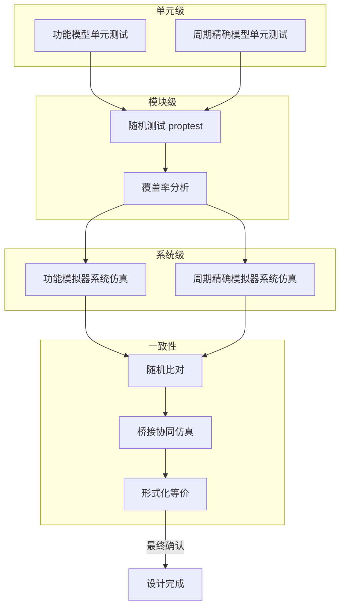

RHDL 的验证与仿真体系以 Rust 测试为核心，结合波形调试、随机测试、覆盖率统计、形式验证接口以及多视图一致性验证，提供了从快速迭代到严格验证的全方位支持。泛型闭包在测试辅助、桥接适配器和属性定义中的应用，使测试代码更简洁、更可维护，同时保持了硬件验证的严谨性。开发者可以像开发软件一样测试硬件，并在功能模型和周期精确模型之间自由切换，确保设计正确性。