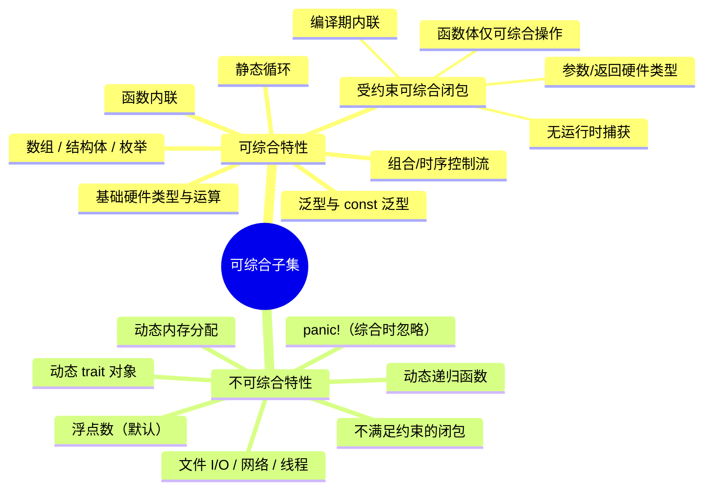
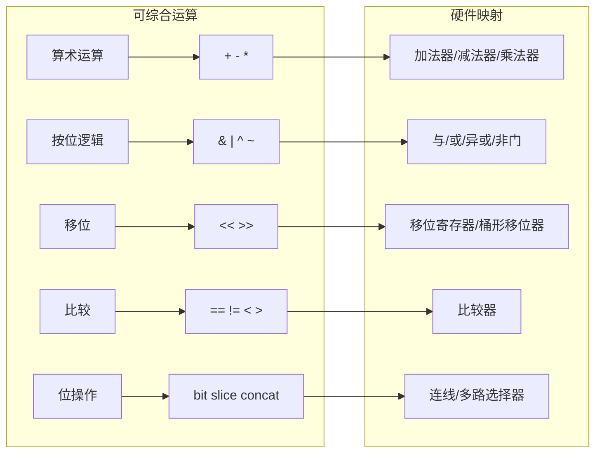
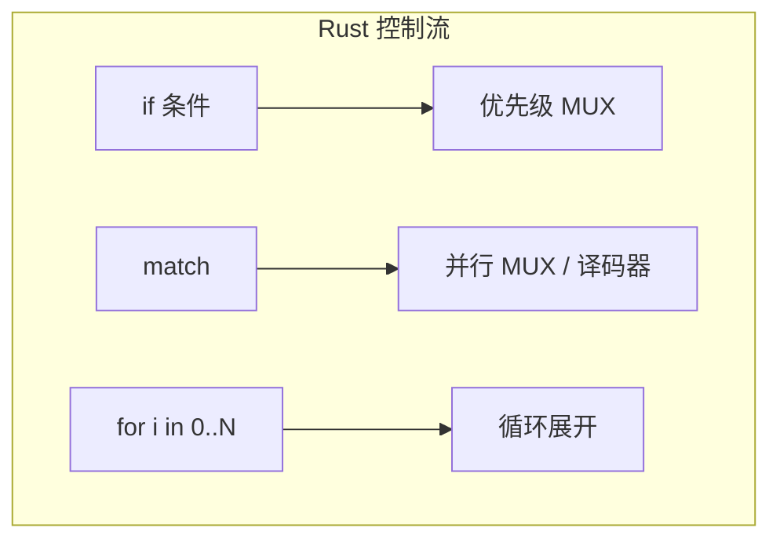
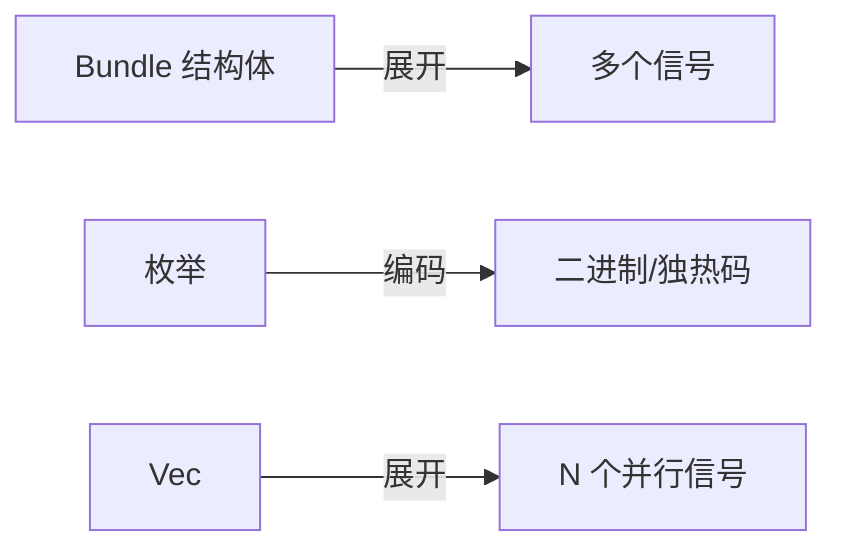
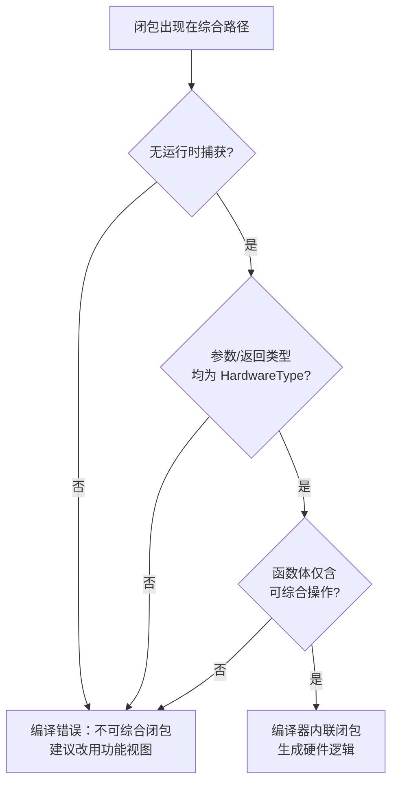
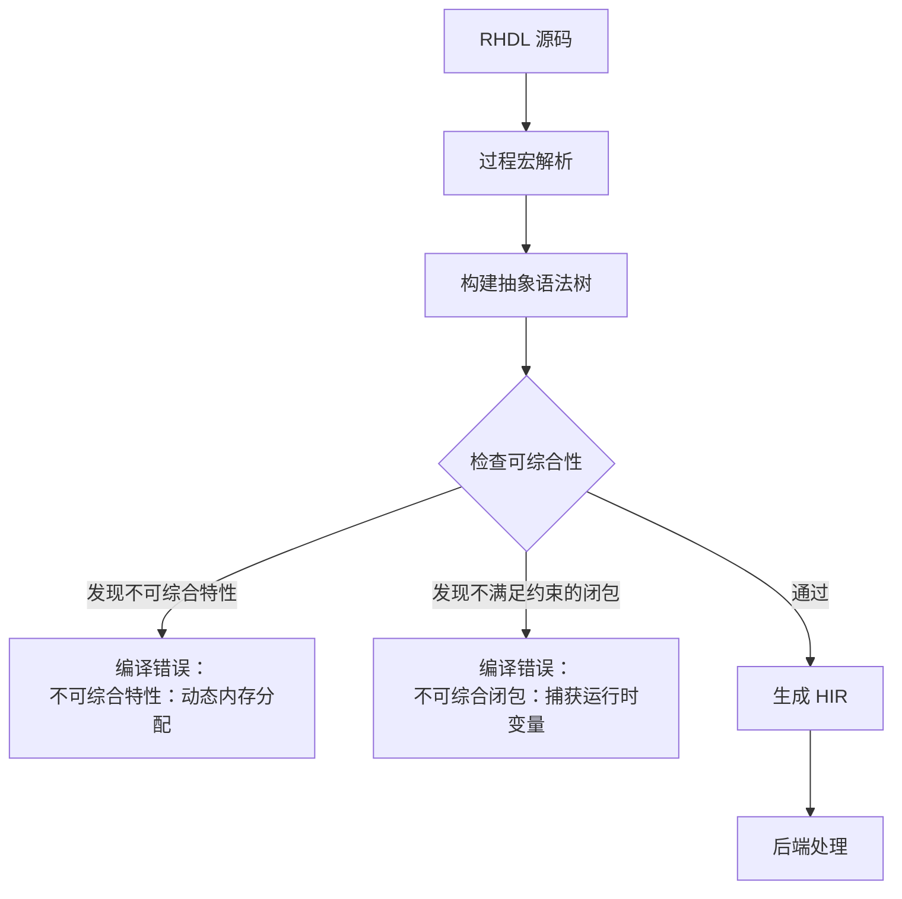
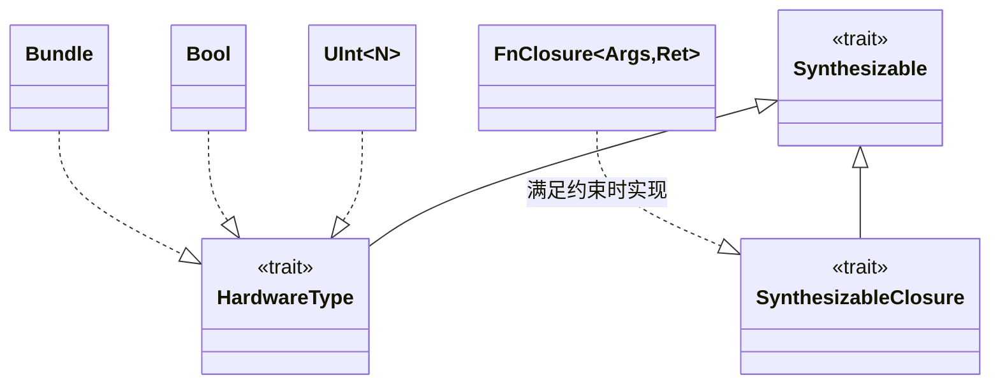
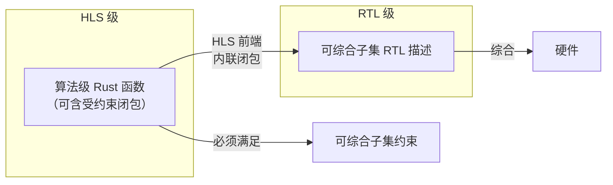
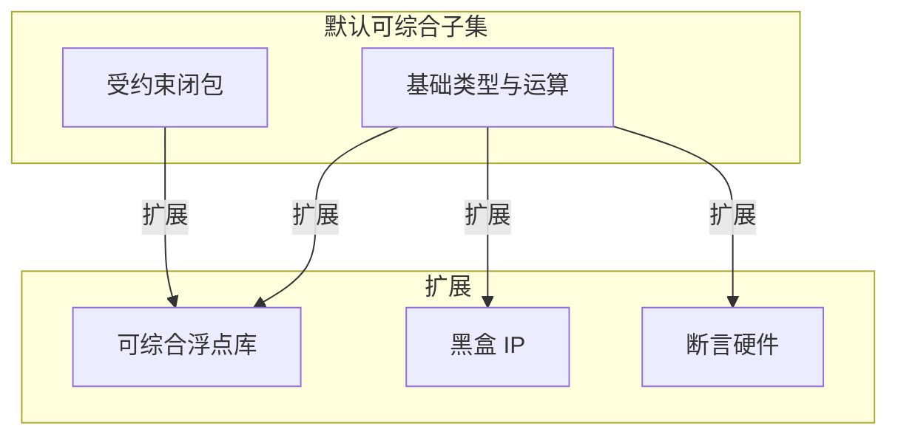
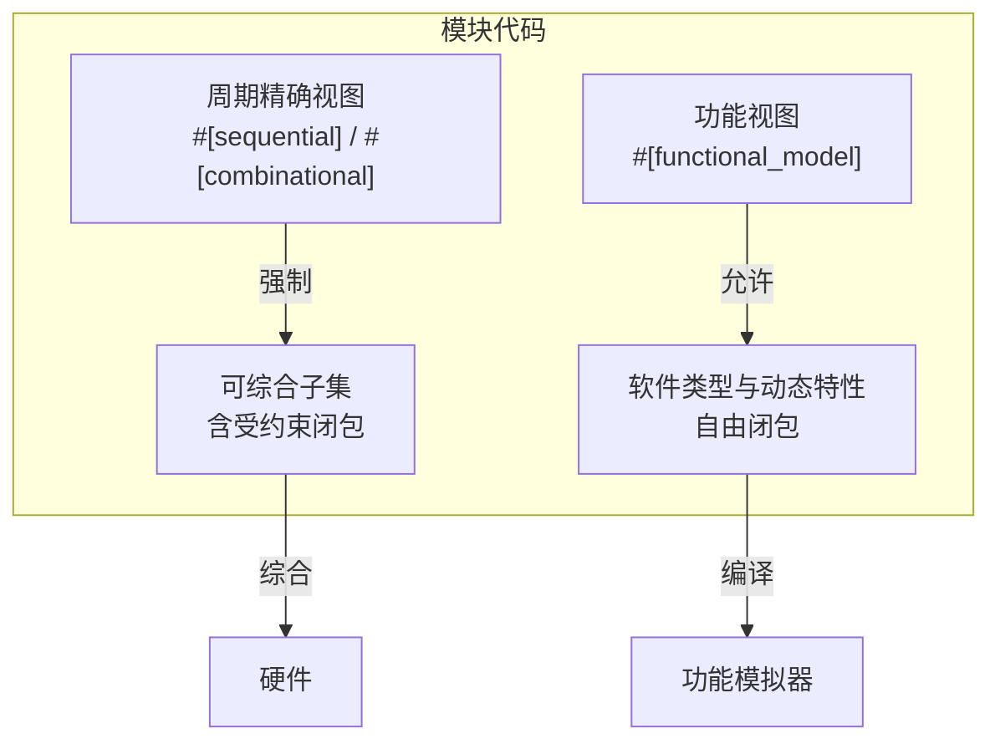

# 15. 可综合子集与限制

RHDL 的设计目标之一是提供明确的**可综合子集**，即定义哪些 Rust 语言特性可以被确定性地转换为硬件电路，哪些特性由于动态行为、资源不可知或语义不匹配而被禁止。这一边界对于保证硬件描述的可综合性、可预测性和工具链的可靠性至关重要。RHDL 编译器通过静态分析强制这一子集，使得任何违反可综合性约束的代码在编译期即被拒绝，而不是等到综合阶段才暴露问题。

在多视图建模中，**周期精确视图必须严格满足可综合子集**，而**功能视图则可以突破部分限制**（例如使用动态数据结构），因为功能视图仅用于仿真，不参与综合。

在引入受控泛型闭包后，可综合子集被扩展为包含**受约束的可综合闭包**：这些闭包必须满足严格的条件（无运行时捕获、纯函数、可内联），并在编译期被完全消解为硬件逻辑。不满足约束的闭包仍然被禁止用于综合路径，但可以在功能视图等非综合场景中自由使用。

## 15.1 可综合子集的定义

可综合子集是 RHDL 语言的一个子集，它覆盖了足够丰富的表达力以描述各种数字电路，同时排除了那些无法映射到硬件或映射语义不明确的 Rust 特性。该子集与 FIRRTL 的语义模型对齐，确保生成的硬件与仿真行为一致。



## 15.2 可综合特性详细说明

### 15.2.1 基础硬件类型与运算

所有基础硬件类型（`Bool`, `Bits<N>`, `UInt<N>`, `SInt<N>`, `Clock`, `Reset`）及其定义的运算符都是可综合的。这些运算符直接映射为组合逻辑门或简单的算术单元。

| Rust 表达式 | 硬件映射 |
| --- | --- |
| `a + b` | 加法器 |
| `a - b` | 减法器 |
| `a * b` | 乘法器 |
| `a & b` | 按位与门阵列 |
| `a == b` | 比较器 |
| `a << b` | 移位器 |
| `!a` | 反相器 |
| `a.bit(i)` | 位选择 |
| `a.slice(high, low)` | 位段提取 |



### 15.2.2 组合与时序控制流

- `if` 表达式：映射为优先级多路选择器。
- `match` 表达式：映射为并行多路选择器或译码器。
- `for` 循环（静态范围）：编译期展开为重复硬件。
- `while` 循环（有界且可静态展开）：不推荐，但允许在编译期完全展开。



### 15.2.3 函数调用（内联）

RHDL 允许调用纯函数（无副作用），这些函数在编译期被内联展开。函数参数和返回值必须是硬件类型，函数体内只能使用可综合特性。

```rust
fn compute_sum(a: UInt<8>, b: UInt<8>) -> UInt<8> {
    a + b
}

#[combinational]
fn logic(&mut self) {
    self.sum.set(compute_sum(self.a.get(), self.b.get()));
}
```

### 15.2.4 泛型与 const 泛型

泛型在编译期展开为具体类型，因此可综合。例如 `ParamAdder<W>` 会被特化为 `ParamAdder<8>` 等，生成对应的硬件实例。

### 15.2.5 数组、结构体、枚举

- **数组** `Vec<T, N>`：固定长度数组，映射为多个并行信号或存储器。
- **结构体** `Bundle`：字段展开为独立的信号集合。
- **枚举**：可编码为二进制、独热码等状态编码，用于状态机。



### 15.2.6 静态断言与编译期计算

Rust 的 `const fn` 可以在编译期计算常量，用于生成参数、查找表等，这些也是可综合的一部分（因为它们在综合前已完全确定）。

### 15.2.7 受约束的可综合闭包

RHDL 允许在综合路径中使用**受约束的可综合闭包**，以提升代码复用和抽象能力。闭包必须满足以下所有条件：

- **无运行时捕获**：闭包不能捕获任何运行时变量（可以捕获 `const` 项或编译期常量）。
- **参数和返回值类型**：所有参数和返回值类型必须实现 `HardwareType` trait。
- **函数体可综合**：函数体内只能包含可综合操作（基础运算、位操作、静态控制流等）。
- **可内联性**：编译器能够在编译期将闭包完全内联为硬件逻辑。

编译器在过程宏展开时检查这些约束，满足则内联；否则报错。



**示例**：合法可综合闭包

```rust
#[combinational]
fn compute(&mut self) {
    let invert = #[synthesizable] |x: UInt<8>| -> UInt<8> { !x };
    self.out.set(invert(self.data.get()));
}
```

**示例**：非法闭包（捕获运行时变量）

```rust
#[combinational]
fn bad(&mut self) {
    let threshold = self.threshold.get(); // 运行时变量
    let compare = |x: UInt<8>| -> Bool { x > threshold }; // 捕获 threshold
    self.out.set(compare(self.data.get())); // 错误
}
```

## 15.3 不可综合特性详细说明

以下 Rust 特性由于依赖运行时动态行为、需要不可预测的资源或产生不可映射的语义，被 RHDL 明确禁止用于硬件描述（综合路径）。在仿真器中，这些特性可能可以工作，但在生成硬件时会报错。

### 15.3.1 动态内存分配

`Vec<T>`（动态数组）、`Box<T>`、`String`、`HashMap` 等依赖堆内存分配的类型，硬件中不存在动态内存管理，因此完全禁止。

```rust
// 错误：不可综合
let mut data = Vec::new();
data.push(value);
```

### 15.3.2 递归函数（动态）

递归函数如果不能在编译期完全展开为有限深度的硬件（如递归深度依赖运行时值），则不可综合。RHDL 要求递归调用必须在编译期可以被静态展开（例如使用 const 泛型控制递归深度），否则拒绝。

```rust
// 错误：动态递归
fn recurse(n: UInt<8>) -> UInt<8> {
    if n == 0 { 0 } else { recurse(n - 1) }
}
```

但以下形式可能可综合（因为递归深度由 const 参数决定并在编译期展开）：

```rust
fn build_adder_tree<const N: usize>(inputs: Vec<UInt<8>, N>) -> UInt<8> {
    // 编译期展开的递归
}
```

### 15.3.3 浮点数（默认）

默认的 Rust `f32`/`f64` 浮点运算不可综合，因为标准浮点单元资源大且语义复杂。RHDL 不直接支持浮点运算，但可以引入外部可综合浮点库（如 `rhdl-float`），这些库使用定点或自定义浮点格式，其运算属于可综合子集。

### 15.3.4 动态 trait 对象

`dyn Trait` 涉及动态分派，硬件无法在运行时决定调用哪个实现，因此禁止。

```rust
// 错误：动态 trait 对象
let obj: &dyn MyTrait = &my_module;
```

### 15.3.5 不满足约束的闭包

闭包本身并非完全禁止，但若出现在综合路径中且不满足可综合闭包约束（如捕获运行时变量、使用非硬件类型、函数体含不可综合操作），则被禁止。此类闭包可以在功能视图、桥接适配器等非综合场景中自由使用。

```rust
// 错误：捕获运行时变量
let offset = self.offset.get();
let calc = |x: UInt<8>| -> UInt<8> { x + offset };
```

### 15.3.6 文件 I/O、网络、线程

硬件描述中不允许任何与外部世界交互的操作，包括文件读写、网络通信、多线程等。这些在综合时无意义。

### 15.3.7 `panic!` 与错误处理

`panic!` 在仿真中触发运行时错误，有助于调试，但在综合时被忽略或禁止。RHDL 编译器会警告用户综合路径中的 `panic!` 将被忽略。

## 15.4 编译期检查机制

RHDL 编译器（过程宏和静态分析）负责强制可综合子集。检查发生在 Rust 编译期间，当过程宏展开时，会分析代码结构，拒绝不可综合的构造。对于闭包，会增加额外的约束检查。

### 15.4.1 检查流程



### 15.4.2 错误信息示例

```plaintext
error: unsynthesizable construct: dynamic memory allocation
  --> src/main.rs:12:5
   |
12 |     let mut data = Vec::new();
   |     ^^^^^^^^^^^^^^^^^^^^^^^^^
   |
   = note: dynamic memory allocation is not supported in synthesizable RHDL
   = help: use a fixed-size array Vec<T, N> instead

error: unsynthesizable closure: captures runtime variable
  --> src/main.rs:10:5
   |
10 |     let compare = |x: UInt<8>| -> Bool { x > threshold };
   |     ^^^^^^^^^^^^^^^^^^^^^^^^^^^^^^^^^^^^^^^^^^^^^^^^^
   |
   = note: use an explicit function or move the threshold as a const
```

编译器还会给出替代建议，例如使用 `Vec<T, N>` 固定数组代替动态 `Vec<T>`，或建议将闭包改为显式函数。

### 15.4.3 可综合性 trait 约束

RHDL 定义了一个 `Synthesizable` trait，所有可综合类型和表达式必须实现该 trait。编译器在展开宏时，会验证表达式的类型是否实现了 `Synthesizable`，否则报错。对于可综合闭包，还要求实现 `SynthesizableClosure` trait。



不可综合类型（如 `String`）不实现 `Synthesizable`，因此不能出现在硬件描述中。不满足约束的闭包不实现 `SynthesizableClosure`，同样被禁止。

## 15.5 可综合子集与 HLS 的关系

RHDL 的高层次综合（HLS）允许编写更算法化的 Rust 代码，但 HLS 函数的输入同样必须满足可综合子集。HLS 前端会将算法描述映射为调度后的硬件，但它所接受的代码仍然受限于静态可分析的范畴（如静态循环、无动态分配等）。因此，可综合子集是 HLS 的基础。

闭包在 HLS 中可以作为数据流变换单元，但仍需满足可综合闭包的约束，并在 HLS 调度前被内联或映射为硬件单元。



## 15.6 限制的例外与扩展

尽管默认禁止某些特性，RHDL 允许通过明确的外部库或属性来扩展可综合子集。例如：

- **可综合浮点库**：引入 `rhdl-float` crate，提供 `Float32` 类型及其运算，这些运算实现了 `Synthesizable` trait。
- **可综合断言宏**：提供 `#[synthesizable_assert]` 宏，在综合时生成硬件检查逻辑。
- **黑盒模块**：允许将外部 IP（如硬核）封装为黑盒，其内部实现可以不符合可综合子集，但对外接口是硬件类型安全的。



## 15.7 多视图建模下的可综合子集

在多视图建模中，可综合子集仅约束**周期精确视图**。**功能视图**使用普通 Rust 代码，可以突破部分限制，例如：

- 功能视图可以使用动态数据结构（`VecDeque`、`String` 等）来建模缓冲区和队列。
- 功能视图可以使用浮点运算进行高层算法验证。
- 功能视图可以使用递归或复杂控制流，只要不用于综合。
- 功能视图中的闭包完全自由，不受可综合闭包约束。

这种分离使得功能模拟器可以充分利用软件灵活性，而周期精确模拟器保持硬件语义严格性。编译器通过 `#[functional_model]` 标注区分代码路径，确保综合路径只包含可综合子集。



桥接适配器负责在两者之间进行数据转换和时序对接，而一致性验证确保功能模型与周期精确模型行为等价。

## 15.8 总结

RHDL 的可综合子集与限制通过编译期检查强制执行，确保了从 Rust 代码到硬件结构的确定性映射。可综合特性涵盖了数字电路设计的核心需求，并扩展包含受约束的可综合闭包，以提升抽象能力而不牺牲安全性。不可综合特性的排除避免了传统 HDL 中常见的综合意外。这一设计既保障了硬件正确性，又为开发者提供了清晰的边界和明确的错误信息，是 RHDL 安全性和可预测性的重要体现。同时，多视图建模通过分离功能视图和周期精确视图，在保持综合严格性的同时，为功能模拟提供了灵活性。