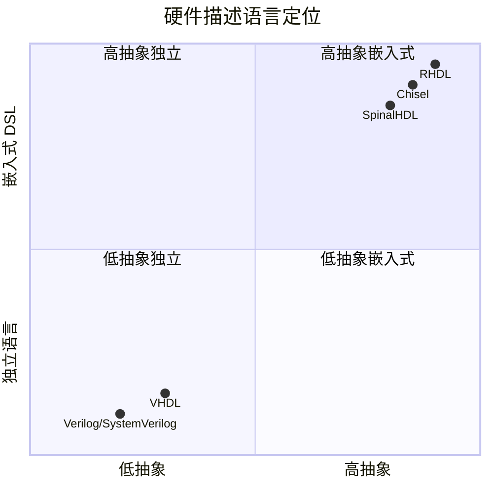
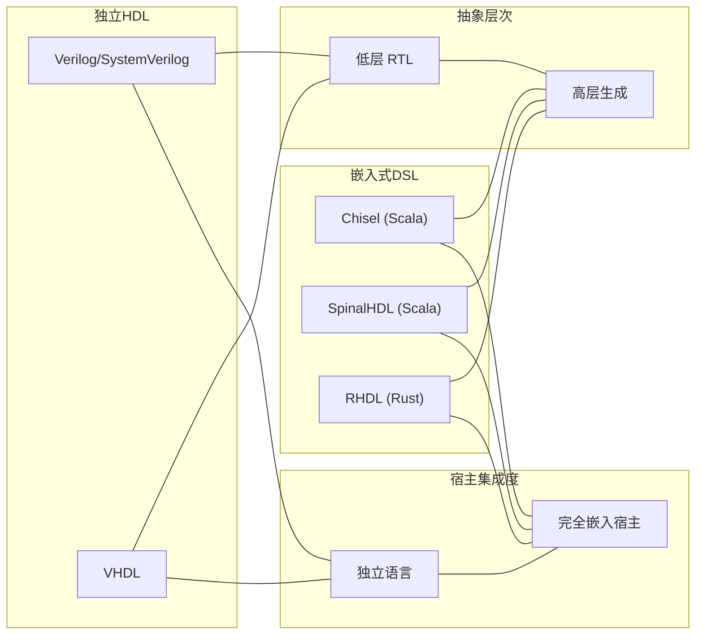
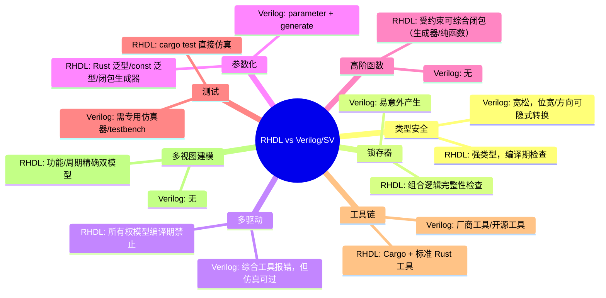
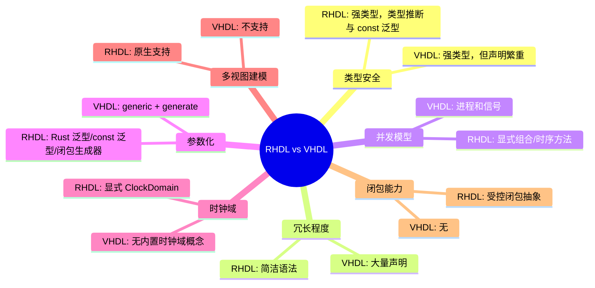
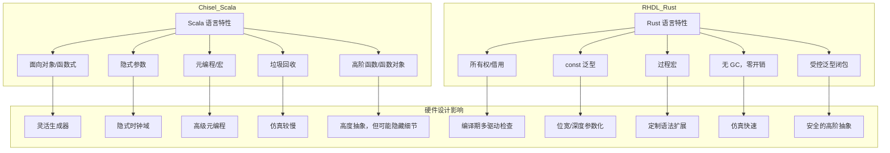
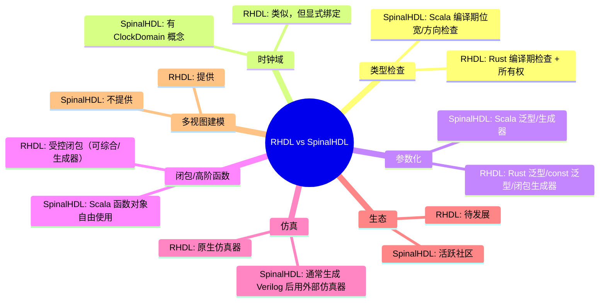
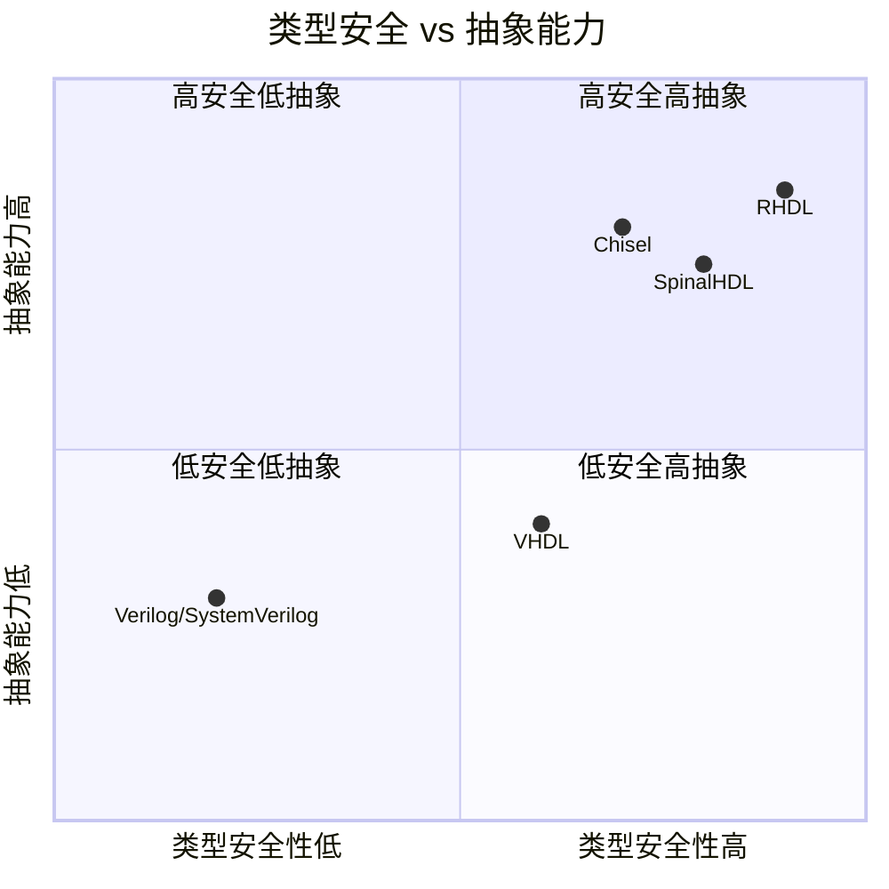
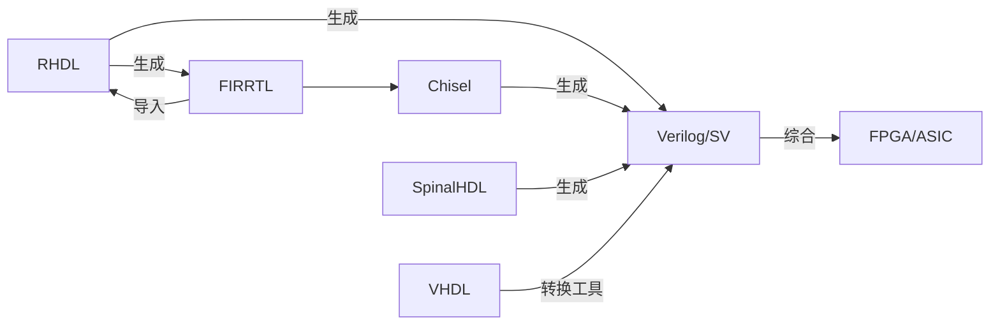
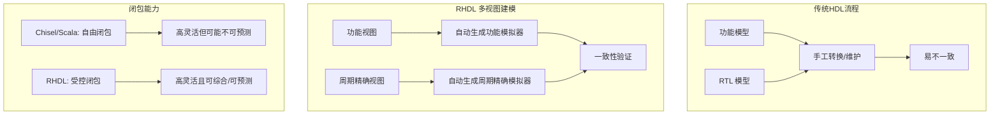

# 16. 与其他 HDL 对比

RHDL 作为后来者，旨在吸收现有 HDL 的优点并解决其痛点。本节将 RHDL 与主流硬件描述语言进行对比，重点分析 Verilog/SystemVerilog、VHDL、Chisel 以及 SpinalHDL（另一个基于 Scala 的 HDL）。通过多维度的比较，凸显 RHDL 的定位和独特价值，特别是其多视图建模、所有权模型、显式时钟域以及**受控泛型闭包抽象**等创新特性。

## 16.1 对比总览

下表从关键维度对比各语言：

| 维度 | Verilog/SystemVerilog | VHDL | Chisel | SpinalHDL | RHDL（本方案） |
| --- | --- | --- | --- | --- | --- |
| **宿主语言** | 独立 | 独立 | Scala | Scala | Rust |
| **类型安全** | 弱 | 强（但繁琐） | 强 | 强 | 强（Rust 类型系统） |
| **多驱动检查** | 工具后置 | 语言层部分支持 | FIRRTL 后置 | 语言层（部分） | 编译期前置（所有权） |
| **时钟域显式** | 否 | 否 | 部分（隐式） | 部分 | 是（ClockDomain） |
| **组合/时序分离** | 易混淆 | 清晰（process） | 通过 Reg 区分 | 通过 Reg 区分 | 显式标注 #\[combinational\] / #\[sequential\] |
| **参数化** | parameter / generate | generic | Scala 泛型/生成器 | Scala 泛型/生成器 | Rust 泛型/const 泛型/宏/**闭包生成器** |
| **高阶函数/闭包支持** | 无 | 无 | 支持（Scala 函数对象） | 支持（Scala 函数对象） | **受控支持**（可综合闭包/生成器闭包） |
| **仿真** | 独立仿真器 | 独立仿真器 | 基于 Scala 测试 | 基于 Scala 测试 | Rust 测试框架（cargo test） |
| **工具链** | 厂商/开源工具 | 厂商/开源工具 | JVM/sbt/Mill | JVM/sbt/Mill | Cargo（原生） |
| **互操作性** | 与所有工具 | 与所有工具 | FIRRTL 生态 | 可生成 Verilog | FIRRTL 交换 + Verilog 输出 |
| **学习曲线** | 中等 | 中等偏高 | 需学 Scala | 需学 Scala | 需学 Rust |
| **成熟度** | 非常成熟 | 非常成熟 | 成熟（工业使用） | 较成熟 | 新兴（设计阶段） |
| **HLS** | 有限（Vivado HLS） | 有限 | 有限 | 有限 | 内置 HLS 支持 |
| **IP 生态** | 丰富 | 丰富 | 成长中 | 成长中 | 规划中（Cargo crates） |
| **多视图建模** | 不支持 | 不支持 | 不支持 | 不支持 | **支持（功能/周期精确）** |
| **功能模拟器生成** | 需额外模型 | 需额外模型 | 需额外模型 | 需额外模型 | **自动生成功能模拟器** |

### 16.1.1 关键维度雷达图（概念示意）

由于 Mermaid 不支持雷达图，使用 `quadrantChart` 展示两个核心维度的定位：

## 16.2 各语言定位图

下图从 **抽象层次** 和 **宿主语言集成度** 两个维度定位各语言：

RHDL 与 Chisel、SpinalHDL 同属嵌入式 DSL，但宿主语言为 Rust，带来了不同的设计哲学和工具链体验。RHDL 在多视图建模和受控闭包抽象方面是独一无二的。

## 16.3 与 Verilog/SystemVerilog 的对比

Verilog/SystemVerilog 是工业界最广泛使用的 HDL，但存在类型宽松、易产生锁存器、多驱动难以控制、参数化能力有限等问题。RHDL 在这些方面有显著改进。

RHDL 通过生成 Verilog 与现有流程保持兼容，因此可以作为 Verilog 的替代设计入口，同时提供更现代的开发体验。

## 16.4 与 VHDL 的对比

VHDL 以强类型和严谨著称，但语法冗长，开发效率较低。RHDL 同样提供强类型，但借助 Rust 的现代语法和泛型闭包，表达更简洁且灵活。

RHDL 在保持强类型安全的同时，显著提升了表达效率和复用能力。

## 16.5 与 Chisel 的对比

Chisel 是 RHDL 最直接的参照对象。两者都追求高抽象和参数化，但宿主语言不同导致设计哲学差异。Chisel 充分利用 Scala 的函数式特性，支持高阶函数和隐式参数；RHDL 通过 Rust 的泛型和受控闭包提供类似能力，同时利用所有权模型增强安全。

### 关键差异点：

| 方面 | Chisel | RHDL |
| --- | --- | --- |
| **多驱动** | 允许 last connect，FIRRTL 后置检查 | 编译期禁止，所有权模型 |
| **时钟域** | 隐式（withClockAndReset） | 显式 ClockDomain |
| **复位** | 隐式全局复位 | 显式绑定到 ClockDomain |
| **参数化** | Scala 泛型/隐式参数 | Rust 泛型/const 泛型 |
| **高阶函数/闭包** | Scala 函数对象自由使用 | 受控闭包：生成器/可综合闭包 |
| **仿真** | 需要 Firrtl 仿真器或 Verilator 协同 | 原生 Rust 仿真器，cargo test |
| **工具链** | JVM/sbt，启动较慢 | Cargo 原生，启动快 |
| **互操作** | FIRRTL 生态 | FIRRTL 后端 + 导入器，双向转换 |
| **多视图建模** | 不支持 | 原生支持功能/周期精确双模型 |
| **成熟度** | 工业界大量使用 | 设计阶段 |

尽管 Chisel 成熟度更高，RHDL 在编译期安全检查和工具链体验上具有潜在优势。受控闭包抽象使 RHDL 能够在保持可综合性的同时提供高阶抽象，避免了 Chisel 中某些隐式行为可能导致的意外。

## 16.6 与 SpinalHDL 的对比

SpinalHDL 是另一个基于 Scala 的 HDL，强调类型安全和生成能力。与 Chisel 类似，但提供更严格的类型检查（如位宽推断、方向检查）。RHDL 与 SpinalHDL 的设计目标有很多相似之处，但宿主语言不同，且在闭包处理上更具约束性。

RHDL 通过所有权模型提供了更强的多驱动防护，并且受控闭包确保了综合路径的可预测性。

## 16.7 关键维度对比图（概念示意）

使用 `quadrantChart` 展示类型安全与抽象能力两个维度的对比：

## 16.8 互操作关系图

RHDL 与现有 HDL 的互操作主要通过生成 Verilog 和 FIRRTL 实现：

RHDL 不直接生成 VHDL，但可通过 Verilog 转换工具间接支持（如使用 Yosys 的 `write_vhdl`）。与 Chisel 的互转通过 FIRRTL 实现，与 SpinalHDL 则可通过 Verilog 或 FIRRTL（如果 SpinalHDL 支持 FIRRTL 输出）。

## 16.9 多视图建模与受控闭包的独特优势

RHDL 的多视图建模和受控闭包抽象是其他 HDL 目前不具备的独特特性。其他语言通常需要维护独立的功能模型和 RTL 模型，而 RHDL 允许在同一模块中同时定义功能视图和周期精确视图，并自动生成对应的模拟器，且提供一致性验证。同时，受控闭包让 RHDL 能够以安全的方式提供高阶抽象，避免了 Scala 系 HDL 中闭包可能引入的不可预测行为。

这一特性大幅降低了功能模拟器与周期精确模拟器的生成和维护难度，并提供了安全的高阶抽象，是 RHDL 相较于其他 HDL 的核心竞争力之一。

## 16.10 总结

RHDL 的设计吸收了两类 HDL 的优点：

- 从 Verilog/VHDL 学习底层 RTL 语义和可综合性。
- 从 Chisel/SpinalHDL 学习高抽象参数化和生成能力。
- 额外引入 Rust 的所有权模型实现编译期多驱动检查，显式 ClockDomain 解决 CDC 问题，以及原生 Rust 仿真环境。
- 独创多视图建模，同时支持功能模拟和周期精确模拟，覆盖从软件开发到硬件验证的全流程。
- 通过受控泛型闭包抽象，在保证可综合性的前提下提供高阶抽象能力，弥补了传统 HDL 在高阶复用方面的不足。

RHDL 的定位是：一个**安全、现代、与 Rust 生态深度融合**的硬件描述语言，它不试图取代现有的成熟流程，而是提供一种更可靠、更高效的替代方案，并通过 FIRRTL 与 Chisel 生态互联互通。随着 Rust 在嵌入式与系统编程领域的普及，RHDL 有望吸引那些希望将硬件开发纳入现代软件工程实践的团队。