# 17. 扩展功能整合

# 17. 扩展功能整合

RHDL 的设计不仅仅是核心 RTL 描述能力，还规划了三个重要的扩展功能：**高层次综合（HLS）**、**硬件 IP 库** 和 **可视化工具**。这些扩展功能不是孤立的附加品，而是深度整合在 RHDL 的整体架构中，与核心类型系统、HIR 和工具链无缝协作，共同提升硬件设计的生产力和可靠性。此外，多视图建模机制进一步增强了这些扩展功能的实用性，使得 HLS 算法、IP 模块和可视化工具都能同时服务于功能模拟和周期精确模拟。

## 17.1 扩展功能整合总览

三个扩展功能在 RHDL 架构中的位置如下：

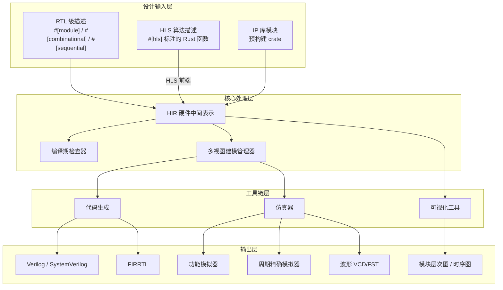

*   **HLS** 作为设计输入的一种，其输出同样进入 HIR，与 RTL 描述统一处理。
    
*   **IP 库** 本质上是 RTL 模块的集合，以 crate 形式发布，可直接实例化，并且支持多视图建模。
    
*   **可视化** 是工具链的后端之一，从 HIR 和仿真数据生成图形。
    
*   **多视图建模管理器** 确保扩展功能中产生的模块可以同时生成功能模拟器和周期精确模拟器。
    

## 17.2 高层次综合（HLS）整合

### 17.2.1 目标与定位

HLS 允许开发者用更算法化的 Rust 函数描述计算，由工具自动生成状态机、数据通路和流水线。RHDL 的 HLS 目标是：

*   降低复杂算法硬件实现的开发门槛。
    
*   与 RTL 模块混合使用，关键路径用 RTL 优化，非关键逻辑用 HLS 加速设计。
    
*   利用 Rust 的强类型和编译期能力进行约束检查。
    
*   自动生成功能模拟器（算法函数本身）和周期精确模拟器（综合后的 RTL），并通过一致性验证确保等价。
    

### 17.2.2 整合架构

HLS 前端作为独立的编译阶段，接收 `#[hls]` 标注的函数，输出 HIR。同时，算法函数本身可直接作为功能模型运行。

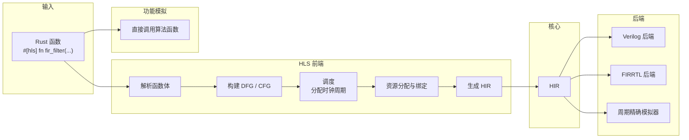

### 17.2.3 HLS 约束与调度

HLS 支持通过属性参数指定约束，例如流水线、延迟、循环展开等。

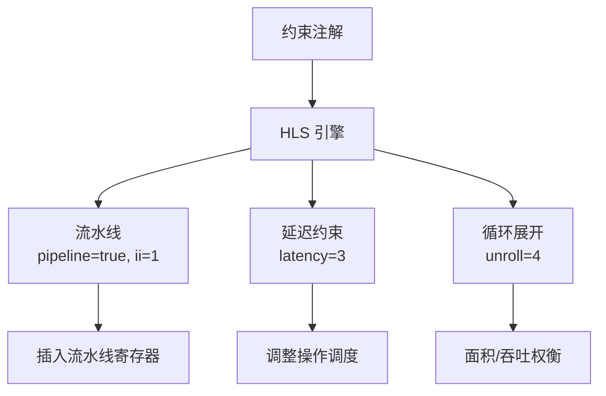

示例：

```rust
#[hls(pipeline = true, ii = 1)]
fn dot_product(a: Vec<UInt<16>, 8>, b: Vec<UInt<16>, 8>) -> UInt<32> {
    let mut sum = 0;
    for i in 0..8 {
        sum += a[i] * b[i];
    }
    sum
}

```

HLS 前端将该函数转换为一个模块，包含流水线乘法器和累加器。

### 17.2.4 HLS 与 RTL 的混合设计

HLS 生成的 HIR 模块可以被其他 RTL 模块实例化，也可以实例化其他 RTL 模块。这允许设计者在高层次和低层次之间自由切换。

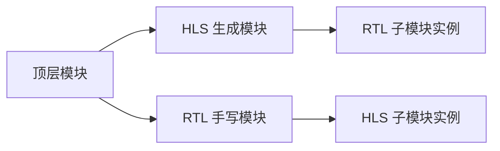

HLS 模块的接口自动生成，与 RTL 模块一致。

### 17.2.5 HLS 与多视图建模的协同

HLS 天然支持多视图建模：算法函数本身就是功能视图，综合生成的 RTL 是周期精确视图。RHDL 工具链可以自动生成两者并进行一致性验证。

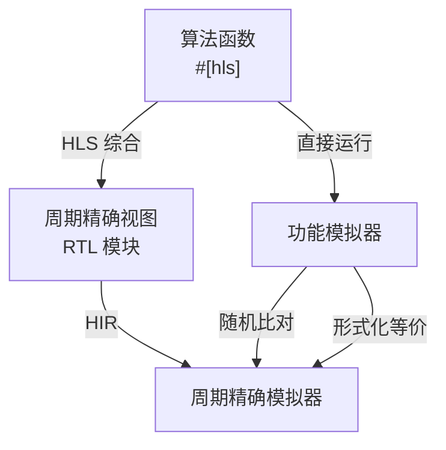

## 17.3 硬件 IP 库整合

### 17.3.1 IP 库的形式

RHDL 的 IP 库以独立的 Rust crates 发布，每个 crate 包含一个或多个相关硬件模块。这些 crate 使用标准 Cargo 依赖管理，开发者通过 `Cargo.toml` 引入。

```toml
[dependencies]
rhdl = "0.1"
rhdl-uart = "0.1"
rhdl-fifo = "0.1"
rhdl-axi = "0.1"

```

### 17.3.2 IP 库结构示例

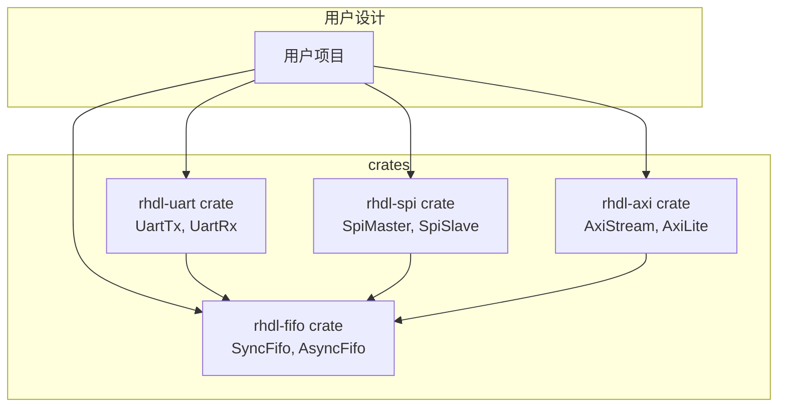

### 17.3.3 标准接口 Bundle

IP 库使用统一的 Bundle 接口，促进互连。例如 AXI-Stream 接口：

```rust
#[derive(Bundle)]
pub struct AxiStream {
    pub tdata: UInt<64>,
    pub tvalid: Bool,
    pub tready: Bool,
    pub tlast: Bool,
}

```

### 17.3.4 参数化 IP

IP 模块利用 Rust 的 const 泛型实现参数化。例如 FIFO：

```rust
#[module]
pub struct SyncFifo<const W: usize, const DEPTH: usize> {
    pub clk: Clock,
    pub rst: Reset,
    pub push: Input<Bool>,
    pub pop: Input<Bool>,
    pub data_in: Input<UInt<W>>,
    pub data_out: Output<UInt<W>>,
    pub full: Output<Bool>,
    pub empty: Output<Bool>,
    // ...
}

```

### 17.3.5 IP 验证与文档

每个 IP crate 都会附带 Rust 测试和文档示例，确保开箱即用。Cargo 的文档系统（`cargo doc`）自动生成 API 文档。

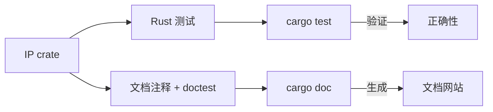

### 17.3.6 IP 库与多视图建模

RHDL 的 IP 库可以利用多视图建模，同时提供功能模型和 RTL 模型。例如 `rhdl-uart` 可以提供：

*   `UartTxFunctional`：快速功能模型（事务级接口）
    
*   `UartTxCycleAccurate`：周期精确模型（RTL 端口）
    

或者同一个模块同时支持两种视图，通过 feature 切换。

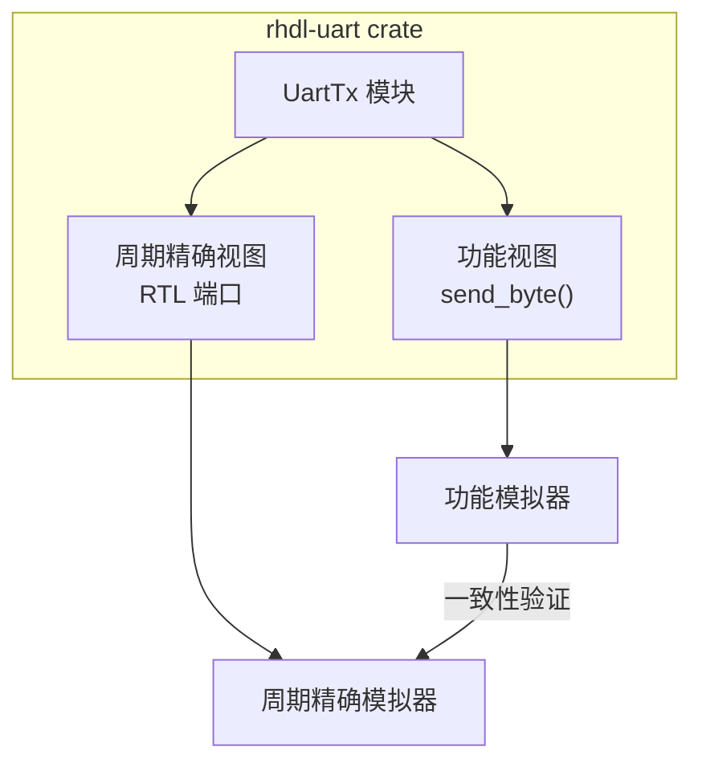

这使得 SoC 设计者可以在早期软件开发中使用功能模型，在硬件验证时切换到周期精确模型，而无需修改上层软件代码。

## 17.4 可视化工具整合

### 17.4.1 模块层次图

从 HIR 中提取模块实例树，生成 Graphviz DOT 或 Mermaid 图。该功能作为 `cargo rhdl visualize` 子命令实现。

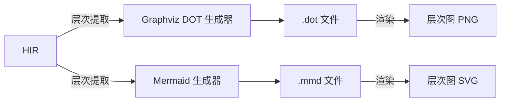

示例生成的层次图：

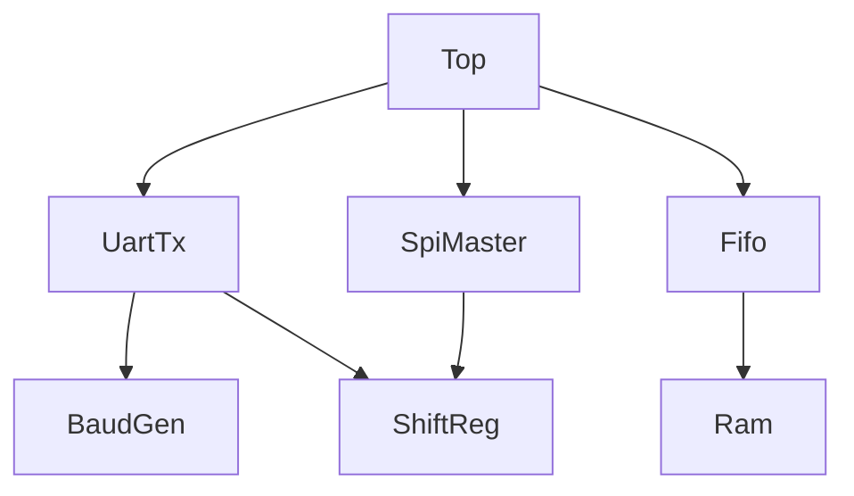

### 17.4.2 时序图

仿真器记录信号变化，可以导出 VCD/FST 波形，或直接生成简化时序图（PlantUML / SVG）。

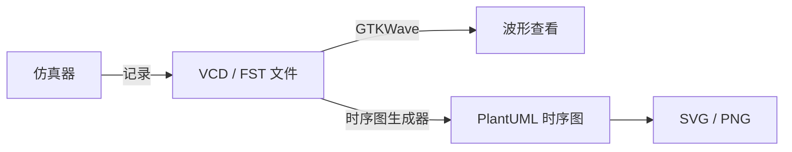

时序图示例（示意）：

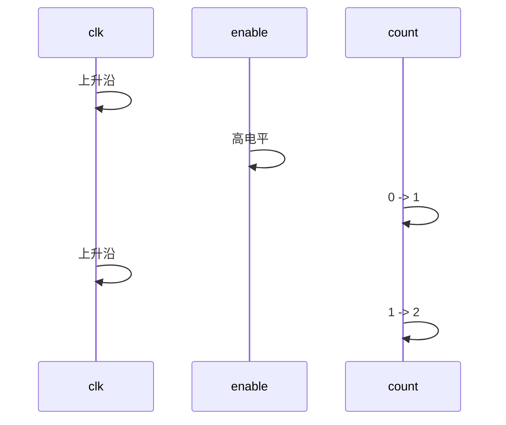

### 17.4.3 与文档集成

可视化输出可以嵌入 Rust 文档注释或独立的设计文档中，实现“代码即文档”。

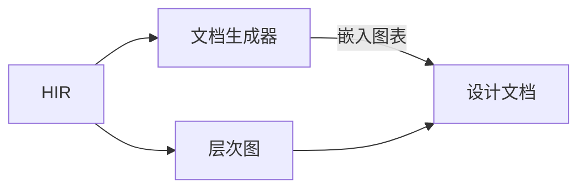

### 17.4.4 可视化与多视图建模

可视化工具既可以展示周期精确视图的模块层次和波形，也可以展示功能视图的函数调用关系或数据流。例如，可以通过注释标注哪些模块具有功能视图，在层次图中高亮显示。

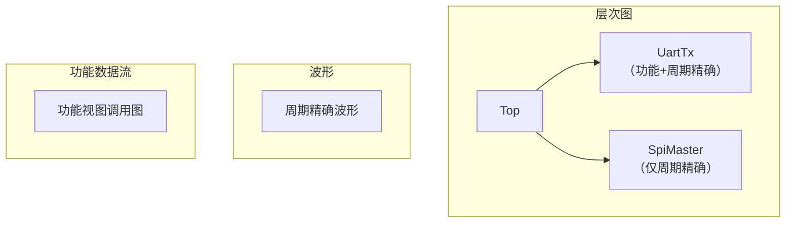

## 17.5 三个扩展功能的协同

三个扩展功能相互配合，形成完整的设计流程：

```mermaid
flowchart TB
    subgraph 设计阶段
        A[使用 IP 库快速搭建系统框架]
        B[关键模块用 RTL 精细设计]
        C[算法密集模块用 HLS 生成]
    end
    subgraph 验证阶段
        D[功能模拟器运行系统级测试]
        E[周期精确模拟器验证硬件行为]
        F[一致性验证确保两者等价]
        G[可视化检查模块层次与波形]
    end
    subgraph 输出阶段
        H[生成 Verilog / FIRRTL]
        I[与 Chisel 互转]
        J[综合 / 布局布线]
    end

    A --> D
    B --> D
    C --> D
    D --> F
    E --> F
    F --> G
    G --> H
    H --> I
    I --> J

```

例如，设计一个 UART 接口的系统：

1.  使用 `rhdl-uart` IP 库快速添加 UART 发送器（功能+周期精确双模型）。
    
2.  使用 HLS 编写一个数据编码算法模块（自动生成功能/周期精确双模型）。
    
3.  使用 RTL 编写一个自定义的 FIFO 控制逻辑（手写 RTL，可提供简单功能模型）。
    
4.  在 Rust 测试中集成验证整个系统：先运行功能模拟器快速检查，再运行周期精确模拟器比对。
    
5.  通过可视化工具检查模块连接和时序。
    
6.  生成 Verilog 并综合。
    

## 17.6 整合中的关键设计决策

*   **HLS 生成 HIR**：保证 HLS 输出与 RTL 输出使用相同的中间表示，后端和工具链统一。
    
*   **IP 库作为 crate**：利用 Cargo 的依赖管理和版本控制，IP 可以独立更新和复用。
    
*   **可视化基于 HIR 和仿真数据**：可视化不依赖于某个特定的后端，而是从核心数据源提取信息。
    
*   **多视图建模贯穿始终**：HLS、IP 库和可视化都支持功能视图和周期精确视图，确保从快速软件开发到严格硬件验证的无缝衔接。
    

这些决策确保了扩展功能与核心 RHDL 架构的紧密集成，同时保持了模块化和可扩展性。

## 17.7 总结

RHDL 的扩展功能整合不是简单的功能叠加，而是从架构层面深度集成：

*   **HLS** 提供了从算法到硬件的自动转换，与 RTL 混合设计，并自动生成功能/周期精确双模型。
    
*   **IP 库** 通过 Cargo 生态提供了丰富的现成模块，加速设计，且支持多视图建模。
    
*   **可视化** 增强了设计理解和调试能力，同时服务于两种视图。
    

三者共同提升了 RHDL 作为现代硬件描述语言的生产力，使其不仅是一个描述语言，更是一个完整的设计平台。多视图建模的引入使得这些扩展功能能够覆盖从软件开发到硬件验证的完整流程，进一步巩固了 RHDL 的独特价值。