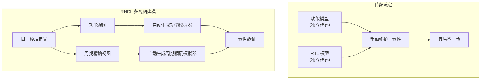
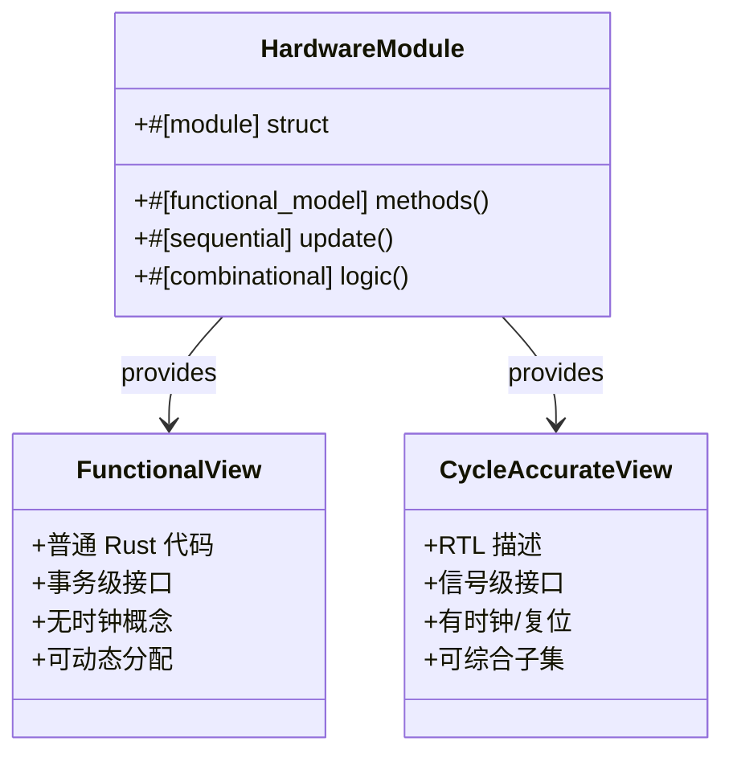
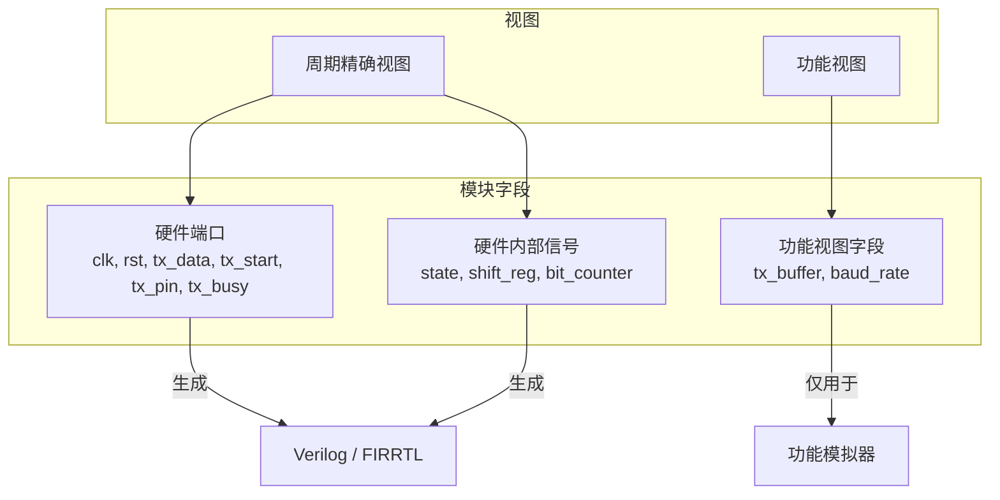
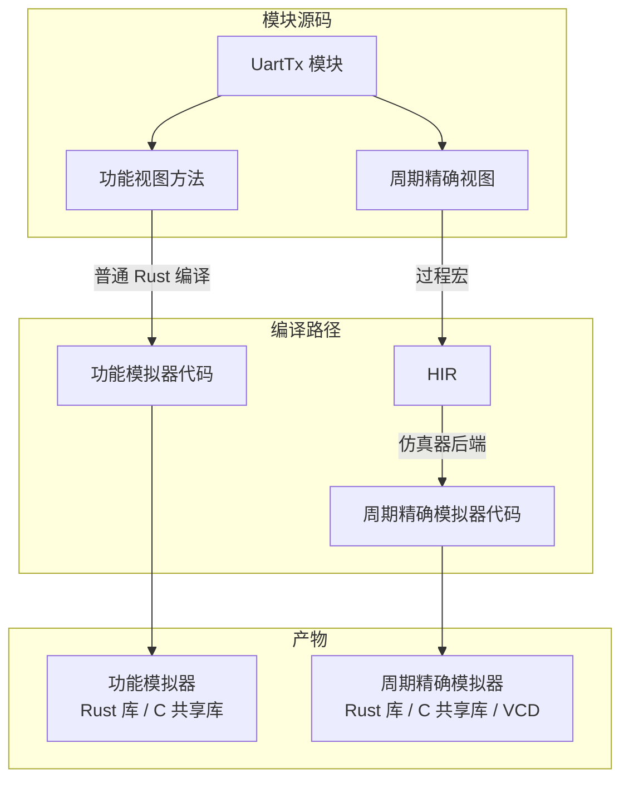
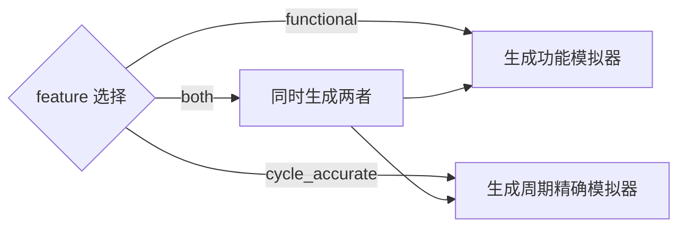
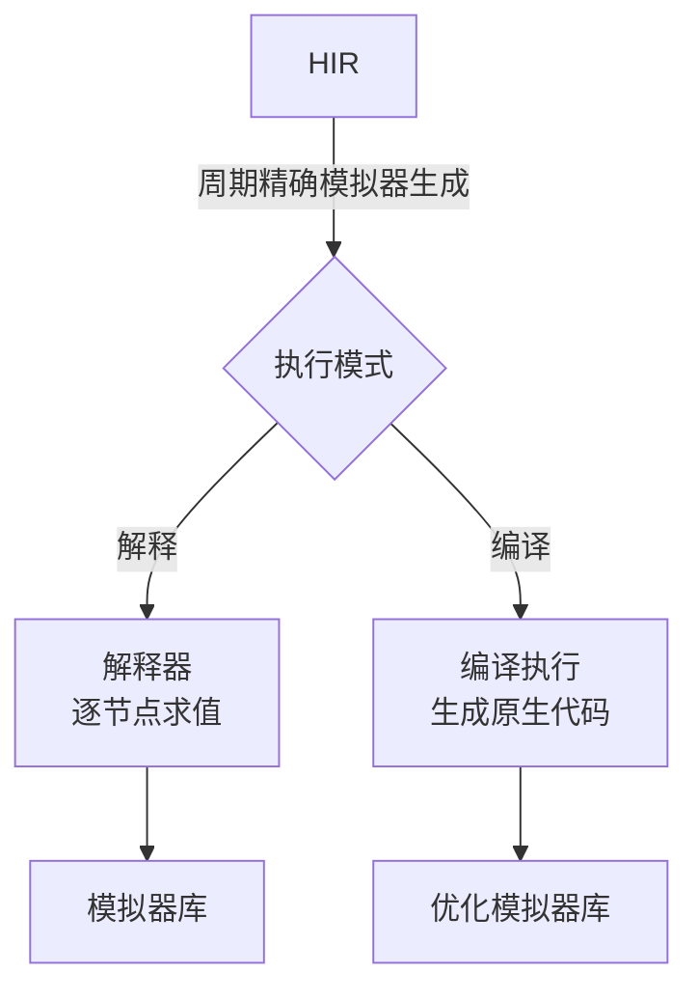
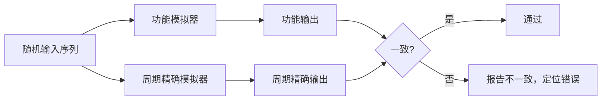
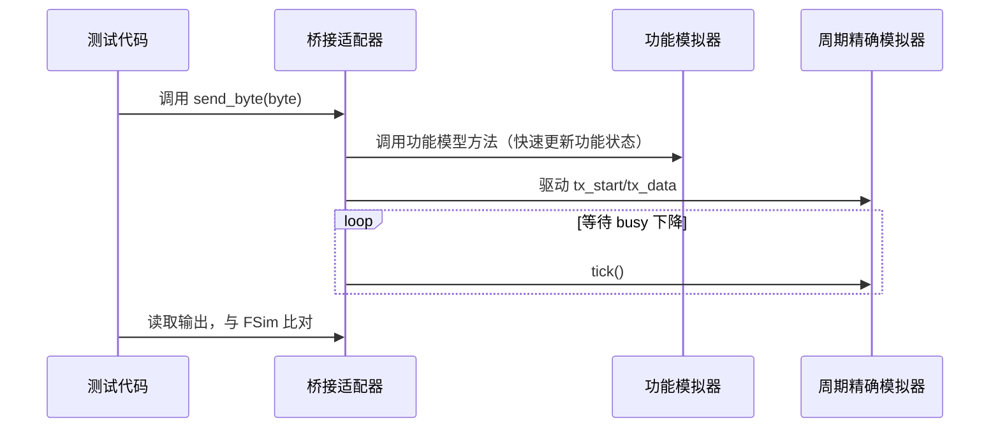
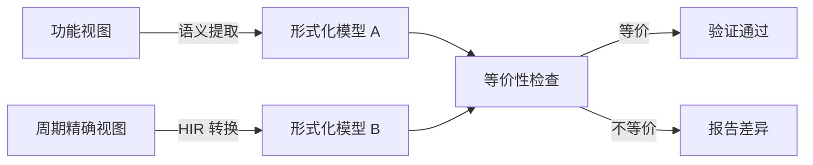
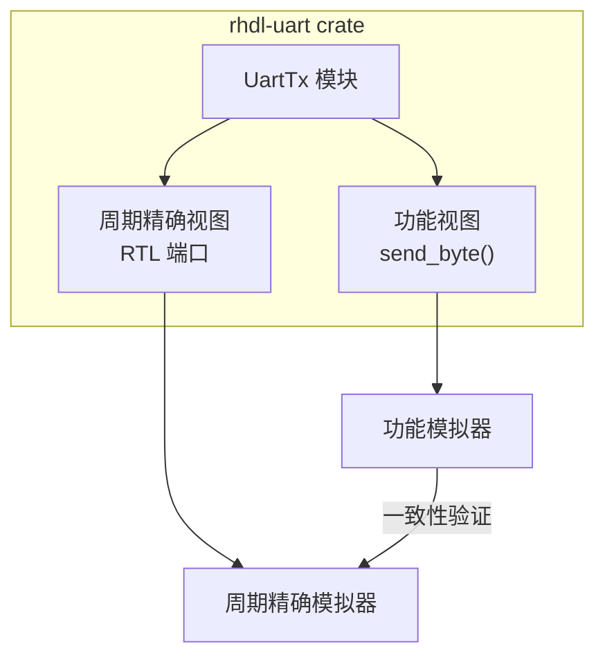

# 18. 多视图建模与模拟器生成（核心优化）

# 18. 多视图建模与模拟器生成（核心优化）

多视图建模是 RHDL 为降低功能模拟器与周期精确模拟器生成难度而引入的核心机制。它允许一个硬件模块同时提供**功能视图**（事务级/算法级，运行速度快）和**周期精确视图**（RTL 级，与硬件逐周期一致），并由工具链自动生成对应的模拟器。通过桥接适配器和一致性验证，确保两种视图行为等价，从而覆盖从软件开发到硬件验证的完整流程。

## 18.1 背景与动机

在传统 HDL 设计流程中，功能模型和 RTL 模型通常是两套独立代码，需手动维护，容易产生不一致。RHDL 的多视图建模将两者整合在同一模块定义中，通过语言层面的支持，自动生成功能模拟器和周期精确模拟器，并提供一致性验证，大幅降低开发与维护成本。



## 18.2 多视图建模核心概念

### 18.2.1 视图定义

*   **功能视图（Functional View）**：使用普通 Rust 代码描述模块行为，通常为事务级或算法级。无时钟概念，可自由使用动态数据结构、循环等。用于快速功能模拟，服务于软件开发。
    
*   **周期精确视图（Cycle-Accurate View）**：使用 RHDL 的 RTL 描述（`#[module]` + `#[sequential]` + `#[combinational]`），逐周期定义硬件行为。用于硬件验证和综合，与最终硬件行为一致。
    



### 18.2.2 模块抽象层次声明

使用 `#[abstraction]` 属性标注模块支持哪些抽象层次。例如：

```rust
#[module]
#[abstraction(functional, cycle_accurate)]
pub struct UartTx { ... }

```

这告诉工具链：该模块既有功能模型，也有周期精确模型。

### 18.2.3 功能视图方法标注

在 `impl` 块中，使用 `#[functional_model]` 标注功能视图方法。这些方法使用普通 Rust 代码，可访问功能视图状态字段（`#[functional_state]`）。

```rust
impl UartTx {
    #[functional_model]
    pub fn send_byte(&mut self, byte: u8) {
        self.tx_buffer.push_back(byte);
        // 在功能模拟器中，可以立即产生输出，或模拟延迟
    }
}

```

## 18.3 多视图模块定义示例

以 UART 发送器为例，展示如何同时定义功能视图和周期精确视图。

```rust
#[module]
#[abstraction(functional, cycle_accurate)]
pub struct UartTx {
    // RTL 端口（周期精确视图）
    pub clk: Clock,
    pub rst: Reset,
    pub tx_data: Input<UInt<8>>,
    pub tx_start: Input<Bool>,
    pub tx_pin: Output<Bool>,
    pub tx_busy: Output<Bool>,

    // RTL 内部寄存器（周期精确视图）
    state: Reg<UartState>,
    shift_reg: Reg<UInt<10>>,
    bit_counter: Reg<UInt<4>>,

    // 功能视图状态（仅功能模拟器使用）
    #[functional_state]
    tx_buffer: std::collections::VecDeque<u8>,
    #[functional_state]
    baud_rate: u32,
}

impl UartTx {
    // 功能视图方法（事务级）
    #[functional_model]
    pub fn send_byte(&mut self, byte: u8) {
        self.tx_buffer.push_back(byte);
    }

    #[functional_model]
    pub fn is_idle(&self) -> bool {
        self.tx_buffer.is_empty()
    }

    // 周期精确视图方法（RTL）
    #[sequential]
    fn state_machine(&mut self) { ... }

    #[combinational]
    fn drive_outputs(&mut self) { ... }
}

```

**模块字段分离**：



## 18.4 模拟器生成机制

### 18.4.1 模拟器类型与生成路径

RHDL 工具链根据模块的视图定义，分别生成两种模拟器：

*   **功能模拟器**：仅编译功能视图代码（`#[functional_model]` 方法和 `#[functional_state]` 字段），生成普通 Rust 库或 C 共享库。
    
*   **周期精确模拟器**：编译周期精确视图为 HIR，然后由仿真器后端解释执行或编译为原生代码，生成 Rust 库或 C 共享库，并支持波形导出。
    



### 18.4.2 模拟器生成配置

通过 Cargo feature 或命令行参数选择生成哪种模拟器：

```toml
[features]
functional = ["rhdl/functional"]          # 仅生成功能模拟器
cycle_accurate = ["rhdl/cycle_accurate"]  # 仅生成周期精确模拟器
both = ["functional", "cycle_accurate"]   # 两者都生成

```


也可以使用命令行：

```bash
cargo rhdl build-sim --kind functional
cargo rhdl build-sim --kind cycle_accurate
cargo rhdl build-sim --kind both

```

### 18.4.3 周期精确模拟器的执行模式

周期精确模拟器支持两种执行模式，可根据需要选择：

*   **解释模式**：直接遍历 HIR 节点求值，便于调试，但速度较慢。
    
*   **编译模式**：将 HIR 编译为优化的 Rust/C 代码，运行速度快，适合大规模仿真。
    



## 18.5 桥接适配器

桥接适配器是功能视图与周期精确视图之间的转换层，允许事务级操作驱动信号级时序（或反之）。

### 18.5.1 桥接适配器的作用

*   将功能视图的方法调用（如 `send_byte()`）转换为周期精确视图的信号序列（如驱动 `tx_start`、等待 `tx_busy` 下降）。
    
*   使软件可以在功能模拟器中快速运行，同时需要时可以切换到周期精确模拟器验证硬件行为。
    
*   桥接适配器可由开发者手动编写，也可由工具从简单映射规则自动生成。
    


### 18.5.2 桥接适配器示例

```rust
impl UartTx {
    #[bridge]
    fn send_byte_to_rtl(&mut self, byte: u8) {
        self.tx_data.set(byte);
        self.tx_start.set(true);
        while self.tx_busy.get() {
            self.tick();
        }
        self.tx_start.set(false);
    }
}

```

该桥接方法使用了 RTL 信号和 `tick`，它不属于功能模型，也不属于纯周期精确逻辑，而是两者之间的粘合代码。

### 18.5.3 桥接适配器的生成

RHDL 可以自动生成简单的桥接适配器。例如，对于常见的“启动-完成”事务模式，工具可以自动生成等待循环。更复杂的桥接需要开发者手动编写。

## 18.6 一致性验证机制

多视图建模的关键在于保证功能模型与周期精确模型行为等价。RHDL 提供三种验证机制：

### 18.6.1 随机测试比对

利用 `proptest` 生成随机输入序列，分别运行功能模拟器和周期精确模拟器，比对输出。这是最直接的一致性验证方法。



**示例测试代码**：

```rust
proptest! {
    #[test]
    fn test_uart_models_agree(data in proptest::collection::vec(any::<u8>(), 0..100)) {
        let mut func_model = UartTxFunctional::new();
        let mut cycle_model = Simulator::new(UartTxCycleAccurate::new());
        for byte in data {
            func_model.send_byte(byte);
            cycle_model.set_input("tx_data", byte);
            cycle_model.set_input("tx_start", true);
            while cycle_model.get_output("tx_busy") {
                cycle_model.tick();
            }
            cycle_model.set_input("tx_start", false);
            assert_eq!(func_model.get_last_tx_byte(), cycle_model.get_output("last_tx_byte"));
        }
    }
}

```

### 18.6.2 桥接协同仿真

通过桥接适配器，在同一测试中让功能模拟器驱动周期精确模拟器（或反之），进行端到端验证。



### 18.6.3 形式化等价验证（可选）

对于关键模块，RHDL 可以生成形式化断言，证明功能模型与周期精确模型在接口上等价。这需要将功能模型转换为某种形式化表示，RHDL 预留接口。



## 18.7 对 IP 库的影响

多视图建模让 IP 库可以同时提供功能模型和 RTL 模型，使用者根据需要选择。

### 18.7.1 IP 库的双模型发布

例如 `rhdl-uart` crate 可以提供：

*   `UartTxFunctional`：快速功能模型（纯 Rust 代码，事务级）
    
*   `UartTxCycleAccurate`：周期精确模型（RHDL 模块，RTL 端口）
    

或者同一个模块支持两种视图，通过 feature 切换。



### 18.7.2 使用场景

*   **软件开发阶段**：使用功能模拟器，运行速度快，不需要时钟周期精确。
    
*   **硬件验证阶段**：切换到周期精确模拟器，逐周期验证硬件行为。
    
*   **系统集成**：可以混合使用功能模拟器和周期精确模拟器（通过桥接适配器）。
    

## 18.8 多视图建模的优势总结

*   **降低功能模拟器生成难度**：开发者显式提供功能模型，而不是工具自动从 RTL 提取。
    
*   **降低周期精确模拟器生成难度**：周期精确模拟器直接从 RTL 视图生成，保持原有优势。
    
*   **保证两者一致性**：通过统一的验证框架自动比对。
    
*   **提升 IP 复用性**：IP 库同时打包功能模型和周期精确模型，适用不同场景。
    
*   **灵活的开发流程**：从算法验证到门级仿真均可覆盖。
    

## 18.9 实施注意事项

*   **视图分离**：编译器需严格区分功能视图代码和周期精确视图代码，确保综合路径不包含功能视图字段。
    
*   **类型转换**：桥接适配器需要处理功能视图类型（如 `VecDeque<u8>`）与周期精确视图类型（如 `UInt<8>`）之间的转换。
    
*   **参数一致性**：参数化模块中，功能视图和周期精确视图共享泛型参数，编译器需确保参数一致。
    
*   **性能优化**：周期精确模拟器的编译执行模式需要优化代码生成，以提升仿真速度。
    

多视图建模是 RHDL 区别于其他 HDL 的核心创新之一，它为硬件设计提供了从软件到硬件的无缝衔接，极大提升了开发效率和验证可靠性。