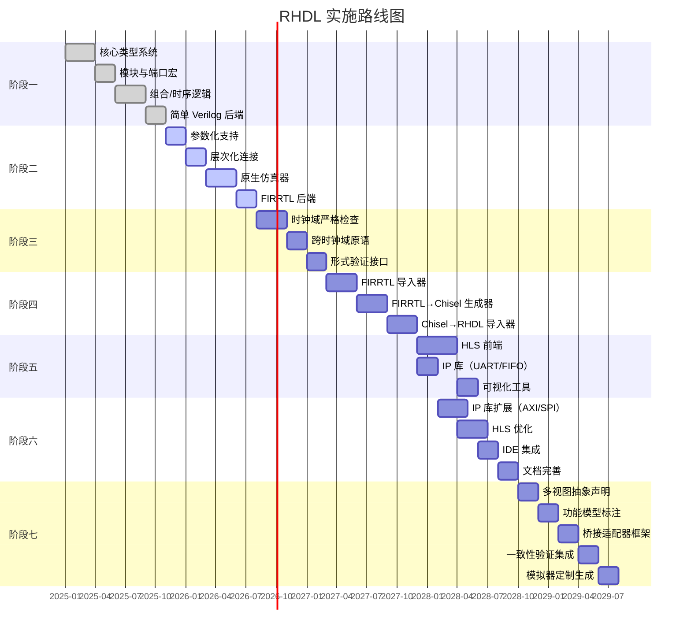
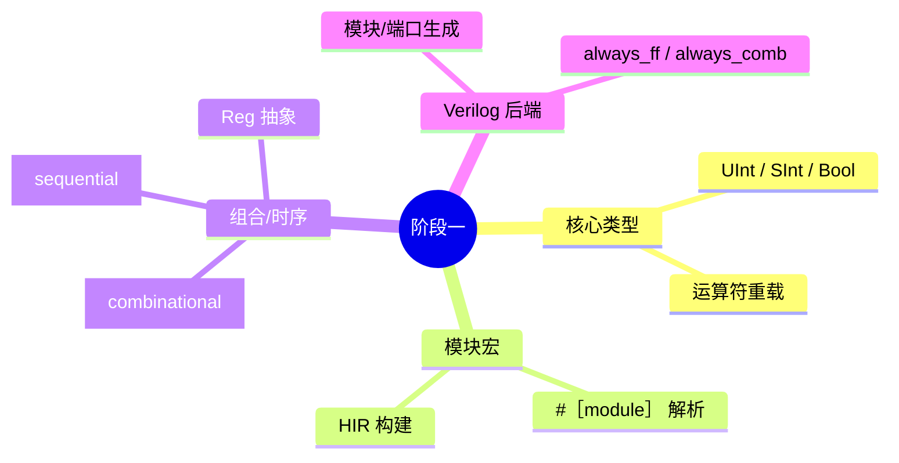
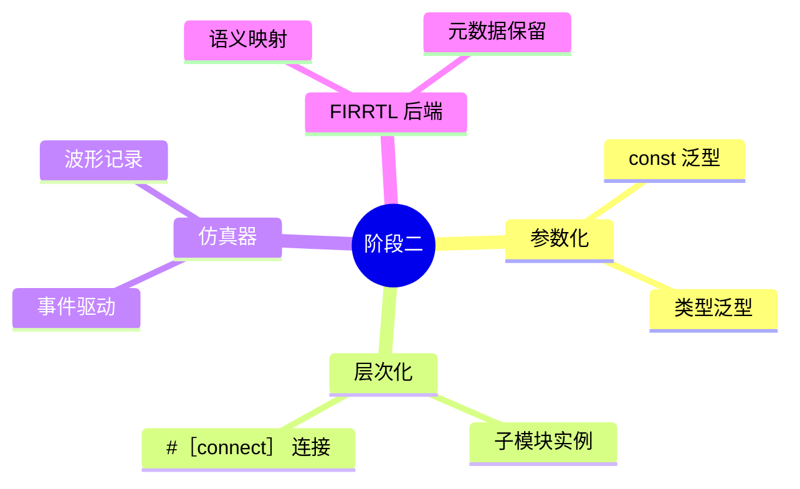
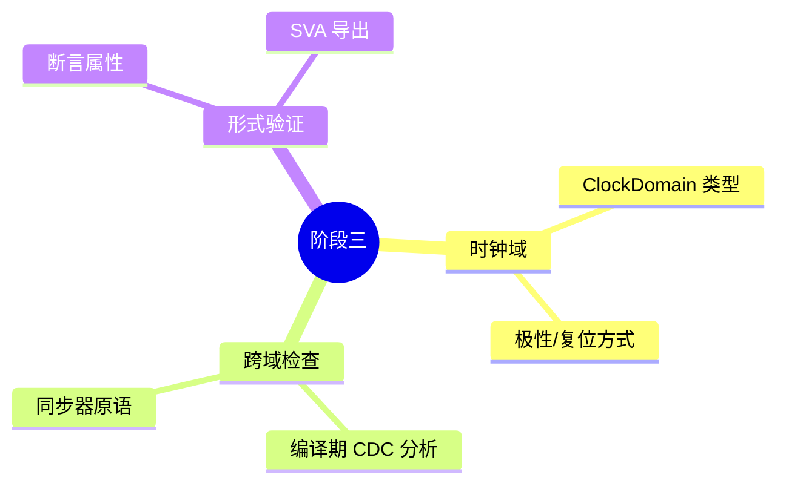
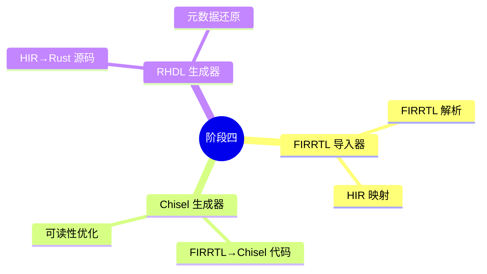
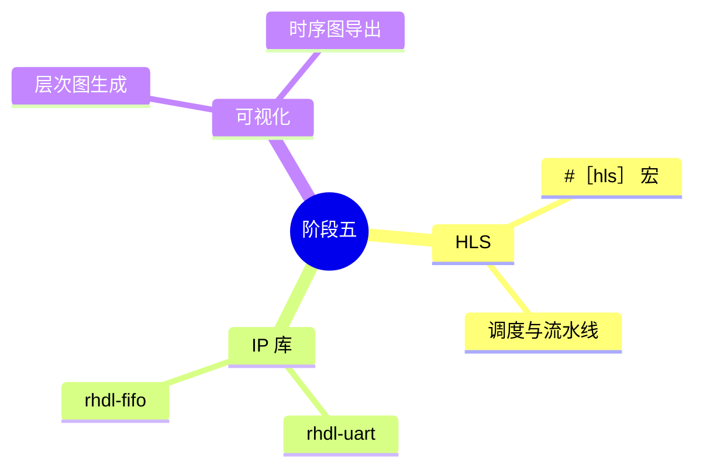
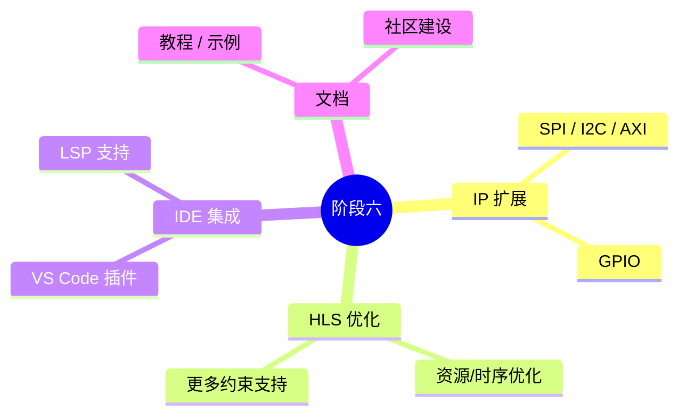
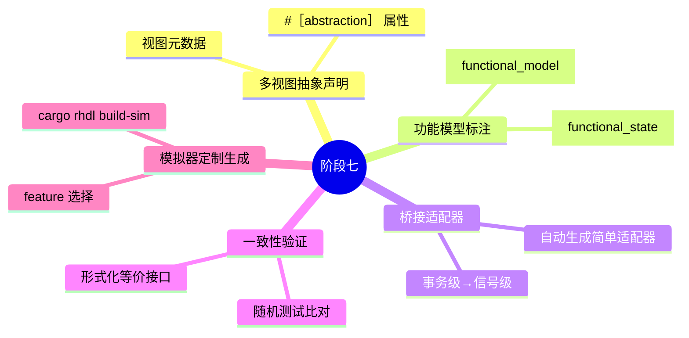
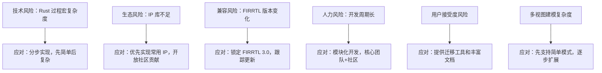

# 19. 实施路线图

# 19. 实施路线图

RHDL 的实施路线图分为七个阶段，从核心语言特性到生态建设逐步推进。每个阶段都有明确的目标、关键任务和交付物，阶段之间存在依赖关系。路线图的设计遵循“先核心后扩展、先基础后生态”的原则，并特别将多视图建模与模拟器生成作为后期集成阶段，确保每一步都为后续工作奠定坚实基础。

## 19.1 路线图总览

> 注：时间仅为示意，实际以开发进度为准。

## 19.2 阶段依赖关系

阶段之间存在强依赖：必须先有核心类型系统和 HIR，才能实现参数化、仿真器和后端；时钟域检查依赖于 HIR 的完善；互转依赖于 FIRRTL 后端；HLS 和 IP 库依赖于稳定的 HIR 和仿真器。多视图建模作为最后的集成阶段，需要所有基础模块成熟后才能高效实现。

## 19.3 阶段一：核心语言基础

**目标**：构建 RHDL 的最小可用核心，能够描述简单硬件并生成可综合 Verilog。

### 关键任务

*   定义基础硬件类型（`Bool`, `Bits<N>`, `UInt<N>`, `SInt<N>`, `Clock`, `Reset`）及其运算。
    
*   实现 `#[module]` 过程宏，解析模块结构体，生成 HIR 模块。
    
*   实现 `#[combinational]` 和 `#[sequential]` 宏，支持基本组合逻辑和时序逻辑描述。
    
*   实现简单的 Verilog 后端，输出可综合代码。
    
*   建立基本的编译期检查（位宽、方向）。
    

### 交付物

*   `rhdl` crate 核心类型与宏。
    
*   能生成 Verilog 的简单模块示例。
    
*   基础单元测试。
    

## 19.4 阶段二：参数化、层次化与仿真

**目标**：支持参数化模块和层次化设计，提供原生仿真器用于测试。

### 关键任务

*   利用 Rust 泛型和 const 泛型实现模块参数化。
    
*   实现层次化模块实例化和端口连接（`#[connect]`）。
    
*   开发原生 Rust 仿真器，支持 `tick`、`set_input`、`get_output`，并输出 VCD 波形。
    
*   实现 FIRRTL 后端，将 HIR 转换为 FIRRTL 文本。
    
*   扩展编译期检查：多驱动检测（所有权模型）、连接完整性检查。
    

### 交付物

*   参数化模块示例（如 `ParamAdder<W>`）。
    
*   层次化设计示例。
    
*   仿真器 API 和波形导出功能。
    
*   FIRRTL 输出示例。
    

## 19.5 阶段三：时钟域、复位与形式验证接口

**目标**：强化时序安全性，引入显式时钟域和跨时钟域原语，为形式验证奠定基础。

### 关键任务

*   完善 `ClockDomain` 类型，支持复位极性和同步/异步配置。
    
*   在编译期执行时钟域检查，禁止未同步的跨域数据传输。
    
*   提供跨时钟域同步原语：`DoubleFlop`、`SyncFIFO`。
    
*   设计属性标注机制（`#[assert]`）用于仿真检查和形式验证。
    
*   开发形式验证后端接口，生成 SVA 或对接 SymbiYosys。
    

### 交付物

*   时钟域配置和检查示例。
    
*   跨时钟域同步器 IP。
    
*   可导出 SVA 的断言支持。
    

## 19.6 阶段四：与 Chisel 互转

**目标**：实现 RHDL 与 Chisel 的中间表示级双向转换，打通生态互操作。

### 关键任务

*   开发 FIRRTL 解析器，将 FIRRTL 导入为 HIR（FIRRTL→RHDL）。
    
*   开发 FIRRTL→Chisel 代码生成器，输出可编译的低层次 Chisel 源码。
    
*   开发 RHDL 源码生成器，从 HIR 生成可编译的 RHDL 源码（用于导入后的输出）。
    
*   处理多驱动规范化、时钟域默认分配等语义差异。
    
*   提供完整的互转工具链命令：`cargo rhdl import`、`cargo rhdl generate --format chisel`。
    

### 交付物

*   FIRRTL 导入器和导出器。
    
*   Chisel 代码生成器。
    
*   双向转换示例（RHDL 计数器 ↔ Chisel 模块）。
    

## 19.7 阶段五：HLS、IP 库与可视化

**目标**：提供高层次综合、常用硬件 IP 库和可视化工具，提升生产力。

### 关键任务

*   实现 `#[hls]` 属性宏和 HLS 前端，支持调度、流水线和循环展开。
    
*   发布首批 IP 库 crate：`rhdl-uart`、`rhdl-fifo`（同步/异步 FIFO）。
    
*   实现可视化工具：从 HIR 生成模块层次图（Graphviz/Mermaid），从仿真波形生成时序图。
    
*   扩展仿真器支持多时钟域和覆盖率记录。
    
*   集成 `cargo rhdl visualize` 和 `cargo rhdl wave` 子命令。
    

### 交付物

*   HLS 前端原型，支持基本算法综合。
    
*   至少两个 IP crate（UART、FIFO）。
    
*   可视化工具和文档生成。
    

## 19.8 阶段六：生态扩展与优化

**目标**：丰富 IP 库，优化 HLS 性能，提升 IDE 体验，完善文档，形成健康生态。

### 关键任务

*   扩展 IP 库：`rhdl-spi`、`rhdl-i2c`、`rhdl-axi`、`rhdl-gpio` 等。
    
*   优化 HLS 调度算法，支持更多优化（资源共享、位宽优化）。
    
*   开发 VS Code 插件或 LSP 服务器，提供语法高亮、错误提示、层次预览。
    
*   编写完整文档、教程和设计示例。
    
*   建立社区贡献指南和 CI 流程。
    

### 交付物

*   一组常用 IP crate。
    
*   HLS 优化版本。
    
*   IDE 插件（VS Code）。
    
*   完善的文档网站。
    

## 19.9 阶段七：多视图建模与模拟器生成集成

**目标**：将多视图建模机制整合到工具链中，实现模块级抽象声明、功能模型标注、桥接适配器和一致性验证框架，最终支持定制生成功能模拟器与周期精确模拟器。

### 关键任务

*   实现 `#[abstraction]` 属性，标注模块支持哪些视图。
    
*   实现 `#[functional_model]` 和 `#[functional_state]` 标注，定义功能视图方法和状态。
    
*   开发桥接适配器框架，支持事务级接口与信号级接口的转换。
    
*   集成一致性验证框架，自动生成随机测试比对和形式化等价检查。
    
*   扩展工具链命令：`cargo rhdl build-sim --kind functional|cycle_accurate|both`。
    
*   更新 IP 库，使每个 IP 同时提供功能视图和周期精确视图。
    
*   提供多视图建模的完整示例和文档。
    

### 交付物

*   多视图模块定义示例（如 UART、FIFO）。
    
*   功能模拟器与周期精确模拟器生成工具。
    
*   一致性验证测试套件。
    
*   更新后的 IP 库（双模型）。
    
*   多视图建模文档与教程。
    

## 19.10 里程碑

每个里程碑对应于一个阶段的完成，并具有可演示的成果。

## 19.11 风险与应对

---

RHDL 的实施路线图以阶段化、里程碑驱动的方式推进，从核心语言到生态扩展，每一步都经过精心规划。特别地，多视图建模与模拟器生成作为最后阶段的集成，确保基础稳定后再加入这一关键创新，以降低实现复杂度和风险。该路线图确保 RHDL 能够逐步成长为功能完善、生态友好的现代硬件描述语言。