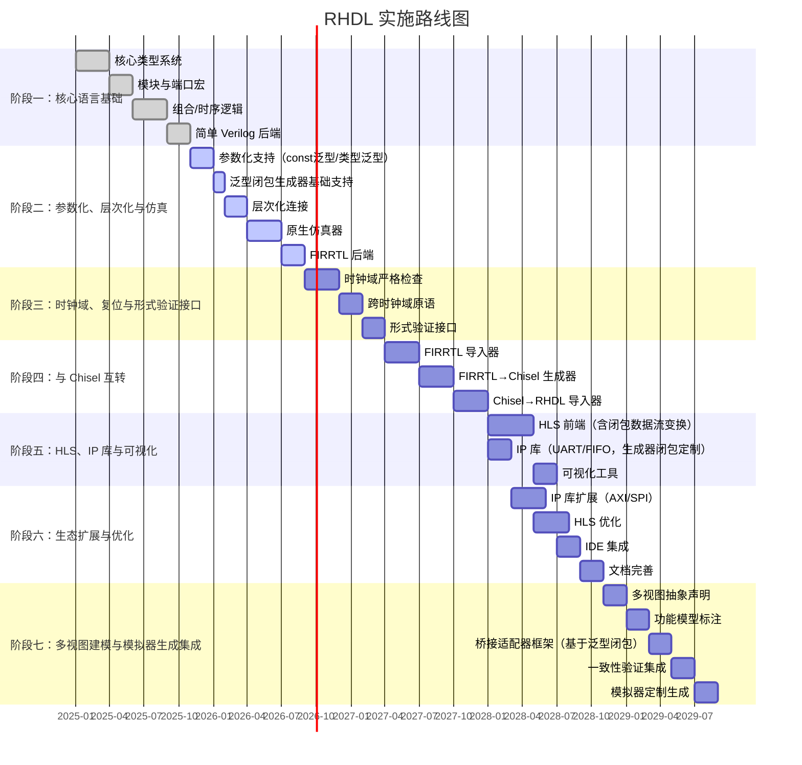
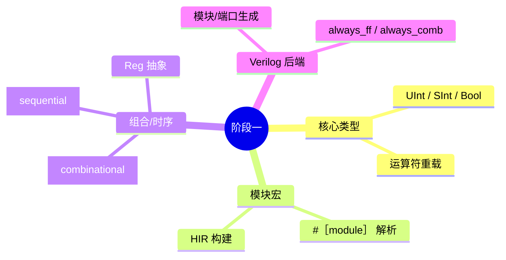
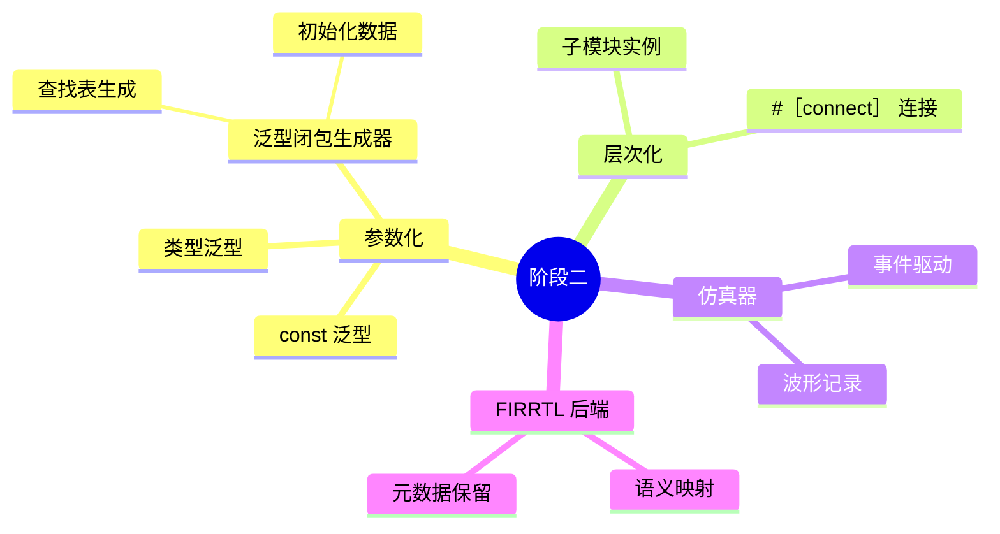
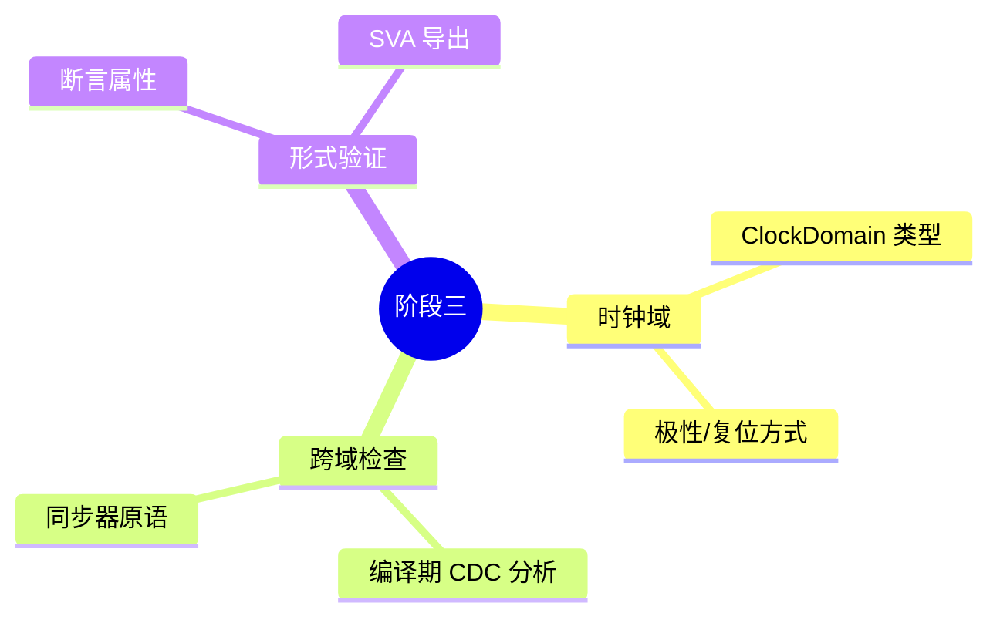
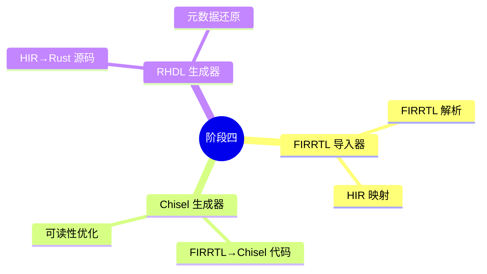
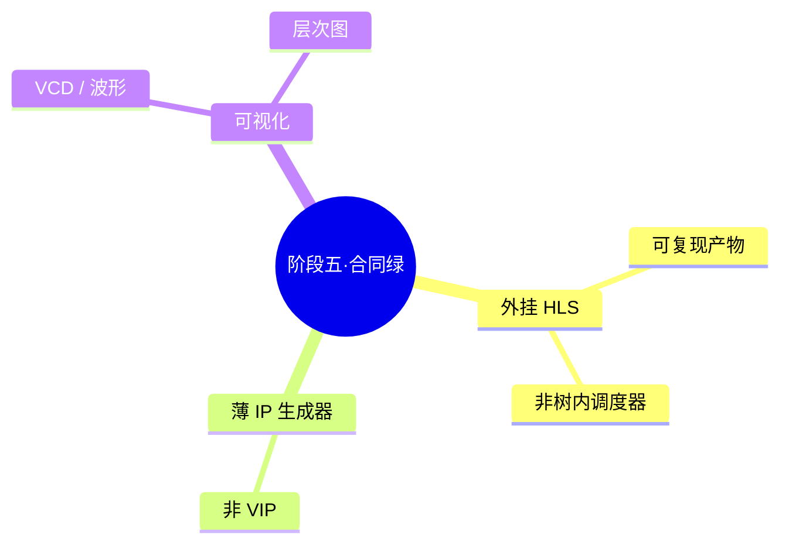
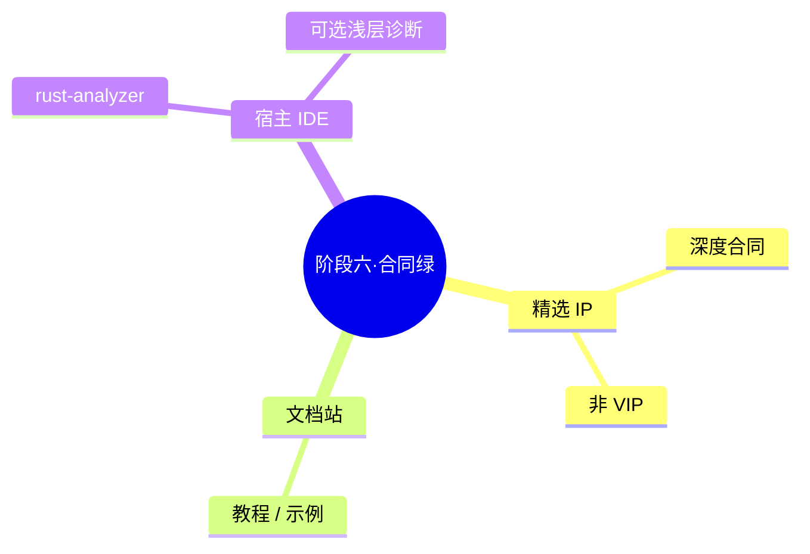
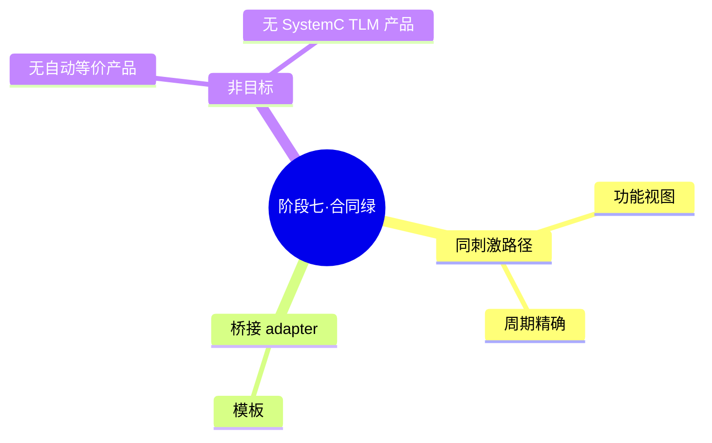
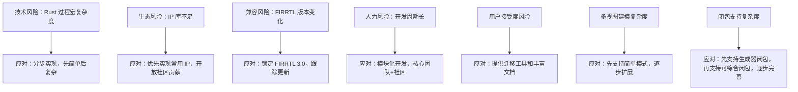

# 19. 实施路线图

RHDL（公开产品名 **Bitloom**）的实施路线图分为七个阶段，从核心语言特性到生态建设逐步推进。每个阶段都有明确的目标、关键任务和交付物，阶段之间存在依赖关系。路线图的设计遵循“先核心后扩展、先基础后生态”的原则，并特别将多视图建模与模拟器生成作为后期集成阶段。在引入受控泛型闭包后，路线图相应调整：在阶段二加入泛型闭包生成器基础支持，在阶段五强化 HLS 闭包变换能力，在阶段七将桥接适配器框架基于泛型闭包实现。每一步都为后续工作奠定坚实基础。

> **合同绿（FR87 / NFR38，Phase 11）：** 阶段五–七的「绿 / 完成」**仅**按下文各节 **合同绿完成定义** 验收。  
> **禁止**用字面未交付项勾选「全绿」或宣称「七阶段字面产品做完」。合同绿 ≠ 字面七阶段愿景一次性兑现。  
> 永久非目标清单（自研 HLS 调度、idiomatic Chisel、SystemC TLM 产品等）见后续 FR93 / README deferred，须新 PRD 才能推翻。

## 19.1 路线图总览

## 19.2 阶段依赖关系

阶段之间存在强依赖：必须先有核心类型系统和 HIR，才能实现参数化、仿真器和后端；时钟域检查依赖于 HIR 的完善；互转依赖于 FIRRTL 后端；HLS 和 IP 库依赖于稳定的 HIR 和仿真器。多视图建模作为最后的集成阶段，需要所有基础模块成熟后才能高效实现。闭包相关能力在各阶段逐步叠加：阶段二先支持生成器闭包，阶段五在 HLS 中应用，阶段七用于桥接适配器。

## 19.3 阶段一：核心语言基础

**目标**：构建 RHDL 的最小可用核心，能够描述简单硬件并生成可综合 Verilog。

### 关键任务

- 定义基础硬件类型（`Bool`, `Bits<N>`, `UInt<N>`, `SInt<N>`, `Clock`, `Reset`）及其运算。
- 实现 `#[module]` 过程宏，解析模块结构体，生成 HIR 模块。
- 实现 `#[combinational]` 和 `#[sequential]` 宏，支持基本组合逻辑和时序逻辑描述。
- 实现简单的 Verilog 后端，输出可综合代码。
- 建立基本的编译期检查（位宽、方向）。
- 初始阶段不涉及闭包，为后续闭包支持预留宏展开接口。

### 交付物

- `rhdl` crate 核心类型与宏。
- 能生成 Verilog 的简单模块示例。
- 基础单元测试。

## 19.4 阶段二：参数化、层次化与仿真

**目标**：支持参数化模块和层次化设计，提供原生仿真器用于测试，并引入泛型闭包生成器基础支持。

### 关键任务

- 利用 Rust 泛型和 const 泛型实现模块参数化。
- **实现泛型闭包生成器基础支持**：允许函数接收 `Fn` 闭包参数在编译期执行，生成硬件初始化数据或结构。
- 实现层次化模块实例化和端口连接（`#[connect]`）。
- 开发原生 Rust 仿真器，支持 `tick`、`set_input`、`get_output`，并输出 VCD 波形。
- 实现 FIRRTL 后端，将 HIR 转换为 FIRRTL 文本。
- 扩展编译期检查：多驱动检测（所有权模型）、连接完整性检查。

### 交付物

- 参数化模块示例（如 `ParamAdder<W>`）。
- 使用闭包生成查找表的示例。
- 层次化设计示例。
- 仿真器 API 和波形导出功能。
- FIRRTL 输出示例。

## 19.5 阶段三：时钟域、复位与形式验证接口

**目标**：强化时序安全性，引入显式时钟域和跨时钟域原语，为形式验证奠定基础。

### 关键任务

- 完善 `ClockDomain` 类型，支持复位极性和同步/异步配置。
- 在编译期执行时钟域检查，禁止未同步的跨域数据传输。
- 提供跨时钟域同步原语：`DoubleFlop`、`SyncFIFO`。
- 设计属性标注机制（`#[assert]`）用于仿真检查和形式验证。
- 开发形式验证后端接口，生成 SVA 或对接 SymbiYosys。

### 交付物

- 时钟域配置和检查示例。
- 跨时钟域同步器 IP。
- 可导出 SVA 的断言支持。

## 19.6 阶段四：与 Chisel 互转

**目标**：实现 RHDL 与 Chisel 的中间表示级双向转换，打通生态互操作。此阶段无需额外考虑闭包，因为闭包在进入 HIR 前已被消除。

### 关键任务

- 开发 FIRRTL 解析器，将 FIRRTL 导入为 HIR（FIRRTL→RHDL）。
- 开发 FIRRTL→Chisel 代码生成器，输出可编译的低层次 Chisel 源码。
- 开发 RHDL 源码生成器，从 HIR 生成可编译的 RHDL 源码（用于导入后的输出）。
- 处理多驱动规范化、时钟域默认分配等语义差异。
- 提供完整的互转工具链命令：`cargo rhdl import`、`cargo rhdl generate --format chisel`。

### 交付物

- FIRRTL 导入器和导出器。
- Chisel 代码生成器。
- 双向转换示例（RHDL 计数器 ↔ Chisel 模块）。

## 19.7 阶段五：HLS、IP 库与可视化

**目标**：提供高层次综合路径、常用硬件 IP 与可视化，提升生产力。闭包能力可扩展到 HLS/IP 生成器叙事，但**不以字面愿景代替完成定义**。

### 合同绿完成定义（P5 绿 · FR87）

阶段五标「绿」**当且仅当**同时满足：

1. **外挂 HLS 可复现产物** — 产品路径为外挂工具（如 Bambu）可复现产物，而非树内自研调度器交差。
2. **薄 IP 生成器** — 提供薄 IP / 生成器基线（非 VIP 全协议）。
3. **VCD / 层次可视化** — 仿真波形（VCD 等）与模块层次可视化入口可用。

对齐已交付能力即可勾选；**禁止**用「自研 `#[hls]` 调度完整产品 / 全协议 IP crate 矩阵」等字面未交付项勾选本阶段全绿。

### 历史愿景（非完成勾选条件）

下列条目保留为方向性叙述，**不是** P5 绿勾选条件：

- 实现树内 `#[hls]` 属性宏与自研调度、流水线、循环展开。
- HLS 前端以闭包作为数据流变换单元并在调度前内联。
- 独立 IP crate 命名（历史 `rhdl-uart` / `rhdl-fifo` 等）与闭包定制全家桶。
- 扩展仿真器覆盖率记录；历史 `cargo rhdl visualize/wave` 命名。

### 交付物（合同口径）

- 外挂 HLS 可复现路径与文档。
- 薄 IP 生成器 / 基线。
- VCD 与层次可视化入口。

## 19.8 阶段六：生态扩展与优化

**目标**：在精选深度上扩展 IP、完善文档站，并明确宿主 IDE/LSP 路径，形成可维护生态。

### 合同绿完成定义（P6 绿 · FR87）

阶段六标「绿」**当且仅当**同时满足：

1. **精选 IP 深度合同（非 VIP）** — 对选定 IP 给出显式深度/子集合同，**不**以 VIP 级全协议 IP 为完成条件。
2. **文档站** — 公开文档站 / 教程索引可用。
3. **宿主 LSP 路径（rust-analyzer）** — 以宿主 rust-analyzer 工作流为 IDE 主路径；可选浅层 Bitloom 诊断**不**挡本阶段绿。

**禁止**用「自研 VS Code 插件 / 全 elaborate netlist LSP / HLS 调度优化产品版 / 全协议 AXI·SPI·I2C 全家桶」等字面未交付项勾选本阶段全绿。

### 历史愿景（非完成勾选条件）

- 扩展全套 `rhdl-spi` / `rhdl-i2c` / `rhdl-axi` / `rhdl-gpio` 等为产品完整面。
- 优化树内 HLS 调度算法（资源共享、位宽优化等）。
- 一等 Bitloom LSP 服务器 / VS Code 插件作为本阶段交付物。

### 交付物（合同口径）

- 精选 IP 深度合同文档与实现边界。
- 文档站。
- 宿主 rust-analyzer 工作流说明（及可选浅层诊断指针）。

## 19.9 阶段七：多视图建模与模拟器生成集成

**目标**：整合多视图建模：同刺激下的功能/周期路径，以及桥接 adapter 模板。桥接可基于泛型闭包模板提升复用，但**不以自动等价或 SystemC TLM 产品为完成条件**。

### 合同绿完成定义（P7 绿 · FR87）

阶段七标「绿」**当且仅当**同时满足：

1. **多抽象同刺激功能/周期路径** — 功能视图与周期精确路径可共享刺激夹具联验。
2. **桥接 adapter 模板** — 提供桥接适配器模板（如启动-等待完成），而非仅口号。

**明确不承诺（非 P7 绿条件，AD-5 / NFR38）：**

- **不**承诺自动等价证明 / 形式化等价产品作为阶段完成。
- **不**承诺 SystemC TLM-2.0 产品路径。

**禁止**用「自动随机比对+形式等价套件 / SystemC TLM 产品 / 每个 IP 双模型齐全」等字面未交付项勾选本阶段全绿。

### 历史愿景（非完成勾选条件）

- `#[abstraction]` / `#[functional_model]` / `#[functional_state]` 全属性矩阵作为唯一完成面。
- 自动生成随机测试比对与形式化等价检查框架作为产品交付。
- 历史 `cargo rhdl build-sim --kind …` 全动词矩阵。
- 更新全部 IP 为双模型完整面。

### 交付物（合同口径）

- 同刺激功能/周期路径与文档。
- 桥接 adapter 模板与跟练入口。
- 明确排除自动等价 / SystemC TLM 产品作为完成勾选。

## 19.10 里程碑

每个里程碑对应于一个阶段的完成，并具有可演示的成果。其中 **M5–M7（阶段五–七）的「完成」按 §19.7–19.9 合同绿定义验收（FR87 / NFR38）**，不得用字面未交付项勾选。

## 19.11 风险与应对

---

RHDL / **Bitloom** 的实施路线图以阶段化、里程碑驱动的方式推进。泛型闭包相关能力分配到阶段二（生成器闭包）、阶段五（HLS/IP 相关叙事）和阶段七（桥接适配器模板）。阶段五–七的「绿」**仅**按上文 **合同绿完成定义（FR87 / NFR38）** 验收；**禁止**用字面未交付项勾选全绿。公开状态与延期项见仓库 README「状态与 deferred」及 `_agile-output/implementation-artifacts/deferred-work.md`。