# 2. 设计目标

RHDL 的设计目标旨在解决传统 HDL 在安全性、开发效率和生态互操作性方面的痛点，同时充分利用 Rust 语言的优势。设计目标可归纳为十一个核心方面，它们相互关联、协同作用，共同定义了 RHDL 的独特价值。其中**多视图建模**和**受控泛型闭包抽象**作为新增或强化的目标，专门用于降低模拟器生成难度并提升抽象能力。

## 2.1 设计目标总览

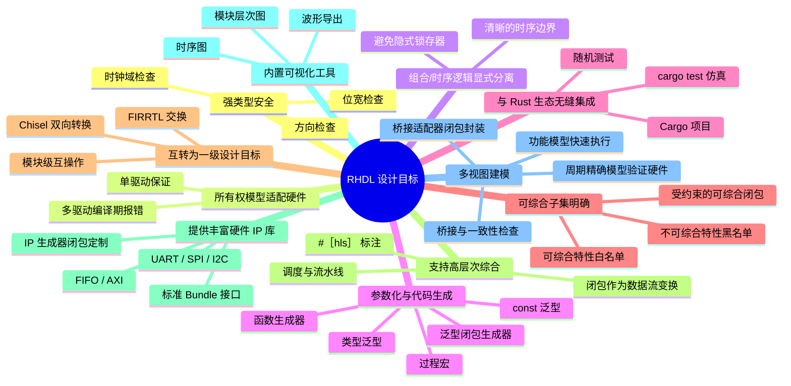

## 2.2 强类型安全

RHDL 将类型安全置于核心，所有硬件信号在编译期就具有明确的位宽、方向和时钟域属性，杜绝了传统 HDL 中常见的位宽不匹配、方向错误和跨时钟域冒险。

### 2.2.1 类型层次

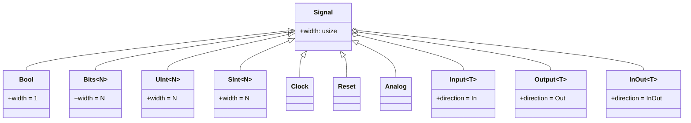

### 2.2.2 编译期检查流程

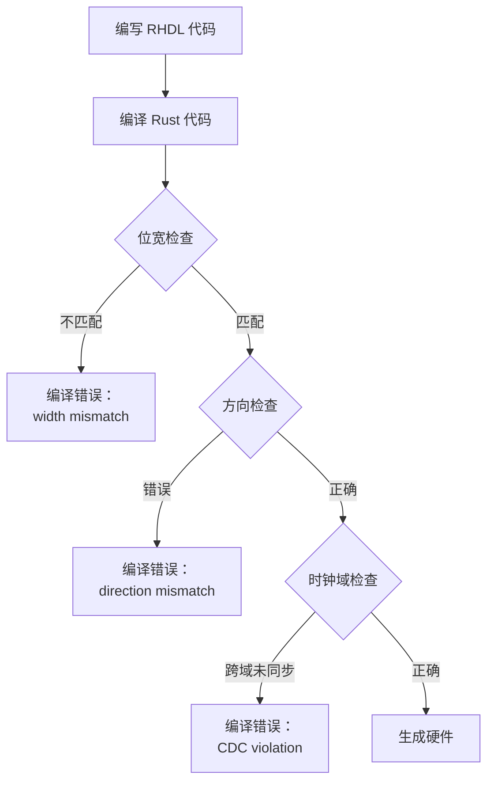

## 2.3 所有权模型适配硬件

Rust 的所有权系统要求每个值在任意时刻只能有一个可变引用。RHDL 利用这一特性，将硬件信号建模为具有所有权语义的实体，从而在编译期就杜绝了多驱动冲突。

### 2.3.1 单驱动保证

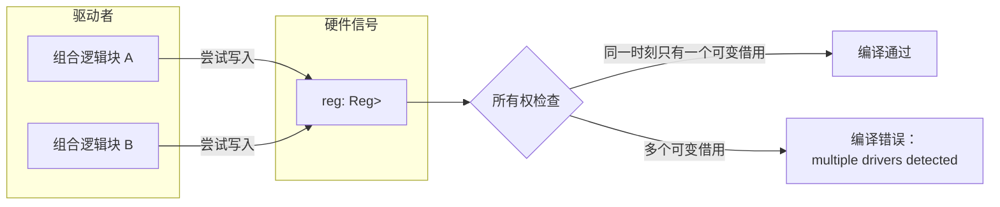

### 2.3.2 借用检查与硬件生成

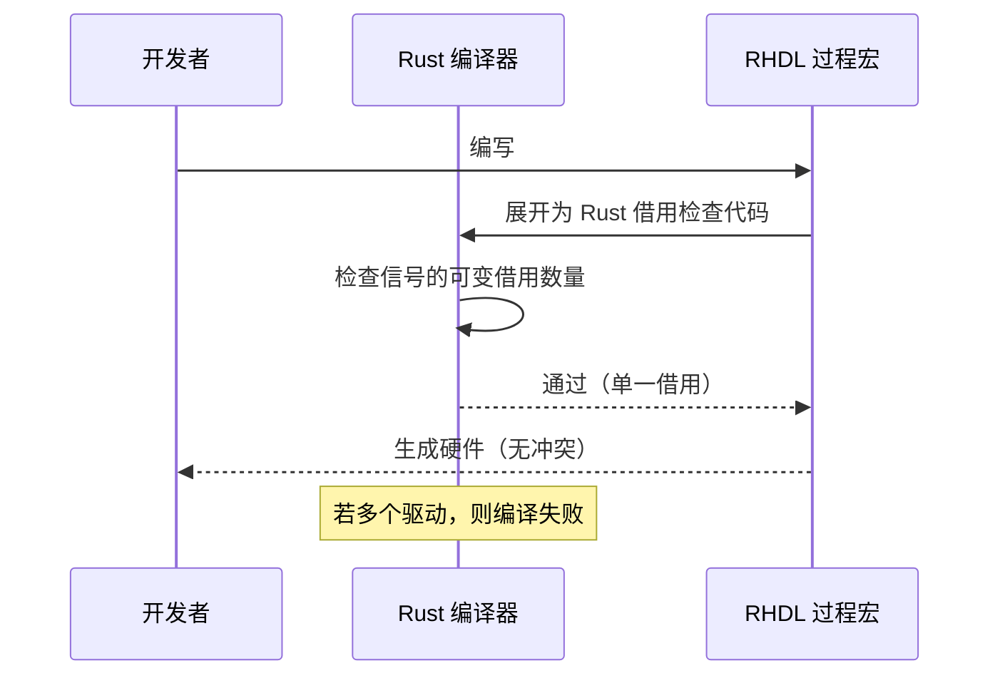

## 2.4 组合/时序逻辑显式分离

RHDL 通过 `#[combinational]` 和 `#[sequential]` 宏显式区分组合逻辑与时序逻辑，避免隐式锁存器的产生，并清晰定义寄存器的更新行为。

### 2.4.1 逻辑分离规则

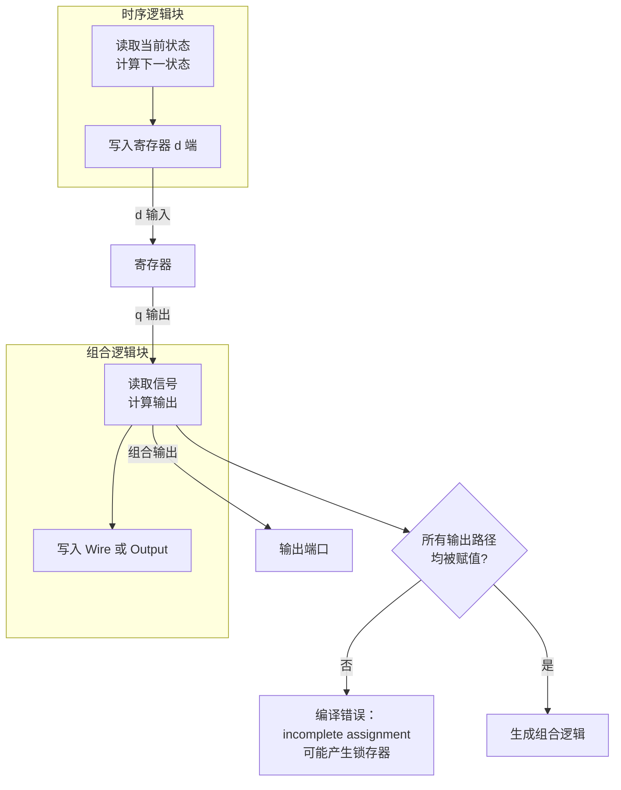

### 2.4.2 时序边界

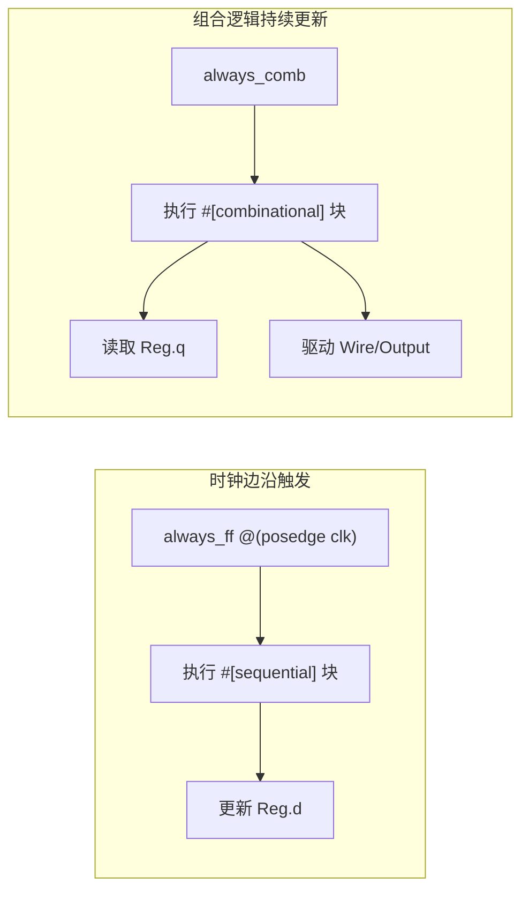

## 2.5 参数化与代码生成

RHDL 充分利用 Rust 的泛型、const 泛型、过程宏和**泛型闭包**，实现强大的参数化硬件生成能力，支持编写可复用的模块。

### 2.5.1 参数化手段

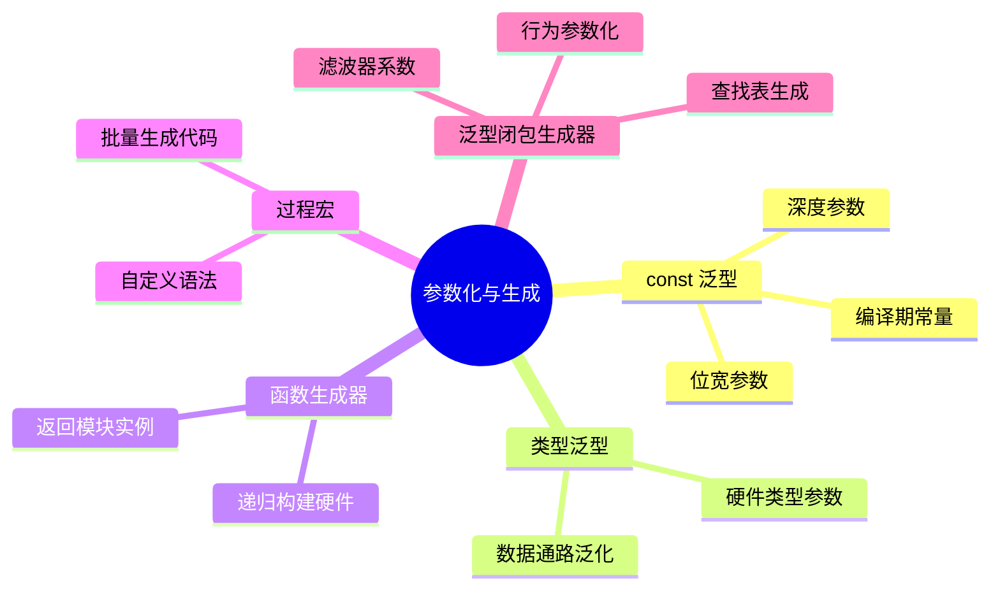

### 2.5.2 泛型闭包生成器示例

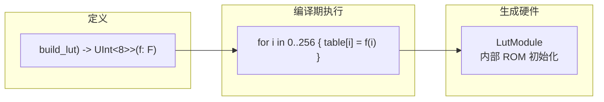

### 2.5.3 参数化模块生成

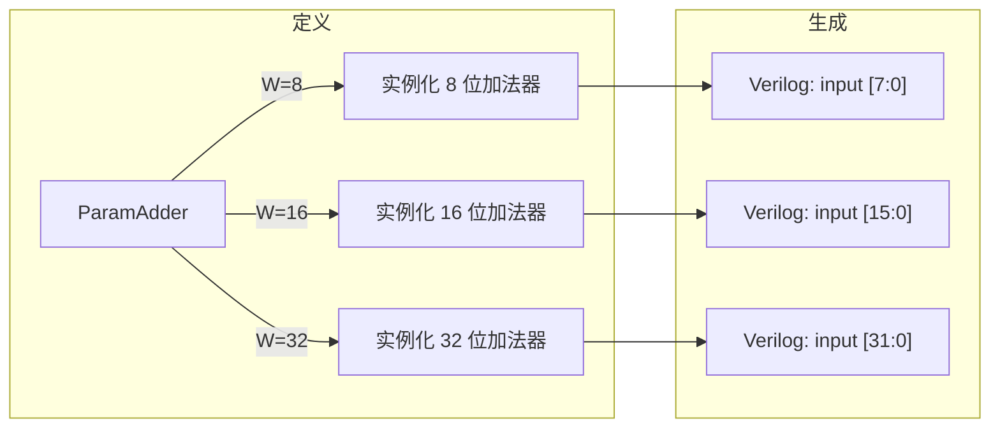

## 2.6 与 Rust 生态无缝集成

RHDL 作为 Rust 库，天然融入 Cargo 生态。项目依赖管理、构建、测试、文档和发布都使用 Rust 的标准工具链。

### 2.6.1 开发工作流

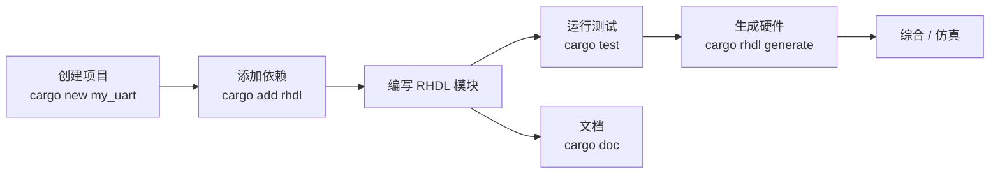

### 2.6.2 仿真测试集成

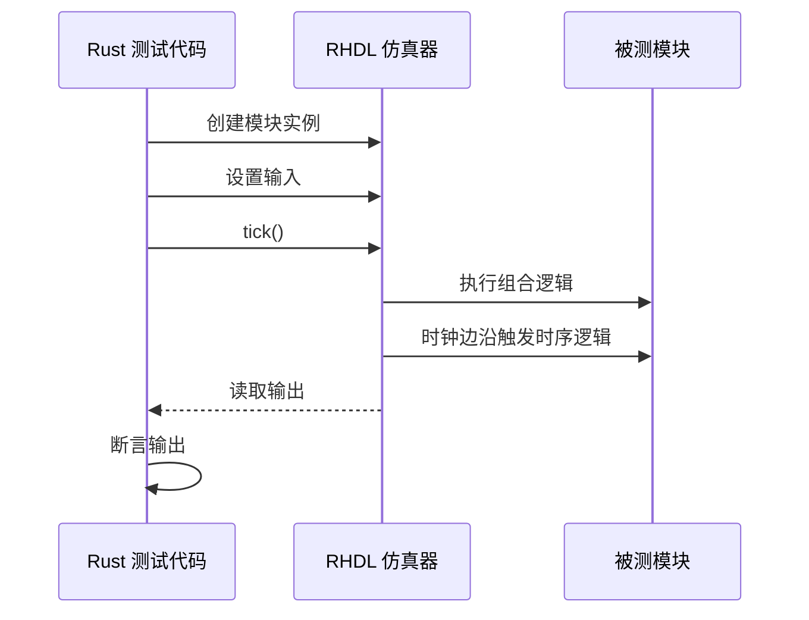

## 2.7 可综合子集明确

RHDL 明确定义哪些 Rust 特性可被综合为硬件，哪些不可综合。这保证了代码的行为一致性，并使开发者能在编译期发现不支持的抽象。**受约束的可综合闭包**作为新增特性被纳入可综合子集。

### 2.7.1 可综合/不可综合边界

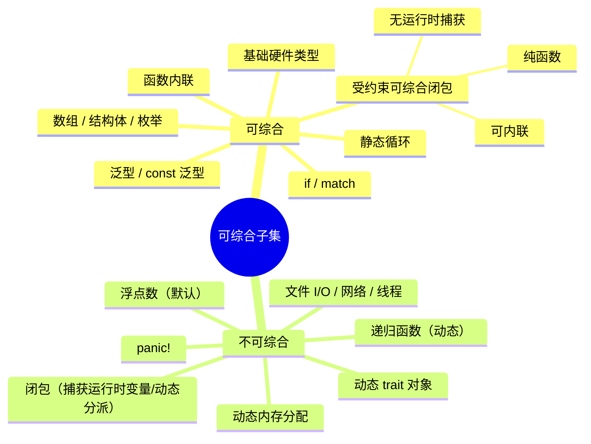

### 2.7.2 可综合闭包约束

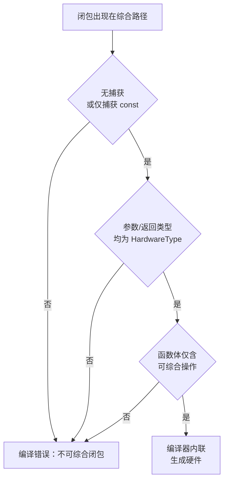

## 2.8 互转为一级设计目标

RHDL 将与其他 HDL（尤其是 Chisel）的互操作性作为核心设计目标。通过 FIRRTL 中间表示，RHDL 模块可以转换为 Chisel 代码，Chisel 生成的 FIRRTL 也可以导入为 RHDL 模块。可综合闭包在进入 HIR 前被内联，因此不影响互转。

### 2.8.1 互转路径

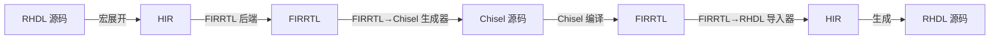

### 2.8.2 互操作层次

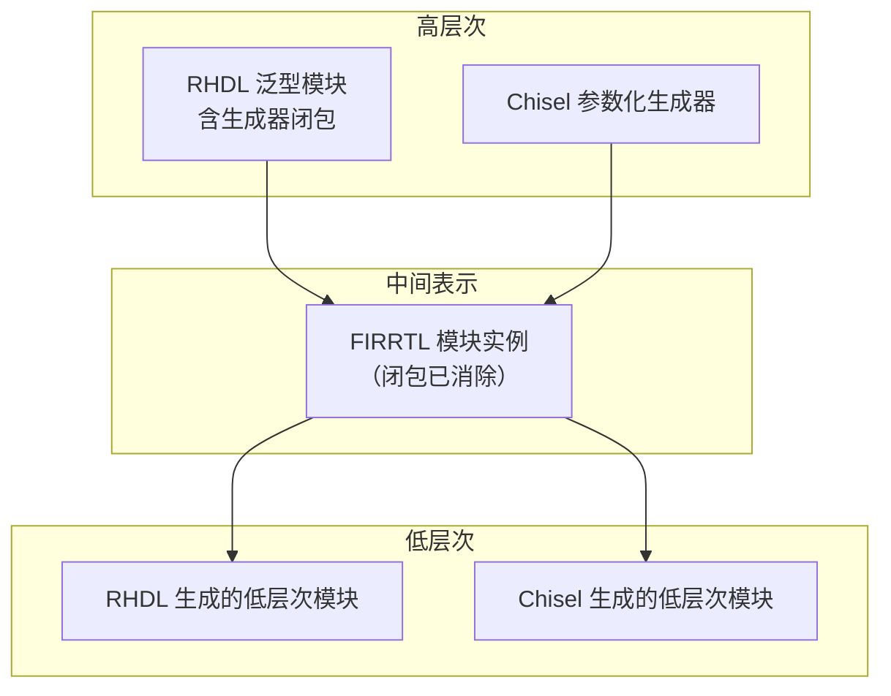

## 2.9 支持高层次综合（HLS）

RHDL 计划集成 HLS，允许开发者使用算法级 Rust 函数描述计算，由工具自动生成 RTL（状态机、数据通路、流水线），从而提高设计抽象层次。HLS 前端支持**闭包作为数据流变换单元**。

### 2.9.1 HLS 流程

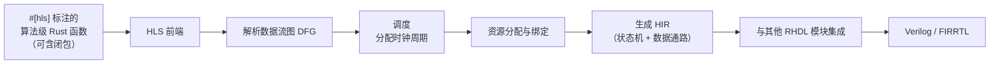

### 2.9.2 闭包在 HLS 中的角色

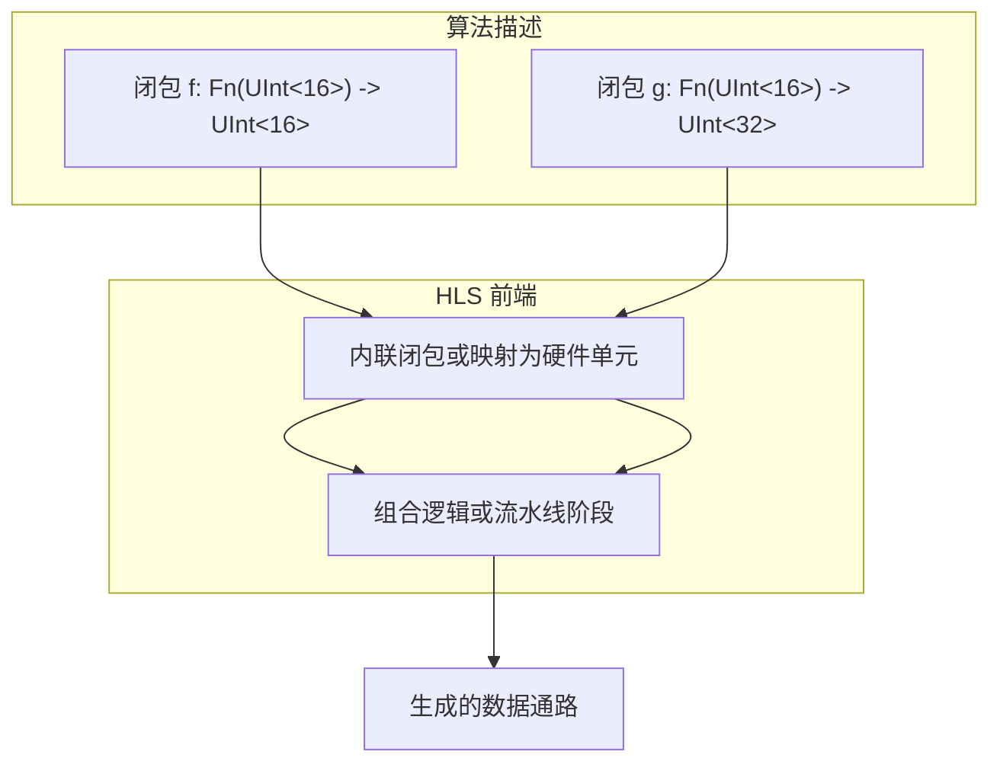

## 2.10 提供丰富硬件 IP 库

RHDL 生态将提供常用硬件 IP 库，以独立 Rust crates 发布，开发者可通过 Cargo 直接引入，加速设计开发。IP 生成器可使用**泛型闭包定制内部算法**。

### 2.10.1 IP 库结构

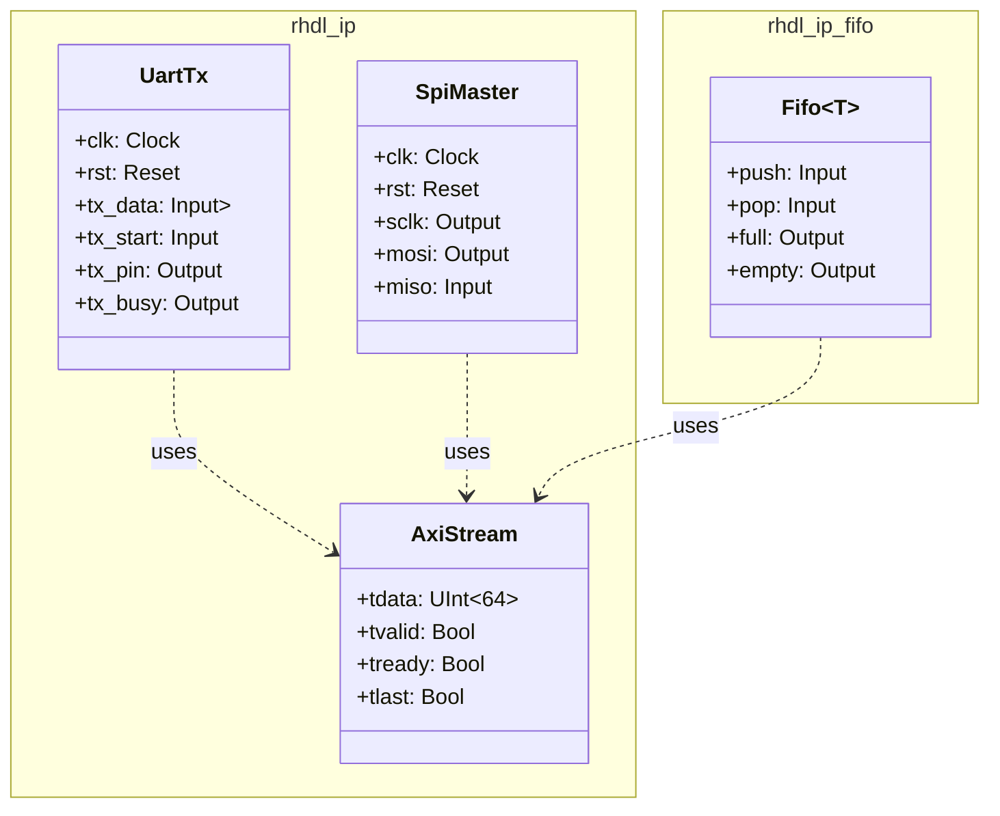

### 2.10.2 IP 生成器闭包定制示例

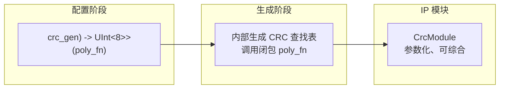

## 2.11 内置可视化工具

RHDL 提供从 HIR 生成模块层次图、从仿真波形生成时序图的能力，帮助开发者理解和调试设计。

### 2.11.1 可视化生成流程

```mermaid
flowchart LR
    HIR[硬件中间表示 HIR] --> dot[Graphviz DOT 生成]
    dot --> hierarchy[模块层次图]
    Sim[仿真器] --> vcd[VCD/FST 波形]
    vcd --> wave[波形查看器]
    vcd --> timing[时序图生成器]
    timing --> svg[SVG / PlantUML]
```

### 2.11.2 可视化类型

```mermaid
mindmap
  root((可视化输出))
    模块层次图
      Graphviz DOT
      Mermaid 图
      层次折叠
    时序图
      信号变化
      时钟周期标注
    波形
      VCD / FST
      与仿真器集成
```

## 2.12 多视图建模与模拟器生成

RHDL 引入多视图建模，允许一个硬件模块同时提供**功能视图**和**周期精确视图**。功能视图使用普通 Rust 代码（事务级/算法级），周期精确视图使用 RHDL 的 RTL 描述。工具链分别生成功能模拟器（快速）和周期精确模拟器（精确），并通过桥接和一致性验证保证两者等价。**桥接适配器大量使用泛型闭包封装转换逻辑**。

### 2.12.1 多视图建模结构

```mermaid
flowchart TB
    subgraph 模块定义
        A[UartTx 模块]
        A --> B["功能视图<br>#[functional_model] 方法"]
        A --> C["周期精确视图<br>#[sequential] + #[combinational]"]
    end
    subgraph 模拟器生成
        B --> D[功能模拟器<br>快速事务级]
        C --> E[周期精确模拟器<br>逐周期 RTL 级]
        D --> F[桥接适配器<br>泛型闭包封装]
        E --> F
    end
    D -->|一致性验证| E
    F -->|协同仿真| G[混合模拟环境]
```

### 2.12.2 桥接适配器中的闭包

```mermaid
flowchart LR
    SW[软件调用] -->|方法调用| TLM["事务级接口<br>send_byte()"]
    TLM -->|桥接适配器<br>（闭包 start_wait_complete）| RTL[信号级接口<br>tx_data / tx_start / tx_busy]
    RTL -->|逐周期 tick| HW[周期精确模拟器]
```

## 2.13 设计目标之间的关联

这些设计目标并非孤立，而是相互支撑、形成闭环：

```mermaid
flowchart LR
    A[强类型安全] --> B[所有权单驱动]
    B --> C[组合/时序分离]
    C --> D[参数化生成<br>含泛型闭包]
    D --> E[Rust 生态集成]
    E --> F[可综合子集<br>含受约束闭包]
    F --> G[互转 FIRRTL]
    G --> H[HLS 支持<br>闭包变换]
    H --> I[IP 库<br>闭包定制]
    I --> J[可视化]
    J --> A
    A --> K[多视图建模]
    K --> E
    K --> H
    K --> L[桥接适配器闭包]
    L --> D
```

**总结**：RHDL 的设计目标围绕“安全、现代、互操作、高产、多视图”五大支柱展开，通过 Rust 语言的内在优势（包括泛型闭包），为硬件设计提供一个可靠、高效且生态友好的新选择。受控闭包抽象作为贯穿多个目标的核心机制，增强了 RHDL 的表达力和代码复用性，同时保持了硬件综合的严格性。多视图建模的加入使得 RHDL 能够支持从快速软件开发到严格硬件验证的完整流程，并通过闭包化的桥接适配器降低集成难度。