# 3. 核心设计原则

RHDL 的设计遵循七项核心原则（在原有基础上新增**受控闭包抽象原则**），它们共同决定了语言的架构、宏展开方式、类型系统设计和工具链行为。这些原则确保了 RHDL 在安全性、可预测性、生态互操作性和多视图建模方面的优势，同时通过受控闭包抽象提升了代码复用与生成能力，并避免了传统 HDL 的常见缺陷。

## 3.1 设计原则总览

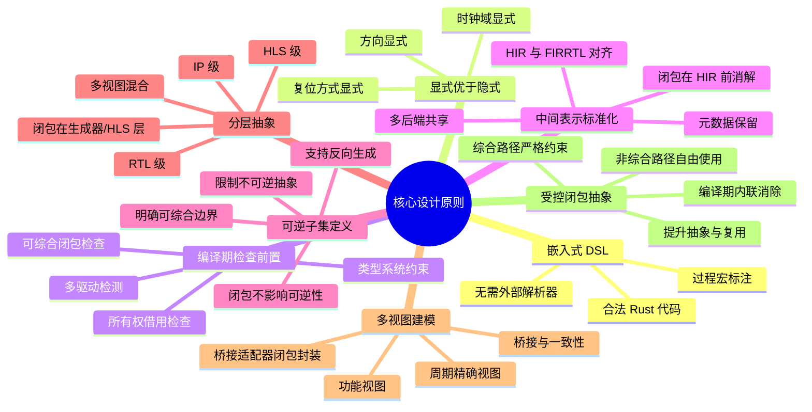

## 3.2 嵌入式 DSL

RHDL 不是一门独立的语言，而是嵌入在 Rust 中的领域特定语言。硬件描述代码就是合法的 Rust 代码，通过过程宏（`#[module]`、`#[combinational]`、`#[sequential]` 等）标注，由 Rust 编译器展开为硬件中间表示（HIR）。这带来几个好处：

- **无需自定义解析器**：直接利用 Rust 的语法和解析器。
- **完整的 Rust 工具链支持**：IDE、格式化、静态分析、文档生成等。
- **与 Rust 生态无缝融合**：可以在同一个项目中编写硬件描述、测试、构建脚本。

泛型闭包作为 Rust 的一等公民，天然存在于嵌入式 DSL 中。在非综合路径（如功能模型、测试、生成器）中，闭包可以自由使用；在综合路径中，闭包则受到可综合性约束，由编译器内联。

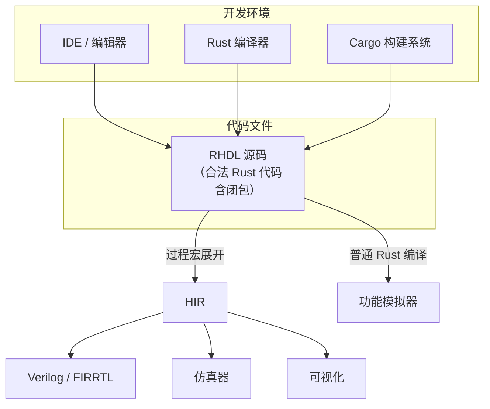

嵌入式 DSL 还使得功能模型（普通 Rust 代码）和 RTL 模型（宏标注代码）可以共存于同一文件中，为多视图建模奠定基础。

## 3.3 显式优于隐式

RHDL 遵循“显式优于隐式”的设计哲学，要求开发者明确声明那些在传统 HDL 中常常隐式处理的关键属性，从而减少设计错误。

### 3.3.1 显式时钟域

每个寄存器必须显式绑定到一个 `ClockDomain` 对象，该对象明确定义了时钟信号、复位信号、复位极性以及复位方式（同步/异步）。跨时钟域的信号传输必须使用显式同步器。

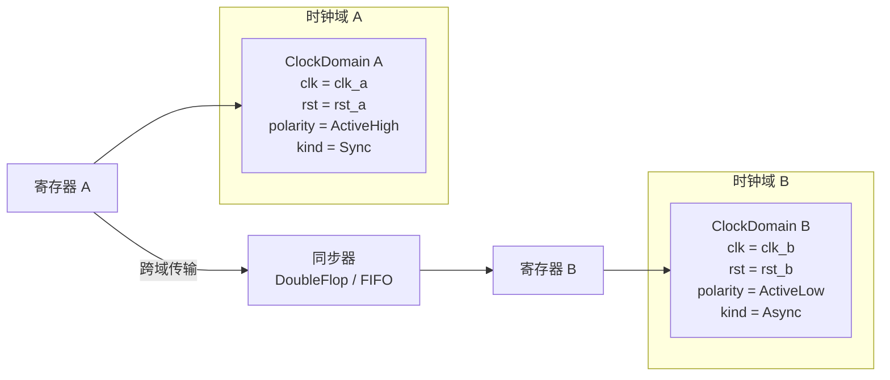

### 3.3.2 显式方向与复位

端口方向由 `Input<T>` / `Output<T>` / `InOut<T>` 包装类型显式声明，复位信号通过 `Reset` 类型传递，极性在 `ClockDomain` 中配置。这消除了传统 Verilog 中 `input` / `output` 声明与使用不一致的问题。

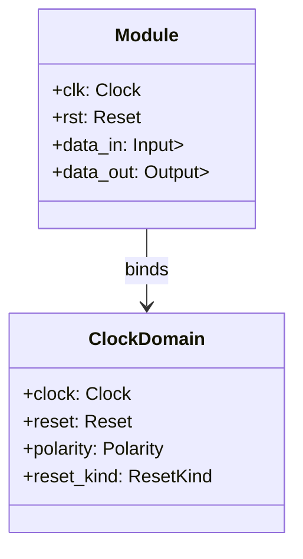

## 3.4 编译期检查前置

RHDL 将尽可能多的检查推迟到 Rust 编译期完成，利用 Rust 的类型系统和借用检查器在硬件生成之前发现错误。这包括：

- **位宽检查**：所有运算的位宽在编译期确定，不匹配会报错。
- **方向检查**：端口方向错误（如将输出连接到输入）在编译期报错。
- **多驱动检测**：利用所有权模型，同一信号只能被一个可变借用驱动，否则编译失败。
- **时钟域检查**：跨时钟域未同步的信号传递会被标记为错误（或警告）。
- **组合逻辑完整性**：`#[combinational]` 块中所有输出路径必须被赋值，否则编译错误，防止锁存器。
- **可综合闭包检查**：在综合路径中，闭包必须满足无运行时捕获、纯函数、可内联等约束，否则编译错误，并提示改用功能视图或显式函数。

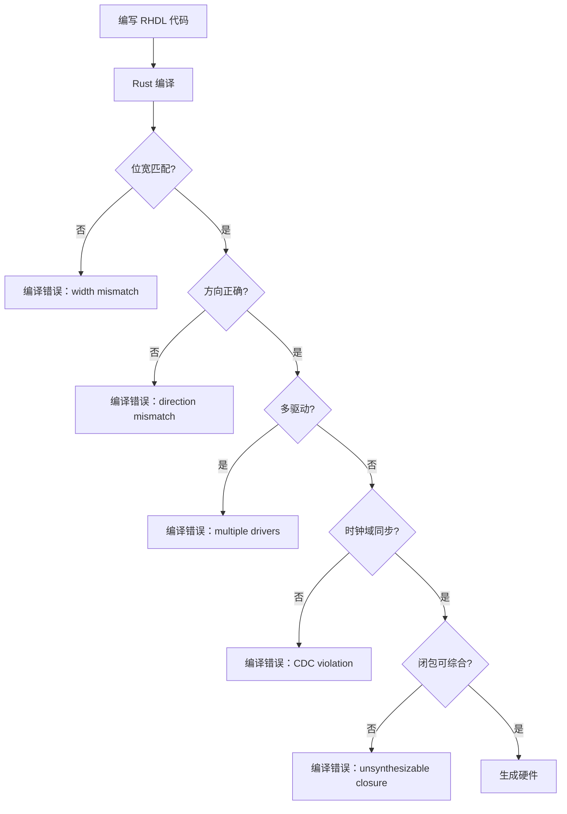

这种“前置检查”将错误发现时机从综合/仿真阶段提前到编码阶段，显著提高开发效率。

## 3.5 中间表示标准化

RHDL 的硬件中间表示（HIR）被设计为与 FIRRTL 语义对齐，并保留足够的元数据以支持多种后端和反向生成。这意味着：

- **单一事实来源**：所有后端（Verilog、FIRRTL、仿真器、可视化）都从同一个 HIR 生成，保证一致性。
- **互操作基础**：HIR 可以无损转换为 FIRRTL，也可以从 FIRRTL 导入，实现与 Chisel 的双向互转。
- **元数据保留**：HIR 中保留原始类型名、字段名、参数化信息等，以便生成可读的代码或反向映射。
- **闭包在 HIR 前消解**：可综合闭包在宏展开阶段被内联为具体逻辑，因此 HIR 中不包含闭包结构，保证了中间表示的简洁性和后端无关性。

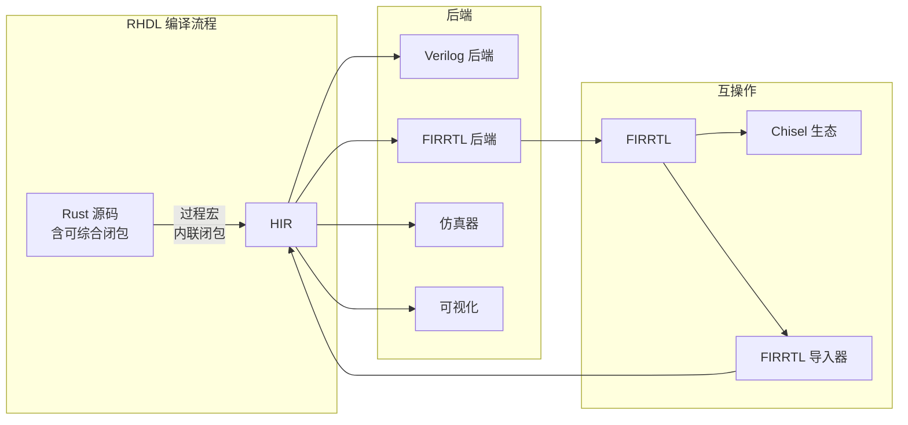

HIR 也是多视图建模的核心载体：周期精确视图编译为 HIR，功能视图则保留为普通 Rust 代码（可选生成 HIR 用于桥接）。

## 3.6 可逆子集定义

为了实现与 Chisel 等语言的互转，特别是从 FIRRTL 反向生成 RHDL 代码，RHDL 明确定义了一个“可逆子集”。这个子集内的 Rust 特性可以确定性地映射到硬件结构，并且可以从中间表示还原出等价的 RHDL 代码。

### 3.6.1 可逆特性

- 基础硬件类型及其运算
- `if` / `match` 控制流
- 静态循环（已知次数，可完全展开）
- 泛型与 const 泛型
- 数组、结构体、枚举
- 简单函数调用（内联）
- **受约束的可综合闭包**（在编译期被内联，因此属于可逆子集）

### 3.6.2 不可逆特性（被限制或禁止）

- 动态内存分配（`Vec`、`Box`）
- 递归函数（除非可完全展开）
- 动态 trait 对象
- **捕获运行时变量的闭包**（不可内联，因此不可逆）
- 文件 I/O、线程等副作用

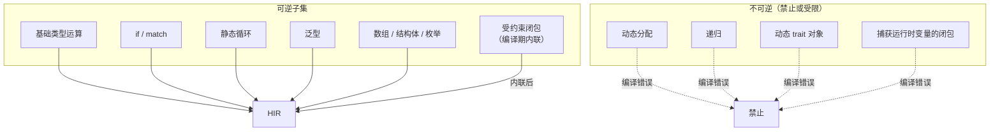

可逆子集的定义同样适用于多视图建模中的周期精确视图，而功能视图可以突破部分限制（例如允许使用动态数据结构），因为其不用于综合。

## 3.7 分层抽象

RHDL 提供多层次的硬件描述能力，从精细的 RTL 到高层次的算法综合，开发者可以根据需要在不同层次之间切换，甚至混合使用。

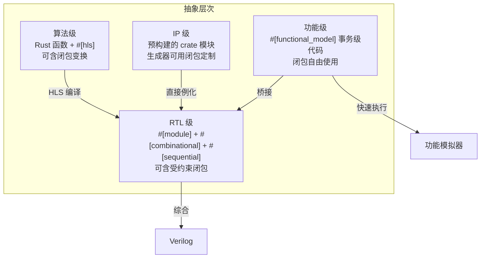

这种分层设计使得硬件设计既拥有底层控制力，又能享受高层次抽象的便利，同时保持各层次之间的清晰边界。泛型闭包在不同层次中扮演不同角色：在 HLS 层作为数据流变换，在 RTL 层作为可综合纯函数，在 IP 层作为定制参数，在功能级则完全自由。

## 3.8 多视图建模原则

多视图建模是 RHDL 为了降低功能模拟器与周期精确模拟器生成难度而引入的核心原则。它允许一个逻辑模块同时拥有多个行为视图，每个视图描述不同抽象层次的行为，并由工具链管理它们之间的一致性。

### 3.8.1 多视图定义

- **功能视图（Functional View）**：使用普通 Rust 代码描述模块的行为，通常为事务级或算法级。该视图不包含时钟概念，可以自由使用动态数据结构、循环、闭包等。它用于快速功能模拟，服务于软件开发。
- **周期精确视图（Cycle-Accurate View）**：使用 RHDL 的 RTL 描述（`#[module]` + `#[sequential]` + `#[combinational]`），逐周期定义硬件行为。它用于硬件验证和综合，与最终硬件行为一致。

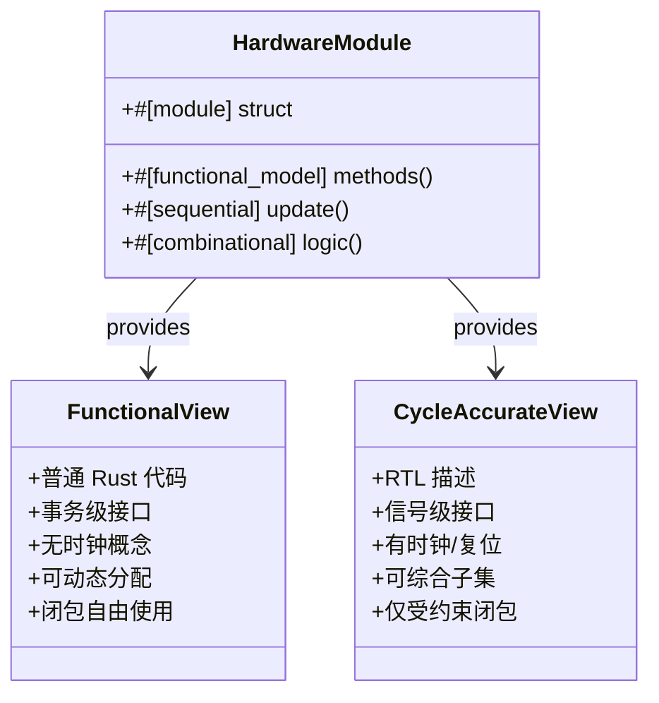

### 3.8.2 桥接与一致性验证

多视图建模的关键在于两个视图之间的桥接和一致性保证。RHDL 提供桥接适配器，将事务级接口转换为信号级时序（或反之），并通过自动化的随机测试和形式化等价检查确保两者行为一致。桥接适配器大量使用泛型闭包封装“事务-周期”转换模式。

### 3.8.3 模拟器生成定制

通过多视图建模，RHDL 工具链可以按需生成不同粒度的模拟器：

- **功能模拟器**：仅编译功能视图代码，运行速度接近软件。
- **周期精确模拟器**：编译周期精确视图为 HIR，解释执行或编译为原生代码。
- **混合模拟器**：同时包含两个视图，允许在运行时切换或使用桥接进行协同仿真。

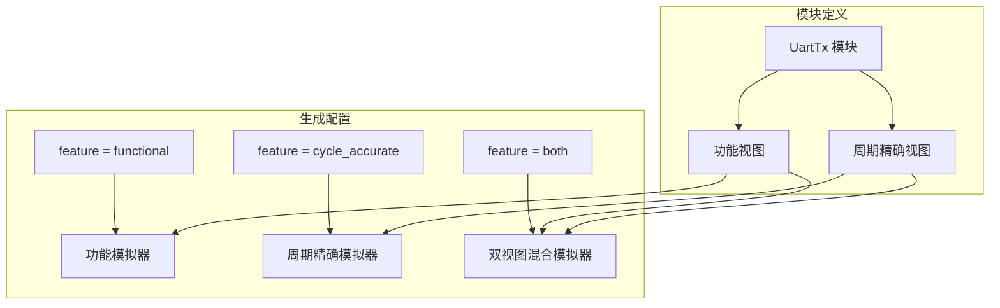

## 3.9 受控闭包抽象原则

这是 RHDL 引入的一项新原则，旨在平衡抽象能力与硬件可综合性。其核心思想是：

- **在非综合路径中**（编译期生成器、功能视图、桥接适配器、测试等），闭包作为普通 Rust 特性可以自由使用，提升代码复用、可配置性和表达能力。
- **在综合路径中**（`#[combinational]`、`#[sequential]` 等方法体内），闭包必须满足严格约束：
  - 不得捕获任何运行时变量（仅可捕获 `const` 项）；
  - 参数和返回值类型均为硬件类型（实现 `HardwareType`）；
  - 函数体仅包含可综合操作；
  - 编译器必须能够在编译期将其完全内联为硬件结构。
- 编译器在过程宏展开时对闭包进行检查，满足约束的闭包被内联并进入 HIR；不满足约束的闭包导致编译错误，并建议改用功能视图或显式函数。

这一原则使得 RHDL 在保持硬件描述确定性和可综合性的同时，获得了接近 Chisel 高阶函数的抽象能力，并且由于闭包在进入 HIR 前被消除，不会对后端和互转造成任何影响。

### 3.9.1 受控闭包抽象的范围

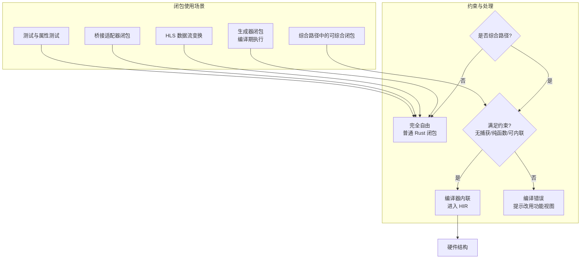

### 3.9.2 闭包与所有权模型的关系

可综合闭包必须是无捕获或仅捕获 `const` 项的纯函数，因此不会引入对硬件信号的额外可变引用，从而与所有权模型的单驱动保证兼容。编译器在检查闭包时也会验证其内部是否违反硬件信号的所有权规则。

## 3.10 设计原则之间的关系

这八项原则相互关联，共同构成了 RHDL 的设计基础：

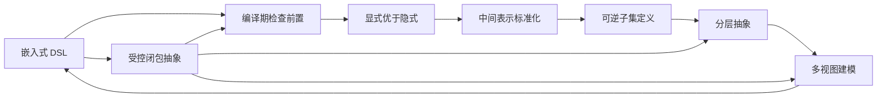

- **嵌入式 DSL** 让 Rust 编译器参与硬件检查，支持 **编译期检查前置**。
- **编译期检查前置** 依赖于 **显式优于隐式** 的设计，使类型系统能捕获更多错误。
- **中间表示标准化** 是 **可逆子集定义** 和 **分层抽象** 的基础，确保不同层次和语言间的互操作。
- **可逆子集定义** 和 **分层抽象** 共同支持了 RHDL 的 HLS 和 IP 库扩展。
- **多视图建模** 是分层抽象在模拟器生成上的具体应用，同时利用嵌入式 DSL 让功能视图和周期精确视图共享同一工程。
- **受控闭包抽象** 贯穿多个原则：它依赖于嵌入式 DSL 和编译期检查前置，同时增强了分层抽象和多视图建模的表达力。

---

总结：RHDL 的核心设计原则围绕“安全、显式、可互操作、可扩展、多视图”展开，并通过新增的受控闭包抽象原则，在保证硬件设计可靠性的同时，显著提升了代码复用和生成器的灵活性。这些原则共同确保了 RHDL 能够提供一个现代、高效且安全的硬件设计环境。