# 4. 整体架构与工作流

RHDL 的整体架构围绕 **Rust 编译器 + 过程宏 + 硬件中间表示（HIR）** 构建。硬件设计以合法的 Rust 代码编写，通过过程宏展开为 HIR，然后由多个后端生成目标产物。整个工具链深度集成在 Cargo 生态中，支持代码生成、仿真、可视化以及与 Chisel 的互转。此外，**多视图建模**机制使得同一设计源可以同时生成功能模拟器与周期精确模拟器。**受控泛型闭包抽象**则贯穿于生成器、HLS、桥接适配器等环节，在非综合路径自由使用，在综合路径则被编译期内联，不影响后端输出。

## 4.1 系统架构总览

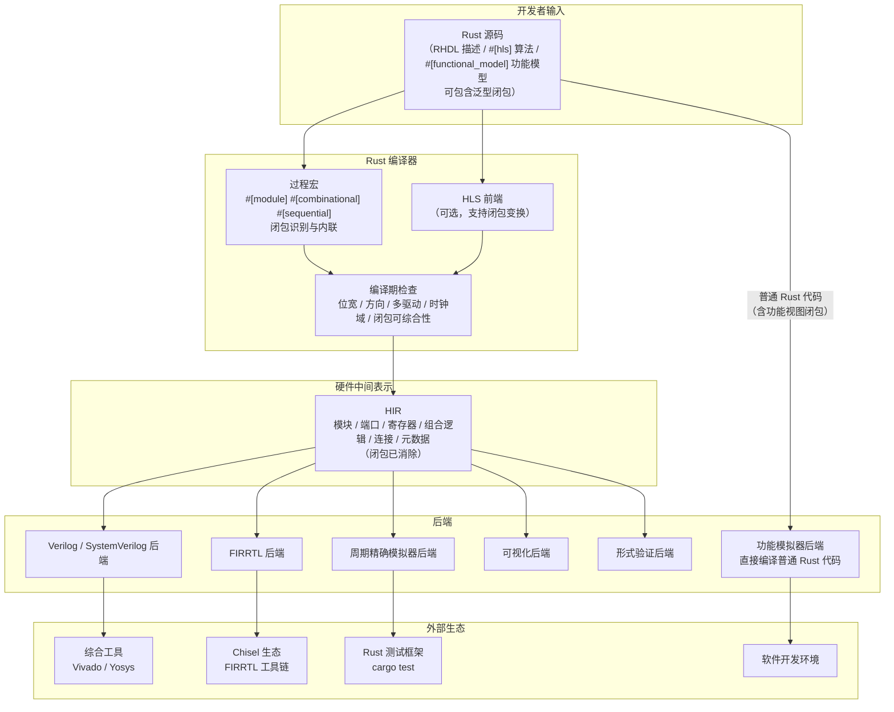

在架构总览中，过程宏需要处理闭包：识别综合路径中的闭包，检查其约束，若满足则内联为等价硬件逻辑；非综合路径中的闭包则保留为普通 Rust 代码，由标准编译器处理。

## 4.2 核心数据流

RHDL 编译流程的核心是 **Rust 源码 → HIR → 目标产物** 的数据转换链条。功能模型则走另一条路径：**Rust 源码 → 普通 Rust 编译 → 功能模拟器**。泛型闭包在不同路径中的处理方式不同：

- 综合路径中的可综合闭包在过程宏阶段被内联，不进入 HIR；
- 生成器闭包在编译期执行，产生 HIR 节点；
- 功能视图和桥接适配器中的闭包保留为运行时闭包，仅用于仿真。

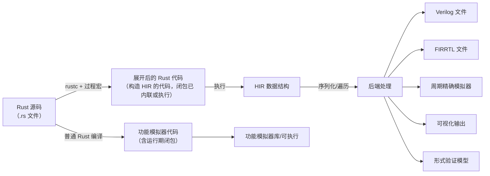

HIR 是核心中间表示，包含以下信息（闭包已不在其中）：

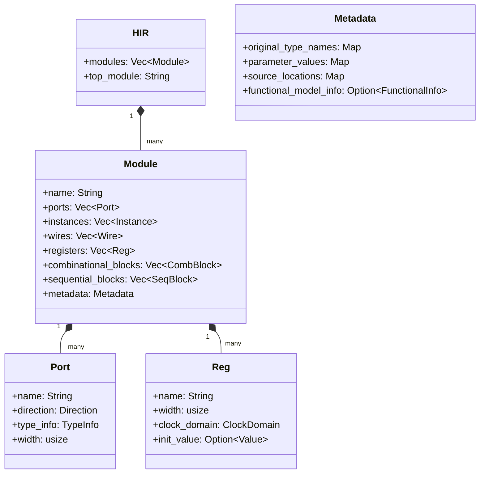

## 4.3 编译与生成流程

### 4.3.1 编译阶段

RHDL 的编译完全嵌入 Rust 的构建过程。当运行 `cargo build` 或 `cargo test` 时，过程宏在编译期间执行，构建 HIR 并执行检查。对于综合路径中的闭包，过程宏会：

1. 识别闭包表达式；
2. 检查闭包是否满足可综合约束（无运行时捕获、参数/返回类型为硬件类型、函数体仅含可综合操作）；
3. 若满足，将闭包调用内联为等价的硬件逻辑代码；
4. 若不满足，产生编译错误并提示开发者改用功能视图或显式函数。

对于生成器闭包（编译期执行的函数参数），则在过程宏展开期间被调用，产生具体的 HIR 节点。

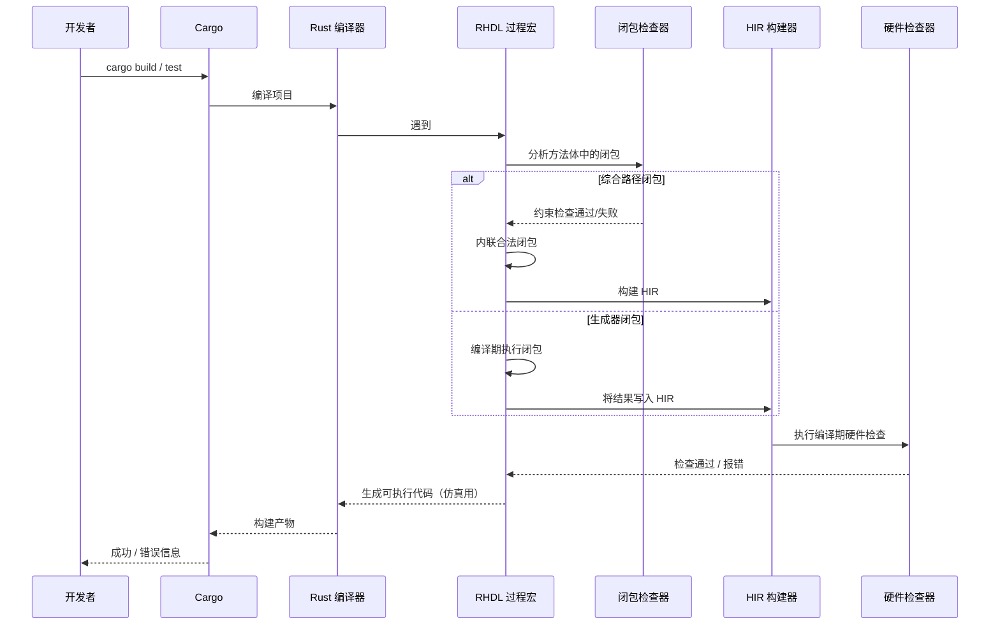

### 4.3.2 硬件生成流程

通过 `cargo rhdl generate` 子命令触发硬件生成，生成 Verilog 或 FIRRTL。由于 HIR 中已经不含闭包，后端无需特殊处理。

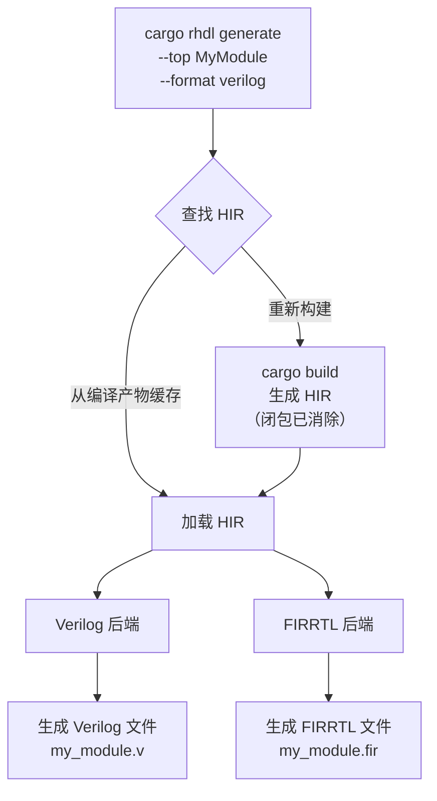

## 4.4 仿真与测试工作流

RHDL 的仿真器允许在 Rust 测试中直接实例化模块并操作信号，完全复用 `cargo test` 基础设施。功能模拟器则作为普通 Rust 库使用，其内部可以包含运行时闭包。周期精确模拟器基于 HIR 构建，不涉及闭包。

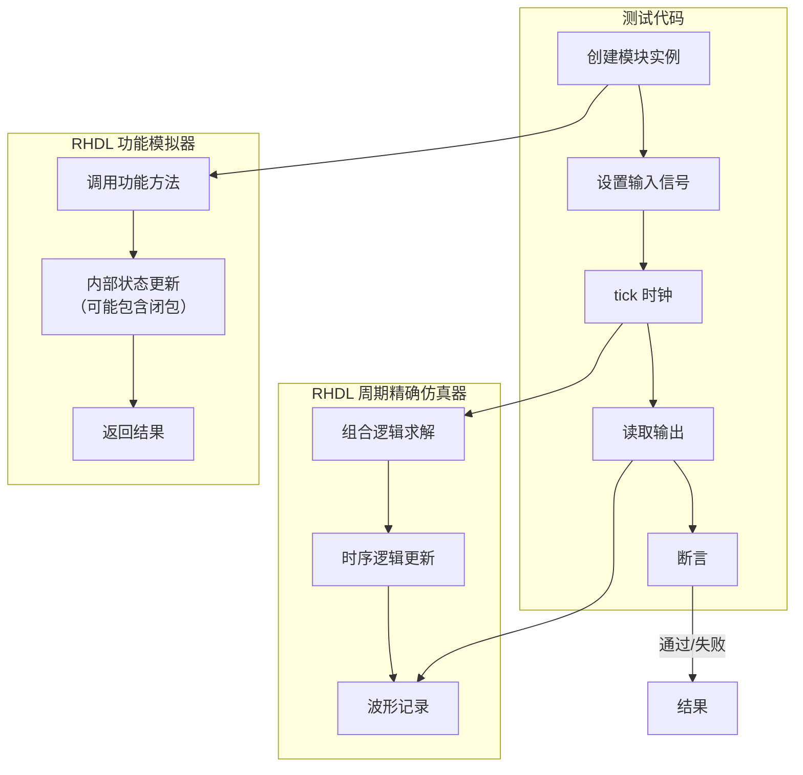

示例测试代码结构（包含闭包简化测试）：

```rust
#[test]
fn test_counter() {
    let mut sim = Simulator::new(Counter::new());
    sim.set_input(enable, true);
    sim.tick();
    assert_eq!(sim.get_output(count), 1);
    sim.tick();
    assert_eq!(sim.get_output(count), 2);
}

// 使用闭包封装通用测试模式
#[test]
fn test_with_closure() {
    with_sim(Counter::new(), |sim| {
        sim.set_input("enable", true);
        sim.tick();
        assert_eq!(sim.get_output("count"), 1);
    });
}
```

仿真器还支持波形导出，生成 VCD/FST 文件供外部工具查看。

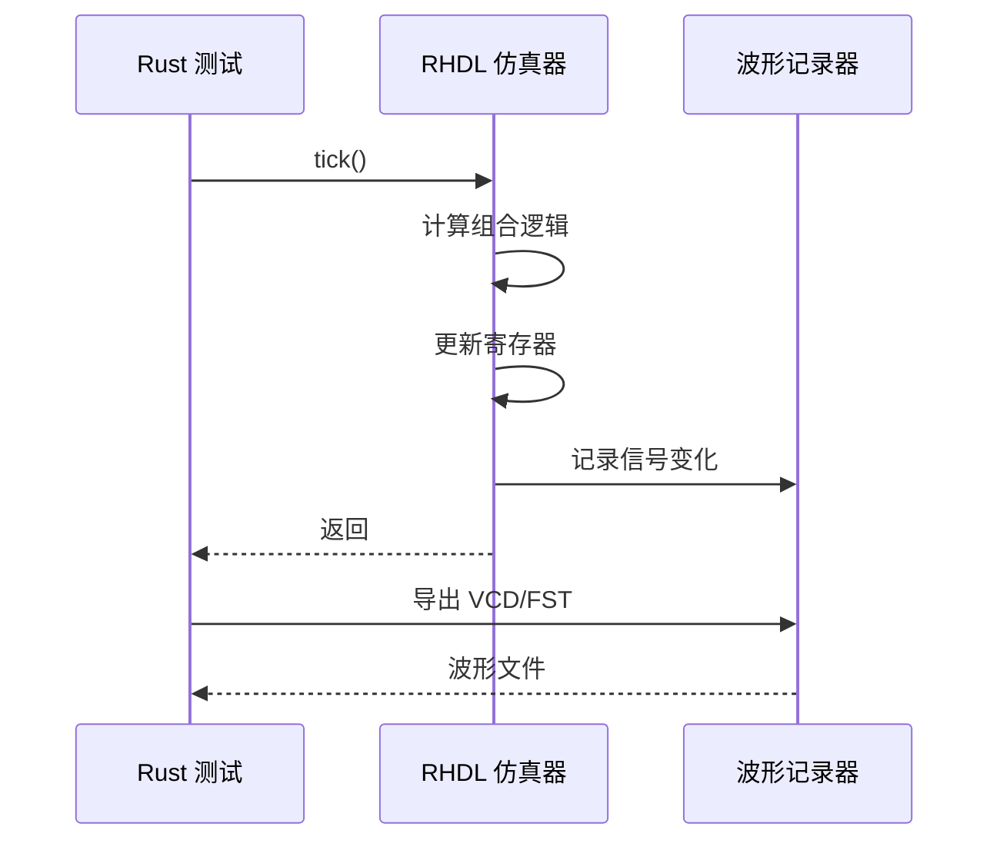

## 4.5 与 Chisel 互转架构

RHDL 以 FIRRTL 为交换格式，实现与 Chisel 的双向转换。由于可综合闭包在进入 HIR 前已被内联，FIRRTL 中不包含闭包结构，因此互转不受影响。生成器闭包属于编译期元编程，同样不会出现在硬件结构中。

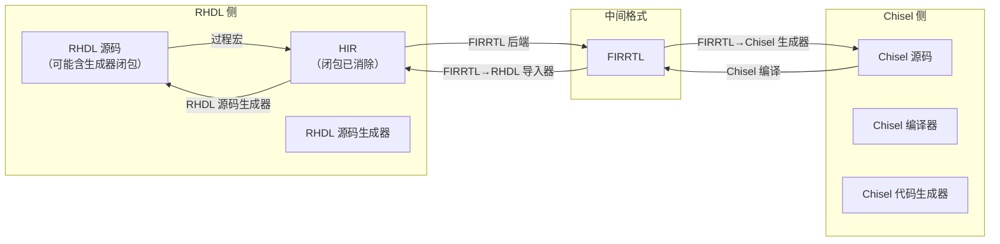

转换过程中的元数据保留：

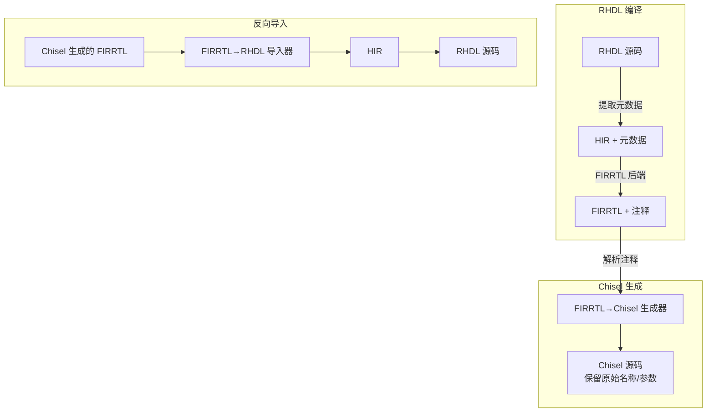

## 4.6 扩展功能集成架构

### 4.6.1 HLS 集成

HLS 前端作为独立模块，接收算法级 Rust 函数（可包含闭包作为无状态变换单元），输出 HIR，与 RTL 描述无缝混合。闭包在 HLS 前端被内联或映射为硬件单元。

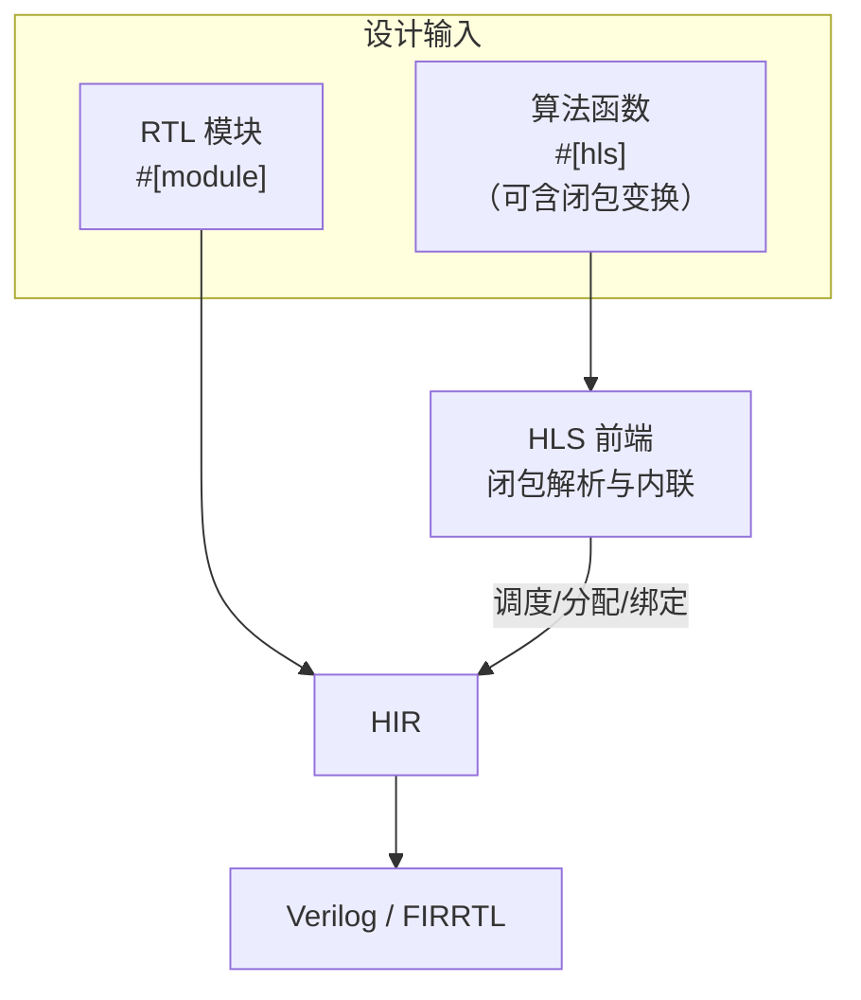

### 4.6.2 IP 库集成

IP 库以普通 Rust crates 形式发布，通过 Cargo 依赖引入，直接被用户模块例化。IP 生成器可以使用泛型闭包定制内部算法，生成参数化模块。

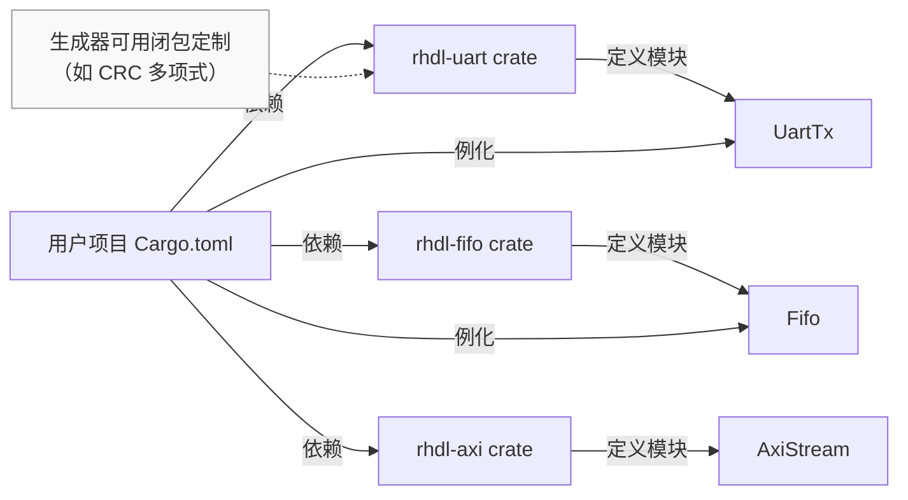

### 4.6.3 可视化集成

可视化工具从 HIR 和仿真波形中提取信息，生成图形描述。HIR 中不含闭包，可视化不受影响。

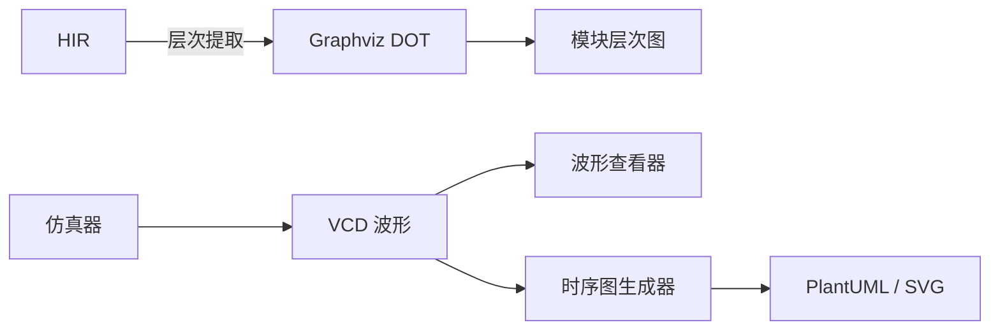

## 4.7 多视图模拟器生成架构

多视图建模允许同一模块同时提供功能视图和周期精确视图。工具链根据 feature 或命令生成对应的模拟器。桥接适配器使用泛型闭包封装事务级与信号级转换逻辑，提升复用性。

### 4.7.1 多视图模拟器生成流程

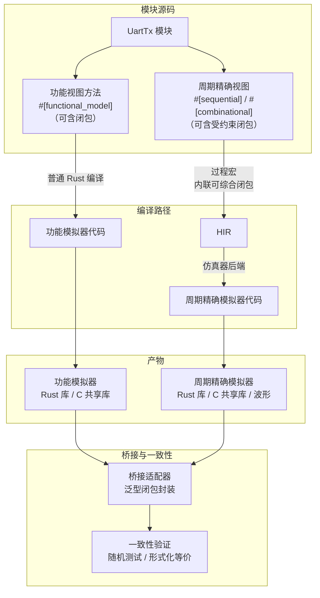

### 4.7.2 桥接适配器中的闭包

桥接适配器定义可复用的转换模板，如 `start_wait_complete`，使用闭包封装具体的启动动作。


## 4.8 典型开发工作流示例

### 4.8.1 新建项目与编写代码

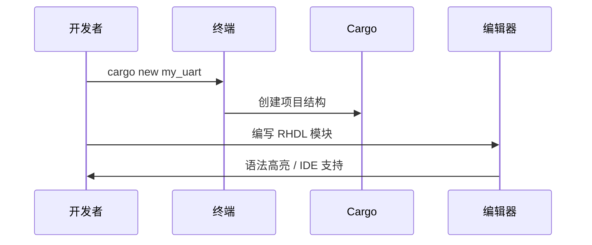

### 4.8.2 编译与测试

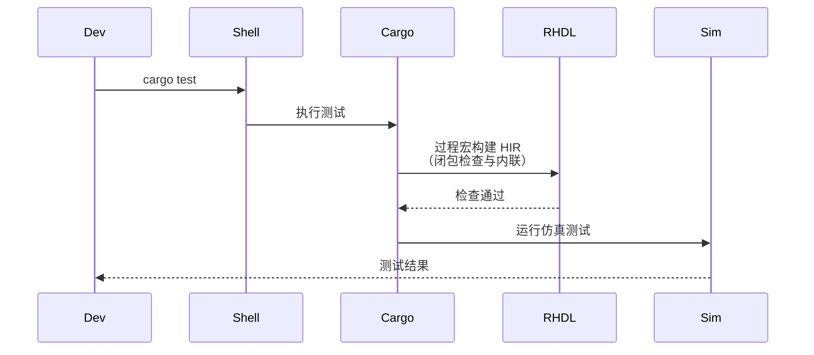

### 4.8.3 生成硬件与综合

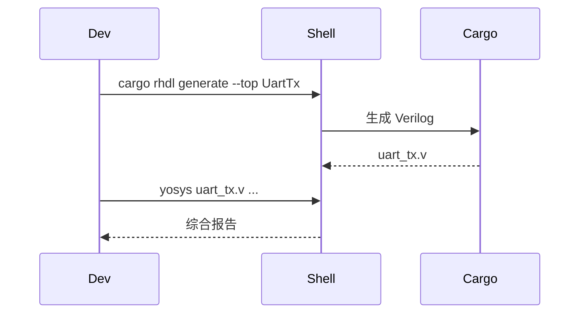

### 4.8.4 生成模拟器供软件使用

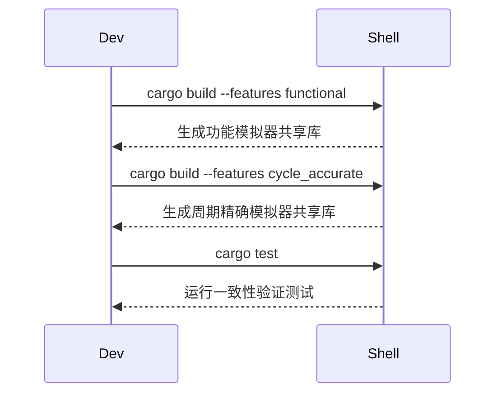

---

RHDL 的整体架构以 Rust 工具链为基石，通过 HIR 统一中间表示，实现了从设计、验证到生成、互操作的完整闭环。受控泛型闭包抽象在架构中扮演了“抽象增强器”的角色：在编译期生成、HLS、桥接适配器等非综合路径中自由使用以提高生产力，在综合路径中则被严格约束并内联，确保后端和互转的简洁性。多视图建模的引入使得架构能够同时支持功能模拟与周期精确模拟，覆盖从软件开发到硬件验证的全流程，并通过闭包化的桥接适配器降低集成难度。