# 5. 类型系统

RHDL 的类型系统是整个语言安全性和可综合性的基石。它利用 Rust 的强类型机制，将位宽、方向、时钟域等硬件属性编码到类型中，使得许多硬件设计错误在编译期就被捕获。类型系统分为四大部分：**基础硬件类型**、**方向类型**、**复合类型**和**时钟域类型**。此外，RHDL 通过**多视图建模**将功能视图中的普通 Rust 类型与硬件类型分离，保证综合路径的严格性，同时允许功能模拟器使用更灵活的软件类型。在引入受控泛型闭包后，类型系统新增了对**可综合闭包的类型约束**，确保闭包在综合路径中满足纯函数、无捕获等要求。

## 5.1 类型系统总览

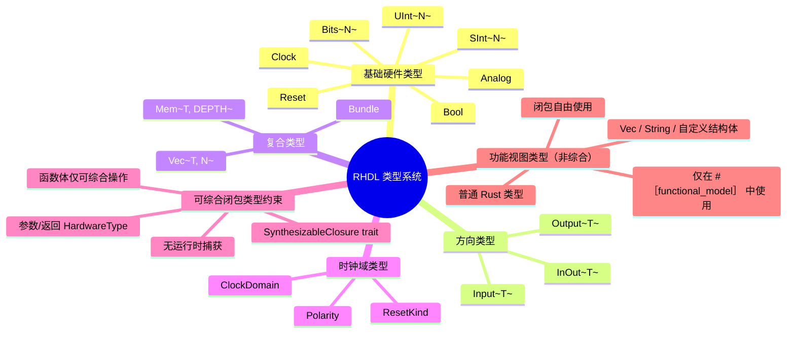

## 5.2 基础硬件类型

基础硬件类型对应硬件中的基本信号，位宽由 `const` 泛型参数 `N` 指定。

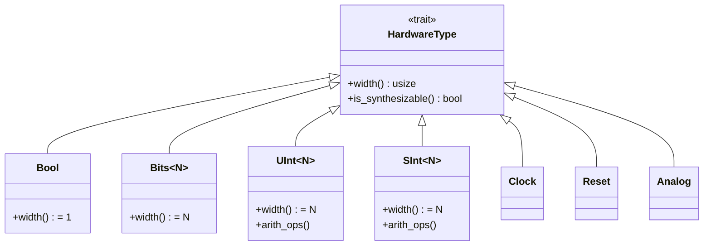

- `Bool`：单比特逻辑，等价于 `Bits<1>`，但语义上表示布尔值，支持逻辑运算 `&&`, `||`, `!`。
- `Bits<N>`：原始 N 位向量，不解释为数值，仅支持按位运算 `&`, `|`, `^`, `~` 和移位。
- `UInt<N>`：N 位无符号整数，支持算术运算 `+`, `-`, `*`, 比较运算等，也支持按位逻辑。
- `SInt<N>`：N 位有符号整数（二进制补码），支持有符号算术和比较。
- `Clock`：时钟信号，不参与数据运算，仅用于时钟域绑定。
- `Reset`：复位信号，可配置极性，通常与 `ClockDomain` 关联。
- `Analog`：模拟/三态信号，仅用于顶层 IO，不可在内部逻辑中使用。

### 5.2.1 位宽指定

位宽通过 Rust 的 `const` 泛型指定，例如 `UInt<8>` 表示 8 位无符号整数。编译器在编译期检查所有运算的位宽兼容性。

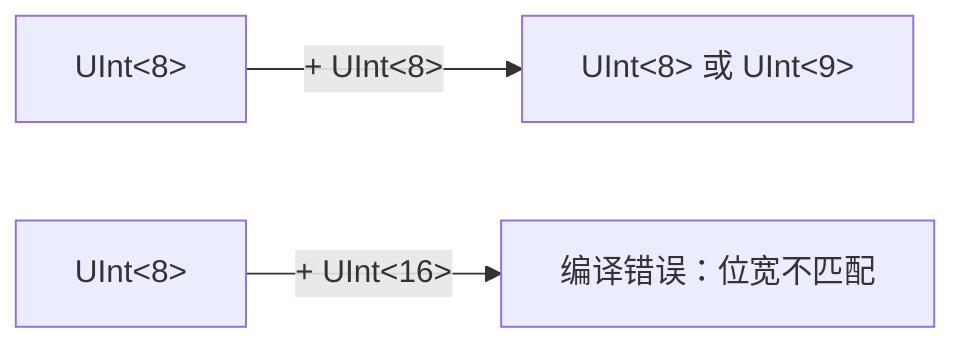

RHDL 默认采用**严格位宽规则**：算术运算结果的位宽与操作数相同，但允许显式扩展（`extend`）或截断（`truncate`）。

## 5.3 方向类型

方向类型包装基础类型，表示端口的方向。所有模块端口必须使用方向类型声明。

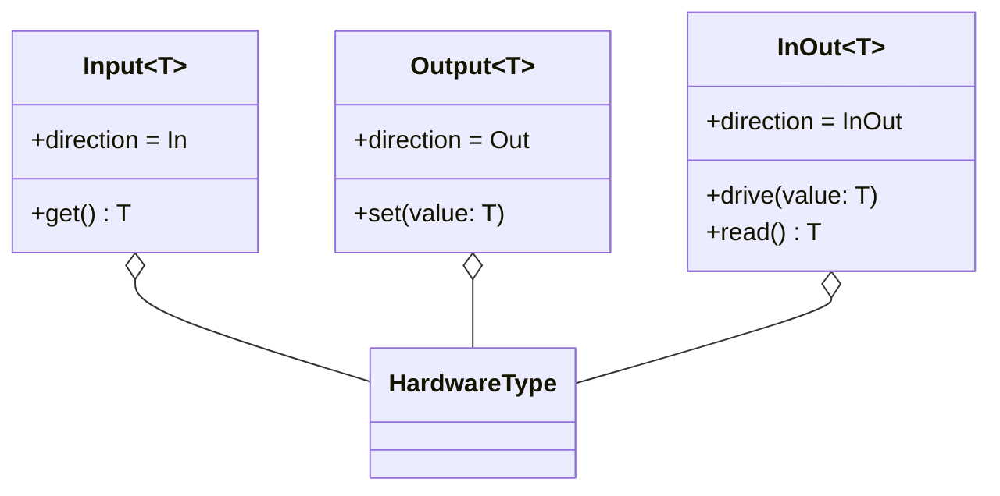

- `Input<T>`：输入端口，只能读取，使用 `.get()` 获取内部信号。
- `Output<T>`：输出端口，只能写入，使用 `.set(value)` 赋值。
- `InOut<T>`：双向端口（如三态总线），仅允许出现在顶层模块，需要显式方向控制。

方向检查是编译期行为：

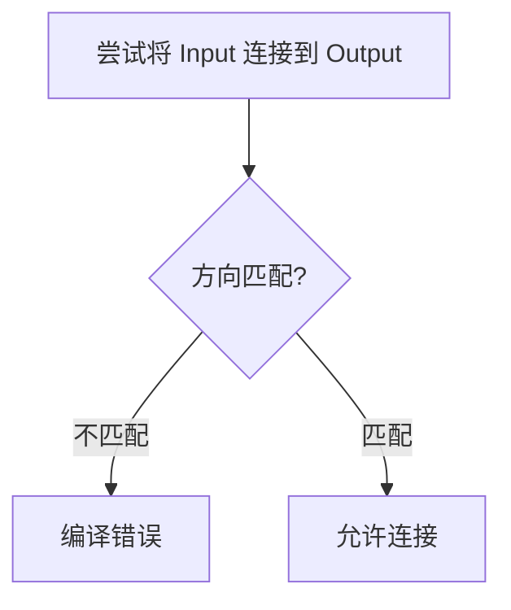

## 5.4 复合类型

复合类型用于组合多个信号，提供结构化描述能力。

### 5.4.1 Bundle（结构体）

`Bundle` 类似于 SystemVerilog 的 `struct`，通过 `#[derive(Bundle)]` 派生。字段可以是基础类型、方向类型或其他 Bundle。

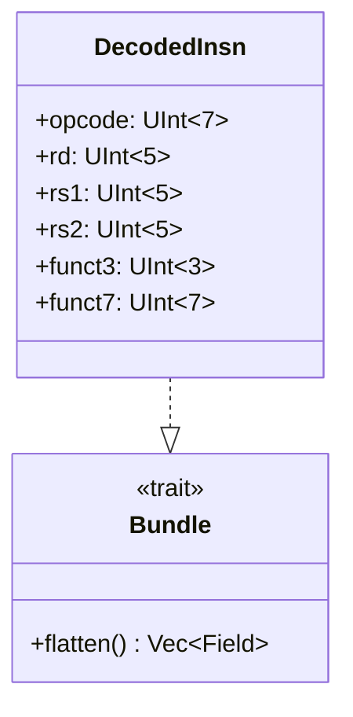

Bundle 可以整体连接，也可拆分访问字段。

### 5.4.2 Vec（数组）

`Vec<T, N>` 表示 N 个 `T` 类型的数组，映射为 Verilog 的 `wire [N-1:0]` 或多维数组。

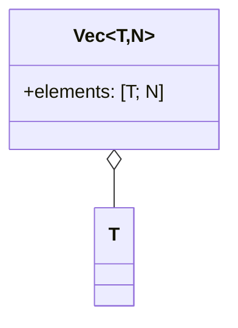

数组索引必须是编译期已知的常量，用于生成多路选择器或存储器。

### 5.4.3 Mem（存储器）

`Mem<T, DEPTH>` 描述存储器，可以是同步或异步，通常映射为 FPGA 的 Block RAM。

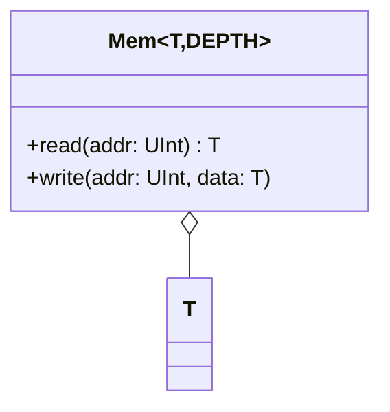

存储器操作在组合或时序逻辑中使用，综合工具会根据访问模式推断 RAM/ROM 类型。

## 5.5 时钟域类型

时钟域类型显式管理时钟、复位和时序逻辑，确保寄存器与正确的时钟和复位信号关联。

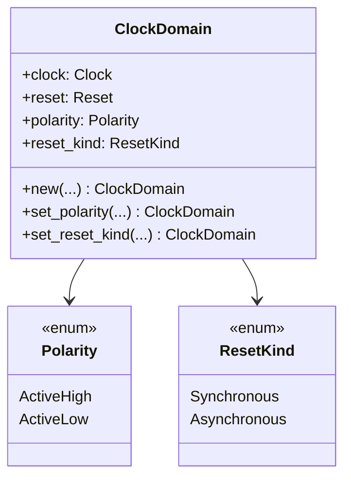

- `Polarity`：复位极性，高有效或低有效。
- `ResetKind`：复位类型，同步或异步。

寄存器通过 `ClockDomain` 绑定：

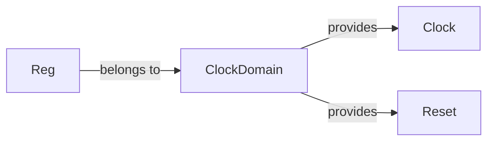

## 5.6 类型运算与位宽规则

RHDL 定义了硬件类型上的运算规则，确保位宽正确。

### 5.6.1 算术运算位宽

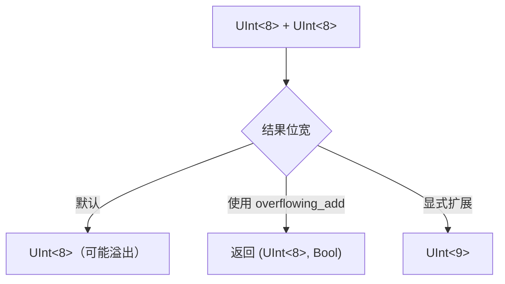

- 默认算术运算结果与操作数同宽，截断高位。
- 需要检测溢出时，使用 `overflowing_add` 等返回额外进位。
- 显式扩展通过 `extend<W>()` 或 `resize<W>()` 实现。

### 5.6.2 逻辑与移位运算

- 按位逻辑：`&`, `|`, `^` 要求操作数位宽相同。
- 移位：`<<`, `>>` 移位数可以是常量或信号，结果位宽与左操作数相同。
- 比较：`==`, `!=`, `<`, `>` 返回 `Bool`。

### 5.6.3 位宽转换

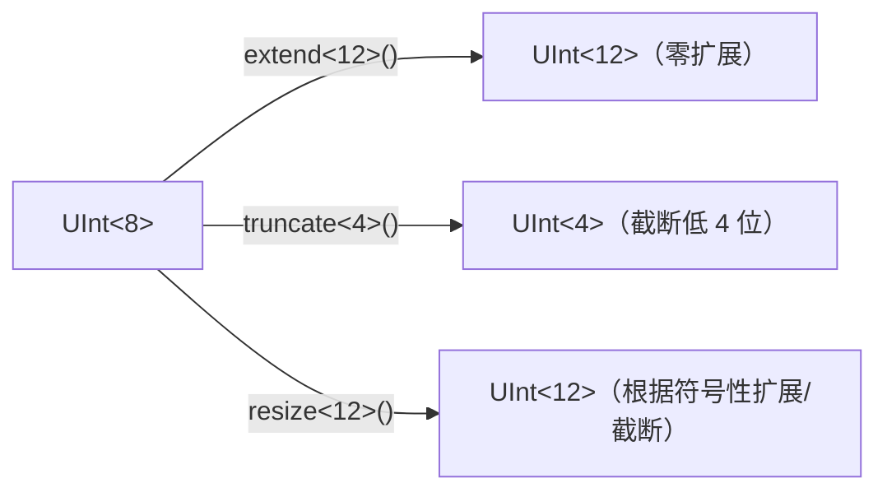

## 5.7 类型检查与错误处理

RHDL 的类型检查集成在 Rust 编译器中，许多错误在编译期报告。在加入可综合闭包后，类型检查还包括对闭包约束的验证。

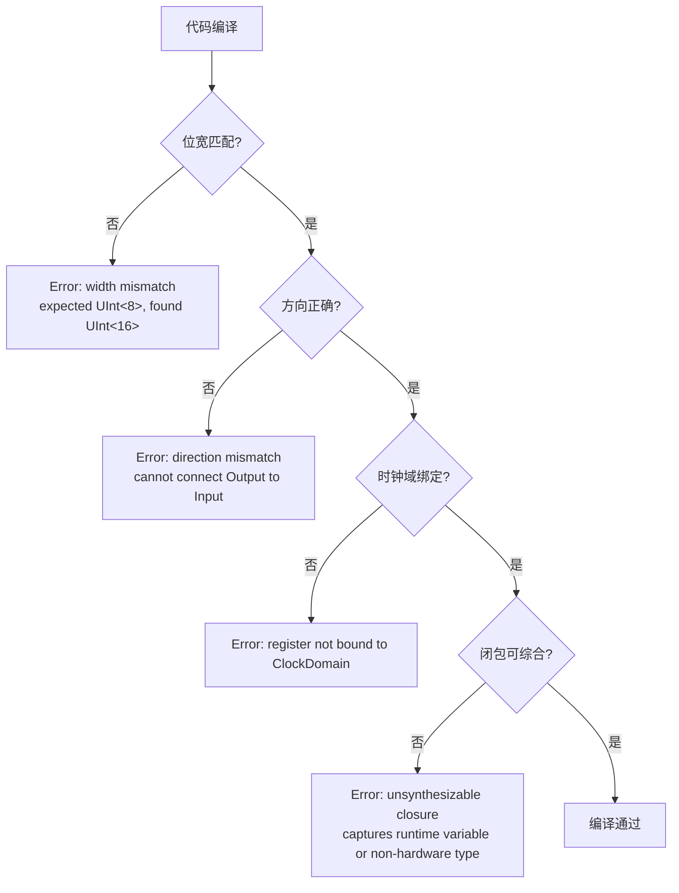

此外，组合逻辑完整性检查也会在类型检查阶段进行，防止锁存器：

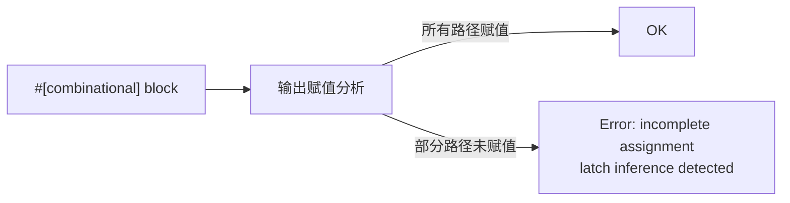

## 5.8 可综合闭包的类型约束

这是 RHDL 引入受控闭包抽象后新增的类型系统组成部分。为了在综合路径中使用闭包，RHDL 定义了 `SynthesizableClosure` trait，对可综合闭包进行约束。

### 5.8.1 SynthesizableClosure trait

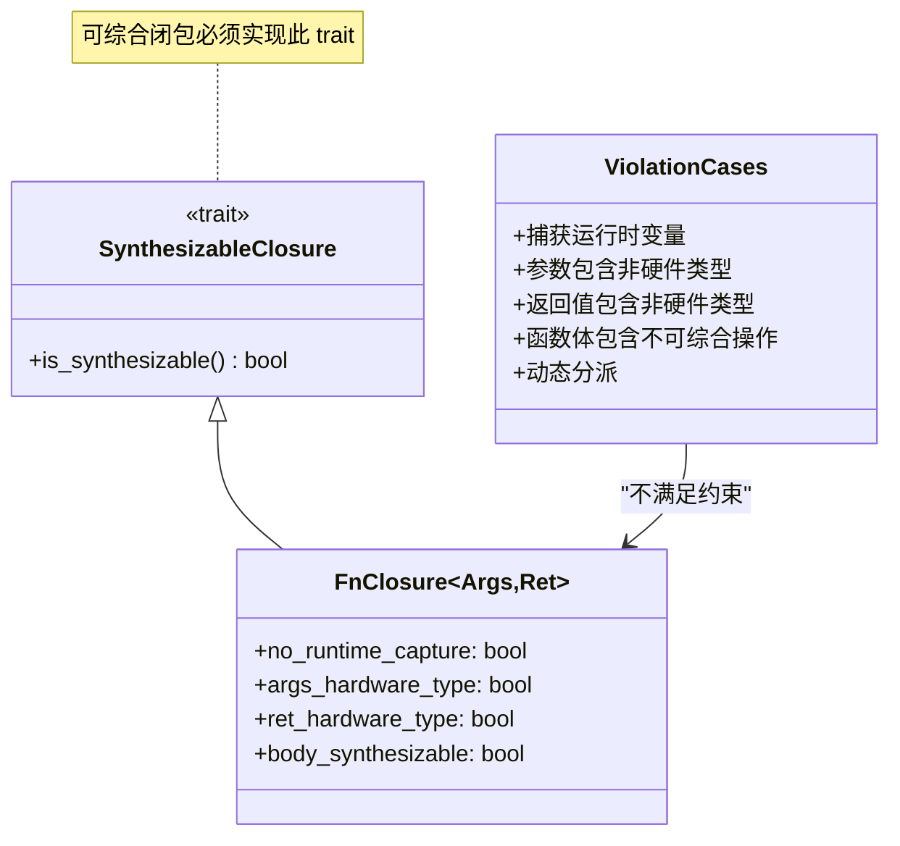

### 5.8.2 约束细则

可综合闭包必须满足以下所有条件：

1. **无运行时捕获**：闭包不能捕获任何运行时变量。可以捕获 `const` 项或编译期常量。
2. **参数和返回值类型**：所有参数和返回值类型必须实现 `HardwareType` trait。
3. **函数体可综合**：函数体内只能包含可综合操作（基础运算、位操作、静态控制流等）。
4. **可内联性**：编译器能够在编译期将闭包完全内联为硬件逻辑。

### 5.8.3 检查流程

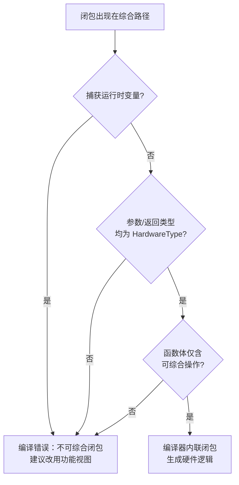

### 5.8.4 示例

合法可综合闭包：

```rust
#[combinational]
fn logic(&mut self) {
    let invert = #[synthesizable] |x: UInt<8>| -> UInt<8> { !x };
    self.out.set(invert(self.data.get()));
}
```

非法闭包（捕获运行时变量）：

```rust
#[combinational]
fn logic(&mut self) {
    let threshold = self.threshold.get(); // 运行时变量
    let compare = |x: UInt<8>| -> Bool { x > threshold }; // 捕获 threshold
    self.out.set(compare(self.data.get())); // 错误
}
```

## 5.9 类型系统与可综合性的关系

所有可综合类型必须实现 `HardwareType` trait，该 trait 定义了位宽、默认值、可综合属性等。不可综合类型（如 `Vec<T>` 动态数组）被禁止在硬件描述中使用。可综合闭包本质上是对可综合类型的纯函数，因此其类型约束与 `HardwareType` 体系紧密相连。

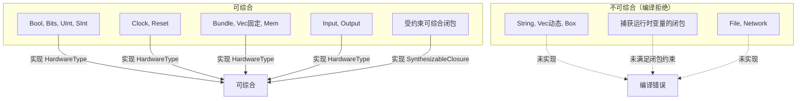

## 5.10 多视图建模中的类型分离

RHDL 的多视图建模允许功能视图使用普通 Rust 类型，不受硬件类型约束，闭包也可以自由使用。这种分离确保了综合路径的严格性，同时为功能模拟器提供了软件灵活性。

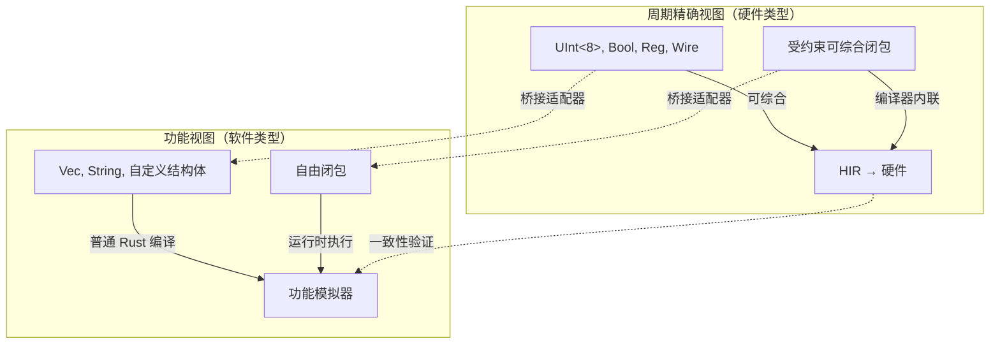

### 5.10.1 功能视图类型示例

```rust
#[module]
pub struct UartTx {
    // RTL 端口（硬件类型）
    pub clk: Clock,
    pub tx_data: Input<UInt<8>>,
    pub tx_pin: Output<Bool>,

    // 功能模型内部状态（软件类型）
    #[functional_state]
    tx_buffer: std::collections::VecDeque<u8>,
}
```

功能视图中的方法可以使用闭包：

```rust
impl UartTx {
    #[functional_model]
    pub fn process(&mut self) {
        let handle = |byte: u8| { self.tx_buffer.push_back(byte); };
        // 自由使用闭包
        handle(0x55);
    }
}
```

而周期精确视图中只能使用满足 `SynthesizableClosure` 约束的闭包，且闭包必须被内联。

---

RHDL 的类型系统是其安全性和现代性的核心体现。通过将硬件属性编码到类型中，RHDL 让编译器成为硬件设计的第一道防线，大幅减少了位宽错误、方向错误、多驱动冲突和时钟域问题。同时，新增的可综合闭包类型约束在提升抽象能力的同时，保证了综合路径的确定性。多视图建模中的类型分离设计，既保证了综合路径的严格性，又为功能模拟器提供了软件开发的灵活性，使得闭包在两种视图中各得其所。