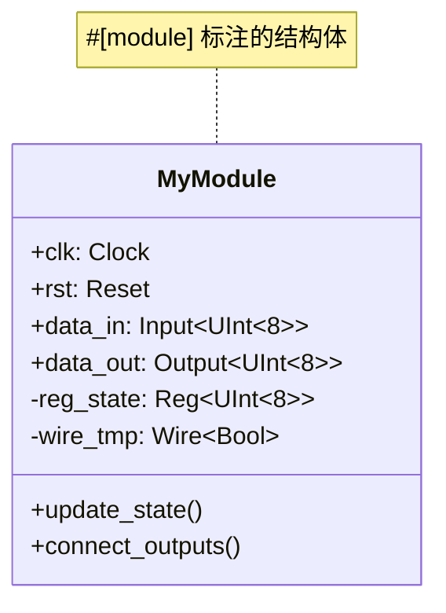
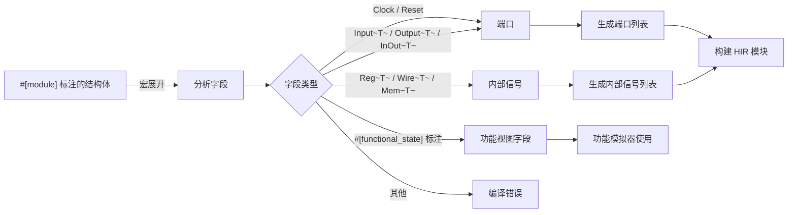
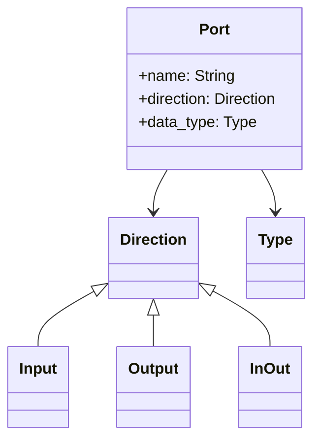
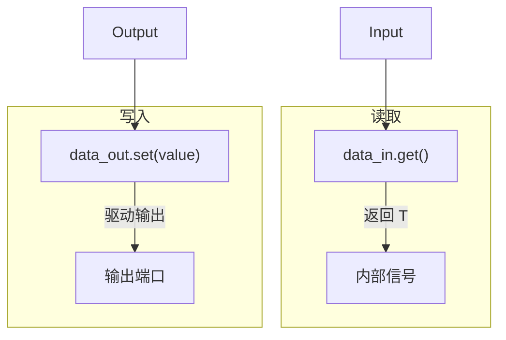
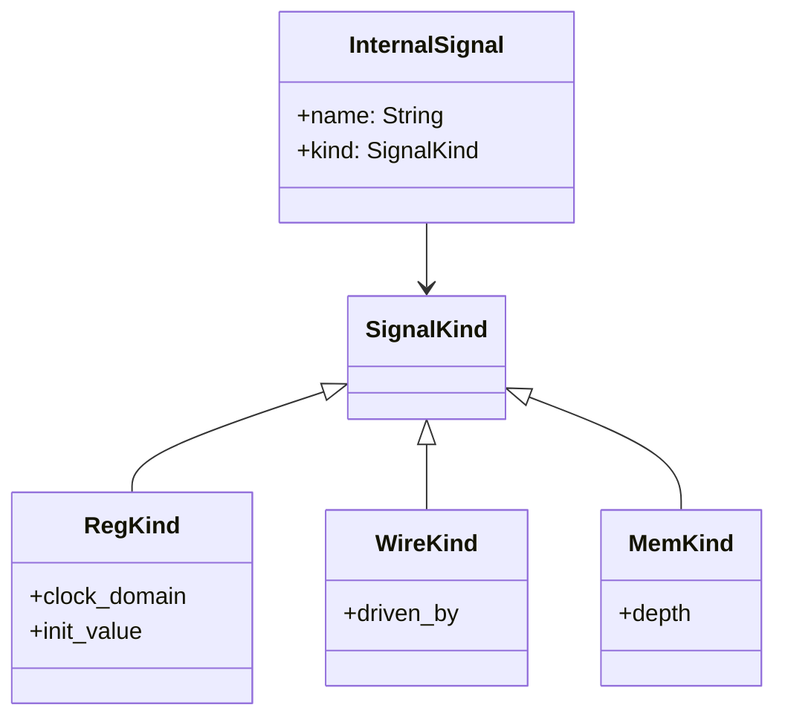
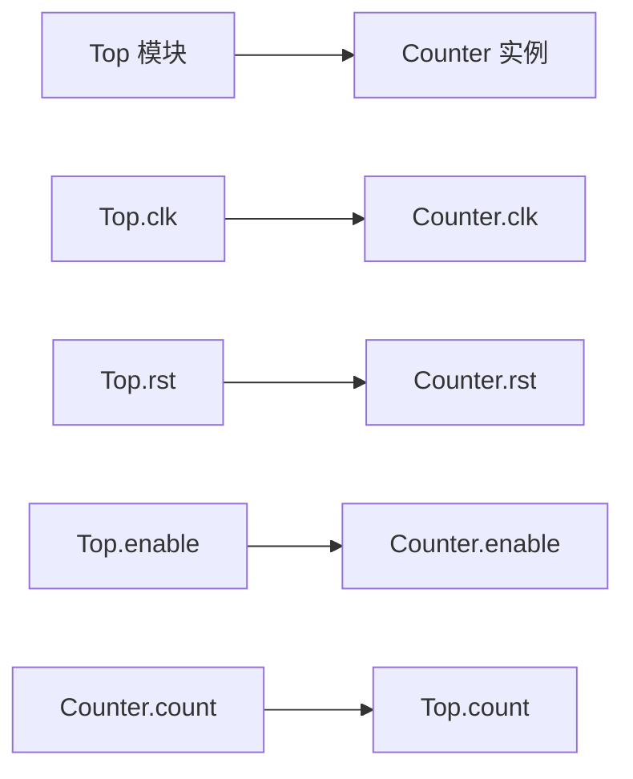
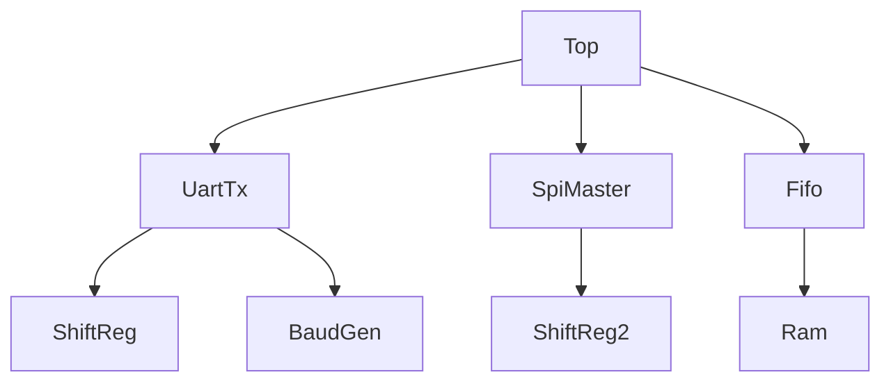
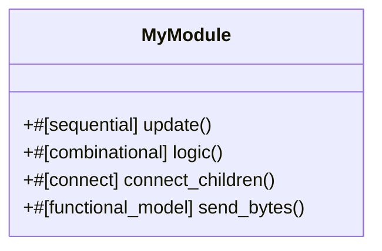
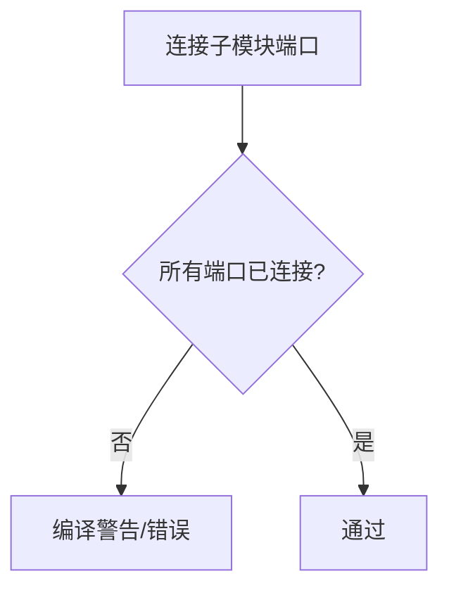
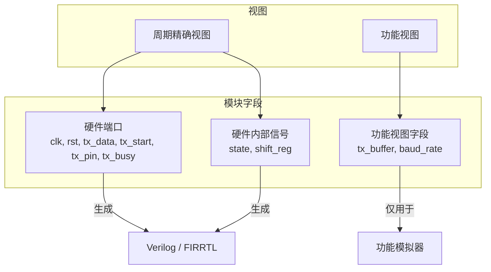

# 6. 模块与端口

# 6. 模块与端口

RHDL 中，硬件模块使用 Rust 的 `struct` 定义，并通过 `#[module]` 过程宏标注。模块的端口和内部信号都是结构体的字段，通过类型系统区分。模块行为在 `impl` 块中描述，利用 `#[combinational]` 和 `#[sequential]` 等方法标注。此外，多视图建模允许模块包含功能视图字段（软件类型）和周期精确视图字段（硬件类型），分别服务于功能模拟器和周期精确模拟器。

## 6.1 模块定义语法

### 6.1.1 基本模块结构

模块定义包括三部分：**属性宏标注**、**结构体定义**和**行为实现**。

```rust
use rhdl::prelude::*;

#[module]
pub struct MyModule {
    // 端口字段
    pub clk: Clock,
    pub rst: Reset,
    pub data_in: Input<UInt<8>>,
    pub data_out: Output<UInt<8>>,

    // 内部信号字段
    reg_state: Reg<UInt<8>>,
    wire_tmp: Wire<Bool>,
}

impl MyModule {
    // 行为方法
    #[sequential]
    fn update_state(&mut self) {
        // ...
    }

    #[combinational]
    fn connect_outputs(&self) {
        // ...
    }
}

```


### 6.1.2 `#[module]` 宏的作用

`#[module]` 过程宏负责：

*   解析结构体字段，分类为端口或内部信号。
    
*   生成 HIR 中的模块表示。
    
*   注入必要的辅助代码，如端口连接方法、默认构造等。
    
*   验证字段类型合法性（所有字段必须是硬件类型或方向类型，功能视图字段需标注 `#[functional_state]`）。
    



## 6.2 端口声明

端口是模块与外界通信的接口。所有端口必须在结构体中声明，并使用方向包装类型明确方向。

### 6.2.1 端口类型分类

| 端口类型 | 方向 | 说明 |
| --- | --- | --- |
| `Clock` | 输入（隐式） | 时钟信号 |
| `Reset` | 输入（隐式） | 复位信号 |
| `Input<T>` | 输入 | 数据输入端口 |
| `Output<T>` | 输出 | 数据输出端口 |
| `InOut<T>` | 双向 | 双向端口（仅限顶层） |



### 6.2.2 端口字段示例

```rust
#[module]
pub struct UartTx {
    pub clk: Clock,
    pub rst: Reset,
    pub tx_data: Input<UInt<8>>,   // 输入数据
    pub tx_start: Input<Bool>,     // 启动信号
    pub tx_pin: Output<Bool>,      // 串行输出
    pub tx_busy: Output<Bool>,     // 忙指示
}

```

*   `Clock` 和 `Reset` 不需要额外方向包装，它们隐式是输入。
    
*   `Input<T>` 字段只能被读取（通过 `.get()`）。
    
*   `Output<T>` 字段只能被写入（通过 `.set()`）。
    
*   方向错误会在编译期被 Rust 类型系统捕获。
    

### 6.2.3 端口方向与访问方法



*   输入端口使用 `.get()` 读取内部值。
    
*   输出端口使用 `.set(value)` 写入。
    
*   双向端口提供更复杂的读写控制（通常需要三态缓冲）。
    

## 6.3 内部信号

内部信号用于在模块内部存储状态或连接组合逻辑，不对外暴露。它们声明为结构体的私有字段，使用 `Reg<T>`、`Wire<T>`、`Mem<T, DEPTH>` 等类型。

### 6.3.1 内部信号类型

| 内部信号类型 | 说明 |
| --- | --- |
| `Reg<T>` | 寄存器，存储状态，时钟边沿更新 |
| `Wire<T>` | 组合逻辑连线，无状态 |
| `Mem<T, DEPTH>` | 存储器（RAM/ROM） |
| 裸类型（如 `UInt<8>`） | 不允许，必须使用 `Wire<T>` 显式声明组合连线 |

内部信号字段通常是 `private`（不加 `pub`），以限制外部直接访问。

```rust
#[module]
pub struct Counter {
    pub clk: Clock,
    pub rst: Reset,
    pub enable: Input<Bool>,
    pub count: Output<UInt<8>>,

    count_reg: Reg<UInt<8>>,       // 内部寄存器
    next_count: Wire<UInt<8>>,     // 内部组合连线
}

```

### 6.3.2 内部信号在 HIR 中的表示



*   `Reg<T>` 必须绑定到 `ClockDomain`。
    
*   `Wire<T>` 在组合逻辑中驱动，可以由多个表达式驱动，但 RHDL 规定单驱动（通过所有权检查）。
    
*   `Mem<T>` 通常由存储器原语支持。
    

## 6.4 层次化与实例化

RHDL 支持模块嵌套，子模块实例作为父模块的字段声明，通过 `#[connect]` 方法连接端口。

### 6.4.1 子模块实例化

```rust
#[module]
pub struct Top {
    pub clk: Clock,
    pub rst: Reset,
    pub enable: Input<Bool>,
    pub count: Output<UInt<8>>,

    counter: Counter,   // 子模块实例
}

```

子模块实例也是结构体字段，但其类型是另一个 `#[module]` 结构体。在 `#[connect]` 方法中，将子模块的端口与父模块端口或内部信号连接。

### 6.4.2 端口连接

```rust
impl Top {
    #[connect]
    fn connect_children(&mut self) {
        self.counter.clk = self.clk;
        self.counter.rst = self.rst;
        self.counter.enable = self.enable;   // Input 连接
        self.count = self.counter.count;     // Output 连接
    }
}

```

连接操作是类型安全的，方向不匹配会在编译期报错。`#[connect]` 宏确保所有端口都被连接，未连接输出会报错（除非显式标记为悬空）。



### 6.4.3 层次结构可视化



## 6.5 模块行为概述

模块行为通过 `impl` 块中的方法描述，具体分为：

*   `**#[sequential]**` **方法**：描述时序逻辑，在时钟边沿触发，更新寄存器。
    
*   `**#[combinational]**` **方法**：描述组合逻辑，持续驱动输出和内部连线。
    
*   `**#[connect]**` **方法**：用于连接子模块端口。
    
*   `**#[functional_model]**` **方法**：描述功能视图的事务级行为，用于功能模拟器。
    



## 6.6 端口连接规则与检查

### 6.6.1 方向匹配

*   `Input<T>` 只能连接到 `Input<T>` 或内部信号。
    
*   `Output<T>` 只能连接到 `Output<T>` 或内部信号。
    
*   不能将 `Output` 连接到 `Input`（方向相反）。
    
*   `Clock` 和 `Reset` 可以连接到子模块的对应端口。
    

### 6.6.2 位宽匹配

连接的端口位宽必须一致，否则编译错误。

### 6.6.3 未连接检查

`#[connect]` 宏会检查所有子模块端口是否已连接。未连接的输入端口需显式绑定默认值或标记为悬空。



## 6.7 多视图建模下的模块字段

在多视图建模中，模块可以同时包含硬件字段（端口和内部信号）和软件字段（功能视图状态）。软件字段使用 `#[functional_state]` 标注，仅用于功能模拟器，不进入 HIR。

```rust
#[module]
#[abstraction(functional, cycle_accurate)]
pub struct UartTx {
    // RTL 端口（周期精确视图）
    pub clk: Clock,
    pub rst: Reset,
    pub tx_data: Input<UInt<8>>,
    pub tx_start: Input<Bool>,
    pub tx_pin: Output<Bool>,
    pub tx_busy: Output<Bool>,

    // RTL 内部寄存器
    state: Reg<UartState>,
    shift_reg: Reg<UInt<10>>,

    // 功能视图状态（仅功能模拟器使用）
    #[functional_state]
    tx_buffer: std::collections::VecDeque<u8>,
    #[functional_state]
    baud_rate: u32,
}

```

*   功能视图字段不会出现在生成的 Verilog/FIRRTL 中。
    
*   功能模型方法（`#[functional_model]`）可以读写这些字段。
    
*   周期精确视图方法（`#[sequential]`/`#[combinational]`）不能访问这些字段，编译器会检查。
    



这种分离保证了综合路径的纯净性，同时为功能模拟器提供了灵活的软件数据结构。

---

RHDL 的模块与端口设计充分利用了 Rust 的结构体和类型系统，使硬件模块声明清晰、类型安全，并且天然支持层次化。端口方向由类型包装强制，内部信号与端口分离，避免了传统 HDL 中常见的信号混淆问题。多视图建模的引入进一步增强了模块的表达能力，使同一模块能够同时服务功能模拟和周期精确模拟，为后续的模拟器生成奠定了坚实基础。