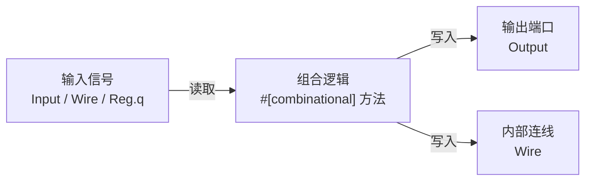
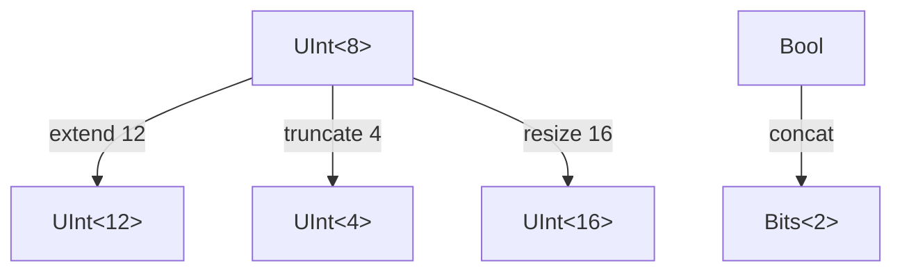
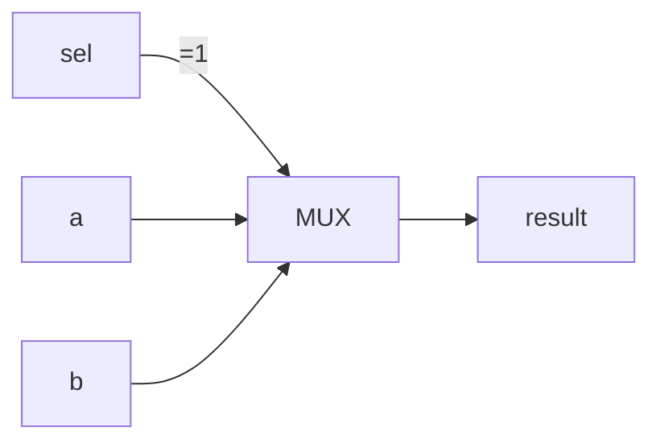
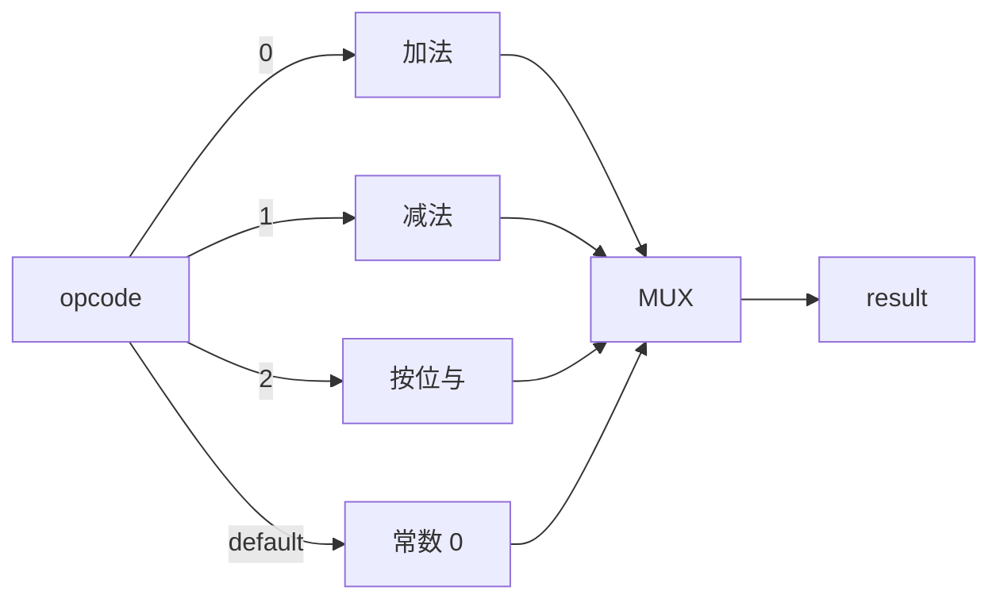
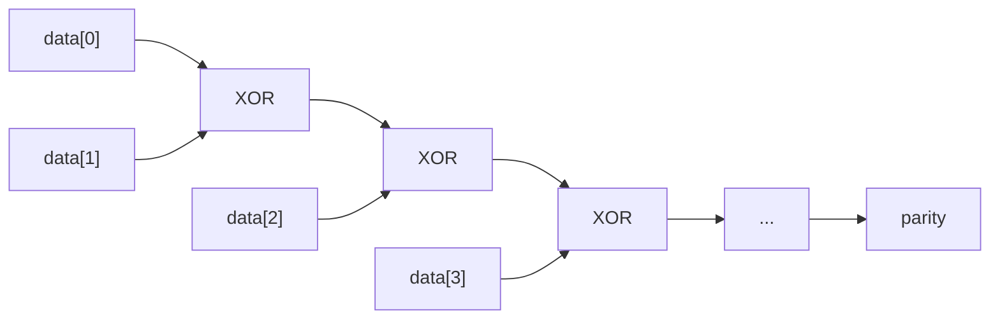
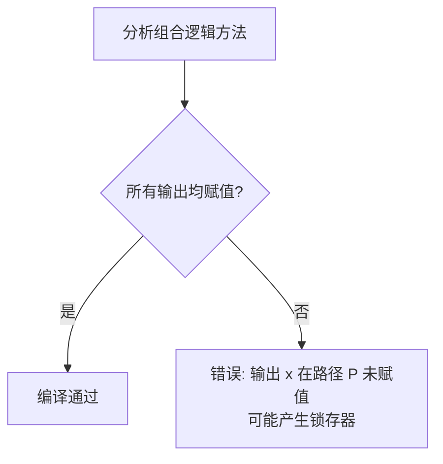
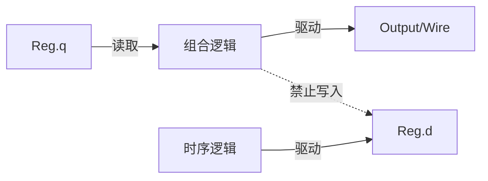
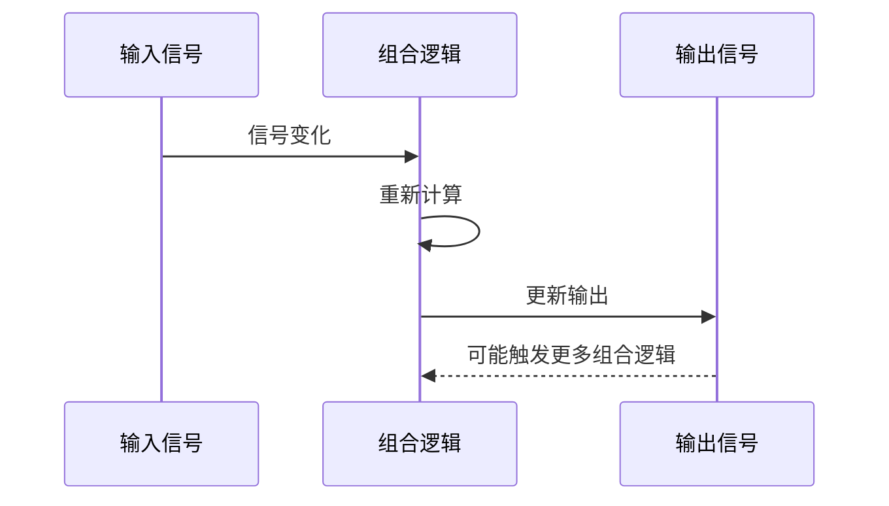
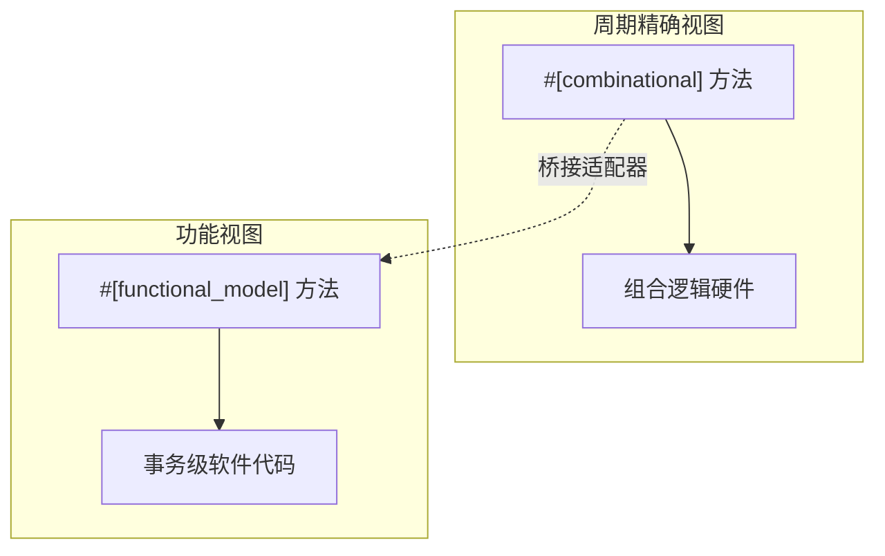

# 7. 组合逻辑

# 7. 组合逻辑

组合逻辑是数字电路的基础，其输出仅取决于当前输入，不包含任何存储元件。在 RHDL 中，组合逻辑通过 `#[combinational]` 方法显式声明，方法内部使用 Rust 表达式描述逻辑功能。RHDL 编译器会检查组合逻辑的完整性，确保所有输出路径都被赋值，从而避免隐式锁存器的产生。组合逻辑仅存在于周期精确视图中，功能视图使用普通 Rust 代码描述事务级行为，无需组合逻辑概念。

## 7.1 组合逻辑的定义

在 RHDL 中，组合逻辑定义在 `impl` 块内，使用 `#[combinational]` 属性标注。该方法通常接受 `&mut self`（以允许写入输出端口和内部连线），内部读取输入信号、寄存器输出和其他连线，计算并驱动输出。

示例：

```rust
impl MyModule {
    #[combinational]
    fn logic(&mut self) {
        // 读取输入
        let a = self.data_in.get();
        // 计算输出
        let sum = a + self.offset;
        // 写入输出
        self.data_out.set(sum);
    }
}

```

该方法的语义是：**每当任何输入或内部信号变化时，方法体重新执行，输出立即更新**。这对应硬件中的组合逻辑云。

## 7.2 组合逻辑模型

组合逻辑可以建模为一个纯函数：**输出 = f(输入, 内部连线)**。在 RHDL 中，所有写入 `Output<T>` 或 `Wire<T>` 的操作都构成了组合逻辑的驱动。



注意：

*   组合逻辑可以读取寄存器输出（`Reg.q`），但不能写入寄存器（`Reg.d`）——寄存器写入只能在 `#[sequential]` 块中。
    
*   组合逻辑可以写入输出端口和内部连线，但不能写入输入端口。
    

## 7.3 运算符映射

RHDL 将 Rust 运算符直接映射为硬件运算符，使得代码直观且可综合。

### 7.3.1 算术运算

| Rust 运算符 | 硬件含义 | 示例 |
| --- | --- | --- |
| `+` | 加法 | `a + b` |
| `-` | 减法 | `a - b` |
| `*` | 乘法（可能较大面积） | `a * b` |
| `/` | 除法（通常需要 IP 核） | `a / b` |
| `%` | 取模 | `a % b` |

默认算术运算与操作数位宽相同，溢出截断。如需检测溢出，使用 `overflowing_add` 等方法。

### 7.3.2 按位逻辑运算

| Rust 运算符 | 硬件含义 |
| --- | --- |
| `&` | 按位与 |
| `\|` | 按位或 |
| `^` | 按位异或 |
| `!` | 按位取反（注意：Rust 中 `!` 是逻辑非，但在 RHDL 中对硬件类型重载为按位取反） |
| `~` | 按位取反（备用） |

### 7.3.3 逻辑运算

逻辑运算作用于 `Bool` 类型，返回 `Bool`。

| Rust 运算符 | 硬件含义 |
| --- | --- |
| `&&` | 逻辑与 |
| `\|\|` | 逻辑或 |
| `!` | 逻辑非 |

### 7.3.4 移位运算

| Rust 运算符 | 硬件含义 |
| --- | --- |
| `<<` | 左移（补零） |
| `>>` | 右移（逻辑右移，对于 `UInt`；算术右移对于 `SInt`） |

移位数可以是常量或信号，但位宽推断需注意。

### 7.3.5 比较运算

| Rust 运算符 | 硬件含义 |
| --- | --- |
| `==` | 相等 |
| `!=` | 不等 |
| `<` | 小于 |
| `<=` | 小于等于 |
| `>` | 大于 |
| `>=` | 大于等于 |

比较运算返回 `Bool`。

### 7.3.6 位宽操作

RHDL 提供显式位宽转换函数：

*   `extend<W>()`：零扩展或符号扩展至 W 位。
    
*   `truncate<W>()`：截断至 W 位。
    
*   `resize<W>()`：根据符号性调整位宽。
    
*   `bit(index)`：提取单个位。
    
*   `slice(high, low)`：提取位段。
    
*   `concat(a, b)`：位拼接。
    



## 7.4 控制流映射

RHDL 将 Rust 的 `if` 表达式和 `match` 表达式映射为硬件多路选择器。

### 7.4.1 `if` 表达式

Rust 的 `if` 在 RHDL 中作为**优先级多路选择器**实现：每个分支对应一个条件，按顺序检查，第一个为真的分支被选中。

```rust
#[combinational]
fn logic(&mut self) {
    let out = if self.sel.get() {
        self.a.get()
    } else {
        self.b.get()
    };
    self.result.set(out);
}

```

对应硬件：



嵌套的 `if` 会形成优先级链，可能产生长组合路径，但综合工具可以优化为并行 case 如果条件互斥。

### 7.4.2 `match` 表达式

`match` 用于多路选择，可映射为**并行多路选择器**或**译码器**。RHDL 鼓励使用 `match` 来表示互斥条件，以获得更好的综合结果。

```rust
#[combinational]
fn logic(&mut self) {
    let out = match self.opcode.get() {
        0 => self.a.get() + self.b.get(),
        1 => self.a.get() - self.b.get(),
        2 => self.a.get() & self.b.get(),
        _ => 0,
    };
    self.result.set(out);
}

```

对应硬件：



### 7.4.3 循环

RHDL 支持在组合逻辑中使用循环，但循环必须是**静态可展开的**（即循环次数在编译期确定，如 `for i in 0..N`），或者使用 `loop` 但需要显式 `break`。动态循环（次数依赖运行时信号）不允许。

```rust
#[combinational]
fn parity(&mut self) {
    let mut p = false;
    for i in 0..8 {
        p = p ^ self.data.get().bit(i);
    }
    self.parity_out.set(p);
}

```

上述循环在编译期展开为 8 个 XOR 门。



## 7.5 完整赋值检查（避免锁存器）

RHDL 的关键安全特性之一是：`#[combinational]` 方法必须**对所有输出路径赋值**。如果某个条件分支未给输出赋值，编译器将报错，因为硬件上会推断出锁存器（电平敏感存储），这通常不是设计者的意图。

### 7.5.1 检查算法

编译器分析 `#[combinational]` 方法体，追踪每个输出信号（`Output<T>` 和 `Wire<T>`）在所有可能的控制流路径上是否被赋值。如果存在某条路径未赋值，则报告错误。



### 7.5.2 示例

错误示例（产生锁存器）：

```rust
#[combinational]
fn bad_logic(&mut self) {
    if self.enable.get() {
        self.out.set(self.a.get());
    }
    // 当 enable 为 false 时，out 未赋值 -> 锁存器
}

```

修正方式：为 `else` 分支提供默认值。

```rust
#[combinational]
fn good_logic(&mut self) {
    if self.enable.get() {
        self.out.set(self.a.get());
    } else {
        self.out.set(self.b.get());
    }
}

```

### 7.5.3 默认赋值模式

RHDL 也支持在方法开头为输出提供默认值，然后覆盖，但要求所有条件路径最终有明确赋值。例如：

```rust
#[combinational]
fn logic(&mut self) {
    // 默认值
    self.out.set(0);
    if self.enable.get() {
        self.out.set(self.a.get());
    }
    // 这样即使 enable=false，out 也有值
}

```

编译器会识别这种模式，等效于 `else` 分支赋值默认值。

## 7.6 内部连线（Wire）

`Wire<T>` 用于在组合逻辑内部连接信号，可以理解为 Verilog 中的 `wire`。在 RHDL 中，`Wire<T>` 字段可以在组合逻辑中赋值，并在其他组合逻辑或输出连接中读取。但必须遵循单驱动原则（所有权模型）。

```rust
#[module]
pub struct Adder {
    pub a: Input<UInt<8>>,
    pub b: Input<UInt<8>>,
    pub sum: Output<UInt<8>>,

    sum_wire: Wire<UInt<8>>,   // 内部连线
}

impl Adder {
    #[combinational]
    fn compute(&mut self) {
        self.sum_wire.set(self.a.get() + self.b.get());
    }

    #[combinational]
    fn drive_output(&mut self) {
        self.sum.set(self.sum_wire.get());
    }
}

```

这里 `sum_wire` 被驱动一次，然后被读取。如果多个组合逻辑块尝试写入同一个 `Wire`，所有权检查会在编译期报错。

## 7.7 组合逻辑与寄存器的交互

组合逻辑可以读取寄存器的输出（`Reg.q`），但不能写入寄存器（`Reg.d`）。寄存器的更新必须在 `#[sequential]` 块中进行。这保证了时序逻辑与组合逻辑的分离。



示例：

```rust
#[sequential]
fn update(&mut self) {
    self.reg.d = self.next_val.get();   // 写入 Reg.d
}

#[combinational]
fn compute_next(&mut self) {
    self.next_val.set(self.reg.q + 1);   // 读取 Reg.q
}

```

## 7.8 组合逻辑的仿真行为

在仿真中，`#[combinational]` 方法会在输入变化时重新计算。RHDL 仿真器采用事件驱动或数据流驱动方式，确保组合逻辑输出及时更新。



仿真器会迭代求解组合逻辑直到稳定（避免组合环检测）。

## 7.9 多视图建模中的组合逻辑位置

在多视图建模中，组合逻辑仅存在于**周期精确视图**。功能视图使用普通 Rust 代码（事务级）描述行为，不涉及 `#[combinational]` 方法。这种分离保证了综合路径的清晰性，同时允许功能模拟器使用更高级的抽象。



桥接适配器可以将事务级操作转换为信号级时序（调用多个 `tick` 和组合逻辑），但组合逻辑本身只出现在周期精确视图中。

## 7.10 组合逻辑最佳实践

*   使用 `match` 代替嵌套 `if` 以获得并行结构。
    
*   为所有输出提供默认赋值，避免锁存器。
    
*   将复杂组合逻辑拆分为多个 `#[combinational]` 方法，通过 `Wire` 连接。
    
*   避免在组合逻辑中使用循环，除非能完全展开且逻辑简单。
    
*   显式处理位宽，使用 `extend`/`truncate` 而不是隐式截断。
    

---

RHDL 的组合理辑设计充分利用了 Rust 的表达能力和编译期检查，使得开发者能够编写清晰、安全且可综合的组合逻辑描述。显式的赋值完整性检查和运算符映射，从源头避免了传统 HDL 中常见的锁存器问题和位宽错误。同时，多视图建模将组合逻辑严格限定在周期精确视图内，保障了功能模拟器的简洁性。