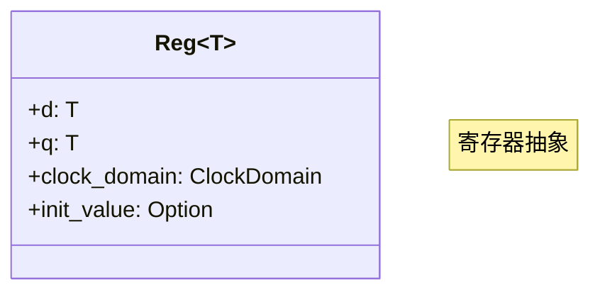
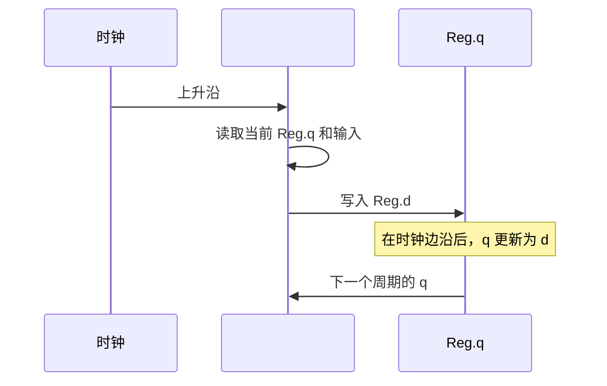
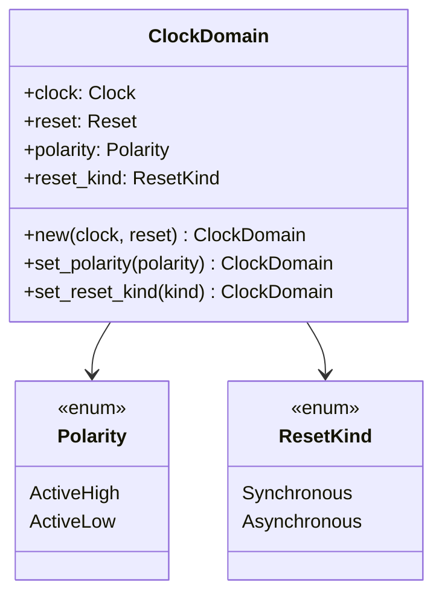
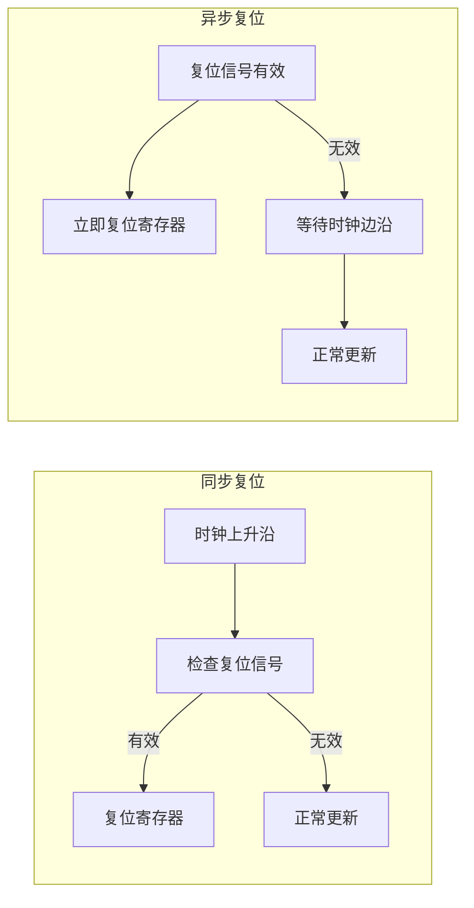
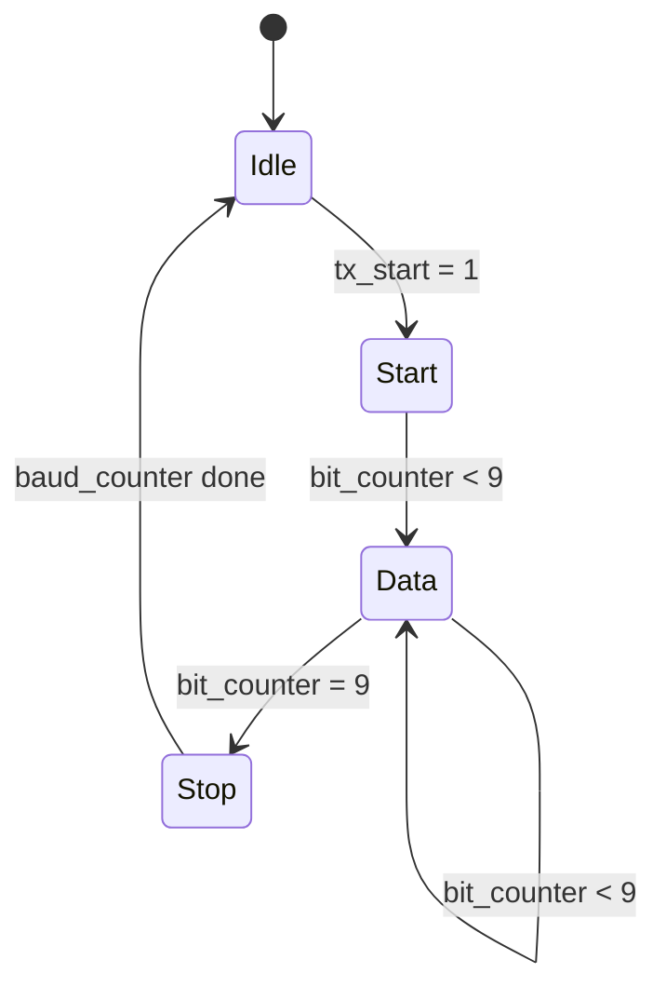
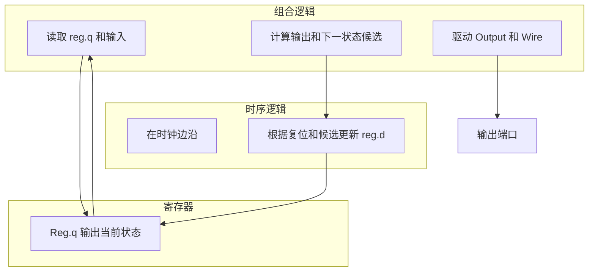
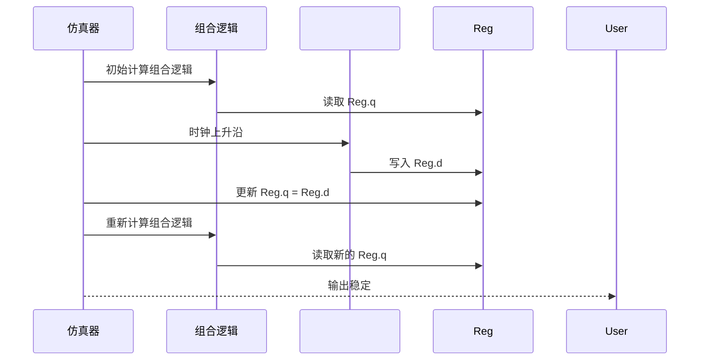
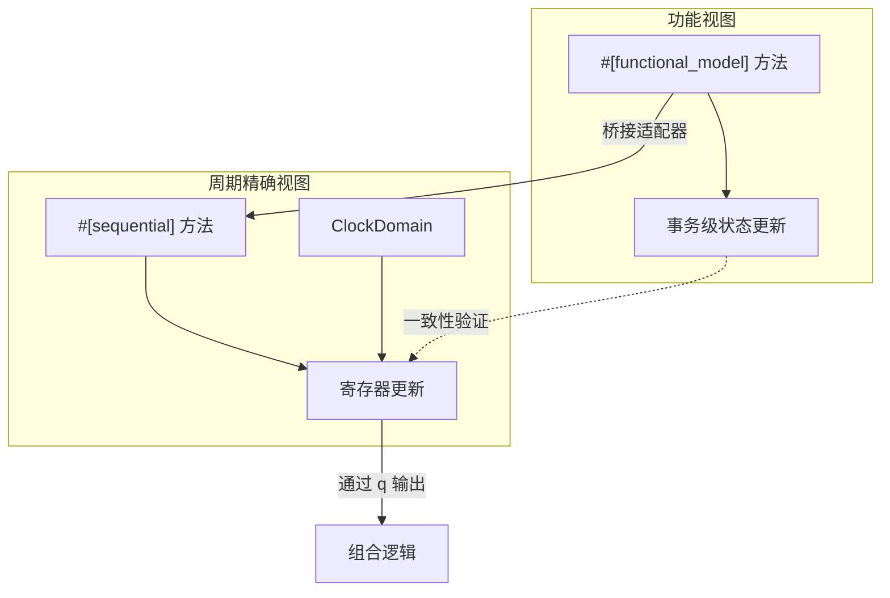

# 8. 时序逻辑

# 8. 时序逻辑

时序逻辑是数字系统中存储状态的核心，其输出不仅取决于当前输入，还取决于电路的历史状态。在 RHDL 中，时序逻辑通过 `#[sequential]` 方法显式描述，并结合 `Reg<T>` 寄存器抽象、`ClockDomain` 时钟域绑定以及 Rust 枚举状态机，实现了清晰、安全且可综合的时序行为描述。时序逻辑仅存在于周期精确视图中，功能视图使用普通 Rust 代码描述事务级行为，不涉及时钟概念。

## 8.1 时序逻辑的定义与作用

时序逻辑在时钟边沿（上升沿或下降沿）触发，更新寄存器状态。在 RHDL 中，所有对寄存器的写入（`reg.d = ...`）必须在 `#[sequential]` 方法中进行，否则编译器会报错。这确保了时序行为与组合行为严格分离。


## 8.2 寄存器抽象：`Reg<T>`

`Reg<T>` 是 RHDL 中寄存器的抽象，包含两个信号端：

*   `**d**`**（data input）**：寄存器的输入，在时钟边沿被采样并传输到 `q`。
    
*   `**q**`**（data output）**：寄存器的输出，反映当前存储的值。
    

```rust
pub struct Reg<T> {
    pub d: T,   // 输入（仅可在 #[sequential] 中赋值）
    pub q: T,   // 输出（可在组合逻辑中读取）
}

```


*   **写入规则**：`d` 只能在 `#[sequential]` 方法中赋值，并且每个寄存器在同一时钟周期内只能被驱动一次（所有权保证）。
    
*   **读取规则**：`q` 可在任意组合逻辑或输出连接中读取，表示当前状态。
    
*   **初始化**：寄存器可以定义复位值（通过 `ClockDomain` 或字段初始化）。
    

## 8.3 `#[sequential]` 方法

`#[sequential]` 标注的方法描述在时钟边沿执行的操作，通常用于计算寄存器的下一状态并赋值给 `reg.d`。方法签名通常为 `&mut self`，因为需要修改寄存器的 `d` 字段。

示例：一个简单的计数器

```rust
#[module]
pub struct Counter {
    pub clk: Clock,
    pub rst: Reset,
    pub enable: Input<Bool>,
    pub count: Output<UInt<8>>,

    count_reg: Reg<UInt<8>>,
}

impl Counter {
    #[sequential]
    fn update(&mut self) {
        if self.rst.is_asserted() {
            self.count_reg.d = 0;          // 复位
        } else if self.enable.get() {
            self.count_reg.d = self.count_reg.q + 1;  // 计数
        } else {
            self.count_reg.d = self.count_reg.q;      // 保持
        }
    }

    #[combinational]
    fn connect_output(&mut self) {
        self.count.set(self.count_reg.q);
    }
}

```

在这个例子中，`update` 方法在时钟上升沿执行，根据复位和使能信号决定寄存器的新值。注意：`d` 赋值必须在每个可能的路径上都有定义，否则可能产生不期望的行为（但 RHDL 不要求像组合逻辑那样的完整性检查，因为未赋值意味着保持原值，这等效于默认的保持行为；不过最佳实践是显式赋值）。

### 8.3.1 时序逻辑执行模型



## 8.4 时钟域与复位

每个寄存器必须绑定到一个 `ClockDomain`，该对象定义了时钟信号、复位信号、复位极性以及复位方式（同步/异步）。

### 8.4.1 `ClockDomain` 配置

```rust
let cd = ClockDomain::new(clk, rst)
    .set_reset_polarity(Polarity::ActiveHigh)
    .set_reset_kind(ResetKind::Synchronous);  // 或 Asynchronous

```


### 8.4.2 同步复位与异步复位

*   **同步复位**：复位信号仅在时钟边沿被采样，复位行为与时钟同步。对应 Verilog 中的 `always @(posedge clk)` 内判断 `if (rst)`。
    
*   **异步复位**：复位信号异步生效，不依赖时钟边沿。对应 Verilog 中的 `always @(posedge clk or posedge rst)`。
    

RHDL 允许开发者为每个时钟域选择复位类型，并在生成 Verilog 时正确映射。



## 8.5 状态机描述

RHDL 使用 Rust 枚举表示有限状态机（FSM）的状态，`match` 表达式描述状态转移和输出逻辑。状态编码可以由综合工具自动选择（二进制、独热码等），也可通过属性指定。

### 8.5.1 状态定义

```rust
#[derive(Clone, Copy, PartialEq, Eq)]
pub enum UartState {
    Idle,
    Start,
    Data,
    Stop,
}

```

状态枚举通常派生 `PartialEq` 和 `Copy`，以便在组合逻辑中比较和复制。

### 8.5.2 状态寄存器

状态寄存器类型为 `Reg<UartState>`，在 `#[sequential]` 块中更新。

```rust
#[module]
pub struct UartTx {
    pub clk: Clock,
    pub rst: Reset,
    pub tx_start: Input<Bool>,
    pub tx_data: Input<UInt<8>>,
    pub tx_pin: Output<Bool>,
    pub tx_busy: Output<Bool>,

    state: Reg<UartState>,
    shift_reg: Reg<UInt<10>>,
    bit_counter: Reg<UInt<4>>,
    baud_counter: Reg<UInt<16>>,
}

impl UartTx {
    #[sequential]
    fn state_machine(&mut self) {
        match self.state.q {
            UartState::Idle => {
                if self.tx_start.get() {
                    self.shift_reg.d = { 0, self.tx_data.get(), 1 }; // start=0, stop=1
                    self.bit_counter.d = 0;
                    self.state.d = UartState::Start;
                }
            }
            UartState::Start | UartState::Data => {
                // 波特率分频和移位逻辑
            }
            UartState::Stop => {
                self.state.d = UartState::Idle;
            }
        }
    }

    #[combinational]
    fn outputs(&mut self) {
        self.tx_pin.set(self.shift_reg.q[0]);
        self.tx_busy.set(self.state.q != UartState::Idle);
    }
}

```

### 8.5.3 状态转换图



### 8.5.4 状态编码

RHDL 支持通过属性指定状态编码，例如：

```rust
#[state_encoding(one_hot)]
enum UartState { Idle, Start, Data, Stop }

```

默认为二进制编码，但可以指定 `one_hot` 或 `gray` 以优化面积或时序。

## 8.6 时序逻辑与组合逻辑的交互

时序逻辑更新寄存器状态，组合逻辑根据当前状态和输入产生输出及下一状态的候选值。两者通过寄存器 `q` 和 `d` 连接，形成完整的同步数字系统。



### 8.6.1 读取 `Reg.q` 的时机

*   在组合逻辑中读取 `reg.q` 得到的是当前时钟周期开始时的状态（即上一个边沿后的值）。
    
*   在 `#[sequential]` 中读取 `reg.q` 也得到当前周期开始时的状态，与组合逻辑读取值一致。
    
*   `reg.d` 的赋值将在时钟边沿后反映到 `reg.q`。
    

这符合同步设计的标准语义：组合逻辑看到的是寄存器的旧值，时序逻辑计算出新值并在边沿更新。

### 8.6.2 避免组合环路

RHDL 通过所有权和类型规则禁止寄存器 `d` 的写入出现在组合逻辑中，因此不会形成组合环路。组合逻辑只能读 `q`、写连线，不能写 `d`。这保证了时序电路的正确性。

## 8.7 时序逻辑的仿真行为

RHDL 仿真器在时钟边沿触发 `#[sequential]` 方法，更新寄存器。具体流程：



仿真器维护一个事件队列，确保组合逻辑在时序逻辑之后重新求值，直到信号稳定。

## 8.8 多视图建模中的时序逻辑位置

在多视图建模中，时序逻辑只属于**周期精确视图**。功能视图通过事务级方法（`#[functional_model]`）描述行为，不涉及时钟和寄存器。桥接适配器负责在两者之间转换。



桥接适配器可以将一个事务级操作（如 `send_byte`）转换为多个时钟周期的信号时序，从而驱动周期精确模型。

## 8.9 时序逻辑最佳实践

*   **显式复位**：在 `#[sequential]` 中始终处理复位信号，确保寄存器有确定初始状态。
    
*   **完整赋值**：虽然 RHDL 允许 `d` 不赋值（等效于保持），但建议显式赋值 `self.reg.d = self.reg.q` 以增强可读性。
    
*   **单驱动**：每个寄存器只能在一个 `#[sequential]` 方法中被驱动，避免多个方法修改同一个寄存器。
    
*   **状态机分离**：将状态寄存器更新和输出逻辑分离到不同的方法（`#[sequential]` 更新状态，`#[combinational]` 计算输出）。
    
*   **使用枚举而非裸整数**：状态用 Rust 枚举表达，避免魔法数字。
    
*   **注意跨时钟域**：寄存器必须属于正确的时钟域，跨域传输需显式同步。
    

---

RHDL 的时序逻辑设计通过 `Reg<T>`、`#[sequential]` 和 `ClockDomain` 提供了清晰、安全的同步电路描述方式。寄存器更新与组合逻辑分离，复位行为显式配置，状态机描述直观，所有这些都从语言层面减少了传统 HDL 中常见的时序错误。多视图建模将时序逻辑限定在周期精确视图，确保了功能模拟器的简化与硬件验证的精确性。