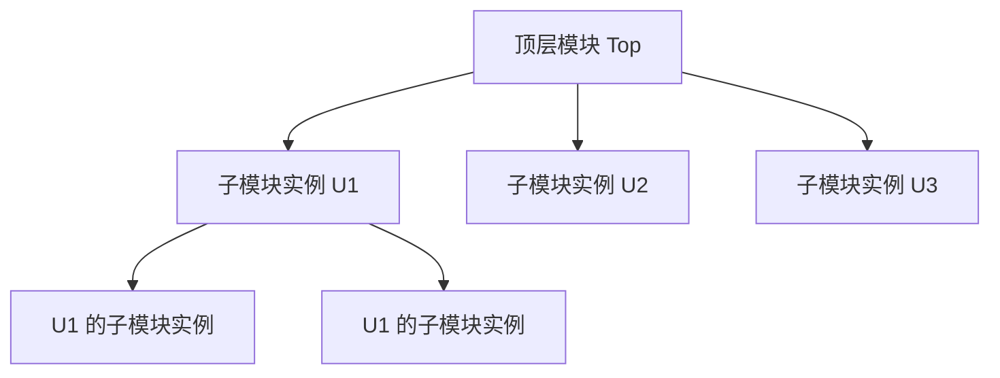
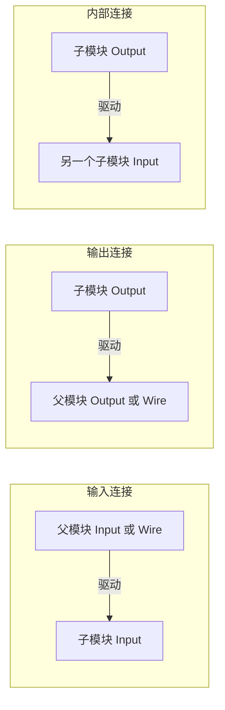
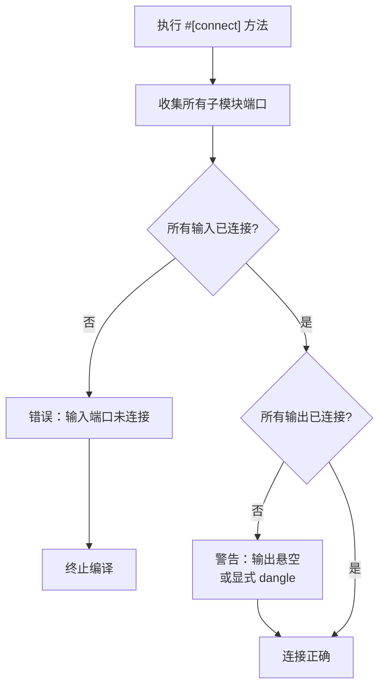
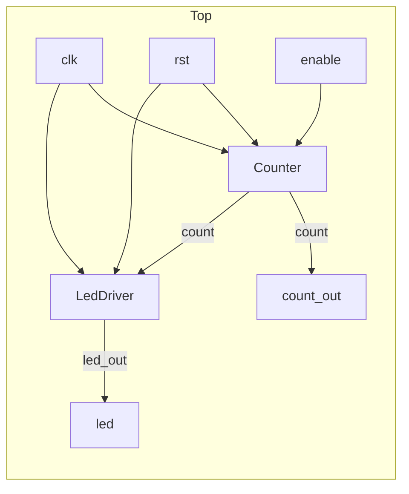
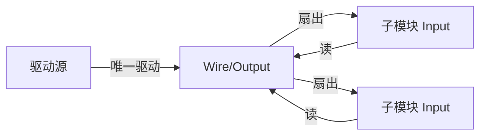
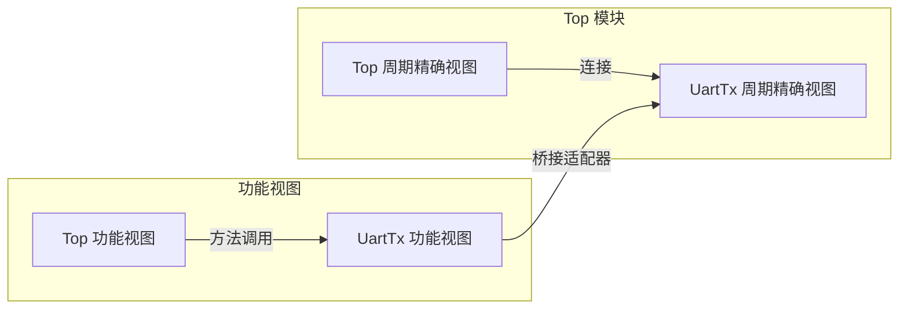

# 9. 层次化与连接

# 9. 层次化与连接

硬件设计通常是分层次的：顶层模块包含多个子模块实例，子模块之间通过端口连接形成更大的系统。RHDL 利用 Rust 的结构体嵌套和显式连接方法，实现了类型安全、可检查的层次化设计。连接操作在编译期验证方向、位宽和完整性，避免了传统 HDL 中因连接错误导致的隐蔽问题。在多视图建模下，层次化连接主要针对周期精确视图，而功能视图则通过桥接适配器与周期精确视图交互。

## 9.1 层次化设计的基本概念

层次化设计将复杂电路分解为多个模块，每个模块封装特定功能，通过例化（实例化）和连接构建更大的系统。在 RHDL 中，模块实例作为父模块的字段存在，端口连接通过 `#[connect]` 方法完成。



RHDL 支持任意深度的层次嵌套，最终综合工具会将层次展平或保持层次（取决于后端设置）。

## 9.2 子模块实例化

### 9.2.1 声明实例字段

在父模块的结构体中，子模块实例作为一个字段声明，类型为子模块结构体类型。字段名即为实例名。

```rust
#[module]
pub struct Top {
    pub clk: Clock,
    pub rst: Reset,
    pub enable: Input<Bool>,
    pub count: Output<UInt<8>>,

    counter: Counter,      // 子模块实例
    prescaler: Prescaler,  // 另一个子模块实例
}

```

### 9.2.2 实例字段的可见性

通常实例字段声明为私有（不加 `pub`），因为子模块的端口连接应在父模块内部完成，不对外暴露子模块细节。但也可以根据需要暴露（极少见）。

### 9.2.3 实例化与默认构造

RHDL 为每个 `#[module]` 结构体自动生成默认构造方法（如 `new()`），用于创建实例。在父模块中，实例字段在父模块的默认构造中被初始化（通常由编译器注入）。

## 9.3 端口连接

端口连接通过 `#[connect]` 方法完成。该方法在父模块的 `impl` 块中定义，负责将子模块的端口与父模块的端口或内部信号连接。

### 9.3.1 连接语法

```rust
impl Top {
    #[connect]
    fn connect_children(&mut self) {
        // 连接子模块 counter 的端口
        self.counter.clk = self.clk;
        self.counter.rst = self.rst;
        self.counter.enable = self.enable;   // Input 连接
        self.count = self.counter.count;     // Output 连接

        // 连接子模块 prescaler 的端口
        self.prescaler.clk = self.clk;
        self.prescaler.rst = self.rst;
        self.prescaler.trigger = self.counter.count;  // 内部信号连接
        self.counter.enable = self.prescaler.tick;    // 内部信号连接（通过父模块内部信号）
    }
}

```

### 9.3.2 连接的语义

*   **方向匹配**：`Input<T>` 端口只能被输入信号驱动，`Output<T>` 端口只能驱动输出信号或内部连线。连接的方向必须正确，否则编译错误。
    
*   **位宽匹配**：连接的信号位宽必须一致，编译器会进行检查。
    
*   **类型匹配**：连接的信号类型必须相同（或可隐式转换，但 RHDL 建议显式类型一致）。
    

### 9.3.3 连接方向分类



## 9.4 连接检查

`#[connect]` 宏在编译期执行多项检查，确保连接的完整性和正确性。

### 9.4.1 方向检查

编译器根据端口类型（`Input`/`Output`/`Clock`/`Reset`）验证赋值方向。错误示例：

```rust
// 错误：将 Output 赋值给 Input
self.counter.enable = self.count; // counter.enable 是 Input，self.count 是 Output

```

### 9.4.2 完整连接检查

`#[connect]` 方法执行后，编译器检查所有子模块的端口是否已被连接。未连接的输入端口会导致错误（除非显式标记为“悬空”）。

*   **未连接输入**：错误，可能导致不确定行为。
    
*   **未连接输出**：警告或错误（取决于配置），输出悬空可能导致逻辑被优化掉。
    

可以显式标记悬空：

```rust
self.counter.unused_input.dangle();  // 显式悬空

```

### 9.4.3 检查流程



## 9.5 层次化示例

下面以一个简单的系统为例：顶层包含一个计数器和一个 LED 驱动器。

### 9.5.1 子模块定义

**Counter 模块**：

```rust
#[module]
pub struct Counter {
    pub clk: Clock,
    pub rst: Reset,
    pub enable: Input<Bool>,
    pub count: Output<UInt<8>>,
    count_reg: Reg<UInt<8>>,
}

impl Counter {
    #[sequential]
    fn update(&mut self) {
        if self.rst.is_asserted() {
            self.count_reg.d = 0;
        } else if self.enable.get() {
            self.count_reg.d = self.count_reg.q + 1;
        } else {
            self.count_reg.d = self.count_reg.q;
        }
    }
    #[combinational]
    fn drive_count(&mut self) {
        self.count.set(self.count_reg.q);
    }
}

```

**LED 驱动器模块**：

```rust
#[module]
pub struct LedDriver {
    pub clk: Clock,
    pub rst: Reset,
    pub count_in: Input<UInt<8>>,
    pub led_out: Output<Bool>,
}

impl LedDriver {
    #[combinational]
    fn drive_led(&mut self) {
        self.led_out.set(self.count_in.get().bit(7));  // 最高位驱动 LED
    }
}

```

### 9.5.2 顶层模块

```rust
#[module]
pub struct Top {
    pub clk: Clock,
    pub rst: Reset,
    pub enable: Input<Bool>,
    pub led: Output<Bool>,
    pub count_out: Output<UInt<8>>,

    counter: Counter,
    led_driver: LedDriver,
}

impl Top {
    #[connect]
    fn connect_children(&mut self) {
        // 连接 Counter
        self.counter.clk = self.clk;
        self.counter.rst = self.rst;
        self.counter.enable = self.enable;

        // 连接 LedDriver
        self.led_driver.clk = self.clk;
        self.led_driver.rst = self.rst;
        self.led_driver.count_in = self.counter.count;  // 内部连接

        // 输出连接
        self.led = self.led_driver.led_out;
        self.count_out = self.counter.count;
    }
}

```

### 9.5.3 层次结构图



## 9.6 参数化层次

子模块可以是参数化的，父模块在实例化时通过泛型参数传递配置。RHDL 利用 Rust 的 const 泛型和类型参数实现。

### 9.6.1 参数化子模块

```rust
#[module]
pub struct ParamAdder<const W: usize> {
    pub a: Input<UInt<W>>,
    pub b: Input<UInt<W>>,
    pub sum: Output<UInt<W>>,
}

```

### 9.6.2 父模块中实例化

```rust
#[module]
pub struct TopAdder {
    pub a: Input<UInt<8>>,
    pub b: Input<UInt<8>>,
    pub sum: Output<UInt<8>>,

    adder8: ParamAdder<8>,   // 实例化 8 位加法器
}

impl TopAdder {
    #[connect]
    fn connect_children(&mut self) {
        self.adder8.a = self.a;
        self.adder8.b = self.b;
        self.sum = self.adder8.sum;
    }
}

```

参数化层次使得设计复用性极大提高，类似于 Chisel 的参数化生成器。

## 9.7 与所有权模型的关系

层次化连接中的单驱动原则依然适用。每个端口或内部信号在连接图中只能被驱动一次，这由 Rust 的所有权系统在编译期保证。

*   **输出端口**：只能被一个子模块输出驱动。
    
*   **内部连线**：如果声明为 `Wire<T>`，只能被一个组合逻辑或一个子模块输出驱动。
    
*   **输入端口**：可以扇出到多个子模块输入（读多次），但只能被一个驱动源驱动。
    



如果两个子模块输出连接到同一个父模块内部连线，Rust 编译会因多次可变借用而报错，从而避免多驱动。

## 9.8 层次化与代码生成

在生成 Verilog/FIRRTL 时，层次结构被保留。子模块实例化为独立的模块实例，连接映射为 wire 赋值。

### 9.8.1 Verilog 生成示例

对于上述 Top 模块，生成的 Verilog 大致如下：

```verilog
module Top (
    input  wire        clk,
    input  wire        rst,
    input  wire        enable,
    output wire        led,
    output wire [7:0]  count_out
);
    wire [7:0] counter_count;

    Counter counter (
        .clk    (clk),
        .rst    (rst),
        .enable (enable),
        .count  (counter_count)
    );

    LedDriver led_driver (
        .clk      (clk),
        .rst      (rst),
        .count_in (counter_count),
        .led_out  (led)
    );

    assign count_out = counter_count;
endmodule

```

### 9.8.2 FIRRTL 层次

FIRRTL 同样保留层次，便于后续优化和跨语言互转。

## 9.9 多视图建模下的层次化连接

在多视图建模中，层次化连接主要涉及周期精确视图。功能视图通常不参与层次化连接，因为功能视图是事务级接口，通过方法调用交互。但模块可以同时拥有功能视图和周期精确视图，层次化连接仅针对周期精确视图的端口。

例如，一个顶层 SoC 可能包含 UART 模块，UART 模块既有功能视图（`send_byte` 方法）也有周期精确视图（RTL 端口）。在层次化连接中，只有 RTL 端口参与 `#[connect]`。功能视图通过桥接适配器与周期精确视图交互，或者直接由软件调用。



在包含多视图的层次化设计中，父模块可以选择是否提供功能视图，子模块亦然。连接始终在周期精确视图内完成，功能视图之间的交互独立于硬件连接。

## 9.10 高级连接特性

*   **总线连接**：支持将整个 `Bundle` 作为一个整体连接，编译器自动展开为逐字段连接。
    
*   **数组实例**：支持生成多个同类型子模块实例（通过 Rust 数组），并通过循环连接。
    
*   **条件实例化**：利用 Rust 的 `if` 在编译期选择实例化哪些模块（元编程）。
    

例如，使用数组实例：

```rust
#[module]
pub struct MultiAdder {
    pub inputs: Vec<Input<UInt<8>>, 4>,
    pub sum: Output<UInt<8>>,

    adders: [ParamAdder<8>; 3],   // 3 个加法器实例
}

```

连接时使用循环：

```rust
impl MultiAdder {
    #[connect]
    fn connect_children(&mut self) {
        // 手动展开或使用宏连接
    }
}

```

## 9.11 总结

RHDL 的层次化与连接机制借助 Rust 的结构体嵌套、类型系统和过程宏，实现了安全、清晰的模块化设计。连接检查在编译期完成，确保方向、位宽和完整性，多驱动冲突由所有权模型防止。参数化层次和 Bundle 连接进一步提升了设计复用性和生产力，同时生成的 Verilog/FIRRTL 保持层次结构，便于综合和调试。多视图建模将层次化连接限定在周期精确视图，功能视图通过桥接适配器独立工作，互不干扰。