# RHDL 方案大纲（最终版）

# RHDL 方案大纲（最终版）

## 1. 项目概述

*   名称与定位：基于 Rust 的嵌入式 RTL 硬件描述语言
    
*   核心思想：硬件描述即合法 Rust 代码，通过过程宏生成 HIR
    
*   特色亮点：所有权模型防多驱动、显式时钟域、与 Chisel 互转、多视图建模
    

## 2. 设计目标

*   强类型安全
    
*   所有权模型适配硬件
    
*   组合/时序逻辑显式分离
    
*   参数化与代码生成
    
*   与 Rust 生态无缝集成
    
*   可综合子集明确
    
*   互转为一级设计目标（FIRRTL）
    
*   支持高层次综合（HLS）
    
*   提供丰富硬件 IP 库
    
*   内置可视化工具
    
*   **支持多视图建模，降低功能模拟器与周期精确模拟器生成难度**
    

## 3. 核心设计原则

*   嵌入式 DSL
    
*   显式优于隐式
    
*   编译期检查前置
    
*   中间表示标准化（HIR 与 FIRRTL 对齐）
    
*   可逆子集定义
    
*   分层抽象（RTL / HLS / IP）
    
*   **多视图建模原则**：允许模块同时提供功能视图与周期精确视图
    

## 4. 整体架构与工作流

*   架构总览（Rust 源码 → 过程宏/HLS → HIR → 多后端）
    
*   核心数据流
    
*   编译与生成流程
    
*   仿真与测试工作流
    
*   与 Chisel 互转架构
    
*   扩展功能集成架构（HLS、IP、可视化）
    
*   **多视图模拟器生成架构**
    

## 5. 类型系统

*   基础硬件类型（Bool, Bits, UInt, SInt, Clock, Reset, Analog）
    
*   方向类型（Input, Output, InOut）
    
*   复合类型（Bundle, Vec<T,N>, Mem<T,DEPTH>）
    
*   时钟域类型（ClockDomain, Polarity, ResetKind）
    
*   类型运算与位宽规则
    
*   类型检查与错误处理
    

## 6. 模块与端口

*   模块定义语法（#\[module\] 结构体）
    
*   端口声明与方向类型
    
*   内部信号（Reg, Wire, Mem）
    
*   层次化与实例化
    
*   端口连接规则与检查
    

## 7. 组合逻辑

*   组合逻辑定义与模型
    
*   运算符映射（算术、逻辑、移位、比较、位操作）
    
*   控制流映射（if, match, 循环展开）
    
*   完整赋值检查（避免锁存器）
    
*   内部连线（Wire）使用
    
*   与寄存器的交互
    

## 8. 时序逻辑

*   时序逻辑定义与作用
    
*   寄存器抽象（Reg）
    
*   \[sequential\] 方法
    
*   时钟域与复位（同步/异步、极性）
    
*   状态机描述（枚举 + match）
    
*   时序逻辑与组合逻辑的交互
    

## 9. 层次化与连接

*   层次化设计基本概念
    
*   子模块实例化
    
*   端口连接语法与语义
    
*   连接检查（方向、位宽、完整性）
    
*   参数化层次
    
*   与所有权模型的关系
    

## 10. 参数化与生成

*   基于 const 泛型的参数化
    
*   基于类型泛型的参数化
    
*   函数与方法硬件生成器
    
*   过程宏驱动的代码生成
    
*   编译期计算与元编程
    
*   与 Chisel 参数化对比
    

## 11. 时钟域与复位

*   时钟域与复位设计目标
    
*   ClockDomain 对象
    
*   复位极性
    
*   同步复位与异步复位
    
*   复位信号生成与分发
    
*   跨时钟域处理（同步器、FIFO）
    
*   时钟门控与使能
    

## 12. 与 Chisel 的互转设计

*   互转目标与层次（源码级 / 中间表示级 / 网表级）
    
*   设计策略（FIRRTL 交换、语义对齐、元数据保留、可逆子集）
    
*   转换流程（RHDL → Chisel、Chisel → RHDL）
    
*   关键挑战与应对（抽象不可逆、多驱动语义、时钟域差异、存储器建模）
    
*   互转示例
    

## 13. 工具链与后端

*   工具链架构总览
    
*   Cargo 集成与命令行接口
    
*   HIR 的核心作用
    
*   Verilog / SystemVerilog 后端
    
*   FIRRTL 后端
    
*   仿真器后端
    
*   可视化后端
    
*   形式验证后端
    
*   工具链工作流与外部工具集成
    

## 14. 验证与仿真

*   验证与仿真目标
    
*   仿真器架构与工作原理
    
*   测试框架集成（cargo test）
    
*   仿真 API 与使用模式
    
*   波形导出与调试
    
*   随机测试与属性测试
    
*   覆盖率分析
    
*   断言与形式验证接口
    

## 15. 可综合子集与限制

*   可综合子集定义
    
*   可综合特性详细说明
    
*   不可综合特性详细说明
    
*   编译期检查机制
    
*   可综合子集与 HLS 的关系
    
*   限制的例外与扩展
    

## 16. 与其他 HDL 对比

*   对比总览表
    
*   各语言定位图
    
*   与 Verilog/SystemVerilog 的对比
    
*   与 VHDL 的对比
    
*   与 Chisel 的对比
    
*   与 SpinalHDL 的对比
    
*   互操作关系图
    

## 17. 扩展功能整合

*   扩展功能整合总览
    
*   高层次综合（HLS）整合
    
    *   目标与定位
        
    *   整合架构
        
    *   HLS 约束与调度
        
    *   HLS 与 RTL 混合设计
        
*   硬件 IP 库整合
    
    *   IP 库形式与结构
        
    *   标准接口 Bundle
        
    *   参数化 IP
        
    *   IP 验证与文档
        
*   可视化工具整合
    
    *   模块层次图
        
    *   时序图
        
    *   与文档集成
        
*   三个扩展功能的协同
    

## 18. 多视图建模与模拟器生成（核心优化）

*   多视图建模思想
    
*   模块抽象层次声明（#\[abstraction\]）
    
*   功能模型与周期精确模型的关联（#\[functional\_model\]）
    
*   事务级接口与信号级接口的桥接
    
*   模拟器生成配置（feature 或模块属性）
    
*   功能模拟器生成（HLS 算法直接运行 / 手动功能模型）
    
*   周期精确模拟器生成（HIR 解释/编译执行）
    
*   两种模拟器一致性验证（随机测试、形式化等价）
    
*   对 IP 库的影响（双模型发布）
    
*   典型示例：UART 发送器多视图建模
    

## 19. 实施路线图

*   路线图总览（甘特图）
    
*   阶段依赖关系
    
*   阶段一：核心语言基础（类型、模块、组合/时序、简单 Verilog 后端）
    
*   阶段二：参数化、层次化与仿真（泛型、连接、原生仿真器、FIRRTL 后端）
    
*   阶段三：时钟域、复位与形式验证接口
    
*   阶段四：与 Chisel 互转（FIRRTL 导入器、Chisel 生成器）
    
*   阶段五：HLS、IP 库与可视化（HLS 前端、首批 IP crate、可视化工具）
    
*   阶段六：生态扩展与优化（IP 扩展、HLS 优化、IDE 集成、文档）
    
*   **阶段七：多视图建模与模拟器生成集成**（模块抽象声明、桥接机制、一致性验证框架）
    
*   里程碑
    
*   风险与应对
    

---

_本大纲整合了 RHDL 的全部设计内容，包括核心语言、工具链、生态互操作以及最新的多视图建模优化，为 RHDL 的实现提供了完整的蓝图。_


# 1. 项目概述

# 1. 项目概述

## 1.1 名称与定位

**RHDL**（Rust Hardware Description Language）是一种基于 Rust 的嵌入式 RTL 硬件描述语言。它不是一门独立的编程语言，而是以 **Rust 过程宏 + 库** 的形式实现，让硬件设计者直接使用 Rust 语言编写硬件描述，充分利用 Rust 的强类型系统、所有权模型、泛型与宏机制，在编译期完成硬件检查与优化。

RHDL 的定位介于传统 HDL（Verilog/SystemVerilog）与高层次硬件构造语言（如 Chisel）之间，既保留 RTL 的底层控制能力，又提供现代语言的安全性和生产力工具。此外，RHDL 引入**多视图建模**机制，允许同一个模块同时提供功能模型（事务级）和周期精确模型（RTL 级），从而简化功能模拟器与周期精确模拟器的生成。

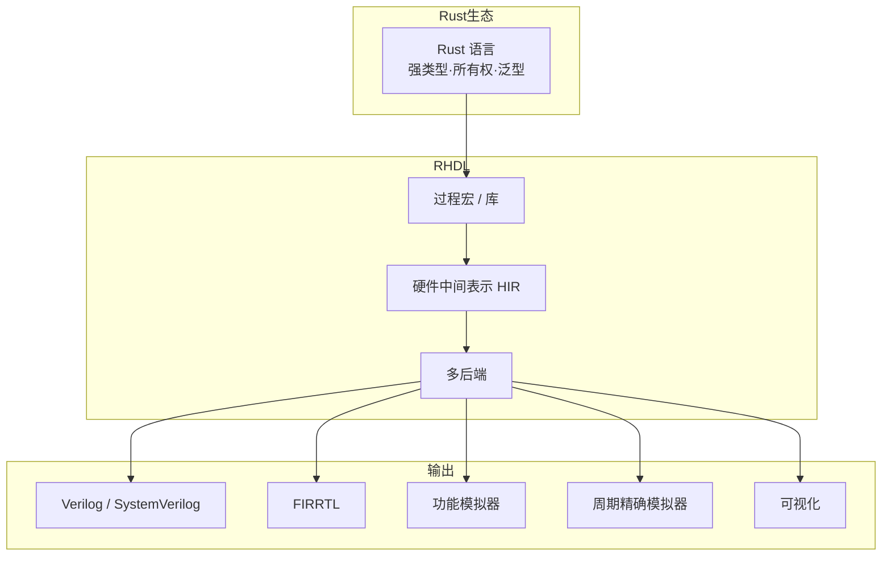
```mermaid
flowchart TB
    subgraph Rust生态
        A[Rust 语言<br>强类型·所有权·泛型]
    end

    subgraph RHDL
        B[过程宏 / 库]
        C[硬件中间表示 HIR]
        D[多后端]
    end

    subgraph 输出
        E[Verilog / SystemVerilog]
        F[FIRRTL]
        G[功能模拟器]
        H[周期精确模拟器]
        I[可视化]
    end

    A --> B --> C --> D
    D --> E
    D --> F
    D --> G
    D --> H
    D --> I

```

## 1.2 核心思想

RHDL 的核心思想是：**硬件描述就是合法的 Rust 代码**。设计者使用 Rust 编写模块、组合逻辑、时序逻辑，通过 `#[module]`、`#[combinational]`、`#[sequential]` 等过程宏标注，编译器将这些代码展开为硬件中间表示（HIR）。HIR 经过多后端转换，可输出 Verilog、FIRRTL，或直接进入仿真器。

在此基础上，RHDL 进一步提出**多视图建模**：一个硬件模块可以同时拥有功能视图（算法级或事务级）和周期精确视图（RTL 级）。功能视图用于快速软件开发，周期精确视图用于硬件验证，两者通过桥接机制和一致性验证保证行为等价。

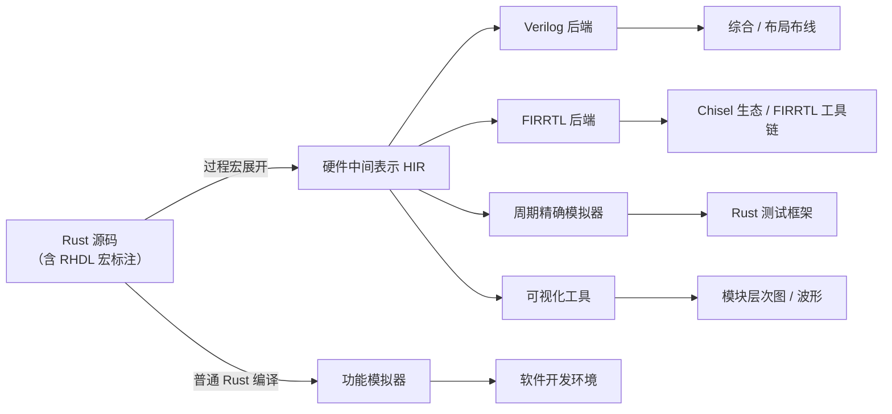
```mermaid
flowchart LR
    A[Rust 源码<br>（含 RHDL 宏标注）] -->|过程宏展开| B[硬件中间表示 HIR]
    B --> C[Verilog 后端]
    B --> D[FIRRTL 后端]
    B --> E[周期精确模拟器]
    B --> F[可视化工具]
    A -->|普通 Rust 编译| G[功能模拟器]
    C --> H[综合 / 布局布线]
    D --> I[Chisel 生态 / FIRRTL 工具链]
    E --> J[Rust 测试框架]
    F --> K[模块层次图 / 波形]
    G --> L[软件开发环境]

```

## 1.3 设计目标

RHDL 的设计目标可以概括为：**在保持底层硬件控制力的同时，提供现代软件开发的安全性与高效性，并支持多层次建模与模拟**。具体包括：

1.  **强类型安全**：位宽、端口方向、时钟域在编译期检查。
    
2.  **所有权模型适配硬件**：每个信号只能被单一驱动，防止多驱动冲突。
    
3.  **组合/时序逻辑显式分离**：避免隐式锁存器。
    
4.  **参数化与代码生成**：利用 Rust 泛型、const 泛型、宏生成可复用硬件。
    
5.  **与 Rust 生态无缝集成**：Cargo 管理项目，直接使用 Rust 测试框架进行仿真验证。
    
6.  **可综合子集明确**：保证描述可被综合为 Verilog/SystemVerilog。
    
7.  **互转为一级设计目标**：以 FIRRTL 为交换格式，实现与 Chisel 的双向转换。
    
8.  **支持高层次综合（HLS）**：从算法级 Rust 函数自动生成 RTL。
    
9.  **提供丰富硬件 IP 库**：UART、SPI、I2C、FIFO、AXI 等。
    
10.  **内置可视化工具**：模块层次图、时序图生成。
    
11.  **多视图建模**：允许模块同时提供功能视图与周期精确视图，降低功能模拟器与周期精确模拟器生成难度。
    

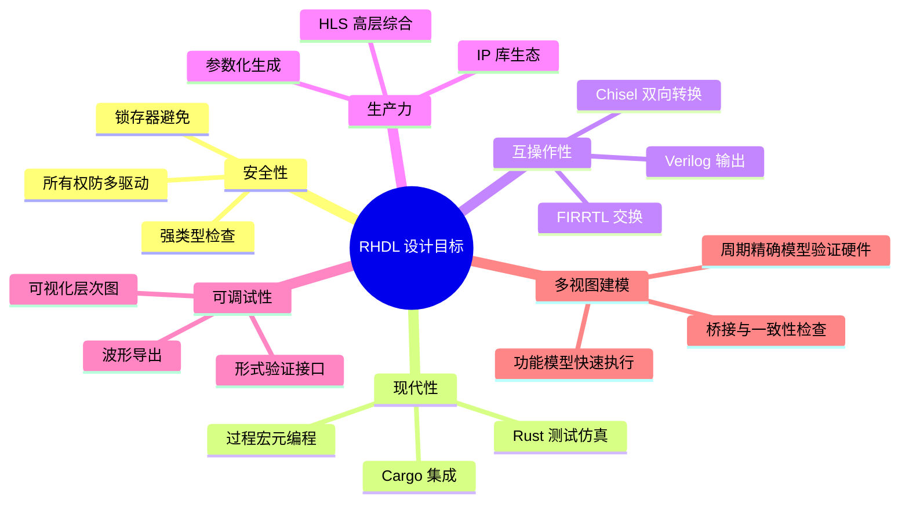
```mermaid
mindmap
  root((RHDL 设计目标))
    安全性
      强类型检查
      所有权防多驱动
      锁存器避免
    现代性
      Cargo 集成
      Rust 测试仿真
      过程宏元编程
    互操作性
      FIRRTL 交换
      Chisel 双向转换
      Verilog 输出
    生产力
      参数化生成
      HLS 高层综合
      IP 库生态
    可调试性
      可视化层次图
      波形导出
      形式验证接口
    多视图建模
      功能模型快速执行
      周期精确模型验证硬件
      桥接与一致性检查

```

## 1.4 与现有 HDL 的关系

RHDL 并非要取代 Verilog 或 Chisel，而是提供一个更安全、更现代的选择，并打通与现有生态的互操作路径：

*   **与 Verilog/SystemVerilog**：RHDL 可生成可综合的 Verilog，作为最终交付格式，兼容现有综合与布局布线工具。
    
*   **与 Chisel**：RHDL 与 Chisel 共享 FIRRTL 中间表示，可实现双向转换，复用 Chisel 的 IP 和工具链。
    
*   **与传统 HDL 设计流程**：RHDL 生成的标准 RTL 可无缝嵌入现有 FPGA/ASIC 流程。
    

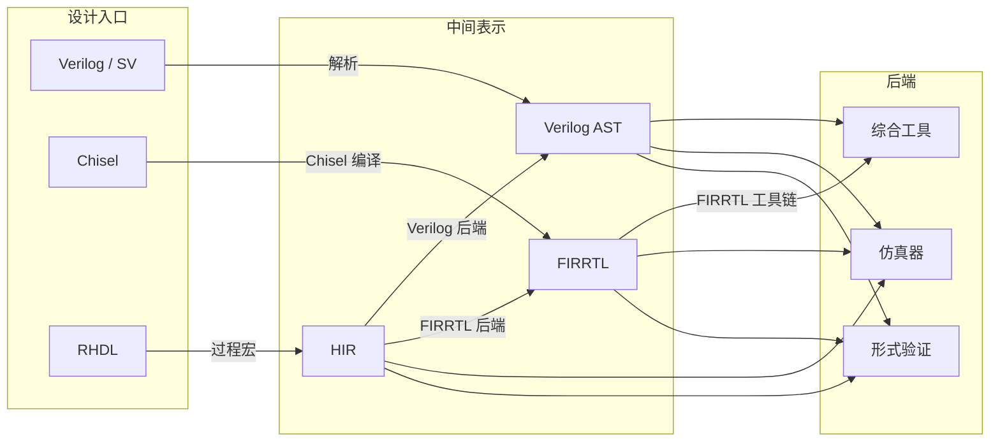
```mermaid
flowchart LR
    subgraph 设计入口
        A[Verilog / SV]
        B[Chisel]
        C[RHDL]
    end

    subgraph 中间表示
        D[Verilog AST]
        E[FIRRTL]
        F[HIR]
    end

    subgraph 后端
        G[综合工具]
        H[仿真器]
        I[形式验证]
    end

    C -->|过程宏| F
    F -->|Verilog 后端| D
    F -->|FIRRTL 后端| E
    E -->|FIRRTL 工具链| G
    D --> G
    B -->|Chisel 编译| E
    A -->|解析| D
    D --> H
    E --> H
    F --> H
    D --> I
    E --> I
    F --> I

```

## 1.5 特色亮点

### 1.5.1 所有权模型天然防多驱动

Rust 的所有权系统要求每个值在任意时刻只能有一个可变引用。RHDL 利用这一特性，将硬件信号建模为带有所有权语义的实体，从而在编译期就杜绝了多驱动冲突——这是传统 HDL 中常见的错误来源。

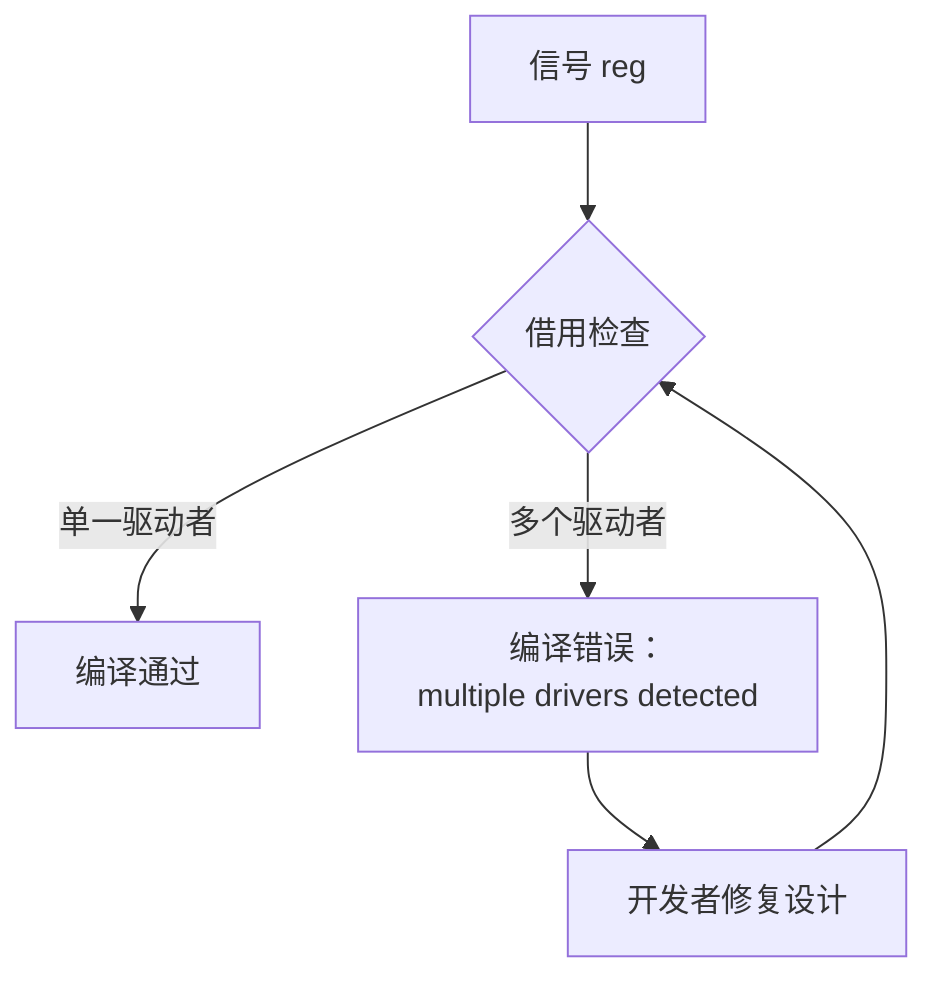
```mermaid
flowchart TD
    A[信号 reg] --> B{借用检查}
    B -->|单一驱动者| C[编译通过]
    B -->|多个驱动者| D[编译错误：<br>multiple drivers detected]
    D --> E[开发者修复设计]
    E --> B

```

### 1.5.2 显式时钟域与复位

RHDL 引入 `ClockDomain` 对象，将时钟、复位极性、复位方式（同步/异步）绑定在一起，并要求每个寄存器明确属于某个时钟域。跨时钟域必须使用显式同步器，从语言层面减少 CDC 问题。

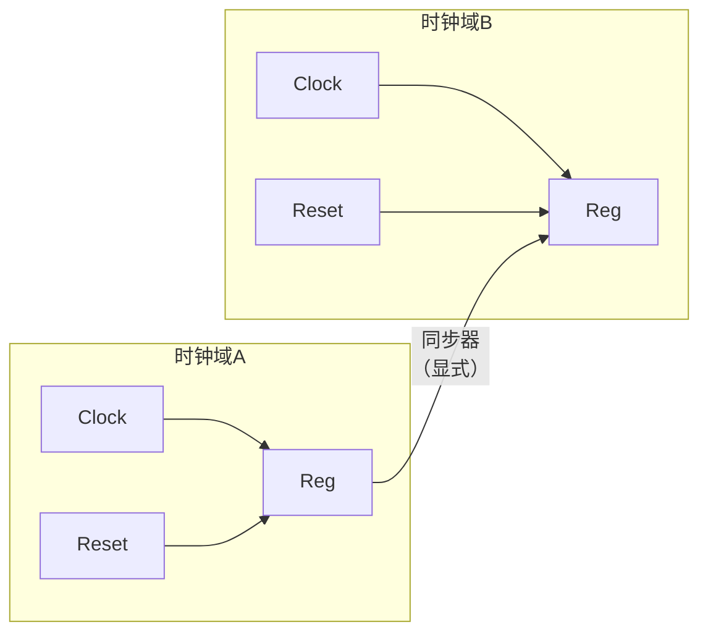
```mermaid
flowchart LR
    subgraph 时钟域A
        clkA[Clock] --> regA[Reg]
        rstA[Reset] --> regA
    end
    subgraph 时钟域B
        clkB[Clock] --> regB[Reg]
        rstB[Reset] --> regB
    end
    regA -- "同步器<br>（显式）" --> regB

```

### 1.5.3 与 Chisel 的深度互操作

RHDL 将互转设计为一等公民。通过 FIRRTL 中间表示，RHDL 模块可以转换为 Chisel 代码，Chisel 生成的 FIRRTL 也可以导入为 RHDL 模块，实现 IP 复用和混合设计。

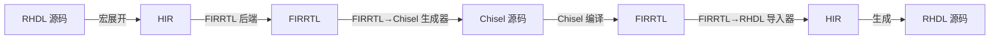
```mermaid
flowchart LR
    RHDL[RHDL 源码] -->|宏展开| HIR[HIR]
    HIR -->|FIRRTL 后端| FIRRTL[FIRRTL]
    FIRRTL -->|FIRRTL→Chisel 生成器| Chisel[Chisel 源码]
    Chisel -->|Chisel 编译| FIRRTL2[FIRRTL]
    FIRRTL2 -->|FIRRTL→RHDL 导入器| HIR2[HIR]
    HIR2 -->|生成| RHDL2[RHDL 源码]

```

### 1.5.4 内置 HLS 与 IP 库

RHDL 计划集成高层次综合（HLS），允许开发者用算法级 Rust 函数自动生成 RTL；同时提供丰富的硬件 IP 库（UART、SPI、I2C、FIFO、AXI 等），通过 Cargo 直接引入，加速设计。

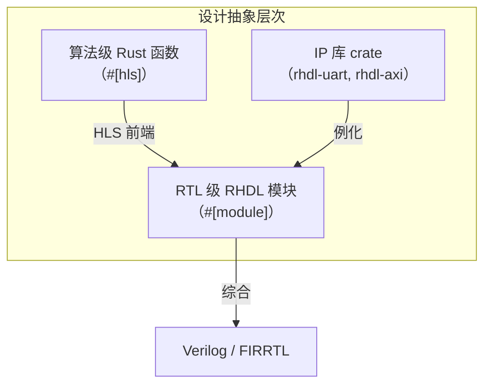
```mermaid
flowchart TB
    subgraph 设计抽象层次
        L1["算法级 Rust 函数<br>（#[hls]）"]
        L2["RTL 级 RHDL 模块<br>（#[module]）"]
        L3[IP 库 crate<br>（rhdl-uart, rhdl-axi）]
    end
    L1 -->|HLS 前端| L2
    L3 -->|例化| L2
    L2 -->|综合| L4[Verilog / FIRRTL]

```

### 1.5.5 多视图建模与模拟器生成

RHDL 允许模块同时提供功能视图和周期精确视图。功能视图使用普通 Rust 代码（事务级/算法级），周期精确视图使用 RHDL 的 RTL 描述。工具链可以分别生成功能模拟器（快速）和周期精确模拟器（精确），并通过桥接和一致性验证保证两者等价。

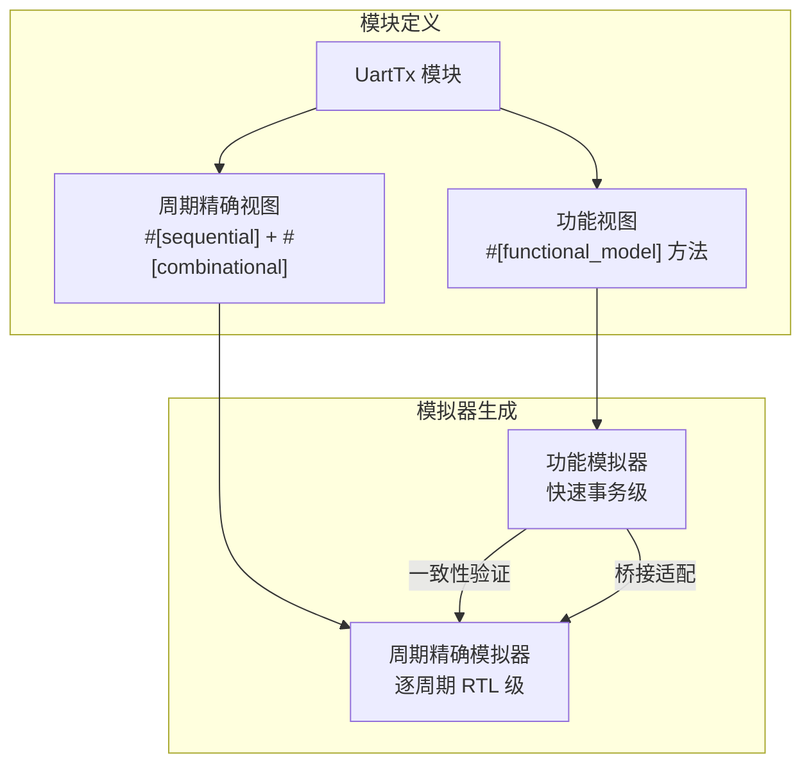
```mermaid
flowchart TB
    subgraph 模块定义
        A[UartTx 模块]
        A --> B["功能视图<br>#[functional_model] 方法"]
        A --> C["周期精确视图<br>#[sequential] + #[combinational]"]
    end
    subgraph 模拟器生成
        B --> D[功能模拟器<br>快速事务级]
        C --> E[周期精确模拟器<br>逐周期 RTL 级]
    end
    D -->|一致性验证| E
    D -->|桥接适配| E

```

## 1.6 总结

RHDL 是一个充分利用 Rust 语言优势的现代硬件描述语言。它以嵌入式 DSL 的形式降低了使用门槛，通过编译期检查提升了设计可靠性，并以 FIRRTL 为桥梁实现了与 Chisel 生态的互操作。RHDL 的目标是成为 FPGA/ASIC 设计中安全、高效且生态友好的选择，同时通过多视图建模支持从快速软件开发到严格硬件验证的完整流程。


# 2. 设计目标

# 2. 设计目标

RHDL 的设计目标旨在解决传统 HDL 在安全性、开发效率和生态互操作性方面的痛点，同时充分利用 Rust 语言的优势。设计目标可归纳为十一个核心方面，它们相互关联、协同作用，共同定义了 RHDL 的独特价值。其中 **多视图建模** 作为新增目标，专门用于降低功能模拟器与周期精确模拟器的生成难度。

## 2.1 设计目标总览

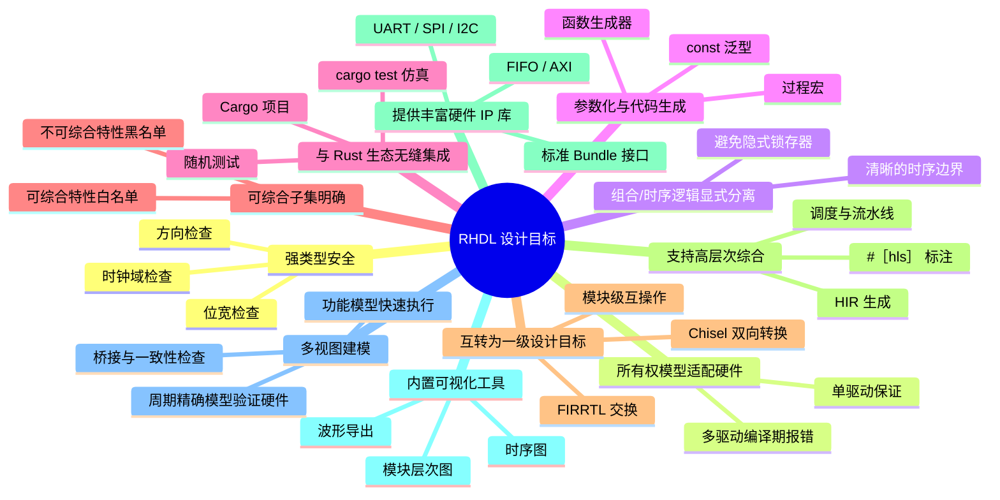
```mermaid
mindmap
  root((RHDL 设计目标))
    强类型安全
      位宽检查
      方向检查
      时钟域检查
    所有权模型适配硬件
      单驱动保证
      多驱动编译期报错
    组合/时序逻辑显式分离
      避免隐式锁存器
      清晰的时序边界
    参数化与代码生成
      const 泛型
      过程宏
      函数生成器
    与 Rust 生态无缝集成
      Cargo 项目
      cargo test 仿真
      随机测试
    可综合子集明确
      可综合特性白名单
      不可综合特性黑名单
    互转为一级设计目标
      FIRRTL 交换
      Chisel 双向转换
      模块级互操作
    支持高层次综合
      #［hls］ 标注
      调度与流水线
      HIR 生成
    提供丰富硬件 IP 库
      UART / SPI / I2C
      FIFO / AXI
      标准 Bundle 接口
    内置可视化工具
      模块层次图
      时序图
      波形导出
    多视图建模
      功能模型快速执行
      周期精确模型验证硬件
      桥接与一致性检查

```
---

## 2.2 强类型安全

RHDL 将类型安全置于核心，所有硬件信号在编译期就具有明确的位宽、方向和时钟域属性，杜绝了传统 HDL 中常见的位宽不匹配、方向错误和跨时钟域冒险。

### 2.2.1 类型层次

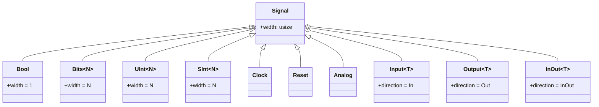
```mermaid
classDiagram
    class Signal {
        +width: usize
    }
    class Bool {
        +width = 1
    }
    class Bits~N~ {
        +width = N
    }
    class UInt~N~ {
        +width = N
    }
    class SInt~N~ {
        +width = N
    }
    class Clock
    class Reset
    class Analog

    Signal <|-- Bool
    Signal <|-- Bits
    Signal <|-- UInt
    Signal <|-- SInt
    Signal <|-- Clock
    Signal <|-- Reset
    Signal <|-- Analog

    class Input~T~ {
        +direction = In
    }
    class Output~T~ {
        +direction = Out
    }
    class InOut~T~ {
        +direction = InOut
    }

    Signal o-- Input
    Signal o-- Output
    Signal o-- InOut

```

### 2.2.2 编译期检查流程

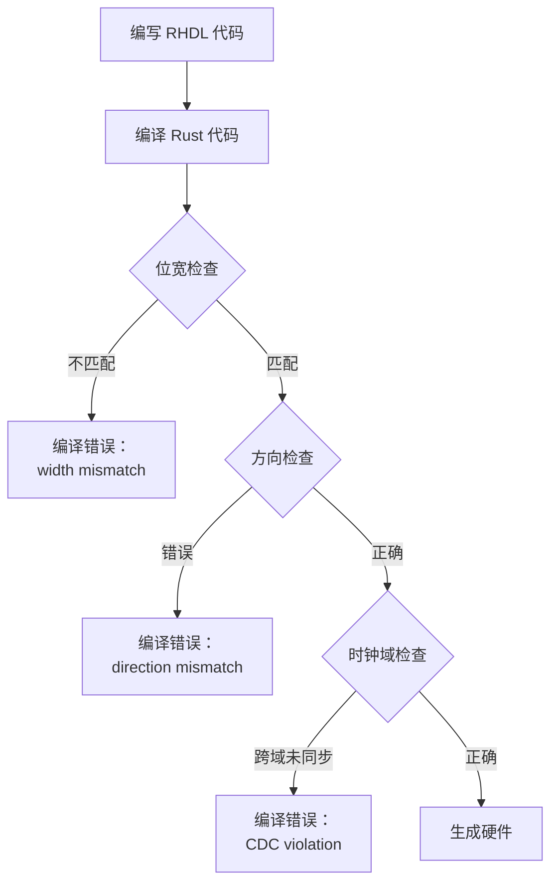
```mermaid
flowchart TD
    A[编写 RHDL 代码] --> B[编译 Rust 代码]
    B --> C{位宽检查}
    C -- 不匹配 --> D[编译错误：<br>width mismatch]
    C -- 匹配 --> E{方向检查}
    E -- 错误 --> F[编译错误：<br>direction mismatch]
    E -- 正确 --> G{时钟域检查}
    G -- 跨域未同步 --> H[编译错误：<br>CDC violation]
    G -- 正确 --> I[生成硬件]

```
---

## 2.3 所有权模型适配硬件

Rust 的所有权系统要求每个值在任意时刻只能有一个可变引用。RHDL 利用这一特性，将硬件信号建模为具有所有权语义的实体，从而在编译期就杜绝了多驱动冲突。

### 2.3.1 单驱动保证

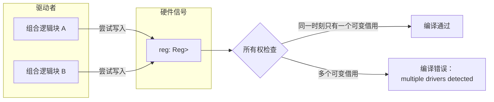
```mermaid
flowchart LR
    subgraph 硬件信号
        signal[reg: Reg<UInt<8>>]
    end

    subgraph 驱动者
        driver1[组合逻辑块 A]
        driver2[组合逻辑块 B]
    end

    driver1 -- "尝试写入" --> signal
    driver2 -- "尝试写入" --> signal

    check{所有权检查}
    signal --> check
    check -- "同一时刻只有一个可变借用" --> pass[编译通过]
    check -- "多个可变借用" --> fail[编译错误：<br>multiple drivers detected]

```

### 2.3.2 借用检查与硬件生成

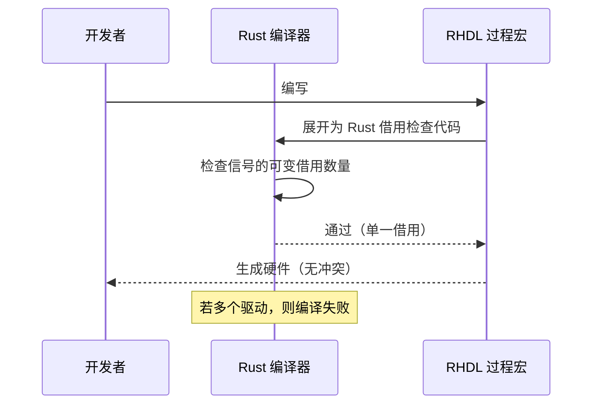
```mermaid
sequenceDiagram
    participant Dev as 开发者
    participant RustC as Rust 编译器
    participant RHDL as RHDL 过程宏

    Dev->>RHDL: 编写 #[combinational] 块赋值寄存器
    RHDL->>RustC: 展开为 Rust 借用检查代码
    RustC->>RustC: 检查信号的可变借用数量
    RustC-->>RHDL: 通过（单一借用）
    RHDL-->>Dev: 生成硬件（无冲突）
    Note over RustC: 若多个驱动，则编译失败

```
---

## 2.4 组合/时序逻辑显式分离

RHDL 通过 `#[combinational]` 和 `#[sequential]` 宏显式区分组合逻辑与时序逻辑，避免隐式锁存器的产生，并清晰定义寄存器的更新行为。

### 2.4.1 逻辑分离规则

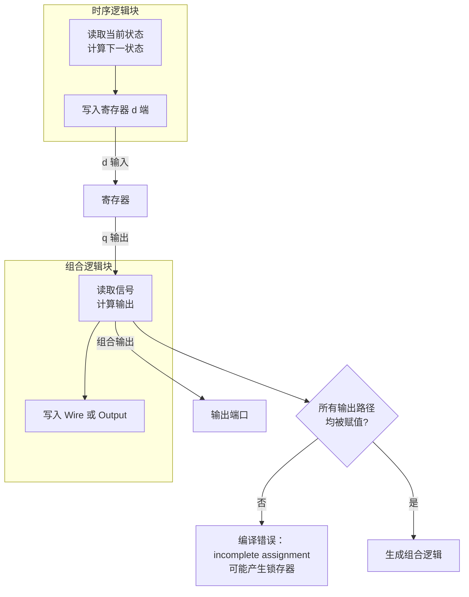
```mermaid
flowchart TB
    subgraph 组合逻辑块
        C[读取信号<br>计算输出]
        C --> D[写入 Wire 或 Output]
    end

    subgraph 时序逻辑块
        S[读取当前状态<br>计算下一状态]
        S --> T[写入寄存器 d 端]
    end

    Reg[寄存器] -->|q 输出| C
    T -->|d 输入| Reg
    C -->|组合输出| Out[输出端口]

    check{所有输出路径<br>均被赋值?}
    C --> check
    check -- 否 --> latch[编译错误：<br>incomplete assignment<br>可能产生锁存器]
    check -- 是 --> ok[生成组合逻辑]

```

### 2.4.2 时序边界

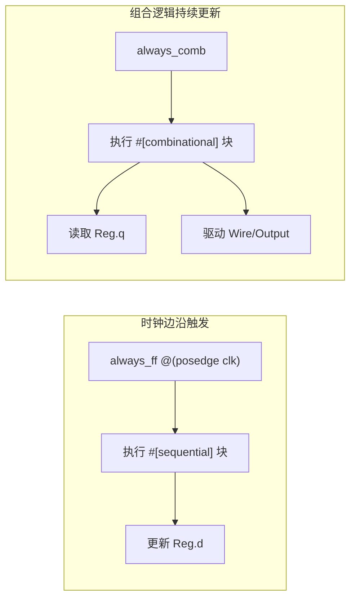
```mermaid
flowchart LR
    subgraph 时钟边沿触发
        always_ff["always_ff @(posedge clk)"]
        always_ff --> update["执行 #[sequential] 块"]
        update --> reg_d[更新 Reg.d]
    end

    subgraph 组合逻辑持续更新
        always_comb[always_comb]
        always_comb --> compute["执行 #[combinational] 块"]
        compute --> reg_q[读取 Reg.q]
        compute --> wire[驱动 Wire/Output]
    end

```
---

## 2.5 参数化与代码生成

RHDL 充分利用 Rust 的泛型、const 泛型和过程宏，实现强大的参数化硬件生成能力，支持编写可复用的模块。

### 2.5.1 参数化模块

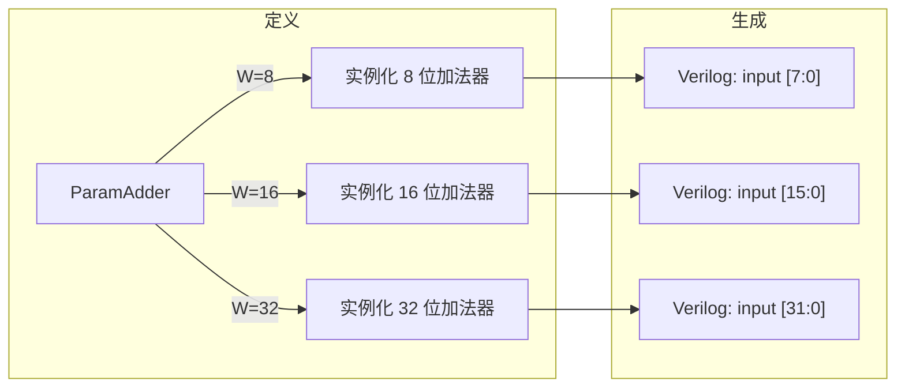
```mermaid
flowchart LR
    subgraph 定义
        def[ParamAdder<const W: usize>]
        def -->|W=8| inst1[实例化 8 位加法器]
        def -->|W=16| inst2[实例化 16 位加法器]
        def -->|W=32| inst3[实例化 32 位加法器]
    end

    subgraph 生成
        inst1 --> v1["Verilog: input [7:0]"]
        inst2 --> v2["Verilog: input [15:0]"]
        inst3 --> v3["Verilog: input [31:0]"]
    end

```

### 2.5.2 过程宏与元编程

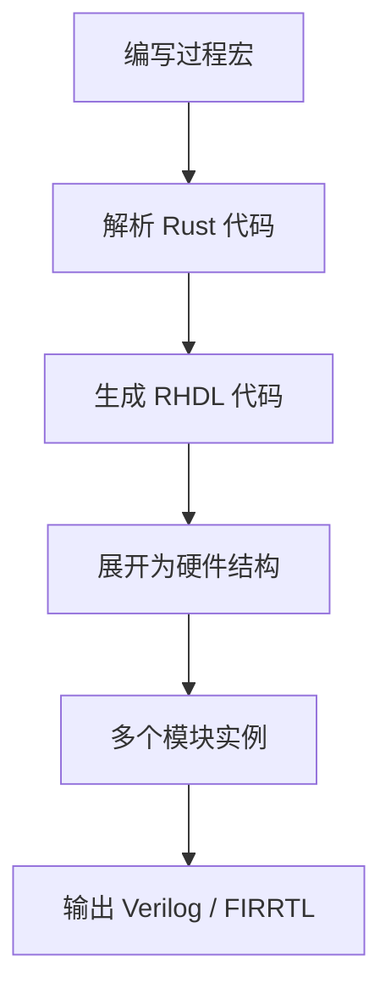
```mermaid
flowchart TD
    A[编写过程宏] --> B[解析 Rust 代码]
    B --> C[生成 RHDL 代码]
    C --> D[展开为硬件结构]
    D --> E[多个模块实例]
    E --> F[输出 Verilog / FIRRTL]

```
---

## 2.6 与 Rust 生态无缝集成

RHDL 作为 Rust 库，天然融入 Cargo 生态。项目依赖管理、构建、测试、文档和发布都使用 Rust 的标准工具链。

### 2.6.1 开发工作流

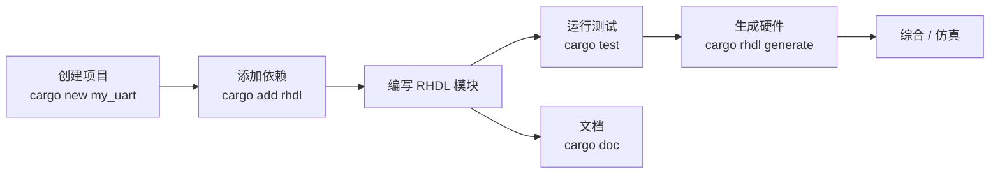
```mermaid
flowchart LR
    A[创建项目<br>cargo new my_uart] --> B[添加依赖<br>cargo add rhdl]
    B --> C[编写 RHDL 模块]
    C --> D[运行测试<br>cargo test]
    D --> E[生成硬件<br>cargo rhdl generate]
    E --> F[综合 / 仿真]
    C --> G[文档<br>cargo doc]

```

### 2.6.2 仿真测试集成

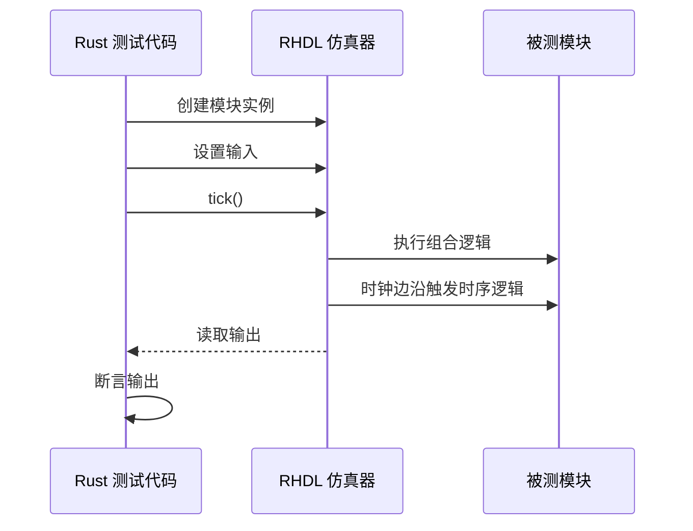
```mermaid
sequenceDiagram
    participant Test as Rust 测试代码
    participant Sim as RHDL 仿真器
    participant DUT as 被测模块

    Test->>Sim: 创建模块实例
    Test->>Sim: 设置输入
    Test->>Sim: tick()
    Sim->>DUT: 执行组合逻辑
    Sim->>DUT: 时钟边沿触发时序逻辑
    Sim-->>Test: 读取输出
    Test->>Test: 断言输出

```
---

## 2.7 可综合子集明确

RHDL 明确定义哪些 Rust 特性可被综合为硬件，哪些不可综合。这保证了代码的行为一致性，并使开发者能在编译期发现不支持的抽象。

### 2.7.1 可综合/不可综合边界

```mermaid
mindmap
  root((可综合子集))
    可综合
      基础硬件类型
      if / match
      静态循环
      函数内联
      泛型 / const 泛型
      数组 / 结构体 / 枚举
    不可综合
      动态内存分配
      递归函数
      浮点数（默认）
      动态 trait 对象
      闭包
      文件 I/O / 网络 / 线程
      panic!

```
---

## 2.8 互转为一级设计目标

RHDL 将与其他 HDL（尤其是 Chisel）的互操作性作为核心设计目标。通过 FIRRTL 中间表示，RHDL 模块可以转换为 Chisel 代码，Chisel 生成的 FIRRTL 也可以导入为 RHDL 模块。

### 2.8.1 互转路径

```mermaid
flowchart LR
    RHDL[RHDL 源码] -->|宏展开| HIR[HIR]
    HIR -->|FIRRTL 后端| FIRRTL[FIRRTL]
    FIRRTL -->|FIRRTL→Chisel 生成器| Chisel[Chisel 源码]
    Chisel -->|Chisel 编译| FIRRTL2[FIRRTL]
    FIRRTL2 -->|FIRRTL→RHDL 导入器| HIR2[HIR]
    HIR2 -->|生成| RHDL2[RHDL 源码]

```

### 2.8.2 互操作层次

```mermaid
flowchart TB
    subgraph 高层次
        A[RHDL 泛型模块]
        B[Chisel 参数化生成器]
    end
    subgraph 中间表示
        C[FIRRTL 模块实例]
    end
    subgraph 低层次
        D[RHDL 生成的低层次模块]
        E[Chisel 生成的低层次模块]
    end
    A --> C
    B --> C
    C --> D
    C --> E

```
---

## 2.9 支持高层次综合（HLS）

RHDL 计划集成 HLS，允许开发者使用算法级 Rust 函数描述计算，由工具自动生成 RTL（状态机、数据通路、流水线），从而提高设计抽象层次。

### 2.9.1 HLS 流程

```mermaid
flowchart LR
    A["#[hls] 标注的<br>算法级 Rust 函数"] --> B[HLS 前端]
    B --> C[解析数据流图 DFG]
    C --> D[调度<br>分配时钟周期]
    D --> E[资源分配与绑定]
    E --> F[生成 HIR<br>（状态机 + 数据通路）]
    F --> G[与其他 RHDL 模块集成]
    G --> H[Verilog / FIRRTL]

```

### 2.9.2 约束与优化

```mermaid
flowchart TD
    constraints[约束注解] --> hls[HLS 引擎]
    hls --> latency[延迟约束<br>latency=3]
    hls --> pipeline[流水线<br>pipeline=true, ii=1]
    hls --> unroll[循环展开<br>unroll=4]
    pipeline --> opt[生成流水线寄存器]
    latency --> sched[调整调度]
    unroll --> area[面积 / 吞吐权衡]

```
---

## 2.10 提供丰富硬件 IP 库

RHDL 生态将提供常用硬件 IP 库，以独立 Rust crates 发布，开发者可通过 Cargo 直接引入，加速设计开发。

### 2.10.1 IP 库结构

```mermaid
classDiagram
    namespace rhdl_ip {
        class UartTx {
            +clk: Clock
            +rst: Reset
            +tx_data: Input<UInt<8>>
            +tx_start: Input<Bool>
            +tx_pin: Output<Bool>
            +tx_busy: Output<Bool>
        }
        class SpiMaster {
            +clk: Clock
            +rst: Reset
            +sclk: Output<Bool>
            +mosi: Output<Bool>
            +miso: Input<Bool>
        }
        class AxiStream {
            +tdata: UInt<64>
            +tvalid: Bool
            +tready: Bool
            +tlast: Bool
        }
    }
    namespace rhdl_ip_fifo {
        class Fifo~T~ {
            +push: Input<T>
            +pop: Input<T>
            +full: Output<Bool>
            +empty: Output<Bool>
        }
    }
    UartTx ..> AxiStream : uses
    SpiMaster ..> AxiStream : uses
    Fifo ..> AxiStream : uses

```

### 2.10.2 依赖与复用

```mermaid
flowchart TD
    App[用户设计] --> UART[rhdl-uart crate]
    App --> SPI[rhdl-spi crate]
    App --> AXI[rhdl-axi crate]
    UART --> FIFO[rhdl-fifo crate]
    SPI --> FIFO
    AXI --> FIFO

```
---

## 2.11 内置可视化工具

RHDL 提供从 HIR 生成模块层次图、从仿真波形生成时序图的能力，帮助开发者理解和调试设计。

### 2.11.1 可视化生成流程

```mermaid
flowchart LR
    HIR[硬件中间表示 HIR] --> dot[Graphviz DOT 生成]
    dot --> hierarchy[模块层次图]
    Sim[仿真器] --> vcd[VCD/FST 波形]
    vcd --> wave[波形查看器]
    vcd --> timing[时序图生成器]
    timing --> svg[SVG / PlantUML]

```

### 2.11.2 可视化类型

```mermaid
mindmap
  root((可视化输出))
    模块层次图
      Graphviz DOT
      Mermaid 图
      层次折叠
    时序图
      信号变化
      时钟周期标注
    波形
      VCD / FST
      与仿真器集成

```
---

## 2.12 多视图建模与模拟器生成（新增目标）

RHDL 引入多视图建模，允许一个硬件模块同时提供**功能视图**和**周期精确视图**。功能视图使用普通 Rust 代码（事务级/算法级），周期精确视图使用 RHDL 的 RTL 描述。工具链分别生成功能模拟器（快速）和周期精确模拟器（精确），并通过桥接和一致性验证保证两者等价。

### 2.12.1 多视图建模结构

```mermaid
flowchart TB
    subgraph 模块定义
        A[UartTx 模块]
        A --> B["功能视图<br>#[functional_model] 方法"]
        A --> C["周期精确视图<br>#[sequential] + #[combinational]"]
    end
    subgraph 模拟器生成
        B --> D[功能模拟器<br>快速事务级]
        C --> E[周期精确模拟器<br>逐周期 RTL 级]
    end
    D -->|一致性验证| E
    D -->|桥接适配| E

```

### 2.12.2 桥接与一致性验证

```mermaid
flowchart LR
    SW[软件调用] -->|方法调用| TLM[事务级接口]
    TLM -->|转换适配器| RTL[信号级接口]
    RTL -->|时钟驱动| HW[硬件模拟]
    TLM -->|一致性验证| RTL

```
---

## 2.13 设计目标之间的关联

这些设计目标并非孤立，而是相互支撑、形成闭环：

```mermaid
flowchart LR
    A[强类型安全] --> B[所有权单驱动]
    B --> C[组合/时序分离]
    C --> D[参数化生成]
    D --> E[Rust 生态集成]
    E --> F[可综合子集]
    F --> G[互转 FIRRTL]
    G --> H[HLS 支持]
    H --> I[IP 库]
    I --> J[可视化]
    J --> A
    A --> K[多视图建模]
    K --> E
    K --> H

```

**总结**：RHDL 的设计目标围绕“安全、现代、互操作、高产、多视图”五大支柱展开，通过 Rust 语言的内在优势，为硬件设计提供一个可靠、高效且生态友好的新选择。多视图建模的加入使得 RHDL 能够支持从快速软件开发到严格硬件验证的完整流程。

# 3. 核心设计原则

# 3. 核心设计原则

RHDL 的设计遵循七项核心原则，它们共同决定了语言的架构、宏展开方式、类型系统设计和工具链行为。这些原则确保了 RHDL 在安全性、可预测性、生态互操作性和多视图建模方面的优势，同时避免了传统 HDL 的常见缺陷。

## 3.1 设计原则总览

```mermaid
mindmap
  root((核心设计原则))
    嵌入式 DSL
      合法 Rust 代码
      过程宏标注
      无需外部解析器
    显式优于隐式
      时钟域显式
      方向显式
      复位方式显式
    编译期检查前置
      类型系统约束
      所有权借用检查
      多驱动检测
    中间表示标准化
      HIR 与 FIRRTL 对齐
      元数据保留
      多后端共享
    可逆子集定义
      明确可综合边界
      限制不可逆抽象
      支持反向生成
    分层抽象
      RTL 级
      HLS 级
      IP 级
      多视图混合
    多视图建模
      功能视图
      周期精确视图
      桥接与一致性

```
---

## 3.2 嵌入式 DSL

RHDL 不是一门独立的语言，而是嵌入在 Rust 中的领域特定语言。硬件描述代码就是合法的 Rust 代码，通过过程宏（`#[module]`、`#[combinational]`、`#[sequential]` 等）标注，由 Rust 编译器展开为硬件中间表示（HIR）。这带来几个好处：

*   **无需自定义解析器**：直接利用 Rust 的语法和解析器。
    
*   **完整的 Rust 工具链支持**：IDE、格式化、静态分析、文档生成等。
    
*   **与 Rust 生态无缝融合**：可以在同一个项目中编写硬件描述、测试、构建脚本。
    

```mermaid
flowchart TB
    subgraph 开发环境
        A[IDE / 编辑器]
        B[Rust 编译器]
        C[Cargo 构建系统]
    end

    subgraph 代码文件
        D[RHDL 源码<br>（合法 Rust 代码）]
    end

    A --> D
    B --> D
    C --> D

    D -->|过程宏展开| E[HIR]
    E --> F[Verilog / FIRRTL]
    E --> G[仿真器]
    E --> H[可视化]

```

嵌入式 DSL 还使得功能模型（普通 Rust 代码）和 RTL 模型（宏标注代码）可以共存于同一文件中，为多视图建模奠定基础。

---

## 3.3 显式优于隐式

RHDL 遵循“显式优于隐式”的设计哲学，要求开发者明确声明那些在传统 HDL 中常常隐式处理的关键属性，从而减少设计错误。

### 3.3.1 显式时钟域

每个寄存器必须显式绑定到一个 `ClockDomain` 对象，该对象明确定义了时钟信号、复位信号、复位极性以及复位方式（同步/异步）。跨时钟域的信号传输必须使用显式同步器。

```mermaid
flowchart LR
    subgraph 时钟域 A
        CD_A[ClockDomain A<br>clk = clk_a<br>rst = rst_a<br>polarity = ActiveHigh<br>kind = Sync]
    end
    subgraph 时钟域 B
        CD_B[ClockDomain B<br>clk = clk_b<br>rst = rst_b<br>polarity = ActiveLow<br>kind = Async]
    end

    RegA[寄存器 A] --> CD_A
    RegB[寄存器 B] --> CD_B

    RegA -- "跨域传输" --> Sync[同步器<br>DoubleFlop / FIFO]
    Sync --> RegB

```

### 3.3.2 显式方向与复位

端口方向由 `Input<T>` / `Output<T>` / `InOut<T>` 包装类型显式声明，复位信号通过 `Reset` 类型传递，极性在 `ClockDomain` 中配置。这消除了传统 Verilog 中 `input` / `output` 声明与使用不一致的问题。

```mermaid
classDiagram
    class Module {
        +clk: Clock
        +rst: Reset
        +data_in: Input<UInt<8>>
        +data_out: Output<UInt<8>>
    }
    class ClockDomain {
        +clock: Clock
        +reset: Reset
        +polarity: Polarity
        +reset_kind: ResetKind
    }
    Module --> ClockDomain : binds

```
---

## 3.4 编译期检查前置

RHDL 将尽可能多的检查推迟到 Rust 编译期完成，利用 Rust 的类型系统和借用检查器在硬件生成之前发现错误。这包括：

*   **位宽检查**：所有运算的位宽在编译期确定，不匹配会报错。
    
*   **方向检查**：端口方向错误（如将输出连接到输入）在编译期报错。
    
*   **多驱动检测**：利用所有权模型，同一信号只能被一个可变借用驱动，否则编译失败。
    
*   **时钟域检查**：跨时钟域未同步的信号传递会被标记为错误（或警告）。
    
*   **组合逻辑完整性**：`#[combinational]` 块中所有输出路径必须被赋值，否则编译错误，防止锁存器。
    

```mermaid
flowchart TD
    A[编写 RHDL 代码] --> B[Rust 编译]
    B --> C{位宽匹配?}
    C -- 否 --> E1[编译错误：width mismatch]
    C -- 是 --> D{方向正确?}
    D -- 否 --> E2[编译错误：direction mismatch]
    D -- 是 --> F{多驱动?}
    F -- 是 --> E3[编译错误：multiple drivers]
    F -- 否 --> G{时钟域同步?}
    G -- 否 --> E4[编译错误：CDC violation]
    G -- 是 --> H[生成硬件]

```

这种“前置检查”将错误发现时机从综合/仿真阶段提前到编码阶段，显著提高开发效率。

---

## 3.5 中间表示标准化

RHDL 的硬件中间表示（HIR）被设计为与 FIRRTL 语义对齐，并保留足够的元数据以支持多种后端和反向生成。这意味着：

*   **单一事实来源**：所有后端（Verilog、FIRRTL、仿真器、可视化）都从同一个 HIR 生成，保证一致性。
    
*   **互操作基础**：HIR 可以无损转换为 FIRRTL，也可以从 FIRRTL 导入，实现与 Chisel 的双向互转。
    
*   **元数据保留**：HIR 中保留原始类型名、字段名、参数化信息等，以便生成可读的代码或反向映射。
    

```mermaid
flowchart LR
    subgraph RHDL 编译流程
        A[Rust 源码] -->|过程宏| B[HIR]
    end
    subgraph 后端
        B --> C[Verilog 后端]
        B --> D[FIRRTL 后端]
        B --> E[仿真器]
        B --> F[可视化]
    end
    subgraph 互操作
        D --> G[FIRRTL]
        G --> H[Chisel 生态]
        G --> I[FIRRTL 导入器]
        I --> B
    end

```

HIR 也是多视图建模的核心载体：周期精确视图编译为 HIR，功能视图则保留为普通 Rust 代码（可选生成 HIR 用于桥接）。

---

## 3.6 可逆子集定义

为了实现与 Chisel 等语言的互转，特别是从 FIRRTL 反向生成 RHDL 代码，RHDL 明确定义了一个“可逆子集”。这个子集内的 Rust 特性可以确定性地映射到硬件结构，并且可以从中间表示还原出等价的 RHDL 代码。

### 3.6.1 可逆特性

*   基础硬件类型及其运算
    
*   `if` / `match` 控制流
    
*   静态循环（已知次数，可完全展开）
    
*   泛型与 const 泛型
    
*   数组、结构体、枚举
    
*   简单函数调用（内联）
    

### 3.6.2 不可逆特性（被限制或禁止）

*   动态内存分配（`Vec`、`Box`）
    
*   递归函数（除非可完全展开）
    
*   动态 trait 对象、闭包
    
*   运行时多态
    
*   文件 I/O、线程等副作用
    

```mermaid
flowchart TB
    subgraph 可逆子集
        A[基础类型运算]
        B[if / match]
        C[静态循环]
        D[泛型]
        E[数组 / 结构体 / 枚举]
    end
    subgraph "不可逆（禁止或受限）"
        F[动态分配]
        G[递归]
        H[动态 trait 对象]
        I[闭包]
    end

    A --> HIR
    B --> HIR
    C --> HIR
    D --> HIR
    E --> HIR
    F -.->|编译错误| 禁止
    G -.->|编译错误| 禁止
    H -.->|编译错误| 禁止
    I -.->|编译错误| 禁止

```

可逆子集的定义同样适用于多视图建模中的周期精确视图，而功能视图可以突破部分限制（例如允许使用动态数据结构），因为其不用于综合。

---

## 3.7 分层抽象

RHDL 提供多层次的硬件描述能力，从精细的 RTL 到高层次的算法综合，开发者可以根据需要在不同层次之间切换，甚至混合使用。

```mermaid
flowchart TB
    subgraph 抽象层次
        L1["算法级<br>Rust 函数 + #[hls]"]
        L2["RTL 级<br>#[module] + #[combinational] + #[sequential]"]
        L3[IP 级<br>预构建的 crate 模块]
        L4["功能级<br>#[functional_model] 事务级代码"]
    end

    L1 -->|HLS 编译| L2
    L3 -->|直接例化| L2
    L4 -->|桥接| L2
    L2 -->|综合| Verilog
    L4 -->|快速执行| 功能模拟器

```

这种分层设计使得硬件设计既拥有底层控制力，又能享受高层次抽象的便利，同时保持各层次之间的清晰边界。

---

## 3.8 多视图建模原则

多视图建模是 RHDL 为了降低功能模拟器与周期精确模拟器生成难度而引入的核心原则。它允许一个逻辑模块同时拥有多个行为视图，每个视图描述不同抽象层次的行为，并由工具链管理它们之间的一致性。

### 3.8.1 多视图定义

*   **功能视图（Functional View）**：使用普通 Rust 代码描述模块的行为，通常为事务级或算法级。该视图不包含时钟概念，可以自由使用动态数据结构、循环等。它用于快速功能模拟，服务于软件开发。
    
*   **周期精确视图（Cycle-Accurate View）**：使用 RHDL 的 RTL 描述（`#[module]` + `#[sequential]` + `#[combinational]`），逐周期定义硬件行为。它用于硬件验证和综合，与最终硬件行为一致。
    

```mermaid
classDiagram
    class HardwareModule {
        +#[module] struct
        +#[functional_model] methods()
        +#[sequential] update()
        +#[combinational] logic()
    }
    class FunctionalView {
        +普通 Rust 代码
        +事务级接口
        +无时钟概念
        +可动态分配
    }
    class CycleAccurateView {
        +RTL 描述
        +信号级接口
        +有时钟/复位
        +可综合子集
    }
    HardwareModule --> FunctionalView : provides
    HardwareModule --> CycleAccurateView : provides

```

### 3.8.2 桥接与一致性验证

多视图建模的关键在于两个视图之间的桥接和一致性保证。RHDL 提供桥接适配器，将事务级接口转换为信号级时序（或反之），并通过自动化的随机测试和形式化等价检查确保两者行为一致。

```mermaid
flowchart LR
    SW[软件调用] -->|方法调用| TLM[事务级接口<br>（功能视图）]
    TLM -->|桥接适配器| RTL[信号级接口<br>（周期精确视图）]
    RTL -->|时钟驱动| HW[硬件模拟]
    TLM -->|一致性验证| RTL

```

### 3.8.3 模拟器生成定制

通过多视图建模，RHDL 工具链可以按需生成不同粒度的模拟器：

*   **功能模拟器**：仅编译功能视图代码，运行速度接近软件。
    
*   **周期精确模拟器**：编译周期精确视图为 HIR，解释执行或编译为原生代码。
    
*   **混合模拟器**：同时包含两个视图，允许在运行时切换或使用桥接进行协同仿真。
    

```mermaid
flowchart TB
    subgraph 模块定义
        A[UartTx 模块]
        A --> B[功能视图]
        A --> C[周期精确视图]
    end
    subgraph 生成配置
        D["feature = functional"] --> E[功能模拟器]
        F["feature = cycle_accurate"] --> G[周期精确模拟器]
        H["feature = both"] --> I[双视图混合模拟器]
    end
    B --> E
    C --> G
    B --> I
    C --> I

```

多视图建模原则使得 IP 库可以同时提供功能模型和 RTL 模型，使用者根据开发阶段选择适当的模拟级别，无需修改上层代码。

---

## 3.9 设计原则之间的关系

这七项原则相互关联，共同构成了 RHDL 的设计基础：

```mermaid
flowchart LR
    A[嵌入式 DSL] --> B[编译期检查前置]
    B --> C[显式优于隐式]
    C --> D[中间表示标准化]
    D --> E[可逆子集定义]
    E --> F[分层抽象]
    F --> G[多视图建模]
    G --> A

```

*   **嵌入式 DSL** 让 Rust 编译器参与硬件检查，支持 **编译期检查前置**。
    
*   **编译期检查前置** 依赖于 **显式优于隐式** 的设计，使类型系统能捕获更多错误。
    
*   **中间表示标准化** 是 **可逆子集定义** 和 **分层抽象** 的基础，确保不同层次和语言间的互操作。
    
*   **可逆子集定义** 和 **分层抽象** 共同支持了 RHDL 的 HLS 和 IP 库扩展。
    
*   **多视图建模** 是分层抽象在模拟器生成上的具体应用，同时利用嵌入式 DSL 让功能视图和周期精确视图共享同一工程。
    

---

总结：RHDL 的核心设计原则围绕“安全、显式、可互操作、可扩展、多视图”展开，通过嵌入式 DSL、编译期检查和标准化中间表示，为硬件设计提供了一个现代、可靠且高度可扩展的环境。多视图建模原则进一步增强了语言对模拟器生成的友好性，使其能够覆盖从快速软件开发到严格硬件验证的完整流程。

# 4. 整体架构与工作流

# 4. 整体架构与工作流

RHDL 的整体架构围绕 **Rust 编译器 + 过程宏 + 硬件中间表示（HIR）** 构建。硬件设计以合法的 Rust 代码编写，通过过程宏展开为 HIR，然后由多个后端生成目标产物。整个工具链深度集成在 Cargo 生态中，支持代码生成、仿真、可视化以及与 Chisel 的互转。此外，**多视图建模**机制使得同一设计源可以同时生成功能模拟器与周期精确模拟器。

## 4.1 系统架构总览

```mermaid
flowchart TB
    subgraph 开发者输入
        SRC["Rust 源码<br>（RHDL 描述 / #[hls] 算法 / #[functional_model] 功能模型）"]
    end

    subgraph Rust 编译器
        MACRO["过程宏<br>#[module] #[combinational] #[sequential]"]
        HLS[HLS 前端<br>（可选）]
        CHECK[编译期检查<br>位宽 / 方向 / 多驱动 / 时钟域]
    end

    subgraph 硬件中间表示
        HIR[HIR<br>模块 / 端口 / 寄存器 / 组合逻辑 / 连接 / 元数据]
    end

    subgraph 后端
        VERILOG[Verilog / SystemVerilog 后端]
        FIRRTL[FIRRTL 后端]
        CSIM[周期精确模拟器后端]
        FSIM[功能模拟器后端]
        VIS[可视化后端]
        FM[形式验证后端]
    end

    subgraph 外部生态
        SYNTH[综合工具<br>Vivado / Yosys]
        CHISEL[Chisel 生态<br>FIRRTL 工具链]
        TEST[Rust 测试框架<br>cargo test]
        SW[软件开发环境]
    end

    SRC --> MACRO
    SRC --> HLS
    SRC -->|普通 Rust 代码| FSIM
    MACRO --> CHECK
    HLS --> CHECK
    CHECK --> HIR
    HIR --> VERILOG
    HIR --> FIRRTL
    HIR --> CSIM
    HIR --> VIS
    HIR --> FM
    VERILOG --> SYNTH
    FIRRTL --> CHISEL
    CSIM --> TEST
    FSIM --> SW

```

## 4.2 核心数据流

RHDL 编译流程的核心是 **Rust 源码 → HIR → 目标产物** 的数据转换链条。功能模型则走另一条路径：**Rust 源码 → 普通 Rust 编译 → 功能模拟器**。

```mermaid
flowchart LR
    A[Rust 源码<br>（.rs 文件）] -->|rustc + 过程宏| B[展开后的 Rust 代码<br>（构造 HIR 的代码）]
    B -->|执行| C[HIR 数据结构]
    A -->|普通 Rust 编译| G[功能模拟器代码]
    C -->|序列化/遍历| D[后端处理]
    D --> E[Verilog 文件]
    D --> F[FIRRTL 文件]
    D --> H[周期精确模拟器]
    D --> I[可视化输出]
    D --> J[形式验证模型]
    G --> K[功能模拟器库/可执行]

```

HIR 是核心中间表示，包含以下信息：

```mermaid
classDiagram
    class HIR {
        +modules: Vec~Module~
        +top_module: String
    }
    class Module {
        +name: String
        +ports: Vec~Port~
        +instances: Vec~Instance~
        +wires: Vec~Wire~
        +registers: Vec~Reg~
        +combinational_blocks: Vec~CombBlock~
        +sequential_blocks: Vec~SeqBlock~
        +metadata: Metadata
    }
    class Port {
        +name: String
        +direction: Direction
        +type_info: TypeInfo
        +width: usize
    }
    class Reg {
        +name: String
        +width: usize
        +clock_domain: ClockDomain
        +init_value: Option~Value~
    }
    class Metadata {
        +original_type_names: Map
        +parameter_values: Map
        +source_locations: Map
        +functional_model_info: Option~FunctionalInfo~
    }
    HIR "1" *-- "many" Module
    Module "1" *-- "many" Port
    Module "1" *-- "many" Reg

```

## 4.3 编译与生成流程

### 4.3.1 编译阶段

RHDL 的编译完全嵌入 Rust 的构建过程。当运行 `cargo build` 或 `cargo test` 时，过程宏在编译期间执行，构建 HIR 并执行检查。

```mermaid
sequenceDiagram
    participant User as 开发者
    participant Cargo as Cargo
    participant rustc as Rust 编译器
    participant Macro as RHDL 过程宏
    participant HIR as HIR 构建器
    participant Check as 硬件检查器

    User->>Cargo: cargo build / test
    Cargo->>rustc: 编译项目
    rustc->>Macro: 遇到 #[module] 等宏
    Macro->>HIR: 解析模块结构，构建 HIR
    HIR->>Check: 执行编译期检查
    Check-->>Macro: 检查通过 / 报错
    Macro-->>rustc: 生成可执行代码（仿真用）
    rustc-->>Cargo: 构建产物
    Cargo-->>User: 成功 / 错误信息

```

### 4.3.2 硬件生成流程

通过 `cargo rhdl generate` 子命令触发硬件生成，生成 Verilog 或 FIRRTL。

```mermaid
flowchart TD
    A[cargo rhdl generate<br>--top MyModule<br>--format verilog] --> B{查找 HIR}
    B -->|从编译产物缓存| C[加载 HIR]
    B -->|重新构建| D[cargo build<br>生成 HIR]
    D --> C
    C --> E[Verilog 后端]
    E --> F[生成 Verilog 文件<br>my_module.v]
    C --> G[FIRRTL 后端]
    G --> H[生成 FIRRTL 文件<br>my_module.fir]

```

## 4.4 仿真与测试工作流

RHDL 的仿真器允许在 Rust 测试中直接实例化模块并操作信号，完全复用 `cargo test` 基础设施。功能模拟器则作为普通 Rust 库使用。

```mermaid
flowchart TB
    subgraph 测试代码
        T1[创建模块实例]
        T2[设置输入信号]
        T3[tick 时钟]
        T4[读取输出]
        T5[断言]
    end
    subgraph RHDL 周期精确仿真器
        S1[组合逻辑求解]
        S2[时序逻辑更新]
        S3[波形记录]
    end
    subgraph RHDL 功能模拟器
        F1[调用功能方法]
        F2[内部状态更新]
        F3[返回结果]
    end
    T1 --> T2 --> T3 --> T4 --> T5
    T3 --> S1
    S1 --> S2
    S2 --> S3
    T4 --> S3
    T5 -->|通过/失败| 结果

    T1 --> F1 --> F2 --> F3

```

示例测试代码结构：

```rust
#[test]
fn test_counter() {
    let mut sim = Simulator::new(Counter::new());
    sim.set_input(enable, true);
    sim.tick();
    assert_eq!(sim.get_output(count), 1);
    sim.tick();
    assert_eq!(sim.get_output(count), 2);
}

```

仿真器还支持波形导出，生成 VCD/FST 文件供外部工具查看。

```mermaid
sequenceDiagram
    participant Test as Rust 测试
    participant Sim as RHDL 仿真器
    participant Wave as 波形记录器
    Test->>Sim: tick()
    Sim->>Sim: 计算组合逻辑
    Sim->>Sim: 更新寄存器
    Sim->>Wave: 记录信号变化
    Sim-->>Test: 返回
    Test->>Wave: 导出 VCD/FST
    Wave-->>Test: 波形文件

```

## 4.5 与 Chisel 互转架构

RHDL 以 FIRRTL 为交换格式，实现与 Chisel 的双向转换。架构上需要两个转换器：

*   **FIRRTL → Chisel 生成器**：将 FIRRTL 转为 Chisel 源码（低层次）
    
*   **FIRRTL → RHDL 导入器**：将 FIRRTL 转为 HIR，再生成 RHDL 源码
    

```mermaid
flowchart LR
    subgraph RHDL 侧
        RHDL_SRC[RHDL 源码]
        HIR[HIR]
        RHDL_GEN[RHDL 源码生成器]
    end
    subgraph 中间格式
        FIRRTL[FIRRTL]
    end
    subgraph Chisel 侧
        CHISEL_SRC[Chisel 源码]
        CHISEL_COMP[Chisel 编译器]
        CHISEL_GEN[Chisel 代码生成器]
    end

    RHDL_SRC -->|过程宏| HIR
    HIR -->|FIRRTL 后端| FIRRTL
    FIRRTL -->|FIRRTL→Chisel 生成器| CHISEL_SRC
    CHISEL_SRC -->|Chisel 编译| FIRRTL
    FIRRTL -->|FIRRTL→RHDL 导入器| HIR
    HIR -->|RHDL 源码生成器| RHDL_SRC

```

转换过程中的元数据保留：

```mermaid
flowchart TB
    subgraph RHDL 编译
        A[RHDL 源码] -->|提取元数据| B[HIR + 元数据]
        B -->|FIRRTL 后端| C[FIRRTL + 注释]
    end
    subgraph Chisel 生成
        C -->|解析注释| D[FIRRTL→Chisel 生成器]
        D --> E[Chisel 源码<br>保留原始名称/参数]
    end
    subgraph 反向导入
        F[Chisel 生成的 FIRRTL] --> G[FIRRTL→RHDL 导入器]
        G --> H[HIR]
        H --> I[RHDL 源码]
    end

```

## 4.6 扩展功能集成架构

### 4.6.1 HLS 集成

HLS 前端作为独立模块，接收算法级 Rust 函数，输出 HIR，与 RTL 描述无缝混合。

```mermaid
flowchart TB
    subgraph 设计输入
        A["RTL 模块<br>#[module]"]
        B["算法函数<br>#[hls]"]
    end
    A --> C[HIR]
    B --> D[HLS 前端]
    D -->|调度/分配/绑定| C
    C --> E[Verilog / FIRRTL]

```

### 4.6.2 IP 库集成

IP 库以普通 Rust crates 形式发布，通过 Cargo 依赖引入，直接被用户模块例化。

```mermaid
flowchart LR
    User[用户项目 Cargo.toml] -->|依赖| IP1[rhdl-uart crate]
    User -->|依赖| IP2[rhdl-fifo crate]
    User -->|依赖| IP3[rhdl-axi crate]
    IP1 -->|定义模块| UartTx
    IP2 -->|定义模块| Fifo
    IP3 -->|定义模块| AxiStream
    User -->|例化| UartTx
    User -->|例化| Fifo

```

### 4.6.3 可视化集成

可视化工具从 HIR 和仿真波形中提取信息，生成图形描述。

```mermaid
flowchart LR
    HIR -->|层次提取| DOT[Graphviz DOT]
    DOT --> SVG[模块层次图]
    Sim[仿真器] --> VCD[VCD 波形]
    VCD --> Wave[波形查看器]
    VCD --> Timing[时序图生成器]
    Timing --> PlantUML[PlantUML / SVG]

```

## 4.7 多视图模拟器生成架构

多视图建模允许同一模块同时提供功能视图和周期精确视图。工具链根据 feature 或命令生成对应的模拟器。

### 4.7.1 多视图模拟器生成流程

```mermaid
flowchart TB
    subgraph 模块源码
        A[UartTx 模块]
        A --> B["功能视图方法<br>#[functional_model]"]
        A --> C["周期精确视图<br>#[sequential] / #[combinational]"]
    end

    subgraph 编译路径
        B -->|普通 Rust 编译| D[功能模拟器代码]
        C -->|过程宏| E[HIR]
        E -->|仿真器后端| F[周期精确模拟器代码]
    end

    subgraph 产物
        D --> G[功能模拟器<br>Rust 库 / C 共享库]
        F --> H[周期精确模拟器<br>Rust 库 / C 共享库 / 波形]
    end

    subgraph 一致性验证
        G --> I[随机测试比对]
        H --> I
        I --> J[形式化等价验证]
    end

```

### 4.7.2 桥接适配器

功能视图与周期精确视图之间可以通过桥接适配器进行交互，使软件可以驱动硬件模型。

```mermaid
flowchart LR
    SW[软件调用] -->|方法调用| TLM["事务级接口<br>send_byte()"]
    TLM -->|桥接适配器| RTL[信号级接口<br>tx_data / tx_start / tx_busy]
    RTL -->|逐周期 tick| HW[周期精确模拟器]

```

## 4.8 典型开发工作流示例

### 4.8.1 新建项目与编写代码

```mermaid
sequenceDiagram
    participant Dev as 开发者
    participant Shell as 终端
    participant Cargo as Cargo
    participant Editor as 编辑器
    Dev->>Shell: cargo new my_uart
    Shell->>Cargo: 创建项目结构
    Dev->>Editor: 编写 RHDL 模块
    Editor->>Dev: 语法高亮 / IDE 支持

```

### 4.8.2 编译与测试

```mermaid
sequenceDiagram
    Dev->>Shell: cargo test
    Shell->>Cargo: 执行测试
    Cargo->>RHDL: 过程宏构建 HIR
    RHDL-->>Cargo: 检查通过
    Cargo->>Sim: 运行仿真测试
    Sim-->>Dev: 测试结果

```

### 4.8.3 生成硬件与综合

```mermaid
sequenceDiagram
    Dev->>Shell: cargo rhdl generate --top UartTx
    Shell->>Cargo: 生成 Verilog
    Cargo-->>Shell: uart_tx.v
    Dev->>Shell: yosys uart_tx.v ...
    Shell-->>Dev: 综合报告

```

### 4.8.4 生成模拟器供软件使用

```mermaid
sequenceDiagram
    Dev->>Shell: cargo build --features functional
    Shell-->>Dev: 生成功能模拟器共享库
    Dev->>Shell: cargo build --features cycle_accurate
    Shell-->>Dev: 生成周期精确模拟器共享库
    Dev->>Shell: cargo test
    Shell-->>Dev: 运行一致性验证测试

```
---

RHDL 的整体架构以 Rust 工具链为基石，通过 HIR 统一中间表示，实现了从设计、验证到生成、互操作的完整闭环。多视图建模的引入使得架构能够同时支持功能模拟与周期精确模拟，覆盖从软件开发到硬件验证的全流程。其灵活性允许开发者根据需要选择抽象层次，并与其他硬件生态无缝协作。


# 5. 类型系统

# 5. 类型系统

RHDL 的类型系统是整个语言安全性和可综合性的基石。它利用 Rust 的强类型机制，将位宽、方向、时钟域等硬件属性编码到类型中，使得许多硬件设计错误在编译期就被捕获。类型系统分为四大部分：**基础硬件类型**、**方向类型**、**复合类型**和**时钟域类型**。此外，RHDL 通过**多视图建模**将功能视图中的普通 Rust 类型与硬件类型分离，保证综合路径的严格性，同时允许功能模拟器使用更灵活的软件类型。

## 5.1 类型系统总览

```mermaid
mindmap
  root((RHDL 类型系统))
    基础硬件类型
      Bool
      Bits~N~
      UInt~N~
      SInt~N~
      Clock
      Reset
      Analog
    方向类型
      Input~T~
      Output~T~
      InOut~T~
    复合类型
      Bundle
      Vec~T, N~
      Mem~T, DEPTH~
    时钟域类型
      ClockDomain
      Polarity
      ResetKind
    功能视图类型（非综合）
      普通 Rust 类型
      Vec / String / 自定义结构体
      仅在 #［functional_model］ 中使用

```

## 5.2 基础硬件类型

基础硬件类型对应硬件中的基本信号，位宽由 const 泛型参数 `N` 指定。

```mermaid
classDiagram
    class HardwareType {
        <<trait>>
        +width() usize
        +is_synthesizable() bool
    }

    class Bool {
        +width() = 1
    }

    class Bits~N~ {
        +width() = N
    }

    class UInt~N~ {
        +width() = N
        +arith_ops()
    }

    class SInt~N~ {
        +width() = N
        +arith_ops()
    }

    class Clock
    class Reset
    class Analog

    HardwareType <|-- Bool
    HardwareType <|-- Bits
    HardwareType <|-- UInt
    HardwareType <|-- SInt
    HardwareType <|-- Clock
    HardwareType <|-- Reset
    HardwareType <|-- Analog

```

*   `**Bool**`：单比特逻辑，等价于 `Bits<1>`，但语义上表示布尔值，支持逻辑运算 `&&`, `||`, `!`。
    
*   `**Bits<N>**`：原始 N 位向量，不解释为数值，仅支持按位运算 `&`, `|`, `^`, `~` 和移位。
    
*   `**UInt<N>**`：N 位无符号整数，支持算术运算 `+`, `-`, `*`, 比较运算等，也支持按位逻辑。
    
*   `**SInt<N>**`：N 位有符号整数（二进制补码），支持有符号算术和比较。
    
*   `**Clock**`：时钟信号，不参与数据运算，仅用于时钟域绑定。
    
*   `**Reset**`：复位信号，可配置极性，通常与 `ClockDomain` 关联。
    
*   `**Analog**`：模拟/三态信号，仅用于顶层 IO，不可在内部逻辑中使用。
    

### 5.2.1 位宽指定

位宽通过 Rust 的 const 泛型指定，例如 `UInt<8>` 表示 8 位无符号整数。编译器在编译期检查所有运算的位宽兼容性。

```mermaid
flowchart LR
    A[UInt<8>] -->|+ UInt<8>| B[UInt<8> 或 UInt<9>]
    C[UInt<8>] -->|+ UInt<16>| D[编译错误：位宽不匹配]

```

RHDL 默认采用**严格位宽规则**：算术运算结果的位宽与操作数相同，但允许显式扩展（`extend`）或截断（`truncate`）。

## 5.3 方向类型

方向类型包装基础类型，表示端口的方向。所有模块端口必须使用方向类型声明。

```mermaid
classDiagram
    class Input~T~ {
        +get() T
        +direction = In
    }
    class Output~T~ {
        +set(value: T)
        +direction = Out
    }
    class InOut~T~ {
        +drive(value: T)
        +read() T
        +direction = InOut
    }
    Input~T~ o-- HardwareType
    Output~T~ o-- HardwareType
    InOut~T~ o-- HardwareType

```

*   `**Input<T>**`：输入端口，只能读取，使用 `.get()` 获取内部信号。
    
*   `**Output<T>**`：输出端口，只能写入，使用 `.set(value)` 赋值。
    
*   `**InOut<T>**`：双向端口（如三态总线），仅允许出现在顶层模块，需要显式方向控制。
    

方向检查是编译期行为：

```mermaid
flowchart TD
    A[尝试将 Input 连接到 Output] --> B{方向匹配?}
    B -- 不匹配 --> C[编译错误]
    B -- 匹配 --> D[允许连接]

```

## 5.4 复合类型

复合类型用于组合多个信号，提供结构化描述能力。

### 5.4.1 Bundle（结构体）

`Bundle` 类似于 SystemVerilog 的 `struct`，通过 `#[derive(Bundle)]` 派生。字段可以是基础类型、方向类型或其他 Bundle。

```mermaid
classDiagram
    class DecodedInsn {
        +opcode: UInt~7~
        +rd: UInt~5~
        +rs1: UInt~5~
        +rs2: UInt~5~
        +funct3: UInt~3~
        +funct7: UInt~7~
    }
    class Bundle {
        <<trait>>
        +flatten() Vec~Field~
    }
    DecodedInsn ..|> Bundle

```

Bundle 可以整体连接，也可拆分访问字段。

### 5.4.2 Vec（数组）

`Vec<T, N>` 表示 N 个 `T` 类型的数组，映射为 Verilog 的 `wire [N-1:0]` 或多维数组。

```mermaid
classDiagram
    class Vec~T,N~ {
        +elements: [T; N]
    }
    Vec~T,N~ o-- T

```

数组索引必须是编译期已知的常量，用于生成多路选择器或存储器。

### 5.4.3 Mem（存储器）

`Mem<T, DEPTH>` 描述存储器，可以是同步或异步，通常映射为 FPGA 的 Block RAM。

```mermaid
classDiagram
    class Mem~T,DEPTH~ {
        +read(addr: UInt) T
        +write(addr: UInt, data: T)
    }
    Mem~T,DEPTH~ o-- T

```

存储器操作在组合或时序逻辑中使用，综合工具会根据访问模式推断 RAM/ROM 类型。

## 5.5 时钟域类型

时钟域类型显式管理时钟、复位和时序逻辑，确保寄存器与正确的时钟和复位信号关联。

```mermaid
classDiagram
    class ClockDomain {
        +clock: Clock
        +reset: Reset
        +polarity: Polarity
        +reset_kind: ResetKind
        +new(...) ClockDomain
        +set_polarity(...) ClockDomain
        +set_reset_kind(...) ClockDomain
    }
    class Polarity {
        <<enum>>
        ActiveHigh
        ActiveLow
    }
    class ResetKind {
        <<enum>>
        Synchronous
        Asynchronous
    }
    ClockDomain --> Polarity
    ClockDomain --> ResetKind

```

*   `**Polarity**`：复位极性，高有效或低有效。
    
*   `**ResetKind**`：复位类型，同步或异步。
    

寄存器通过 `ClockDomain` 绑定：

```mermaid
flowchart LR
    Reg[Reg<T>] -->|belongs to| CD[ClockDomain]
    CD -->|provides| Clk[Clock]
    CD -->|provides| Rst[Reset]

```

## 5.6 类型运算与位宽规则

RHDL 定义了硬件类型上的运算规则，确保位宽正确。

### 5.6.1 算术运算位宽

```mermaid
flowchart TB
    A[UInt<8> + UInt<8>] --> B{结果位宽}
    B -->|默认| C[UInt<8>（可能溢出）]
    B -->|使用 overflowing_add| D["返回 (UInt<8>, Bool)"]
    B -->|显式扩展| E[UInt<9>]

```

*   默认算术运算结果与操作数同宽，截断高位。
    
*   需要检测溢出时，使用 `overflowing_add` 等返回额外进位。
    
*   显式扩展通过 `extend<W>()` 或 `resize<W>()` 实现。
    

### 5.6.2 逻辑与移位运算

*   按位逻辑：`&`, `|`, `^` 要求操作数位宽相同。
    
*   移位：`<<`, `>>` 移位数可以是常量或信号，结果位宽与左操作数相同。
    
*   比较：`==`, `!=`, `<`, `>` 返回 `Bool`。
    

### 5.6.3 位宽转换

```mermaid
flowchart LR
    A[UInt<8>] -->|"extend<12>()"| B[UInt<12>（零扩展）]
    A -->|"truncate<4>()"| C[UInt<4>（截断低 4 位）]
    A -->|"resize<12>()"| D[UInt<12>（根据符号性扩展/截断）]

```

## 5.7 类型检查与错误处理

RHDL 的类型检查集成在 Rust 编译器中，许多错误在编译期报告。

```mermaid
flowchart TD
    A[代码编译] --> B{位宽匹配?}
    B -- 否 --> C[Error: width mismatch<br>expected UInt<8>, found UInt<16>]
    B -- 是 --> D{方向正确?}
    D -- 否 --> E[Error: direction mismatch<br>cannot connect Output to Input]
    D -- 是 --> F{时钟域绑定?}
    F -- 否 --> G[Error: register not bound to ClockDomain]
    F -- 是 --> H[编译通过]

```

此外，组合逻辑完整性检查也会在类型检查阶段进行，防止锁存器：

```mermaid
flowchart LR
    Comb["#[combinational] block"] --> Assign[输出赋值分析]
    Assign -->|所有路径赋值| OK[OK]
    Assign -->|部分路径未赋值| Error[Error: incomplete assignment<br>latch inference detected]

```

## 5.8 类型系统与可综合性的关系

所有可综合类型必须实现 `HardwareType` trait，该 trait 定义了位宽、默认值、可综合属性等。不可综合类型（如 `Vec<T>` 动态数组）被禁止在硬件描述中使用。

```mermaid
flowchart TB
    subgraph 可综合
        A[Bool, Bits, UInt, SInt]
        B[Clock, Reset]
        C[Bundle, Vec固定, Mem]
        D[Input, Output]
    end
    subgraph "不可综合（编译拒绝）"
        E[String, Vec动态, Box]
        F[Closure, Trait Object]
        G[File, Network]
    end
    A -->|实现 HardwareType| OK[可综合]
    B -->|实现 HardwareType| OK
    C -->|实现 HardwareType| OK
    D -->|实现 HardwareType| OK
    E -.->|未实现| Reject[编译错误]
    F -.->|未实现| Reject
    G -.->|未实现| Reject

```

## 5.9 多视图建模中的类型分离

RHDL 的多视图建模允许功能视图使用普通 Rust 类型，不受硬件类型约束。这种分离确保了综合路径的严格性，同时为功能模拟器提供了软件灵活性。

```mermaid
flowchart TB
    subgraph "周期精确视图（硬件类型）"
        A[UInt<8>, Bool, Reg, Wire]
        A -->|可综合| B[HIR → 硬件]
    end
    subgraph "功能视图（软件类型）"
        C[Vec<u8>, String, 自定义结构体]
        C -->|普通 Rust 编译| D[功能模拟器]
    end
    A -.->|桥接适配器| C
    B -.->|一致性验证| D

```

### 5.9.1 功能视图类型示例

```rust
#[module]
pub struct UartTx {
    // RTL 端口（硬件类型）
    pub clk: Clock,
    pub tx_data: Input<UInt<8>>,
    pub tx_pin: Output<Bool>,

    // 功能模型内部状态（软件类型）
    #[functional_state]
    tx_buffer: std::collections::VecDeque<u8>,
}

```

*   功能视图字段可以使用 `VecDeque<u8>` 等动态数据结构，不会进入 HIR。
    
*   桥接适配器负责在功能视图类型和周期精确视图类型之间转换。
    
*   一致性验证框架确保两种视图在行为上等价。
    

---

RHDL 的类型系统是其安全性和现代性的核心体现。通过将硬件属性编码到类型中，RHDL 让编译器成为硬件设计的第一道防线，大幅减少了位宽错误、方向错误、多驱动冲突和时钟域问题。同时，多视图建模中的类型分离设计，既保证了综合路径的严格性，又为功能模拟器提供了软件开发的灵活性。

# 6. 模块与端口

# 6. 模块与端口

RHDL 中，硬件模块使用 Rust 的 `struct` 定义，并通过 `#[module]` 过程宏标注。模块的端口和内部信号都是结构体的字段，通过类型系统区分。模块行为在 `impl` 块中描述，利用 `#[combinational]` 和 `#[sequential]` 等方法标注。此外，多视图建模允许模块包含功能视图字段（软件类型）和周期精确视图字段（硬件类型），分别服务于功能模拟器和周期精确模拟器。

## 6.1 模块定义语法

### 6.1.1 基本模块结构

模块定义包括三部分：**属性宏标注**、**结构体定义**和**行为实现**。

```rust
use rhdl::prelude::*;

#[module]
pub struct MyModule {
    // 端口字段
    pub clk: Clock,
    pub rst: Reset,
    pub data_in: Input<UInt<8>>,
    pub data_out: Output<UInt<8>>,

    // 内部信号字段
    reg_state: Reg<UInt<8>>,
    wire_tmp: Wire<Bool>,
}

impl MyModule {
    // 行为方法
    #[sequential]
    fn update_state(&mut self) {
        // ...
    }

    #[combinational]
    fn connect_outputs(&self) {
        // ...
    }
}

```
```mermaid
classDiagram
    class MyModule {
        +clk: Clock
        +rst: Reset
        +data_in: Input~UInt~8~~
        +data_out: Output~UInt~8~~
        -reg_state: Reg~UInt~8~~
        -wire_tmp: Wire~Bool~
        +update_state()
        +connect_outputs()
    }
    note for MyModule "#[module] 标注的结构体"

```

### 6.1.2 `#[module]` 宏的作用

`#[module]` 过程宏负责：

*   解析结构体字段，分类为端口或内部信号。
    
*   生成 HIR 中的模块表示。
    
*   注入必要的辅助代码，如端口连接方法、默认构造等。
    
*   验证字段类型合法性（所有字段必须是硬件类型或方向类型，功能视图字段需标注 `#[functional_state]`）。
    

```mermaid
flowchart LR
    A["#[module] 标注的结构体"] -->|宏展开| B[分析字段]
    B --> C{字段类型}
    C -->|Clock / Reset| D[端口]
    C -->|Input~T~ / Output~T~ / InOut~T~| D
    C -->|Reg~T~ / Wire~T~ / Mem~T~| E[内部信号]
    C -->|"#[functional_state] 标注"| F[功能视图字段]
    C -->|其他| G[编译错误]
    D --> H[生成端口列表]
    E --> I[生成内部信号列表]
    F --> J[功能模拟器使用]
    H --> K[构建 HIR 模块]
    I --> K

```

## 6.2 端口声明

端口是模块与外界通信的接口。所有端口必须在结构体中声明，并使用方向包装类型明确方向。

### 6.2.1 端口类型分类

| 端口类型 | 方向 | 说明 |
| --- | --- | --- |
| `Clock` | 输入（隐式） | 时钟信号 |
| `Reset` | 输入（隐式） | 复位信号 |
| `Input<T>` | 输入 | 数据输入端口 |
| `Output<T>` | 输出 | 数据输出端口 |
| `InOut<T>` | 双向 | 双向端口（仅限顶层） |

```mermaid
classDiagram
    class Port {
        +name: String
        +direction: Direction
        +data_type: Type
    }
    Direction <|-- Input
    Direction <|-- Output
    Direction <|-- InOut
    Port --> Direction
    Port --> Type

```

### 6.2.2 端口字段示例

```rust
#[module]
pub struct UartTx {
    pub clk: Clock,
    pub rst: Reset,
    pub tx_data: Input<UInt<8>>,   // 输入数据
    pub tx_start: Input<Bool>,     // 启动信号
    pub tx_pin: Output<Bool>,      // 串行输出
    pub tx_busy: Output<Bool>,     // 忙指示
}

```

*   `Clock` 和 `Reset` 不需要额外方向包装，它们隐式是输入。
    
*   `Input<T>` 字段只能被读取（通过 `.get()`）。
    
*   `Output<T>` 字段只能被写入（通过 `.set()`）。
    
*   方向错误会在编译期被 Rust 类型系统捕获。
    

### 6.2.3 端口方向与访问方法

```mermaid
flowchart TB
    subgraph 读取
        read["data_in.get()"] -->|返回 T| signal[内部信号]
    end
    subgraph 写入
        set["data_out.set(value)"] -->|驱动输出| out[输出端口]
    end
    Input --> read
    Output --> set

```

*   输入端口使用 `.get()` 读取内部值。
    
*   输出端口使用 `.set(value)` 写入。
    
*   双向端口提供更复杂的读写控制（通常需要三态缓冲）。
    

## 6.3 内部信号

内部信号用于在模块内部存储状态或连接组合逻辑，不对外暴露。它们声明为结构体的私有字段，使用 `Reg<T>`、`Wire<T>`、`Mem<T, DEPTH>` 等类型。

### 6.3.1 内部信号类型

| 内部信号类型 | 说明 |
| --- | --- |
| `Reg<T>` | 寄存器，存储状态，时钟边沿更新 |
| `Wire<T>` | 组合逻辑连线，无状态 |
| `Mem<T, DEPTH>` | 存储器（RAM/ROM） |
| 裸类型（如 `UInt<8>`） | 不允许，必须使用 `Wire<T>` 显式声明组合连线 |

内部信号字段通常是 `private`（不加 `pub`），以限制外部直接访问。

```rust
#[module]
pub struct Counter {
    pub clk: Clock,
    pub rst: Reset,
    pub enable: Input<Bool>,
    pub count: Output<UInt<8>>,

    count_reg: Reg<UInt<8>>,       // 内部寄存器
    next_count: Wire<UInt<8>>,     // 内部组合连线
}

```

### 6.3.2 内部信号在 HIR 中的表示

```mermaid
classDiagram
    class InternalSignal {
        +name: String
        +kind: SignalKind
    }
    SignalKind <|-- RegKind
    SignalKind <|-- WireKind
    SignalKind <|-- MemKind
    RegKind : +clock_domain
    RegKind : +init_value
    WireKind : +driven_by
    MemKind : +depth
    InternalSignal --> SignalKind

```

*   `Reg<T>` 必须绑定到 `ClockDomain`。
    
*   `Wire<T>` 在组合逻辑中驱动，可以由多个表达式驱动，但 RHDL 规定单驱动（通过所有权检查）。
    
*   `Mem<T>` 通常由存储器原语支持。
    

## 6.4 层次化与实例化

RHDL 支持模块嵌套，子模块实例作为父模块的字段声明，通过 `#[connect]` 方法连接端口。

### 6.4.1 子模块实例化

```rust
#[module]
pub struct Top {
    pub clk: Clock,
    pub rst: Reset,
    pub enable: Input<Bool>,
    pub count: Output<UInt<8>>,

    counter: Counter,   // 子模块实例
}

```

子模块实例也是结构体字段，但其类型是另一个 `#[module]` 结构体。在 `#[connect]` 方法中，将子模块的端口与父模块端口或内部信号连接。

### 6.4.2 端口连接

```rust
impl Top {
    #[connect]
    fn connect_children(&mut self) {
        self.counter.clk = self.clk;
        self.counter.rst = self.rst;
        self.counter.enable = self.enable;   // Input 连接
        self.count = self.counter.count;     // Output 连接
    }
}

```

连接操作是类型安全的，方向不匹配会在编译期报错。`#[connect]` 宏确保所有端口都被连接，未连接输出会报错（除非显式标记为悬空）。

```mermaid
flowchart LR
    Top[Top 模块] --> Counter[Counter 实例]
    Top.clk --> Counter.clk
    Top.rst --> Counter.rst
    Top.enable --> Counter.enable
    Counter.count --> Top.count

```

### 6.4.3 层次结构可视化

```mermaid
flowchart TB
    Top --> UartTx
    Top --> SpiMaster
    Top --> Fifo
    UartTx --> ShiftReg
    UartTx --> BaudGen
    SpiMaster --> ShiftReg2
    Fifo --> Ram

```

## 6.5 模块行为概述

模块行为通过 `impl` 块中的方法描述，具体分为：

*   `**#[sequential]**` **方法**：描述时序逻辑，在时钟边沿触发，更新寄存器。
    
*   `**#[combinational]**` **方法**：描述组合逻辑，持续驱动输出和内部连线。
    
*   `**#[connect]**` **方法**：用于连接子模块端口。
    
*   `**#[functional_model]**` **方法**：描述功能视图的事务级行为，用于功能模拟器。
    

```mermaid
classDiagram
    class MyModule {
        +#[sequential] update()
        +#[combinational] logic()
        +#[connect] connect_children()
        +#[functional_model] send_bytes()
    }

```

## 6.6 端口连接规则与检查

### 6.6.1 方向匹配

*   `Input<T>` 只能连接到 `Input<T>` 或内部信号。
    
*   `Output<T>` 只能连接到 `Output<T>` 或内部信号。
    
*   不能将 `Output` 连接到 `Input`（方向相反）。
    
*   `Clock` 和 `Reset` 可以连接到子模块的对应端口。
    

### 6.6.2 位宽匹配

连接的端口位宽必须一致，否则编译错误。

### 6.6.3 未连接检查

`#[connect]` 宏会检查所有子模块端口是否已连接。未连接的输入端口需显式绑定默认值或标记为悬空。

```mermaid
flowchart TD
    A[连接子模块端口] --> B{所有端口已连接?}
    B -- 否 --> C[编译警告/错误]
    B -- 是 --> D[通过]

```

## 6.7 多视图建模下的模块字段

在多视图建模中，模块可以同时包含硬件字段（端口和内部信号）和软件字段（功能视图状态）。软件字段使用 `#[functional_state]` 标注，仅用于功能模拟器，不进入 HIR。

```rust
#[module]
#[abstraction(functional, cycle_accurate)]
pub struct UartTx {
    // RTL 端口（周期精确视图）
    pub clk: Clock,
    pub rst: Reset,
    pub tx_data: Input<UInt<8>>,
    pub tx_start: Input<Bool>,
    pub tx_pin: Output<Bool>,
    pub tx_busy: Output<Bool>,

    // RTL 内部寄存器
    state: Reg<UartState>,
    shift_reg: Reg<UInt<10>>,

    // 功能视图状态（仅功能模拟器使用）
    #[functional_state]
    tx_buffer: std::collections::VecDeque<u8>,
    #[functional_state]
    baud_rate: u32,
}

```

*   功能视图字段不会出现在生成的 Verilog/FIRRTL 中。
    
*   功能模型方法（`#[functional_model]`）可以读写这些字段。
    
*   周期精确视图方法（`#[sequential]`/`#[combinational]`）不能访问这些字段，编译器会检查。
    

```mermaid
flowchart TB
    subgraph 模块字段
        A[硬件端口<br>clk, rst, tx_data, tx_start, tx_pin, tx_busy]
        B[硬件内部信号<br>state, shift_reg]
        C[功能视图字段<br>tx_buffer, baud_rate]
    end
    subgraph 视图
        D[周期精确视图] --> A
        D --> B
        E[功能视图] --> C
    end
    A -->|生成| F[Verilog / FIRRTL]
    B -->|生成| F
    C -->|仅用于| G[功能模拟器]

```

这种分离保证了综合路径的纯净性，同时为功能模拟器提供了灵活的软件数据结构。

---

RHDL 的模块与端口设计充分利用了 Rust 的结构体和类型系统，使硬件模块声明清晰、类型安全，并且天然支持层次化。端口方向由类型包装强制，内部信号与端口分离，避免了传统 HDL 中常见的信号混淆问题。多视图建模的引入进一步增强了模块的表达能力，使同一模块能够同时服务功能模拟和周期精确模拟，为后续的模拟器生成奠定了坚实基础。

# 7. 组合逻辑

# 7. 组合逻辑

组合逻辑是数字电路的基础，其输出仅取决于当前输入，不包含任何存储元件。在 RHDL 中，组合逻辑通过 `#[combinational]` 方法显式声明，方法内部使用 Rust 表达式描述逻辑功能。RHDL 编译器会检查组合逻辑的完整性，确保所有输出路径都被赋值，从而避免隐式锁存器的产生。组合逻辑仅存在于周期精确视图中，功能视图使用普通 Rust 代码描述事务级行为，无需组合逻辑概念。

## 7.1 组合逻辑的定义

在 RHDL 中，组合逻辑定义在 `impl` 块内，使用 `#[combinational]` 属性标注。该方法通常接受 `&mut self`（以允许写入输出端口和内部连线），内部读取输入信号、寄存器输出和其他连线，计算并驱动输出。

示例：

```rust
impl MyModule {
    #[combinational]
    fn logic(&mut self) {
        // 读取输入
        let a = self.data_in.get();
        // 计算输出
        let sum = a + self.offset;
        // 写入输出
        self.data_out.set(sum);
    }
}

```

该方法的语义是：**每当任何输入或内部信号变化时，方法体重新执行，输出立即更新**。这对应硬件中的组合逻辑云。

## 7.2 组合逻辑模型

组合逻辑可以建模为一个纯函数：**输出 = f(输入, 内部连线)**。在 RHDL 中，所有写入 `Output<T>` 或 `Wire<T>` 的操作都构成了组合逻辑的驱动。

```mermaid
flowchart LR
    Inputs["输入信号<br>Input<T> / Wire<T> / Reg.q"] -->|读取| CombLogic["组合逻辑<br>#[combinational] 方法"]
    CombLogic -->|写入| Outputs[输出端口<br>Output<T>]
    CombLogic -->|写入| Wires[内部连线<br>Wire<T>]

```

注意：

*   组合逻辑可以读取寄存器输出（`Reg.q`），但不能写入寄存器（`Reg.d`）——寄存器写入只能在 `#[sequential]` 块中。
    
*   组合逻辑可以写入输出端口和内部连线，但不能写入输入端口。
    

## 7.3 运算符映射

RHDL 将 Rust 运算符直接映射为硬件运算符，使得代码直观且可综合。

### 7.3.1 算术运算

| Rust 运算符 | 硬件含义 | 示例 |
| --- | --- | --- |
| `+` | 加法 | `a + b` |
| `-` | 减法 | `a - b` |
| `*` | 乘法（可能较大面积） | `a * b` |
| `/` | 除法（通常需要 IP 核） | `a / b` |
| `%` | 取模 | `a % b` |

默认算术运算与操作数位宽相同，溢出截断。如需检测溢出，使用 `overflowing_add` 等方法。

### 7.3.2 按位逻辑运算

| Rust 运算符 | 硬件含义 |
| --- | --- |
| `&` | 按位与 |
| `\|` | 按位或 |
| `^` | 按位异或 |
| `!` | 按位取反（注意：Rust 中 `!` 是逻辑非，但在 RHDL 中对硬件类型重载为按位取反） |
| `~` | 按位取反（备用） |

### 7.3.3 逻辑运算

逻辑运算作用于 `Bool` 类型，返回 `Bool`。

| Rust 运算符 | 硬件含义 |
| --- | --- |
| `&&` | 逻辑与 |
| `\|\|` | 逻辑或 |
| `!` | 逻辑非 |

### 7.3.4 移位运算

| Rust 运算符 | 硬件含义 |
| --- | --- |
| `<<` | 左移（补零） |
| `>>` | 右移（逻辑右移，对于 `UInt`；算术右移对于 `SInt`） |

移位数可以是常量或信号，但位宽推断需注意。

### 7.3.5 比较运算

| Rust 运算符 | 硬件含义 |
| --- | --- |
| `==` | 相等 |
| `!=` | 不等 |
| `<` | 小于 |
| `<=` | 小于等于 |
| `>` | 大于 |
| `>=` | 大于等于 |

比较运算返回 `Bool`。

### 7.3.6 位宽操作

RHDL 提供显式位宽转换函数：

*   `extend<W>()`：零扩展或符号扩展至 W 位。
    
*   `truncate<W>()`：截断至 W 位。
    
*   `resize<W>()`：根据符号性调整位宽。
    
*   `bit(index)`：提取单个位。
    
*   `slice(high, low)`：提取位段。
    
*   `concat(a, b)`：位拼接。
    

```mermaid
flowchart TB
    A[UInt<8>] -->|extend 12| B[UInt<12>]
    A -->|truncate 4| C[UInt<4>]
    A -->|resize 16| D[UInt<16>]
    E[Bool] -->|concat| F[Bits<2>]

```

## 7.4 控制流映射

RHDL 将 Rust 的 `if` 表达式和 `match` 表达式映射为硬件多路选择器。

### 7.4.1 `if` 表达式

Rust 的 `if` 在 RHDL 中作为**优先级多路选择器**实现：每个分支对应一个条件，按顺序检查，第一个为真的分支被选中。

```rust
#[combinational]
fn logic(&mut self) {
    let out = if self.sel.get() {
        self.a.get()
    } else {
        self.b.get()
    };
    self.result.set(out);
}

```

对应硬件：

```mermaid
flowchart LR
    sel[sel] -->|=1| mux[MUX]
    a[a] --> mux
    b[b] --> mux
    mux --> out[result]

```

嵌套的 `if` 会形成优先级链，可能产生长组合路径，但综合工具可以优化为并行 case 如果条件互斥。

### 7.4.2 `match` 表达式

`match` 用于多路选择，可映射为**并行多路选择器**或**译码器**。RHDL 鼓励使用 `match` 来表示互斥条件，以获得更好的综合结果。

```rust
#[combinational]
fn logic(&mut self) {
    let out = match self.opcode.get() {
        0 => self.a.get() + self.b.get(),
        1 => self.a.get() - self.b.get(),
        2 => self.a.get() & self.b.get(),
        _ => 0,
    };
    self.result.set(out);
}

```

对应硬件：

```mermaid
flowchart LR
    opcode[opcode] -->|0| add[加法]
    opcode -->|1| sub[减法]
    opcode -->|2| and_op[按位与]
    opcode -->|default| zero[常数 0]
    add --> mux[MUX]
    sub --> mux
    and_op --> mux
    zero --> mux
    mux --> result

```

### 7.4.3 循环

RHDL 支持在组合逻辑中使用循环，但循环必须是**静态可展开的**（即循环次数在编译期确定，如 `for i in 0..N`），或者使用 `loop` 但需要显式 `break`。动态循环（次数依赖运行时信号）不允许。

```rust
#[combinational]
fn parity(&mut self) {
    let mut p = false;
    for i in 0..8 {
        p = p ^ self.data.get().bit(i);
    }
    self.parity_out.set(p);
}

```

上述循环在编译期展开为 8 个 XOR 门。

```mermaid
flowchart LR
    data0["data[0]"] --> xor1[XOR]
    data1["data[1]"] --> xor1
    xor1 --> xor2[XOR]
    data2["data[2]"] --> xor2
    xor2 --> xor3[XOR]
    data3["data[3]"] --> xor3
    xor3 --> ... --> result[parity]

```

## 7.5 完整赋值检查（避免锁存器）

RHDL 的关键安全特性之一是：`#[combinational]` 方法必须**对所有输出路径赋值**。如果某个条件分支未给输出赋值，编译器将报错，因为硬件上会推断出锁存器（电平敏感存储），这通常不是设计者的意图。

### 7.5.1 检查算法

编译器分析 `#[combinational]` 方法体，追踪每个输出信号（`Output<T>` 和 `Wire<T>`）在所有可能的控制流路径上是否被赋值。如果存在某条路径未赋值，则报告错误。

```mermaid
flowchart TD
    A[分析组合逻辑方法] --> B{所有输出均赋值?}
    B -- 是 --> C[编译通过]
    B -- 否 --> D[错误: 输出 x 在路径 P 未赋值<br>可能产生锁存器]

```

### 7.5.2 示例

错误示例（产生锁存器）：

```rust
#[combinational]
fn bad_logic(&mut self) {
    if self.enable.get() {
        self.out.set(self.a.get());
    }
    // 当 enable 为 false 时，out 未赋值 -> 锁存器
}

```

修正方式：为 `else` 分支提供默认值。

```rust
#[combinational]
fn good_logic(&mut self) {
    if self.enable.get() {
        self.out.set(self.a.get());
    } else {
        self.out.set(self.b.get());
    }
}

```

### 7.5.3 默认赋值模式

RHDL 也支持在方法开头为输出提供默认值，然后覆盖，但要求所有条件路径最终有明确赋值。例如：

```rust
#[combinational]
fn logic(&mut self) {
    // 默认值
    self.out.set(0);
    if self.enable.get() {
        self.out.set(self.a.get());
    }
    // 这样即使 enable=false，out 也有值
}

```

编译器会识别这种模式，等效于 `else` 分支赋值默认值。

## 7.6 内部连线（Wire）

`Wire<T>` 用于在组合逻辑内部连接信号，可以理解为 Verilog 中的 `wire`。在 RHDL 中，`Wire<T>` 字段可以在组合逻辑中赋值，并在其他组合逻辑或输出连接中读取。但必须遵循单驱动原则（所有权模型）。

```rust
#[module]
pub struct Adder {
    pub a: Input<UInt<8>>,
    pub b: Input<UInt<8>>,
    pub sum: Output<UInt<8>>,

    sum_wire: Wire<UInt<8>>,   // 内部连线
}

impl Adder {
    #[combinational]
    fn compute(&mut self) {
        self.sum_wire.set(self.a.get() + self.b.get());
    }

    #[combinational]
    fn drive_output(&mut self) {
        self.sum.set(self.sum_wire.get());
    }
}

```

这里 `sum_wire` 被驱动一次，然后被读取。如果多个组合逻辑块尝试写入同一个 `Wire`，所有权检查会在编译期报错。

## 7.7 组合逻辑与寄存器的交互

组合逻辑可以读取寄存器的输出（`Reg.q`），但不能写入寄存器（`Reg.d`）。寄存器的更新必须在 `#[sequential]` 块中进行。这保证了时序逻辑与组合逻辑的分离。

```mermaid
flowchart LR
    Reg_q[Reg.q] -->|读取| Comb[组合逻辑]
    Comb -->|驱动| Output[Output/Wire]
    Comb -.->|禁止写入| Reg_d[Reg.d]
    Seq[时序逻辑] -->|驱动| Reg_d

```

示例：

```rust
#[sequential]
fn update(&mut self) {
    self.reg.d = self.next_val.get();   // 写入 Reg.d
}

#[combinational]
fn compute_next(&mut self) {
    self.next_val.set(self.reg.q + 1);   // 读取 Reg.q
}

```

## 7.8 组合逻辑的仿真行为

在仿真中，`#[combinational]` 方法会在输入变化时重新计算。RHDL 仿真器采用事件驱动或数据流驱动方式，确保组合逻辑输出及时更新。

```mermaid
sequenceDiagram
    participant Input as 输入信号
    participant Comb as 组合逻辑
    participant Output as 输出信号
    Input->>Comb: 信号变化
    Comb->>Comb: 重新计算
    Comb->>Output: 更新输出
    Output-->>Comb: 可能触发更多组合逻辑

```

仿真器会迭代求解组合逻辑直到稳定（避免组合环检测）。

## 7.9 多视图建模中的组合逻辑位置

在多视图建模中，组合逻辑仅存在于**周期精确视图**。功能视图使用普通 Rust 代码（事务级）描述行为，不涉及 `#[combinational]` 方法。这种分离保证了综合路径的清晰性，同时允许功能模拟器使用更高级的抽象。

```mermaid
flowchart TB
    subgraph 周期精确视图
        A["#[combinational] 方法"] --> B[组合逻辑硬件]
    end
    subgraph 功能视图
        C["#[functional_model] 方法"] --> D[事务级软件代码]
    end
    A -.->|桥接适配器| C

```

桥接适配器可以将事务级操作转换为信号级时序（调用多个 `tick` 和组合逻辑），但组合逻辑本身只出现在周期精确视图中。

## 7.10 组合逻辑最佳实践

*   使用 `match` 代替嵌套 `if` 以获得并行结构。
    
*   为所有输出提供默认赋值，避免锁存器。
    
*   将复杂组合逻辑拆分为多个 `#[combinational]` 方法，通过 `Wire` 连接。
    
*   避免在组合逻辑中使用循环，除非能完全展开且逻辑简单。
    
*   显式处理位宽，使用 `extend`/`truncate` 而不是隐式截断。
    

---

RHDL 的组合理辑设计充分利用了 Rust 的表达能力和编译期检查，使得开发者能够编写清晰、安全且可综合的组合逻辑描述。显式的赋值完整性检查和运算符映射，从源头避免了传统 HDL 中常见的锁存器问题和位宽错误。同时，多视图建模将组合逻辑严格限定在周期精确视图内，保障了功能模拟器的简洁性。

# 8. 时序逻辑

# 8. 时序逻辑

时序逻辑是数字系统中存储状态的核心，其输出不仅取决于当前输入，还取决于电路的历史状态。在 RHDL 中，时序逻辑通过 `#[sequential]` 方法显式描述，并结合 `Reg<T>` 寄存器抽象、`ClockDomain` 时钟域绑定以及 Rust 枚举状态机，实现了清晰、安全且可综合的时序行为描述。时序逻辑仅存在于周期精确视图中，功能视图使用普通 Rust 代码描述事务级行为，不涉及时钟概念。

## 8.1 时序逻辑的定义与作用

时序逻辑在时钟边沿（上升沿或下降沿）触发，更新寄存器状态。在 RHDL 中，所有对寄存器的写入（`reg.d = ...`）必须在 `#[sequential]` 方法中进行，否则编译器会报错。这确保了时序行为与组合行为严格分离。

```mermaid
flowchart LR
    Clock[时钟信号] -->|边沿触发| Sequential["#[sequential] 方法"]
    Sequential -->|计算下一状态| RegD[Reg.d]
    RegD -->|更新| RegQ[Reg.q]
    RegQ -->|输出当前状态| Combinational[组合逻辑]
    Combinational -->|产生下一状态输入| Sequential

```

## 8.2 寄存器抽象：`Reg<T>`

`Reg<T>` 是 RHDL 中寄存器的抽象，包含两个信号端：

*   `**d**`**（data input）**：寄存器的输入，在时钟边沿被采样并传输到 `q`。
    
*   `**q**`**（data output）**：寄存器的输出，反映当前存储的值。
    

```rust
pub struct Reg<T> {
    pub d: T,   // 输入（仅可在 #[sequential] 中赋值）
    pub q: T,   // 输出（可在组合逻辑中读取）
}

```
```mermaid
classDiagram
    class Reg~T~ {
        +d: T
        +q: T
        +clock_domain: ClockDomain
        +init_value: Option<T>
    }
    note for Reg~T~ "寄存器抽象"

```

*   **写入规则**：`d` 只能在 `#[sequential]` 方法中赋值，并且每个寄存器在同一时钟周期内只能被驱动一次（所有权保证）。
    
*   **读取规则**：`q` 可在任意组合逻辑或输出连接中读取，表示当前状态。
    
*   **初始化**：寄存器可以定义复位值（通过 `ClockDomain` 或字段初始化）。
    

## 8.3 `#[sequential]` 方法

`#[sequential]` 标注的方法描述在时钟边沿执行的操作，通常用于计算寄存器的下一状态并赋值给 `reg.d`。方法签名通常为 `&mut self`，因为需要修改寄存器的 `d` 字段。

示例：一个简单的计数器

```rust
#[module]
pub struct Counter {
    pub clk: Clock,
    pub rst: Reset,
    pub enable: Input<Bool>,
    pub count: Output<UInt<8>>,

    count_reg: Reg<UInt<8>>,
}

impl Counter {
    #[sequential]
    fn update(&mut self) {
        if self.rst.is_asserted() {
            self.count_reg.d = 0;          // 复位
        } else if self.enable.get() {
            self.count_reg.d = self.count_reg.q + 1;  // 计数
        } else {
            self.count_reg.d = self.count_reg.q;      // 保持
        }
    }

    #[combinational]
    fn connect_output(&mut self) {
        self.count.set(self.count_reg.q);
    }
}

```

在这个例子中，`update` 方法在时钟上升沿执行，根据复位和使能信号决定寄存器的新值。注意：`d` 赋值必须在每个可能的路径上都有定义，否则可能产生不期望的行为（但 RHDL 不要求像组合逻辑那样的完整性检查，因为未赋值意味着保持原值，这等效于默认的保持行为；不过最佳实践是显式赋值）。

### 8.3.1 时序逻辑执行模型

```mermaid
sequenceDiagram
    participant Clock as 时钟
    participant Seq as #[sequential] 方法
    participant Reg as Reg.q
    Clock->>Seq: 上升沿
    Seq->>Seq: 读取当前 Reg.q 和输入
    Seq->>Reg: 写入 Reg.d
    Note over Reg: 在时钟边沿后，q 更新为 d
    Reg->>Seq: 下一个周期的 q

```

## 8.4 时钟域与复位

每个寄存器必须绑定到一个 `ClockDomain`，该对象定义了时钟信号、复位信号、复位极性以及复位方式（同步/异步）。

### 8.4.1 `ClockDomain` 配置

```rust
let cd = ClockDomain::new(clk, rst)
    .set_reset_polarity(Polarity::ActiveHigh)
    .set_reset_kind(ResetKind::Synchronous);  // 或 Asynchronous

```
```mermaid
classDiagram
    class ClockDomain {
        +clock: Clock
        +reset: Reset
        +polarity: Polarity
        +reset_kind: ResetKind
        +new(clock, reset) ClockDomain
        +set_polarity(polarity) ClockDomain
        +set_reset_kind(kind) ClockDomain
    }
    class Polarity {
        <<enum>>
        ActiveHigh
        ActiveLow
    }
    class ResetKind {
        <<enum>>
        Synchronous
        Asynchronous
    }
    ClockDomain --> Polarity
    ClockDomain --> ResetKind

```

### 8.4.2 同步复位与异步复位

*   **同步复位**：复位信号仅在时钟边沿被采样，复位行为与时钟同步。对应 Verilog 中的 `always @(posedge clk)` 内判断 `if (rst)`。
    
*   **异步复位**：复位信号异步生效，不依赖时钟边沿。对应 Verilog 中的 `always @(posedge clk or posedge rst)`。
    

RHDL 允许开发者为每个时钟域选择复位类型，并在生成 Verilog 时正确映射。

```mermaid
flowchart LR
    subgraph 同步复位
        S1[时钟上升沿] --> S2[检查复位信号]
        S2 -->|有效| S3[复位寄存器]
        S2 -->|无效| S4[正常更新]
    end
    subgraph 异步复位
        A1[复位信号有效] --> A2[立即复位寄存器]
        A1 -->|无效| A3[等待时钟边沿]
        A3 --> A4[正常更新]
    end

```

## 8.5 状态机描述

RHDL 使用 Rust 枚举表示有限状态机（FSM）的状态，`match` 表达式描述状态转移和输出逻辑。状态编码可以由综合工具自动选择（二进制、独热码等），也可通过属性指定。

### 8.5.1 状态定义

```rust
#[derive(Clone, Copy, PartialEq, Eq)]
pub enum UartState {
    Idle,
    Start,
    Data,
    Stop,
}

```

状态枚举通常派生 `PartialEq` 和 `Copy`，以便在组合逻辑中比较和复制。

### 8.5.2 状态寄存器

状态寄存器类型为 `Reg<UartState>`，在 `#[sequential]` 块中更新。

```rust
#[module]
pub struct UartTx {
    pub clk: Clock,
    pub rst: Reset,
    pub tx_start: Input<Bool>,
    pub tx_data: Input<UInt<8>>,
    pub tx_pin: Output<Bool>,
    pub tx_busy: Output<Bool>,

    state: Reg<UartState>,
    shift_reg: Reg<UInt<10>>,
    bit_counter: Reg<UInt<4>>,
    baud_counter: Reg<UInt<16>>,
}

impl UartTx {
    #[sequential]
    fn state_machine(&mut self) {
        match self.state.q {
            UartState::Idle => {
                if self.tx_start.get() {
                    self.shift_reg.d = { 0, self.tx_data.get(), 1 }; // start=0, stop=1
                    self.bit_counter.d = 0;
                    self.state.d = UartState::Start;
                }
            }
            UartState::Start | UartState::Data => {
                // 波特率分频和移位逻辑
            }
            UartState::Stop => {
                self.state.d = UartState::Idle;
            }
        }
    }

    #[combinational]
    fn outputs(&mut self) {
        self.tx_pin.set(self.shift_reg.q[0]);
        self.tx_busy.set(self.state.q != UartState::Idle);
    }
}

```

### 8.5.3 状态转换图

```mermaid
stateDiagram-v2
    [*] --> Idle
    Idle --> Start : tx_start = 1
    Start --> Data : bit_counter < 9
    Data --> Data : bit_counter < 9
    Data --> Stop : bit_counter = 9
    Stop --> Idle : baud_counter done

```

### 8.5.4 状态编码

RHDL 支持通过属性指定状态编码，例如：

```rust
#[state_encoding(one_hot)]
enum UartState { Idle, Start, Data, Stop }

```

默认为二进制编码，但可以指定 `one_hot` 或 `gray` 以优化面积或时序。

## 8.6 时序逻辑与组合逻辑的交互

时序逻辑更新寄存器状态，组合逻辑根据当前状态和输入产生输出及下一状态的候选值。两者通过寄存器 `q` 和 `d` 连接，形成完整的同步数字系统。

```mermaid
flowchart TB
    subgraph 组合逻辑
        C1[读取 reg.q 和输入]
        C2[计算输出和下一状态候选]
        C3[驱动 Output 和 Wire]
    end
    subgraph 时序逻辑
        S1[在时钟边沿]
        S2[根据复位和候选更新 reg.d]
    end
    subgraph 寄存器
        R[Reg.q 输出当前状态]
    end
    C1 --> R
    C2 --> S2
    S2 --> R
    R --> C1
    C3 --> Out[输出端口]

```

### 8.6.1 读取 `Reg.q` 的时机

*   在组合逻辑中读取 `reg.q` 得到的是当前时钟周期开始时的状态（即上一个边沿后的值）。
    
*   在 `#[sequential]` 中读取 `reg.q` 也得到当前周期开始时的状态，与组合逻辑读取值一致。
    
*   `reg.d` 的赋值将在时钟边沿后反映到 `reg.q`。
    

这符合同步设计的标准语义：组合逻辑看到的是寄存器的旧值，时序逻辑计算出新值并在边沿更新。

### 8.6.2 避免组合环路

RHDL 通过所有权和类型规则禁止寄存器 `d` 的写入出现在组合逻辑中，因此不会形成组合环路。组合逻辑只能读 `q`、写连线，不能写 `d`。这保证了时序电路的正确性。

## 8.7 时序逻辑的仿真行为

RHDL 仿真器在时钟边沿触发 `#[sequential]` 方法，更新寄存器。具体流程：

```mermaid
sequenceDiagram
    participant Sim as 仿真器
    participant Comb as 组合逻辑
    participant Seq as #[sequential]
    participant Reg as Reg
    Sim->>Comb: 初始计算组合逻辑
    Comb->>Reg: 读取 Reg.q
    Sim->>Seq: 时钟上升沿
    Seq->>Reg: 写入 Reg.d
    Sim->>Reg: 更新 Reg.q = Reg.d
    Sim->>Comb: 重新计算组合逻辑
    Comb->>Reg: 读取新的 Reg.q
    Sim-->>User: 输出稳定

```

仿真器维护一个事件队列，确保组合逻辑在时序逻辑之后重新求值，直到信号稳定。

## 8.8 多视图建模中的时序逻辑位置

在多视图建模中，时序逻辑只属于**周期精确视图**。功能视图通过事务级方法（`#[functional_model]`）描述行为，不涉及时钟和寄存器。桥接适配器负责在两者之间转换。

```mermaid
flowchart TB
    subgraph 周期精确视图
        A["#[sequential] 方法"] --> B[寄存器更新]
        C[ClockDomain] --> B
    end
    subgraph 功能视图
        D["#[functional_model] 方法"] --> E[事务级状态更新]
    end
    B -->|通过 q 输出| F[组合逻辑]
    D -->|桥接适配器| A
    E -.->|一致性验证| B

```

桥接适配器可以将一个事务级操作（如 `send_byte`）转换为多个时钟周期的信号时序，从而驱动周期精确模型。

## 8.9 时序逻辑最佳实践

*   **显式复位**：在 `#[sequential]` 中始终处理复位信号，确保寄存器有确定初始状态。
    
*   **完整赋值**：虽然 RHDL 允许 `d` 不赋值（等效于保持），但建议显式赋值 `self.reg.d = self.reg.q` 以增强可读性。
    
*   **单驱动**：每个寄存器只能在一个 `#[sequential]` 方法中被驱动，避免多个方法修改同一个寄存器。
    
*   **状态机分离**：将状态寄存器更新和输出逻辑分离到不同的方法（`#[sequential]` 更新状态，`#[combinational]` 计算输出）。
    
*   **使用枚举而非裸整数**：状态用 Rust 枚举表达，避免魔法数字。
    
*   **注意跨时钟域**：寄存器必须属于正确的时钟域，跨域传输需显式同步。
    

---

RHDL 的时序逻辑设计通过 `Reg<T>`、`#[sequential]` 和 `ClockDomain` 提供了清晰、安全的同步电路描述方式。寄存器更新与组合逻辑分离，复位行为显式配置，状态机描述直观，所有这些都从语言层面减少了传统 HDL 中常见的时序错误。多视图建模将时序逻辑限定在周期精确视图，确保了功能模拟器的简化与硬件验证的精确性。


# 9. 层次化与连接

# 9. 层次化与连接

硬件设计通常是分层次的：顶层模块包含多个子模块实例，子模块之间通过端口连接形成更大的系统。RHDL 利用 Rust 的结构体嵌套和显式连接方法，实现了类型安全、可检查的层次化设计。连接操作在编译期验证方向、位宽和完整性，避免了传统 HDL 中因连接错误导致的隐蔽问题。在多视图建模下，层次化连接主要针对周期精确视图，而功能视图则通过桥接适配器与周期精确视图交互。

## 9.1 层次化设计的基本概念

层次化设计将复杂电路分解为多个模块，每个模块封装特定功能，通过例化（实例化）和连接构建更大的系统。在 RHDL 中，模块实例作为父模块的字段存在，端口连接通过 `#[connect]` 方法完成。

```mermaid
flowchart TB
    Top[顶层模块 Top]
    Top --> U1[子模块实例 U1]
    Top --> U2[子模块实例 U2]
    Top --> U3[子模块实例 U3]
    U1 --> U1_1[U1 的子模块实例]
    U1 --> U1_2[U1 的子模块实例]

```

RHDL 支持任意深度的层次嵌套，最终综合工具会将层次展平或保持层次（取决于后端设置）。

## 9.2 子模块实例化

### 9.2.1 声明实例字段

在父模块的结构体中，子模块实例作为一个字段声明，类型为子模块结构体类型。字段名即为实例名。

```rust
#[module]
pub struct Top {
    pub clk: Clock,
    pub rst: Reset,
    pub enable: Input<Bool>,
    pub count: Output<UInt<8>>,

    counter: Counter,      // 子模块实例
    prescaler: Prescaler,  // 另一个子模块实例
}

```

### 9.2.2 实例字段的可见性

通常实例字段声明为私有（不加 `pub`），因为子模块的端口连接应在父模块内部完成，不对外暴露子模块细节。但也可以根据需要暴露（极少见）。

### 9.2.3 实例化与默认构造

RHDL 为每个 `#[module]` 结构体自动生成默认构造方法（如 `new()`），用于创建实例。在父模块中，实例字段在父模块的默认构造中被初始化（通常由编译器注入）。

## 9.3 端口连接

端口连接通过 `#[connect]` 方法完成。该方法在父模块的 `impl` 块中定义，负责将子模块的端口与父模块的端口或内部信号连接。

### 9.3.1 连接语法

```rust
impl Top {
    #[connect]
    fn connect_children(&mut self) {
        // 连接子模块 counter 的端口
        self.counter.clk = self.clk;
        self.counter.rst = self.rst;
        self.counter.enable = self.enable;   // Input 连接
        self.count = self.counter.count;     // Output 连接

        // 连接子模块 prescaler 的端口
        self.prescaler.clk = self.clk;
        self.prescaler.rst = self.rst;
        self.prescaler.trigger = self.counter.count;  // 内部信号连接
        self.counter.enable = self.prescaler.tick;    // 内部信号连接（通过父模块内部信号）
    }
}

```

### 9.3.2 连接的语义

*   **方向匹配**：`Input<T>` 端口只能被输入信号驱动，`Output<T>` 端口只能驱动输出信号或内部连线。连接的方向必须正确，否则编译错误。
    
*   **位宽匹配**：连接的信号位宽必须一致，编译器会进行检查。
    
*   **类型匹配**：连接的信号类型必须相同（或可隐式转换，但 RHDL 建议显式类型一致）。
    

### 9.3.3 连接方向分类

```mermaid
flowchart LR
    subgraph 输入连接
        A[父模块 Input 或 Wire] -->|驱动| B[子模块 Input]
    end
    subgraph 输出连接
        C[子模块 Output] -->|驱动| D[父模块 Output 或 Wire]
    end
    subgraph 内部连接
        E[子模块 Output] -->|驱动| F[另一个子模块 Input]
    end

```

## 9.4 连接检查

`#[connect]` 宏在编译期执行多项检查，确保连接的完整性和正确性。

### 9.4.1 方向检查

编译器根据端口类型（`Input`/`Output`/`Clock`/`Reset`）验证赋值方向。错误示例：

```rust
// 错误：将 Output 赋值给 Input
self.counter.enable = self.count; // counter.enable 是 Input，self.count 是 Output

```

### 9.4.2 完整连接检查

`#[connect]` 方法执行后，编译器检查所有子模块的端口是否已被连接。未连接的输入端口会导致错误（除非显式标记为“悬空”）。

*   **未连接输入**：错误，可能导致不确定行为。
    
*   **未连接输出**：警告或错误（取决于配置），输出悬空可能导致逻辑被优化掉。
    

可以显式标记悬空：

```rust
self.counter.unused_input.dangle();  // 显式悬空

```

### 9.4.3 检查流程

```mermaid
flowchart TD
    A["执行 #[connect] 方法"] --> B[收集所有子模块端口]
    B --> C{所有输入已连接?}
    C -- 否 --> D[错误：输入端口未连接]
    C -- 是 --> E{所有输出已连接?}
    E -- 否 --> F[警告：输出悬空<br>或显式 dangle]
    E -- 是 --> G[连接正确]
    F --> G
    D --> H[终止编译]

```

## 9.5 层次化示例

下面以一个简单的系统为例：顶层包含一个计数器和一个 LED 驱动器。

### 9.5.1 子模块定义

**Counter 模块**：

```rust
#[module]
pub struct Counter {
    pub clk: Clock,
    pub rst: Reset,
    pub enable: Input<Bool>,
    pub count: Output<UInt<8>>,
    count_reg: Reg<UInt<8>>,
}

impl Counter {
    #[sequential]
    fn update(&mut self) {
        if self.rst.is_asserted() {
            self.count_reg.d = 0;
        } else if self.enable.get() {
            self.count_reg.d = self.count_reg.q + 1;
        } else {
            self.count_reg.d = self.count_reg.q;
        }
    }
    #[combinational]
    fn drive_count(&mut self) {
        self.count.set(self.count_reg.q);
    }
}

```

**LED 驱动器模块**：

```rust
#[module]
pub struct LedDriver {
    pub clk: Clock,
    pub rst: Reset,
    pub count_in: Input<UInt<8>>,
    pub led_out: Output<Bool>,
}

impl LedDriver {
    #[combinational]
    fn drive_led(&mut self) {
        self.led_out.set(self.count_in.get().bit(7));  // 最高位驱动 LED
    }
}

```

### 9.5.2 顶层模块

```rust
#[module]
pub struct Top {
    pub clk: Clock,
    pub rst: Reset,
    pub enable: Input<Bool>,
    pub led: Output<Bool>,
    pub count_out: Output<UInt<8>>,

    counter: Counter,
    led_driver: LedDriver,
}

impl Top {
    #[connect]
    fn connect_children(&mut self) {
        // 连接 Counter
        self.counter.clk = self.clk;
        self.counter.rst = self.rst;
        self.counter.enable = self.enable;

        // 连接 LedDriver
        self.led_driver.clk = self.clk;
        self.led_driver.rst = self.rst;
        self.led_driver.count_in = self.counter.count;  // 内部连接

        // 输出连接
        self.led = self.led_driver.led_out;
        self.count_out = self.counter.count;
    }
}

```

### 9.5.3 层次结构图

```mermaid
flowchart TB
    subgraph Top
        direction TB
        clk[clk] --> counter[Counter]
        rst[rst] --> counter
        enable[enable] --> counter
        counter -- count --> count_out[count_out]
        counter -- count --> led_driver[LedDriver]
        clk --> led_driver
        rst --> led_driver
        led_driver -- led_out --> led[led]
    end

```

## 9.6 参数化层次

子模块可以是参数化的，父模块在实例化时通过泛型参数传递配置。RHDL 利用 Rust 的 const 泛型和类型参数实现。

### 9.6.1 参数化子模块

```rust
#[module]
pub struct ParamAdder<const W: usize> {
    pub a: Input<UInt<W>>,
    pub b: Input<UInt<W>>,
    pub sum: Output<UInt<W>>,
}

```

### 9.6.2 父模块中实例化

```rust
#[module]
pub struct TopAdder {
    pub a: Input<UInt<8>>,
    pub b: Input<UInt<8>>,
    pub sum: Output<UInt<8>>,

    adder8: ParamAdder<8>,   // 实例化 8 位加法器
}

impl TopAdder {
    #[connect]
    fn connect_children(&mut self) {
        self.adder8.a = self.a;
        self.adder8.b = self.b;
        self.sum = self.adder8.sum;
    }
}

```

参数化层次使得设计复用性极大提高，类似于 Chisel 的参数化生成器。

## 9.7 与所有权模型的关系

层次化连接中的单驱动原则依然适用。每个端口或内部信号在连接图中只能被驱动一次，这由 Rust 的所有权系统在编译期保证。

*   **输出端口**：只能被一个子模块输出驱动。
    
*   **内部连线**：如果声明为 `Wire<T>`，只能被一个组合逻辑或一个子模块输出驱动。
    
*   **输入端口**：可以扇出到多个子模块输入（读多次），但只能被一个驱动源驱动。
    

```mermaid
flowchart LR
    src[驱动源] -->|唯一驱动| wire[Wire/Output]
    wire -->|扇出| dest1[子模块 Input]
    wire -->|扇出| dest2[子模块 Input]
    dest1 -->|读| wire
    dest2 -->|读| wire

```

如果两个子模块输出连接到同一个父模块内部连线，Rust 编译会因多次可变借用而报错，从而避免多驱动。

## 9.8 层次化与代码生成

在生成 Verilog/FIRRTL 时，层次结构被保留。子模块实例化为独立的模块实例，连接映射为 wire 赋值。

### 9.8.1 Verilog 生成示例

对于上述 Top 模块，生成的 Verilog 大致如下：

```verilog
module Top (
    input  wire        clk,
    input  wire        rst,
    input  wire        enable,
    output wire        led,
    output wire [7:0]  count_out
);
    wire [7:0] counter_count;

    Counter counter (
        .clk    (clk),
        .rst    (rst),
        .enable (enable),
        .count  (counter_count)
    );

    LedDriver led_driver (
        .clk      (clk),
        .rst      (rst),
        .count_in (counter_count),
        .led_out  (led)
    );

    assign count_out = counter_count;
endmodule

```

### 9.8.2 FIRRTL 层次

FIRRTL 同样保留层次，便于后续优化和跨语言互转。

## 9.9 多视图建模下的层次化连接

在多视图建模中，层次化连接主要涉及周期精确视图。功能视图通常不参与层次化连接，因为功能视图是事务级接口，通过方法调用交互。但模块可以同时拥有功能视图和周期精确视图，层次化连接仅针对周期精确视图的端口。

例如，一个顶层 SoC 可能包含 UART 模块，UART 模块既有功能视图（`send_byte` 方法）也有周期精确视图（RTL 端口）。在层次化连接中，只有 RTL 端口参与 `#[connect]`。功能视图通过桥接适配器与周期精确视图交互，或者直接由软件调用。

```mermaid
flowchart LR
    subgraph Top 模块
        A[Top 周期精确视图] -->|连接| B[UartTx 周期精确视图]
    end
    subgraph 功能视图
        C[Top 功能视图] -->|方法调用| D[UartTx 功能视图]
    end
    D -->|桥接适配器| B

```

在包含多视图的层次化设计中，父模块可以选择是否提供功能视图，子模块亦然。连接始终在周期精确视图内完成，功能视图之间的交互独立于硬件连接。

## 9.10 高级连接特性

*   **总线连接**：支持将整个 `Bundle` 作为一个整体连接，编译器自动展开为逐字段连接。
    
*   **数组实例**：支持生成多个同类型子模块实例（通过 Rust 数组），并通过循环连接。
    
*   **条件实例化**：利用 Rust 的 `if` 在编译期选择实例化哪些模块（元编程）。
    

例如，使用数组实例：

```rust
#[module]
pub struct MultiAdder {
    pub inputs: Vec<Input<UInt<8>>, 4>,
    pub sum: Output<UInt<8>>,

    adders: [ParamAdder<8>; 3],   // 3 个加法器实例
}

```

连接时使用循环：

```rust
impl MultiAdder {
    #[connect]
    fn connect_children(&mut self) {
        // 手动展开或使用宏连接
    }
}

```

## 9.11 总结

RHDL 的层次化与连接机制借助 Rust 的结构体嵌套、类型系统和过程宏，实现了安全、清晰的模块化设计。连接检查在编译期完成，确保方向、位宽和完整性，多驱动冲突由所有权模型防止。参数化层次和 Bundle 连接进一步提升了设计复用性和生产力，同时生成的 Verilog/FIRRTL 保持层次结构，便于综合和调试。多视图建模将层次化连接限定在周期精确视图，功能视图通过桥接适配器独立工作，互不干扰。


# 10. 参数化与生成

# 10. 参数化与生成

参数化与代码生成是 RHDL 实现硬件复用和设计自动化的核心机制。RHDL 深度利用 Rust 的泛型（包括类型泛型和 const 泛型）、函数、过程宏以及编译期计算，使设计者能够编写一次模块定义，生成适用于不同位宽、深度、数据类型甚至不同结构的硬件实例。这类似于 Chisel 的参数化生成器，但充分利用了 Rust 的编译期能力和现代包管理。在多视图建模中，参数化同时作用于功能视图和周期精确视图，并可通过桥接适配器保持两者参数一致。

## 10.1 参数化与生成的目的

硬件设计中，许多模块结构相同但参数不同，例如不同位宽的加法器、不同深度的 FIFO、不同数据类型的处理单元。传统 Verilog 使用 `parameter` 和 `generate` 实现有限参数化，但灵活性和类型安全不足。Chisel 通过 Scala 的泛型和函数式编程实现了强大的参数化生成器。RHDL 同样追求高度的参数化，同时利用 Rust 的编译期检查保证参数化模块的正确性。

```mermaid
mindmap
  root((参数化与生成))
    位宽参数化
    深度/大小参数化
    类型参数化
    结构生成
    批量端口生成
    编译期计算
    多视图参数一致性

```

## 10.2 基于 const 泛型的参数化

Rust 的 const 泛型允许在类型中使用编译期常量，非常适合硬件位宽、深度等参数的描述。RHDL 的基础硬件类型如 `UInt<N>` 已经使用了 const 泛型。模块定义可以进一步参数化。

### 10.2.1 参数化模块定义

```rust
#[module]
pub struct ParamAdder<const W: usize> {
    pub a: Input<UInt<W>>,
    pub b: Input<UInt<W>>,
    pub sum: Output<UInt<W>>,
    pub carry: Output<Bool>,
}

```

这里 `W` 是位宽参数，在实例化时确定。模块内部逻辑自动适应参数。

```rust
impl<const W: usize> ParamAdder<W> {
    #[combinational]
    fn compute(&mut self) {
        let (s, c) = self.a.get().overflowing_add(self.b.get());
        self.sum.set(s);
        self.carry.set(c);
    }
}

```

### 10.2.2 不同参数的实例化

```rust
let adder8: ParamAdder<8>;
let adder16: ParamAdder<16>;
let adder32: ParamAdder<32>;

```

每个实例都是一个独立的硬件模块（或同一模块的不同参数特化）。RHDL 编译器会为每个不同的参数组合生成对应的 Verilog 模块。

```mermaid
flowchart LR
    Def[ParamAdder<const W: usize>] -->|W=8| Inst8[ParamAdder<8>]
    Def -->|W=16| Inst16[ParamAdder<16>]
    Def -->|W=32| Inst32[ParamAdder<32>]
    Inst8 --> Gen8[Verilog: ParamAdder_8]
    Inst16 --> Gen16[Verilog: ParamAdder_16]
    Inst32 --> Gen32[Verilog: ParamAdder_32]

```

### 10.2.3 多参数模块

```rust
#[module]
pub struct Fifo<const W: usize, const DEPTH: usize> {
    pub clk: Clock,
    pub rst: Reset,
    pub push: Input<Bool>,
    pub pop: Input<Bool>,
    pub data_in: Input<UInt<W>>,
    pub data_out: Output<UInt<W>>,
    pub full: Output<Bool>,
    pub empty: Output<Bool>,
    // 内部使用 Mem<UInt<W>, DEPTH> 和寄存器
}

```

FIFO 可以根据数据宽度和深度任意实例化。

## 10.3 基于类型泛型的参数化

除了位宽和深度等数值参数，RHDL 还支持将数据类型本身作为泛型参数，例如处理不同数据类型的处理单元（如 CRC 计算器、滤波器）。这需要数据类型实现 `HardwareType` trait。

### 10.3.1 泛型类型约束

```rust
#[module]
pub struct PipelineStage<T: HardwareType> {
    pub clk: Clock,
    pub rst: Reset,
    pub data_in: Input<T>,
    pub data_out: Output<T>,
    reg: Reg<T>,
}

impl<T: HardwareType> PipelineStage<T> {
    #[sequential]
    fn update(&mut self) {
        self.reg.d = self.data_in.get();
    }
    #[combinational]
    fn drive_out(&mut self) {
        self.data_out.set(self.reg.q);
    }
}

```

这个模块可以用于 `UInt<8>`、`Bool`、`Bits<128>` 甚至自定义 Bundle 类型。

### 10.3.2 类型参数化实例

```rust
let stage_u8 = PipelineStage::<UInt<8>>::new();
let stage_bool = PipelineStage::<Bool>::new();
let stage_bundle = PipelineStage::<MyBundle>::new();

```

## 10.4 基于函数和方法的硬件生成器

RHDL 允许使用普通 Rust 函数在编译期生成硬件结构。这些函数接受参数，返回模块实例或连接信息，类似于 Chisel 中的生成器函数。

### 10.4.1 函数返回模块实例

```rust
fn make_adder<const W: usize>() -> ParamAdder<W> {
    ParamAdder::<W>::new()
}

```

### 10.4.2 递归/迭代生成硬件结构

例如生成一个加法器树：

```rust
fn build_adder_tree<const N: usize, const W: usize>(
    inputs: Vec<UInt<W>, N>,
) -> UInt<W> {
    // 递归生成二叉树加法器
    if N == 1 {
        inputs[0]
    } else {
        let left = build_adder_tree(inputs.slice(0, N/2));
        let right = build_adder_tree(inputs.slice(N/2, N));
        let mut adder = ParamAdder::<W>::new();
        adder.a = left;
        adder.b = right;
        adder.sum
    }
}

```

注意：这些函数在编译期执行，生成硬件连接。最终 HIR 中实例化了多个加法器并正确连线。递归在编译期展开，不涉及运行时递归。

### 10.4.3 生成器流程

```mermaid
flowchart TB
    A["调用生成器函数<br>build_adder_tree(8, 16)"] --> B[编译期执行]
    B --> C[生成 N-1 个加法器实例]
    C --> D[连接形成树状结构]
    D --> E[将 HIR 插入父模块]
    E --> F[输出 Verilog/FIRRTL]

```

## 10.5 过程宏驱动的代码生成

RHDL 的过程宏可以用于批量生成模块、端口列表或重复结构。例如，可以定义一个宏来自动生成总线接口的多个通道。

### 10.5.1 自定义过程宏示例

```rust
#[generate_bus(channels = 4, data_width = 32)]
struct MyBus;

```

宏展开后生成：

```rust
#[module]
pub struct MyBus {
    pub channel_0_data: Input<UInt<32>>,
    pub channel_0_valid: Input<Bool>,
    pub channel_0_ready: Output<Bool>,
    // ... 重复 4 次
}

```

### 10.5.2 宏展开流程

```mermaid
sequenceDiagram
    participant Dev as 开发者
    participant Macro as 过程宏
    participant Code as 生成代码
    Dev->>Macro: 编写宏调用 #[generate_bus(...)]
    Macro->>Macro: 解析属性参数
    Macro->>Code: 生成结构体和 impl 代码
    Code->>Dev: 展开为完整 RHDL 模块

```

## 10.6 编译期计算与元编程

Rust 的 `const fn` 可以在编译期执行计算，用于生成常量、计算位宽、生成查找表等。RHDL 可以利用这些特性实现更高级的参数化。

### 10.6.1 const fn 计算参数

```rust
const fn addr_width(depth: usize) -> usize {
    (depth as f64).log2().ceil() as usize
}

#[module]
pub struct Ram<const DEPTH: usize> {
    // 地址宽度自动计算
    pub addr: Input<UInt<{ addr_width(DEPTH) }>>,
    pub data: Input<UInt<8>>,
    // ...
}

```

### 10.6.2 生成查找表

使用编译期数组初始化 ROM：

```rust
const fn generate_sin_table() -> [UInt<16>; 256] {
    let mut table = [0; 256];
    // 编译期计算正弦值
    table
}

#[module]
pub struct SineGen {
    // 使用 ROM 初始化
    rom: Mem<UInt<16>, 256>,
}

```

### 10.6.3 编译期计算与类型级编程

Rust 的类型级编程（通过 trait 和 const 泛型）可以实现在类型层面编码复杂约束，例如确保两个类型位宽相同、总线宽度匹配等。

## 10.7 参数化与生成的组合示例

下面是一个更完整的例子：参数化的 N 通道多路选择器。

### 10.7.1 定义

```rust
#[module]
pub struct Mux<const N: usize, const W: usize> {
    pub sel: Input<UInt<{ log2_ceil(N) }>>,
    pub inputs: Vec<Input<UInt<W>>, N>,
    pub output: Output<UInt<W>>,
}

const fn log2_ceil(n: usize) -> usize {
    // 计算 ceil(log2(n))
}

impl<const N: usize, const W: usize> Mux<N, W> {
    #[combinational]
    fn select(&mut self) {
        let idx = self.sel.get().resize(log2_ceil(N)); // 简化
        // 使用 match 或索引选择
        self.output.set(self.inputs[idx].get());
    }
}

```

### 10.7.2 实例化

```rust
let mux4_8 = Mux::<4, 8>::new();
let mux16_32 = Mux::<16, 32>::new();

```

编译器为每个特化生成独立的 Verilog 模块。

## 10.8 参数化在功能视图和周期精确视图中的一致性

在多视图建模中，同一个参数化模块可能同时具有功能视图和周期精确视图。两者的参数（如位宽、深度）必须保持一致。RHDL 通过以下方式确保一致性：

*   参数定义在模块级别，功能视图和周期精确视图共享相同的泛型参数。
    
*   桥接适配器在编译期根据参数生成，确保类型匹配。
    
*   一致性验证框架可以使用相同的参数实例进行比对。
    

示例：参数化 FIFO

```rust
#[module]
#[abstraction(functional, cycle_accurate)]
pub struct SyncFifo<const W: usize, const DEPTH: usize> {
    // 周期精确视图端口
    pub clk: Clock,
    pub rst: Reset,
    pub push: Input<Bool>,
    pub pop: Input<Bool>,
    pub data_in: Input<UInt<W>>,
    pub data_out: Output<UInt<W>>,
    pub full: Output<Bool>,
    pub empty: Output<Bool>,

    // 功能视图状态
    #[functional_state]
    buffer: std::collections::VecDeque<UInt<W>>,
}

impl<const W: usize, const DEPTH: usize> SyncFifo<W, DEPTH> {
    // 功能模型方法
    #[functional_model]
    fn push_data(&mut self, data: UInt<W>) {
        self.buffer.push_back(data);
    }

    #[functional_model]
    fn pop_data(&mut self) -> Option<UInt<W>> {
        self.buffer.pop_front()
    }

    // 周期精确方法
    #[sequential]
    fn update(&mut self) { ... }
    #[combinational]
    fn outputs(&mut self) { ... }
}

```

参数 `W` 和 `DEPTH` 同时约束功能视图和周期精确视图，保证了两个视图行为的一致性基础。

```mermaid
flowchart TB
    Param[泛型参数<br>W, DEPTH] --> FuncView[功能视图<br>VecDeque 容量逻辑]
    Param --> RTLView[周期精确视图<br>Mem/寄存器结构]
    FuncView -->|桥接适配器| RTLView
    FuncView -->|一致性验证| RTLView

```

## 10.9 与 Chisel 参数化的对比

| 特性 | Chisel (Scala) | RHDL (Rust) |
| --- | --- | --- |
| 参数化手段 | Scala 泛型、隐式参数、函数生成器、元编程 | Rust 泛型、const 泛型、函数生成器、过程宏 |
| 类型安全 | 编译期检查（Scala 类型系统） | 编译期检查（Rust 类型系统 + 所有权） |
| 位宽参数 | `UInt(width.W)` | `UInt<W>`（const 泛型） |
| 生成器风格 | 面向对象 + 函数式组合 | 函数式 + 过程宏 |
| 编译期计算 | Scala 编译期求值 | Rust const fn |
| 生态 | 成熟 IP 生成器（Diplomacy） | 新兴，但 Rust 生态强大 |
| 多视图参数一致性 | 需手动保证 | 语言层面共享参数 |

RHDL 的参数化能力与 Chisel 相当，但得益于 Rust 的所有权模型和 const 泛型，在表达编译期约束方面更加严格和安全。

## 10.10 总结

RHDL 的参数化与生成机制充分利用了 Rust 的现代语言特性：

*   **const 泛型**：安全地参数化位宽、深度等数值。
    
*   **类型泛型**：支持数据类型参数化，编写通用的数据通路模块。
    
*   **函数生成器**：在编译期构建复杂硬件结构（如加法器树、互连网络）。
    
*   **过程宏**：自动化批量生成重复代码，减少样板。
    
*   **编译期计算**：通过 const fn 和类型级编程实现高级参数推导。
    
*   **多视图参数一致性**：功能视图和周期精确视图共享参数，保证模型等价性。
    

这些能力使 RHDL 能够高效地创建可复用的硬件 IP，同时保持强类型安全，避免了传统 HDL 中参数化带来的易错性。参数化与生成是 RHDL 实现高生产力硬件设计的关键支柱之一。

# 11. 时钟域与复位

# 11. 时钟域与复位

在数字电路设计中，时钟域与复位是可靠性和正确性的关键。错误的时钟域处理（如跨时钟域未同步）和复位设计不当（如复位释放冒险）会导致亚稳态、数据损坏甚至系统失效。RHDL 将时钟域和复位作为**一等公民**，通过类型系统和显式语法，在编译期就防止许多 CDC（Clock Domain Crossing）问题，并确保复位行为清晰可控。在多视图建模中，时钟域与复位仅存在于**周期精确视图**，功能视图使用无时钟的事务级模型，两者通过桥接适配器进行时序转换。

## 11.1 时钟域与复位的设计目标

*   **显式声明**：每个寄存器必须明确属于某个时钟域，不允许隐式全局时钟。
    
*   **复位可配置**：复位极性、同步/异步复位方式均可配置。
    
*   **跨域安全检查**：跨时钟域的信号传输必须通过显式同步器，否则编译报错。
    
*   **类型安全**：时钟、复位、数据信号在类型上严格区分，防止误用。
    
*   **可综合**：生成对应 Verilog 的 `always_ff` 和 `always_comb` 结构，确保正确综合。
    
*   **多视图隔离**：功能视图不涉及时钟域，保持事务级抽象；周期精确视图严格管理时钟域，确保硬件正确性。
    

## 11.2 ClockDomain 对象

`ClockDomain` 是 RHDL 中封装时钟、复位及其属性的核心类型。每个寄存器或时序逻辑块都与一个 `ClockDomain` 相关联。

### 11.2.1 ClockDomain 结构

```mermaid
classDiagram
    class ClockDomain {
        +clock: Clock
        +reset: Reset
        +polarity: Polarity
        +reset_kind: ResetKind
        +new(clock, reset) ClockDomain
        +set_polarity(polarity) ClockDomain
        +set_reset_kind(kind) ClockDomain
        +is_reset_asserted() Bool
    }
    class Polarity {
        <<enumeration>>
        ActiveHigh
        ActiveLow
    }
    class ResetKind {
        <<enumeration>>
        Synchronous
        Asynchronous
    }
    ClockDomain --> Polarity
    ClockDomain --> ResetKind

```

*   `**clock**`：时钟信号，类型为 `Clock`。
    
*   `**reset**`：复位信号，类型为 `Reset`。
    
*   `**polarity**`：复位极性，高有效或低有效。
    
*   `**reset_kind**`：复位方式，同步或异步。
    

### 11.2.2 ClockDomain 的配置示例

```rust
let cd = ClockDomain::new(clk, rst)
    .set_reset_polarity(Polarity::ActiveHigh)
    .set_reset_kind(ResetKind::Synchronous);

```

或者使用 Builder 风格链式调用：

```rust
let cd = ClockDomain::new(clk, rst)
    .active_high()
    .synchronous();

```

### 11.2.3 ClockDomain 与寄存器绑定

寄存器通过所属时钟域初始化，通常在每个 `#[sequential]` 块中使用 `ClockDomain` 判断复位和时钟边沿。RHDL 编译器会检查寄存器与时钟域的一致性。

```rust
#[sequential]
fn update(&mut self) {
    // 隐含使用 self.clk_domain
    if self.clk_domain.is_reset_asserted() {
        self.reg.d = 0;
    } else {
        self.reg.d = self.reg.q + 1;
    }
}

```

或者更简洁地使用 `reset_if` 辅助宏（可选）：

```rust
#[sequential]
fn update(&mut self) {
    self.reg.d = self.clk_domain.reset_if(0, self.reg.q + 1);
}

```

## 11.3 复位极性

复位信号可能是高有效或低有效，这取决于硬件平台和设计习惯。RHDL 的 `Polarity` 枚举明确指定极性，生成的 Verilog 将正确映射。

*   **ActiveHigh**：复位信号为 `1` 时复位。
    
*   **ActiveLow**：复位信号为 `0` 时复位。
    

在 Verilog 生成中，复位条件会根据极性正确编写：

```verilog
// ActiveHigh, Synchronous
always_ff @(posedge clk) begin
    if (rst) begin
        reg <= 0;
    end else begin
        reg <= next;
    end
end

// ActiveLow, Asynchronous
always_ff @(posedge clk or negedge rst_n) begin
    if (!rst_n) begin
        reg <= 0;
    end else begin
        reg <= next;
    end
end

```

## 11.4 同步复位与异步复位

复位方式分为同步复位和异步复位。RHDL 通过 `ResetKind` 枚举明确指定，并在代码生成时区别对待。

### 11.4.1 同步复位

同步复位仅在时钟边沿采样复位信号，复位行为与时钟同步。优点是避免复位释放时的亚稳态，时序分析简单，但对复位信号的毛刺敏感（可以通过同步器消除）。

```mermaid
sequenceDiagram
    participant CLK as 时钟
    participant RST as 复位信号
    participant REG as 寄存器
    CLK->>REG: 上升沿
    REG->>RST: 采样复位电平
    alt 复位有效
        REG->>REG: 复位值
    else 复位无效
        REG->>REG: 正常更新
    end

```

Verilog 生成示例：

```verilog
always_ff @(posedge clk) begin
    if (rst) reg <= 0;
    else reg <= next;
end

```

### 11.4.2 异步复位

异步复位不依赖时钟边沿，复位信号有效时立即复位。优点是复位响应快，即使时钟停止也能复位；但释放时可能产生恢复时间违规，需要小心设计。

```mermaid
sequenceDiagram
    participant CLK as 时钟
    participant RST as 复位信号
    participant REG as 寄存器
    RST->>REG: 复位有效，立即复位（无需时钟）
    RST->>REG: 复位释放
    CLK->>REG: 时钟边沿后开始正常更新

```

Verilog 生成示例：

```verilog
always_ff @(posedge clk or posedge rst) begin
    if (rst) reg <= 0;
    else reg <= next;
end

```

### 11.4.3 复位方式选择建议

*   **同步复位**：推荐用于大多数 FPGA 设计，时序收敛容易。
    
*   **异步复位**：用于需要上电立即复位、或时钟失效也要复位的场景，但需注意复位释放同步。
    

RHDL 允许每个 `ClockDomain` 独立选择复位方式，例如一个设计可以同时存在同步复位域和异步复位域。

## 11.5 复位信号的生成与分发

复位信号通常由顶层输入或内部复位控制器生成。RHDL 中 `Reset` 类型是一个特殊信号，不能被普通数据逻辑驱动，但可以由专门的复位生成模块输出。

```rust
#[module]
pub struct ResetGen {
    pub clk: Clock,
    pub ext_rst_n: Input<Bool>,    // 外部低有效复位
    pub rst_out: Output<Reset>,    // 生成的复位信号
    // 内部同步器、计数器等
}

```

复位信号可以扇出到多个时钟域，但需注意跨域复位同步（如果复位异步释放）。

## 11.6 跨时钟域处理

RHDL 的时钟域是显式且类型化的，因此编译器可以检测跨时钟域的数据传输。直接在不同时钟域的寄存器之间传递信号（未同步）会导致编译错误。

```mermaid
flowchart LR
    subgraph Domain_A
        A[Reg in Domain A] -- 数据 --> B[Reg in Domain B]
    end
    subgraph Domain_B
        B
    end
    A -->|跨域传递| B
    B -->|编译错误：未同步跨域信号| X[错误]

```

跨时钟域必须使用显式同步器，RHDL 提供以下同步原语：

*   **DoubleFlop**（两级触发器同步器）：适用于单比特控制信号。
    
*   **SyncFIFO**：用于多比特数据流跨域。
    
*   **Handshake**：基于请求-应答的同步机制。
    

### 11.6.1 单比特同步器

```rust
let sync = DoubleFlop::new(src_clk_domain, dst_clk_domain);
let synced_signal = sync.synchronize(raw_signal);

```
```mermaid
flowchart LR
    src[源时钟域信号] -->|DoubleFlop| sync1[触发器1]
    sync1 --> sync2[触发器2]
    sync2 --> dst[目标时钟域信号]

```

### 11.6.2 多比特数据跨域

多比特数据通常使用异步 FIFO：

```rust
let fifo = AsyncFifo::<UInt<32>, 16>::new(src_cd, dst_cd);
fifo.push(data, src_cd);
let data_out = fifo.pop(dst_cd);

```

### 11.6.3 跨域检查

RHDL 编译器会分析信号连接，如果发现一个寄存器输出直接连接到另一个时钟域的寄存器输入，且未经过同步器，则报错。这需要信号携带时钟域信息，RHDL 类型系统可以为信号附加时钟域标签（可选功能）。

## 11.7 时钟门控与时钟使能

时钟门控用于低功耗设计，但需要小心处理。RHDL 暂不直接支持门控时钟，而是推荐使用**时钟使能**（Clock Enable）的方式，即在时序逻辑中使用条件判断来等效实现门控效果，这样更安全且易于综合。

```rust
#[sequential]
fn update(&mut self) {
    if self.clk_enable.get() {
        // 仅在使能时更新
        self.reg.d = next_value;
    } else {
        self.reg.d = self.reg.q; // 保持
    }
}

```

综合工具通常会将这种结构优化为门控时钟或使能触发器。

## 11.8 多视图建模中的时钟域与复位

在多视图建模中，时钟域与复位只影响**周期精确视图**。功能视图使用事务级抽象，没有时钟和复位概念，因此不需要处理时钟域问题。桥接适配器负责将事务级操作转换为信号级时序，从而驱动周期精确模型。

*   **功能视图**：模块的 `#[functional_model]` 方法不涉及时钟，它们使用普通 Rust 代码，可以自由调度。例如 `send_byte()` 可以直接更新内部缓冲区，无需等待时钟周期。
    
*   **周期精确视图**：所有寄存器绑定到 `ClockDomain`，时序逻辑遵循同步规则。
    
*   **桥接适配器**：在两者之间转换时，桥接器需要模拟时钟行为。例如，如果功能视图调用 `send_byte()`，桥接器可以驱动 `tx_start` 信号并等待 `tx_busy` 下降，期间需要调用多个 `tick()` 来推进时钟。
    

```mermaid
flowchart TB
    subgraph 功能视图
        A["#[functional_model] 方法"] --> B[直接更新内部状态]
    end
    subgraph 桥接适配器
        C[将事务转换为信号时序]
        C --> D[驱动 tx_start 等信号]
        D --> E[等待若干时钟周期]
    end
    subgraph 周期精确视图
        F[ClockDomain 驱动寄存器]
        F --> G["#[sequential] 更新状态"]
    end
    A --> C
    C --> F

```

这种分离确保了功能模拟器的高效性（无需逐周期仿真），同时周期精确模拟器保持硬件精度。两者通过桥接适配器在需要时进行交互，并通过一致性验证确保行为等价。

## 11.9 总结

RHDL 的时钟域与复位设计通过以下机制确保了时序电路的可靠性：

*   `ClockDomain` 显式封装时钟、复位、极性和复位方式。
    
*   `Polarity` 和 `ResetKind` 枚举提供清晰配置。
    
*   跨时钟域传输强制使用显式同步器。
    
*   类型系统防止时钟、复位与数据信号混用。
    
*   生成后端代码正确处理同步/异步复位。
    
*   多视图建模将时钟域限定在周期精确视图，功能视图保持无时钟抽象，桥接适配器处理时序转换。
    

这些设计使 RHDL 在编译期就能避免许多常见的时钟域错误，提高了设计的正确性和可维护性，同时支持功能模拟与周期精确模拟的有效分离。


# 12. 与 Chisel 的互转设计

# 12. 与 Chisel 的互转设计

与 Chisel 的互操作是 RHDL 的一级设计目标。RHDL 通过 **FIRRTL** 作为标准交换格式，实现与 Chisel 生态的双向转换。这并非源码级自动翻译（由于宿主语言差异不可行），而是**中间表示级互操作**，即 RHDL 模块可以转换为 FIRRTL 并进一步生成 Chisel 源码，反之 Chisel 生成的 FIRRTL 也可以导入为 RHDL 模块。这种设计允许两个语言共享 IP、验证工具和综合后端，形成互补生态。

在多视图建模下，互转仅针对**周期精确视图**（RTL 描述）。功能视图（事务级/算法级）不进入 FIRRTL，因此不参与互转。桥接适配器和一致性验证仍然在 RHDL 内部处理。

## 12.1 互转目标与层次

互转可以在三个层次上理解：

| 层次 | 含义 | 可行性 |
| --- | --- | --- |
| **源码级** | 直接翻译 RHDL 源码到 Chisel 源码（或反之） | 极难，宿主语言抽象差异大 |
| **中间表示级** | 以 FIRRTL 为交换格式，转换硬件结构 | **可行，且为主推方案** |
| **网表级** | 生成 Verilog 后通过 Verilog 互转 | 可行但丢失高层信息 |

RHDL 选择**中间表示级**作为核心互转路径，并保留元数据以生成相对可读的代码。

```mermaid
flowchart TB
    subgraph 抽象层次
        A[高层次抽象<br>RHDL 泛型模块<br>Chisel 生成器]
        B[中间表示<br>FIRRTL]
        C[低层次代码<br>可编译的 RHDL / Chisel]
    end
    A -->|展开/编译| B
    B -->|生成| C
    C -->|可综合| D[Verilog]

```

## 12.2 设计策略

为实现有效的互转，RHDL 在设计上做了以下关键决策：

### 12.2.1 FIRRTL 作为共同交换格式

RHDL 的 HIR 被设计为与 FIRRTL 语义对齐，并实现 HIR ↔ FIRRTL 的双向序列化。FIRRTL 是公开的标准中间表示，Chisel 原生输出 FIRRTL，因此它是天然的桥梁。

```mermaid
flowchart LR
    subgraph RHDL 侧
        RHDL_SRC[RHDL 源码<br>（周期精确视图）]
        HIR[HIR]
        RHDL_BE[FIRRTL 后端]
        RHDL_IMPORT[FIRRTL 导入器]
    end
    subgraph 共享中间表示
        FIRRTL[FIRRTL]
    end
    subgraph Chisel 侧
        CHISEL_SRC[Chisel 源码]
        CHISEL_COMP[Chisel 编译器]
        CHISEL_GEN[FIRRTL→Chisel 生成器]
    end

    RHDL_SRC -->|过程宏| HIR
    HIR --> RHDL_BE --> FIRRTL
    FIRRTL --> CHISEL_GEN --> CHISEL_SRC
    CHISEL_SRC -->|Chisel 编译| FIRRTL
    FIRRTL --> RHDL_IMPORT --> HIR
    HIR -->|生成| RHDL_SRC

```

### 12.2.2 HIR 与 FIRRTL 语义对齐

RHDL 的 HIR 在模块、端口、寄存器、连线、条件语句、存储器等核心概念上与 FIRRTL 一一对应。转换时只需做简单的语法映射，避免复杂语义转换。例如：

*   HIR `Module` ↔ FIRRTL `module`
    
*   HIR `Reg<T>` ↔ FIRRTL `reg`
    
*   HIR 组合逻辑 ↔ FIRRTL `connect` / `node`
    
*   HIR 条件语句 ↔ FIRRTL `when` / `mux`
    

### 12.2.3 元数据保留

在 RHDL 编译为 HIR 时，会保留原始类型名、字段名、参数化信息、层次结构注释等元数据。这些元数据可以嵌入 FIRRTL 作为注释（annotations）或旁路信息。当从 FIRRTL 导入并生成 Chisel/RHDL 代码时，这些元数据帮助恢复部分高层结构，提高生成代码的可读性。

```mermaid
flowchart LR
    subgraph RHDL 编译
        A[RHDL 源码<br>含类型名/参数] --> B[HIR]
        B --> C["FIRRTL + 注释<br>（#@ name = DecodedInsn）"]
    end
    subgraph Chisel 生成
        C --> D[FIRRTL→Chisel 生成器<br>读取注释]
        D --> E[Chisel 源码<br>保留 Bundle 名和字段名]
    end
    subgraph 反向导入
        F[Chisel 生成的 FIRRTL] --> G[FIRRTL→RHDL 导入器]
        G --> H[HIR]
        H --> I[RHDL 源码]
    end

```

### 12.2.4 可逆子集定义

并非所有 RHDL 特性都能无损映射到 FIRRTL。RHDL 定义了一个**可逆子集**，该子集内的描述可以双向转换。例如：基础类型运算、`if`/`match`、静态循环、泛型实例化、Bundle 等。不可逆特性（如动态内存、闭包、高阶函数、Rust 特有的所有权抽象）在硬件生成阶段被完全展开，转换后无法还原高层结构，只能生成低层次代码。

功能视图（事务级/算法级）不在可逆子集内，因为它们不映射为硬件结构。

## 12.3 转换流程

### 12.3.1 RHDL → Chisel

流程分为两步：

1.  **RHDL → FIRRTL**：利用 RHDL 的 FIRRTL 后端，将 HIR 转换为标准 FIRRTL 文本。
    
2.  **FIRRTL → Chisel**：使用一个独立的 **FIRRTL→Chisel 代码生成器**，解析 FIRRTL 并生成等价的 Chisel 源码。
    

```mermaid
sequenceDiagram
    participant User as 开发者
    participant RHDL as RHDL 编译器
    participant FIRRTL as FIRRTL 文件
    participant Gen as FIRRTL→Chisel 生成器

    User->>RHDL: cargo rhdl generate --format firrtl
    RHDL->>FIRRTL: 输出 module.fir
    User->>Gen: 调用生成器 module.fir
    Gen->>Gen: 解析 FIRRTL，构建 AST
    Gen-->>User: 输出 Chisel 源码 (*.scala)

```

生成的 Chisel 代码是低层次的，但可编译、可综合，并可作为子模块被其他 Chisel 设计例化。

**生成代码示例**：

```scala
class MyModule extends RawModule {
  val io = IO(new Bundle {
    val a = Input(UInt(8.W))
    val b = Input(UInt(8.W))
    val sum = Output(UInt(8.W))
  })
  val reg = RegInit(0.U(8.W))
  reg := io.a + io.b
  io.sum := reg
}

```

### 12.3.2 Chisel → RHDL

流程同样分为两步：

1.  **Chisel → FIRRTL**：由 Chisel 编译器（如 `firrtl` 或 `circt`）生成 FIRRTL。
    
2.  **FIRRTL → RHDL**：使用 RHDL 提供的 **FIRRTL 导入器**，将 FIRRTL 解析为 HIR，再由 HIR 生成 RHDL 源码（低层次）。
    

```mermaid
sequenceDiagram
    participant User as 开发者
    participant Chisel as Chisel 编译器
    participant FIRRTL as FIRRTL 文件
    participant Import as FIRRTL 导入器
    participant RHDL as RHDL 源码生成器

    User->>Chisel: 运行 Chisel 项目
    Chisel->>FIRRTL: 输出 module.fir
    User->>Import: cargo rhdl import --format firrtl module.fir
    Import->>Import: 解析 FIRRTL → HIR
    Import->>RHDL: 生成 RHDL 源码
    RHDL-->>User: 输出 *.rs 文件

```

生成的 RHDL 代码同样为低层次，例如：

```rust
#[module]
pub struct MyModule {
    pub a: Input<UInt<8>>,
    pub b: Input<UInt<8>>,
    pub sum: Output<UInt<8>>,
    reg_0: Reg<UInt<8>>,
}

impl MyModule {
    #[sequential]
    fn update(&mut self) {
        self.reg_0.d = self.a.get() + self.b.get();
    }
    #[combinational]
    fn connect_outputs(&mut self) {
        self.sum.set(self.reg_0.q);
    }
}

```

## 12.4 关键挑战与应对

### 12.4.1 抽象层次不可逆

Chisel 的 Diplomacy 参数化框架、Scala 高阶函数、隐式参数等无法从 FIRRTL 还原。RHDL 的泛型生成器同样在编译时展开为具体模块。应对策略：

*   转换后的代码仅保留**已实例化的硬件结构**，不包含生成器逻辑。
    
*   对于需要参数化的模块，可在生成的代码中保留 `parameter` 风格（Verilog）或生成一组特化实例，但无法自动生成 Rust 泛型或 Scala 生成器。
    
*   文档明确：互转目标是**模块级互操作**，而非完整设计迁移。
    

### 12.4.2 多驱动语义差异

Chisel 允许对同一信号多次赋值（`last connect` 语义），而 RHDL 的所有权模型强制单驱动。导入 FIRRTL 时，如果存在同一信号被多次连接，导入器需要**规范化**为单驱动形式。

例如 FIRRTL 中的：

```plaintext
wire x : UInt<8>
x <= a
when cond:
    x <= b

```

导入器会将其转换为带优先级多路选择器的 RHDL 代码：

```rust
let x = if cond { b } else { a };

```

规范化算法会分析所有连接路径，合并为单个赋值表达式。

```mermaid
flowchart TD
    A[FIRRTL 多次连接] --> B[规范化分析]
    B --> C{条件互斥?}
    C -->|是| D[生成 when/mux 链]
    C -->|否| E[按 last connect 优先级]
    D --> F[单驱动 RHDL]
    E --> F

```

### 12.4.3 时钟域与复位语义差异

Chisel 的时钟和复位通常是隐式全局信号（通过 `withClockAndReset`），而 RHDL 要求显式 `ClockDomain`。导入 FIRRTL 时，所有寄存器会被分配一个默认时钟域（例如全局 `clk` 和 `rst`，同步高有效复位），并在生成的 RHDL 代码中显式声明。

RHDL → Chisel 时，每个 `ClockDomain` 对应一组时钟/复位信号，Chisel 生成的代码需要使用 `withClockAndReset` 块来保持正确绑定。

```mermaid
flowchart LR
    subgraph RHDL
        CD[ClockDomain A] --> RegA[Reg]
    end
    subgraph FIRRTL
        RegA -->|clock = clk_a, reset = rst_a| FIR
    end
    subgraph Chisel
        withClockAndReset___clk_a___rst_a 
    end

```

### 12.4.4 存储器建模差异

Chisel 的 `SyncReadMem` / `Mem` 和 RHDL 的 `Mem<T,DEPTH>` 在抽象上存在差异（如读取延迟、端口数量）。转换时需映射到 FIRRTL 的标准存储器原语（如 `cmem`, `smem`），并在两端分别适配。

### 12.4.5 工具链工作量

实现双向转换器需要开发两个工具：

*   **FIRRTL → Chisel 生成器**：可以基于现有 FIRRTL 解析库（如 `firrtl` Scala 库或 `firtool`）开发，工作量适中。
    
*   **FIRRTL → RHDL 导入器**：需要将 FIRRTL AST 映射到 RHDL HIR，然后从 HIR 生成 Rust 代码。这部分在 RHDL 内部实现，与 HIR 设计紧密相关。
    

好消息是 FIRRTL 规范公开，已有多种解析器，可以复用。

## 12.5 互转示例

### 12.5.1 RHDL 模块转 Chisel

假设有一个 RHDL 计数器：

```rust
#[module]
pub struct Counter {
    pub clk: Clock,
    pub rst: Reset,
    pub enable: Input<Bool>,
    pub count: Output<UInt<8>>,
    count_reg: Reg<UInt<8>>,
}
impl Counter {
    #[sequential]
    fn update(&mut self) {
        if self.rst.is_asserted() {
            self.count_reg.d = 0;
        } else if self.enable.get() {
            self.count_reg.d = self.count_reg.q + 1;
        } else {
            self.count_reg.d = self.count_reg.q;
        }
    }
    #[combinational]
    fn drive_count(&mut self) {
        self.count.set(self.count_reg.q);
    }
}

```

RHDL 生成 FIRRTL，再由 FIRRTL→Chisel 生成器输出：

```scala
class Counter extends RawModule {
  val io = IO(new Bundle {
    val clk = Input(Clock())
    val rst = Input(Bool())
    val enable = Input(Bool())
    val count = Output(UInt(8.W))
  })
  val count_reg = RegInit(0.U(8.W))
  when(io.rst) {
    count_reg := 0.U
  }.elsewhen(io.enable) {
    count_reg := count_reg + 1.U
  }.otherwise {
    count_reg := count_reg
  }
  io.count := count_reg
}

```

### 12.5.2 Chisel 模块转 RHDL

给定 Chisel 代码：

```scala
class Adder extends Module {
  val io = IO(new Bundle {
    val a = Input(UInt(8.W))
    val b = Input(UInt(8.W))
    val sum = Output(UInt(8.W))
  })
  io.sum := io.a + io.b
}

```

Chisel 编译输出 FIRRTL，导入 RHDL 生成：

```rust
#[module]
pub struct Adder {
    pub a: Input<UInt<8>>,
    pub b: Input<UInt<8>>,
    pub sum: Output<UInt<8>>,
}
impl Adder {
    #[combinational]
    fn compute(&mut self) {
        self.sum.set(self.a.get() + self.b.get());
    }
}

```

## 12.6 多视图建模对互转的影响

多视图建模中，只有周期精确视图参与互转。功能视图不转换为 FIRRTL，也不从 FIRRTL 导入。当 RHDL 模块同时具有功能视图和周期精确视图时，互转仅处理周期精确视图部分。功能视图可以独立于互转存在，桥接适配器和一致性验证在 RHDL 侧完成。这样保证了互转的清晰性和互操作性。

```mermaid
flowchart TB
    subgraph RHDL 模块
        F[功能视图] 
        C[周期精确视图]
    end
    C -->|FIRRTL 转换| FIRRTL[FIRRTL]
    FIRRTL -->|Chisel 生成| Chisel[Chisel 源码]
    F -.->|不参与| FIRRTL

```

## 12.7 总结

RHDL 与 Chisel 的互转设计以 FIRRTL 为桥梁，通过 HIR 与 FIRRTL 的语义对齐、元数据保留和规范化处理，实现了中间表示级的双向转换。虽然无法自动还原高层抽象，但生成的代码可编译、可综合，支持模块级 IP 复用和混合设计。这种互操作性使 RHDL 能够融入现有 Chisel 生态，同时也为 Chisel 用户提供了引入 Rust 安全性和现代工具链的途径。多视图建模的引入并未干扰互转，反而明确了互转的边界——仅涉及周期精确视图，保持了功能模拟器的独立性。


# 13. 工具链与后端

# 13. 工具链与后端

RHDL 的工具链完全嵌入 Rust 生态，以 Cargo 为核心构建，提供从代码生成、仿真、验证到可视化的全流程支持。其核心是 **HIR（硬件中间表示）**，所有后端均从 HIR 生成，确保一致性和可扩展性。工具链包括命令行接口（`cargo rhdl`）、多个后端（Verilog、FIRRTL、仿真器、可视化、形式验证）以及与外部工具的集成接口。此外，多视图建模使得工具链可以分别生成**功能模拟器**和**周期精确模拟器**，满足软件开发和硬件验证的不同需求。

## 13.1 工具链架构总览

```mermaid
flowchart TB
    subgraph 用户层
        CLI[命令行接口<br>cargo rhdl]
        IDE[IDE 集成<br>（VS Code 插件等）]
    end

    subgraph Rust 构建系统
        Cargo[Cargo]
        Rustc[Rust 编译器]
        Macro[RHDL 过程宏]
        HLS[HLS 前端]
    end

    subgraph 核心
        HIR[HIR 硬件中间表示]
        Check[编译期检查器<br>类型/所有权/时钟域]
    end

    subgraph 后端
        VerilogBE[Verilog / SystemVerilog 后端]
        FIRRTLBE[FIRRTL 后端]
        CSIMBE[周期精确模拟器后端]
        FSIMBE[功能模拟器后端]
        VisBE[可视化后端]
        FormalBE[形式验证后端]
    end

    subgraph 输出
        Verilog[.v / .sv 文件]
        FIRRTL[.fir 文件]
        CSim[周期精确模拟器<br>Rust库 / C共享库 / 波形VCD]
        FSim[功能模拟器<br>Rust库 / C共享库]
        Diagrams[Graphviz / Mermaid / SVG]
        Formal[形式验证模型<br>SVA等]
    end

    CLI --> Cargo
    IDE --> Cargo
    Cargo --> Rustc
    Rustc --> Macro
    Rustc --> HLS
    Macro --> HIR
    HLS --> HIR
    HIR --> Check
    Check --> HIR
    HIR --> VerilogBE --> Verilog
    HIR --> FIRRTLBE --> FIRRTL
    HIR --> CSIMBE --> CSim
    HIR --> FSIMBE --> FSim
    HIR --> VisBE --> Diagrams
    HIR --> FormalBE --> Formal

```

## 13.2 Cargo 集成与命令行接口

RHDL 以 Rust crate（`rhdl`）的形式提供核心库，并通过 Cargo 子命令扩展开发体验。所有工具链操作都通过 `cargo rhdl <子命令>` 触发。

### 13.2.1 项目结构

一个典型的 RHDL 项目与普通 Rust 项目结构一致：

```plaintext
my_uart/
├── Cargo.toml
├── src/
│   ├── main.rs         # 可选，用于仿真入口
│   └── lib.rs          # 硬件模块定义
└── tests/
    └── test_uart.rs    # 仿真测试

```

`Cargo.toml` 中添加依赖：

```toml
[dependencies]
rhdl = "0.1"

[dev-dependencies]
rhdl-sim = "0.1"   # 仿真器（也可包含在 rhdl 中）

```

### 13.2.2 主要子命令

| 命令 | 功能 |
| --- | --- |
| `cargo rhdl generate --top <module> --format <verilog\|firrtl>` | 生成硬件描述 |
| `cargo rhdl test` | 运行仿真测试（内部调用 `cargo test`） |
| `cargo rhdl visualize --top <module> --format <dot\|mermaid>` | 生成模块层次图 |
| `cargo rhdl wave --vcd <file>` | 导出仿真波形 |
| `cargo rhdl check` | 执行静态检查（位宽、多驱动、CDC 等） |
| `cargo rhdl import --format firrtl <file>` | 导入 FIRRTL 并生成 RHDL 源码 |
| `cargo rhdl doc` | 生成硬件设计文档（包含层次图和模块说明） |
| `cargo rhdl build-sim --kind functional\|cycle_accurate` | 构建指定类型的模拟器 |

```mermaid
flowchart LR
    User[开发者] -->|cargo rhdl generate| Gen[代码生成]
    User -->|cargo rhdl test| Test[运行测试]
    User -->|cargo rhdl visualize| Vis[可视化]
    User -->|cargo rhdl wave| Wave[波形导出]
    User -->|cargo rhdl check| Check[静态检查]
    User -->|cargo rhdl import| Import[FIRRTL 导入]
    User -->|cargo rhdl build-sim| SimBuild[构建模拟器]

```

## 13.3 HIR 的核心作用

HIR 是工具链的中央数据结构，所有后端都从 HIR 读取信息。HIR 包含模块、端口、寄存器、组合逻辑块、时序逻辑块、连接关系以及元数据。

```mermaid
classDiagram
    class HIR {
        +modules: Vec<Module>
        +top_module: String
        +metadata: Metadata
    }
    class Module {
        +name: String
        +ports: Vec<Port>
        +instances: Vec<Instance>
        +wires: Vec<Wire>
        +registers: Vec<Reg>
        +combinational_blocks: Vec<CombBlock>
        +sequential_blocks: Vec<SeqBlock>
    }
    HIR "1" *-- "many" Module
    Module "1" *-- "many" Port
    Module "1" *-- "many" Reg
    Module "1" *-- "many" CombBlock
    Module "1" *-- "many" SeqBlock

```

### 13.3.1 HIR 的来源

HIR 由 RHDL 过程宏在 Rust 编译期间生成。过程宏解析 `#[module]` 等标注，构建 HIR，并执行编译期检查。HIR 可以序列化为二进制或 JSON，供后续工具使用（例如 `cargo rhdl generate` 可以加载已构建的 HIR，避免重复编译）。

```mermaid
flowchart LR
    RustSrc[Rust 源码] -->|过程宏| HIR_Build[构建 HIR]
    HIR_Build --> HIR[HIR 数据结构]
    HIR --> Serialize[序列化缓存]
    Serialize --> Load[后续工具加载]
    Load --> Backends[各后端]

```

## 13.4 Verilog / SystemVerilog 后端

Verilog 后端是 RHDL 最核心的后端，生成可综合的 Verilog-2001 或 SystemVerilog-2017 代码。它遍历 HIR 模块，生成对应的硬件描述。

### 13.4.1 生成原则

*   **可综合**：输出的 Verilog 代码严格符合可综合子集，可以直接用于 FPGA/ASIC 工具。
    
*   **可读性**：保留原始名称和结构，添加注释。
    
*   **参数化**：对于参数化模块，生成 Verilog `parameter` 或直接生成特化实例（取决于配置）。
    
*   **时序逻辑**：使用 `always_ff`（SystemVerilog）或 `always @(posedge clk)`（Verilog-2001）。
    
*   **组合逻辑**：使用 `assign` 或 `always_comb`。
    
*   **层次保留**：默认保持模块层次，子模块实例化为独立模块。
    

### 13.4.2 生成流程

```mermaid
flowchart TB
    HIR[HIR] -->|遍历模块| VGen[Verilog 生成器]
    VGen -->|端口声明| VPorts[module 端口列表]
    VGen -->|内部信号| VWires[wire / reg 声明]
    VGen -->|时序块| VSeq[always_ff 块]
    VGen -->|组合块| VComb[always_comb / assign 块]
    VGen -->|实例化| VInst[子模块实例]
    VGen -->|连接| VConn[端口连接]
    VPorts --> VFile[Verilog 文件]
    VWires --> VFile
    VSeq --> VFile
    VComb --> VFile
    VInst --> VFile
    VConn --> VFile

```

### 13.4.3 代码风格示例

对于 RHDL 计数器，生成的 Verilog：

```verilog
module Counter (
    input  wire        clk,
    input  wire        rst,
    input  wire        enable,
    output wire [7:0]  count
);
    reg [7:0] count_reg;

    always_ff @(posedge clk) begin
        if (rst) begin
            count_reg <= 8'h0;
        end else if (enable) begin
            count_reg <= count_reg + 1;
        end
    end

    assign count = count_reg;
endmodule

```

## 13.5 FIRRTL 后端

FIRRTL 后端生成标准 FIRRTL 文本，用于与 Chisel 生态以及其他 FIRRTL 工具（如 `firtool`）对接。

### 13.5.1 FIRRTL 生成

*   HIR 的模块、端口、寄存器、连接等直接映射到 FIRRTL 语法。
    
*   保留元数据作为 FIRRTL annotations。
    
*   支持 FIRRTL 3.0 规范。
    

```mermaid
flowchart LR
    HIR -->|FIRRTL 生成器| FIRRTL[FIRRTL 文件]
    FIRRTL -->|可被| Chisel[Chisel 工具链]
    FIRRTL -->|可被| Firtool[firtool / circt]

```

### 13.5.2 FIRRTL 示例

```plaintext
circuit Counter :
  module Counter :
    input clk : Clock
    input rst : UInt<1>
    input enable : UInt<1>
    output count : UInt<8>

    reg count_reg : UInt<8>, clk
    when rst :
      count_reg <= UInt<8>(0)
    else when enable :
      count_reg <= add(count_reg, UInt<1>(1))
    count <= count_reg

```

## 13.6 仿真器后端

RHDL 的仿真器后端分为两个独立的部分：**周期精确模拟器**和**功能模拟器**。两者从同一设计源生成，但执行模型不同。

### 13.6.1 周期精确模拟器后端

周期精确模拟器基于 HIR 构建，逐周期模拟硬件行为。支持两种执行方式：

*   **解释执行**：直接遍历 HIR 节点进行求值，适合调试和波形记录。
    
*   **编译执行**：将 HIR 编译为优化的 Rust/C 代码，速度更快。
    

```mermaid
flowchart TB
    HIR -->|周期精确模拟器生成| CSimGen[模拟器代码生成]
    CSimGen --> Interp[解释器模式<br>直接遍历 HIR]
    CSimGen --> Compiled[编译模式<br>生成 Rust/C 代码]
    Interp --> RustLib1[周期精确模拟器<br>Rust 库]
    Compiled --> RustLib2[周期精确模拟器<br>优化库]
    RustLib1 --> CAPI1[C 共享库 / VCD 波形]
    RustLib2 --> CAPI2[C 共享库 / VCD 波形]

```

周期精确模拟器保证与最终硬件在**周期级一致**，可用于与硬件实现比对。

### 13.6.2 功能模拟器后端

功能模拟器直接使用模块的功能视图代码（普通 Rust 代码），不经过 HIR。工具链将 `#[functional_model]` 方法编译为独立的库，供软件调用。

```mermaid
flowchart TB
    FuncSrc["功能视图代码<br>#[functional_model] 方法"] -->|普通 Rust 编译| FuncLib[功能模拟器库]
    FuncLib --> CAPI[C 共享库]
    FuncLib --> RustAPI[Rust 库]

```

功能模拟器运行速度快，适合软件开发。

### 13.6.3 多视图模拟器生成配置

通过 Cargo feature 选择生成哪种模拟器：

```toml
[features]
functional = ["rhdl/functional"]          # 仅生成功能模拟器
cycle_accurate = ["rhdl/cycle_accurate"]  # 仅生成周期精确模拟器
both = ["functional", "cycle_accurate"]   # 两者都生成

```
```mermaid
flowchart LR
    Feature{feature 选择} -->|functional| F[生成功能模拟器]
    Feature -->|cycle_accurate| C[生成周期精确模拟器]
    Feature -->|both| B[同时生成两者]
    B --> F
    B --> C

```

### 13.6.4 仿真 API 示例

周期精确模拟器：

```rust
let mut sim = Simulator::new(Counter::new());
sim.set_input("enable", true);
sim.tick();
assert_eq!(sim.get_output("count"), 1);
sim.dump_vcd("counter.vcd");

```

功能模拟器：

```rust
let mut model = UartTxFunctional::new();
model.send_byte(0x55);
let received = model.read_byte();

```

## 13.7 可视化后端

可视化后端从 HIR 和仿真数据生成图形描述，帮助开发者理解设计结构和时序行为。

### 13.7.1 模块层次图

从 HIR 中提取模块实例树，生成 Graphviz DOT 或 Mermaid 图。

```mermaid
flowchart LR
    HIR -->|层次提取| DotGen[Graphviz DOT 生成器]
    DotGen --> DOT[.dot 文件]
    DOT -->|渲染| PNG[层次图]
    HIR -->|层次提取| MermaidGen[Mermaid 生成器]
    MermaidGen --> MD[.mmd 文件]

```

生成的层次图示例：

```mermaid
flowchart TB
    Top --> UartTx
    Top --> SpiMaster
    Top --> Fifo
    UartTx --> BaudGen
    UartTx --> ShiftReg
    Fifo --> Ram

```

### 13.7.2 时序图

从仿真波形（VCD）或仿真器直接记录的数据生成时序图，展示信号随时间的变化。

```mermaid
flowchart LR
    Sim[仿真器] -->|VCD/FST| VCD[波形文件]
    VCD -->|波形查看器| GTKWave[GTKWave]
    VCD -->|时序图生成| TimingGen[PlantUML / SVG 时序图]

```

生成的时序图示例（示意）：

```mermaid
sequenceDiagram
    participant clk
    participant enable
    participant count
    clk->>clk: 上升沿
    enable->>enable: 高
    count->>count: 0 -> 1
    clk->>clk: 上升沿
    count->>count: 1 -> 2

```

## 13.8 形式验证后端

形式验证后端生成用于形式验证工具的模型，如 SymbiYosys 的 SVA 属性或直接与 Rust 形式验证库（如 `creusot` 或 `krust`）集成。RHDL 计划提供接口，允许用户在模块上标注属性（assertions），生成可验证的模型。

### 13.8.1 属性标注

```rust
#[module]
pub struct Fifo {
    // ...
}

impl Fifo {
    #[property]
    fn no_overflow(&self) -> Bool {
        !(self.full.get() && self.push.get())
    }
}

```

### 13.8.2 生成流程

```mermaid
flowchart LR
    HIR -->|属性提取| Prop[属性列表]
    Prop -->|SVA 生成| SVA[SystemVerilog Assertions]
    SVA -->|SymbiYosys| Verify[形式验证]

```

## 13.9 工具链工作流

### 13.9.1 标准开发流程

```mermaid
sequenceDiagram
    participant Dev as 开发者
    participant Cargo as Cargo/CLI
    participant RHDL as RHDL 工具链
    participant Backend as 后端
    participant External as 外部工具

    Dev->>Cargo: cargo new my_design
    Dev->>Dev: 编写 RHDL 模块
    Dev->>Cargo: cargo rhdl check
    Cargo->>RHDL: 静态检查
    RHDL-->>Cargo: 通过 / 错误报告
    Dev->>Cargo: cargo test
    Cargo->>RHDL: 运行仿真测试
    RHDL-->>Cargo: 测试结果
    Dev->>Cargo: cargo rhdl generate --top Top --format verilog
    Cargo->>RHDL: 生成 Verilog
    RHDL->>Backend: Verilog 后端
    Backend-->>Cargo: Top.v
    Dev->>External: 使用 Vivado/Yosys 综合

```

### 13.9.2 模拟器生成与使用流程

```mermaid
sequenceDiagram
    participant Dev as 开发者
    participant Cargo as Cargo
    participant RHDL as RHDL 工具链
    participant SW as 软件环境

    Dev->>Cargo: cargo build --features functional
    Cargo->>RHDL: 生成功能模拟器
    RHDL-->>Cargo: libfunctional.so
    Dev->>Cargo: cargo build --features cycle_accurate
    Cargo->>RHDL: 生成周期精确模拟器
    RHDL-->>Cargo: libcycle_accurate.so
    Dev->>SW: 集成功能模拟器进行软件开发
    Dev->>Cargo: cargo test（一致性验证）

```

### 13.9.3 与 Chisel 互转工作流

```mermaid
sequenceDiagram
    participant Dev as 开发者
    participant RHDL as RHDL
    participant FIRRTL as FIRRTL
    participant Chisel as Chisel 生态

    Dev->>RHDL: cargo rhdl generate --format firrtl
    RHDL-->>Dev: module.fir
    Dev->>Chisel: FIRRTL→Chisel 转换器
    Chisel-->>Dev: module.scala
    Dev->>Dev: 在 Chisel 项目中使用
    Note over Dev: 或反向
    Dev->>Chisel: Chisel 编译输出 FIRRTL
    Dev->>RHDL: cargo rhdl import module.fir
    RHDL-->>Dev: module.rs

```

## 13.10 外部工具集成

RHDL 工具链设计为开放架构，可与众多外部工具集成：

*   **综合工具**：Yosys、Vivado、Quartus 等，直接使用生成的 Verilog。
    
*   **仿真工具**：Verilator、Icarus Verilog 等，也可直接使用生成的 Verilog 进行协同仿真。
    
*   **形式验证**：SymbiYosys、JasperGold 等，通过 SVA 或 FIRRTL。
    
*   **波形查看器**：GTKWave、Surfer 等，通过 VCD/FST。
    
*   **文档生成**：结合 `cargo doc` 和可视化图，自动生成设计文档。
    

```mermaid
flowchart LR
    RHDL[RHDL 工具链] --> Verilog[Verilog]
    Verilog --> Yosys[Yosys]
    Verilog --> Vivado[Vivado]
    RHDL --> FIRRTL[FIRRTL]
    FIRRTL --> Chisel[Chisel 工具链]
    FIRRTL --> Firtool[firtool]
    RHDL --> VCD[VCD]
    VCD --> GTKWave[GTKWave]
    RHDL --> SVA[SVA]
    SVA --> SymbiYosys[SymbiYosys]

```

## 13.11 总结

RHDL 的工具链围绕 HIR 构建，通过 Cargo 提供一致且现代的开发体验。Verilog 后端确保可综合输出，FIRRTL 后端打通 Chisel 生态，原生仿真器支持周期精确模拟，功能模拟器支持快速软件开发，可视化工具提升设计理解，形式验证接口则为高可靠性需求铺路。工具链的开放架构允许与各种外部工具无缝协作，使 RHDL 不仅是一个语言，更是一个完整的硬件设计平台。多视图建模的集成使工具链能够同时生成功能模拟器和周期精确模拟器，覆盖从软件开发到硬件验证的全流程。

# 14. 验证与仿真

# 14. 验证与仿真

验证与仿真是硬件设计流程中不可或缺的环节。RHDL 充分利用 Rust 生态的测试基础设施，提供原生仿真器，支持在 `cargo test` 中直接实例化模块、驱动激励、断言输出，并生成 VCD/FST 波形用于调试。此外，RHDL 通过**多视图建模**实现了**功能模拟器**与**周期精确模拟器**的分离，并提供了两者的一致性验证机制，从而覆盖从软件开发到硬件验证的完整流程。

## 14.1 验证与仿真目标

*   **无缝集成**：仿真测试就是普通的 Rust 测试，使用 `cargo test` 运行，无需额外工具。
    
*   **快速反馈**：功能模拟器用于快速软件开发，周期精确模拟器用于硬件精确验证，各取所需。
    
*   **波形可调试**：周期精确模拟器支持导出 VCD/FST 波形，可配合 GTKWave 等工具进行波形调试。
    
*   **随机化验证**：借助 Rust 的 `proptest` 等库，实现基于属性的随机测试。
    
*   **覆盖率驱动**：记录仿真过程中的代码覆盖率和功能覆盖率，指导测试完善。
    
*   **多视图一致性**：自动验证功能模型与周期精确模型行为等价，确保软件开发与硬件实现一致。
    
*   **可扩展**：仿真器支持插件，可集成形式验证或协同仿真。
    

## 14.2 仿真器架构与工作原理

RHDL 提供两种独立的模拟器：**周期精确模拟器**和**功能模拟器**。它们从同一设计源的不同视图生成，执行模型不同。

### 14.2.1 周期精确模拟器

周期精确模拟器基于 HIR 构建，逐周期模拟硬件行为，保证与最终硬件在周期级一致。它采用**事件驱动 + 同步时序模型**：每个 `tick()` 调用中，先求解组合逻辑，再在时钟边沿更新寄存器。

```mermaid
classDiagram
    class CycleAccurateSimulator {
        -module: HIR
        -event_queue: EventQueue
        -waveform: WaveformRecorder
        +set_input(name, value)
        +get_output(name) value
        +tick()
        +tick_n(n)
        +reset()
        +dump_vcd(filename)
        +dump_fst(filename)
    }
    class EventQueue {
        -events: VecDeque~Event~
        +push(event)
        +pop() Option~Event~
    }
    class WaveformRecorder {
        -signals: HashMap~String, Vec~Value~~
        +record(signal, value)
        +write_vcd(filename)
        +write_fst(filename)
    }
    class CombinationalSolver {
        +solve(module: &HIR)
    }
    class SequentialUpdater {
        +update(module: &mut HIR)
    }
    CycleAccurateSimulator --> EventQueue
    CycleAccurateSimulator --> WaveformRecorder
    CycleAccurateSimulator --> CombinationalSolver
    CycleAccurateSimulator --> SequentialUpdater

```

**执行模型**：

```mermaid
sequenceDiagram
    participant Test as 测试代码
    participant Sim as 周期精确模拟器
    participant Comb as 组合逻辑求解器
    participant Seq as 时序更新器
    participant Reg as 寄存器

    Test->>Sim: set_input(...)
    Test->>Sim: tick()
    Sim->>Comb: 求解组合逻辑
    Comb->>Sim: 更新输出/Wire
    Sim->>Seq: 时钟边沿触发
    Seq->>Reg: 将 d 写入 q
    Reg->>Sim: 更新寄存器状态
    Sim->>Comb: 再次求解组合逻辑（传播新状态）
    Comb->>Sim: 更新输出
    Sim-->>Test: 返回

```

### 14.2.2 功能模拟器

功能模拟器直接执行模块的 `#[functional_model]` 方法（事务级代码），不经过 HIR，无时钟概念。它运行速度快，适合软件开发。

```mermaid
classDiagram
    class FunctionalSimulator {
        -module: FunctionalView
        +call_method(name, args)
        +get_internal_state() 
    }
    class FunctionalView {
        +#[functional_model] methods()
    }
    FunctionalSimulator --> FunctionalView

```

**执行模型**：

```mermaid
sequenceDiagram
    participant SW as 软件调用
    participant FSim as 功能模拟器
    participant Model as 功能视图方法

    SW->>FSim: send_byte(0x55)
    FSim->>Model: 执行 #[functional_model] 方法
    Model->>Model: 更新内部状态（如缓冲区）
    Model-->>SW: 返回结果

```

### 14.2.3 两种模拟器对比

| 特性 | 周期精确模拟器 | 功能模拟器 |
| --- | --- | --- |
| 执行模型 | 逐周期，事件驱动 | 事务级，直接调用 |
| 时序精度 | 周期精确（无门延迟） | 无时序概念 |
| 速度 | 中等（可编译优化） | 快（接近软件） |
| 波形支持 | VCD/FST | 不产生波形 |
| 使用场景 | 硬件验证、波形比对 | 软件开发、架构探索 |
| 生成方式 | HIR 解释/编译执行 | 普通 Rust 编译 |

## 14.3 测试框架集成

RHDL 测试就是普通的 Rust 单元测试或集成测试，使用 `#[test]` 属性标注。周期精确模拟器和功能模拟器都可以在测试中直接使用。

### 14.3.1 周期精确模拟器测试

```rust
#[test]
fn test_counter_increments() {
    let mut sim = Simulator::new(Counter::new()); // 周期精确模拟器
    sim.set_input("enable", true);
    sim.tick();
    assert_eq!(sim.get_output("count"), 1);
    sim.tick();
    assert_eq!(sim.get_output("count"), 2);
}

```

### 14.3.2 功能模拟器测试

```rust
#[test]
fn test_uart_functional() {
    let mut model = UartTxFunctional::new();
    model.send_byte(0x55);
    assert_eq!(model.get_tx_buffer_len(), 0); // 假设发送后缓冲区空
}

```

### 14.3.3 运行测试

`cargo test` 自动发现并运行所有测试，包括周期精确和功能模拟器测试。

```mermaid
flowchart LR
    A[cargo test] --> B[编译测试代码]
    B --> C["运行所有 #[test] 函数"]
    C --> D[周期精确模拟器测试]
    C --> E[功能模拟器测试]
    C --> F[多视图一致性测试]
    D --> G[通过/失败]
    E --> G
    F --> G

```

## 14.4 仿真 API 与使用模式

### 14.4.1 周期精确模拟器 API

| 方法 | 说明 |
| --- | --- |
| `Simulator::new(module)` | 创建周期精确模拟器实例 |
| `set_input(name, value)` | 设置输入端口的值 |
| `get_output(name)` | 读取输出端口的值 |
| `tick()` | 执行一个时钟周期（上升沿+组合逻辑） |
| `tick_n(n)` | 执行 n 个时钟周期 |
| `reset()` | 触发复位 |
| `dump_vcd(filename)` | 导出 VCD 波形 |
| `dump_fst(filename)` | 导出 FST 波形 |
| `set_clock_period(ps)` | 设置时钟周期（用于波形时间轴） |

### 14.4.2 功能模拟器 API

功能模拟器 API 由模块的 `#[functional_model]` 方法定义，例如 `send_byte()`、`read_byte()` 等，直接调用。

### 14.4.3 典型测试模式

#### 定向测试

手动构造激励序列，检查输出。

```rust
let mut sim = Simulator::new(MyModule::new());
sim.set_input("a", 10);
sim.set_input("b", 20);
sim.tick();
assert_eq!(sim.get_output("sum"), 30);

```

#### 随机测试

使用 `proptest` 生成大量随机输入。

```rust
use proptest::prelude::*;

proptest! {
    #[test]
    fn test_adder_random(a in 0u8..255, b in 0u8..255) {
        let mut sim = Simulator::new(Adder::new());
        sim.set_input("a", a);
        sim.set_input("b", b);
        sim.tick();
        assert_eq!(sim.get_output("sum"), a.wrapping_add(b));
    }
}

```

#### 脚本化激励

使用循环和条件生成复杂时序波形。

```rust
for i in 0..100 {
    sim.set_input("data", i as u8);
    sim.tick();
    assert_eq!(sim.get_output("result"), expected(i));
}

```

## 14.5 波形导出与调试

周期精确模拟器支持 VCD/FST 波形导出，便于硬件调试。

### 14.5.1 波形记录

可以配置记录哪些信号，以减少文件大小。

```rust
sim.record_signal("count");
sim.record_all(); // 记录所有信号

```

### 14.5.2 VCD 导出流程

```mermaid
flowchart LR
    Sim[周期精确模拟器] -->|记录信号变化| Recorder[波形记录器]
    Recorder -->|tick 后| VCD[VCD 文件]
    VCD -->|GTKWave| Waveform[波形查看]

```

### 14.5.3 自动波形导出（失败时）

```rust
Simulator::set_auto_dump_on_failure(true);

```

测试失败时自动生成 VCD，便于事后分析。

## 14.6 随机测试与属性测试

RHDL 与 Rust 的 `proptest` 库无缝集成，支持属性驱动测试（PBT）。这对于验证硬件功能正确性非常有效。

### 14.6.1 属性测试示例

```rust
proptest! {
    #[test]
    fn test_fifo_order(data in proptest::collection::vec(any::<u8>(), 0..100)) {
        let mut sim = Simulator::new(Fifo::<8, 16>::new());
        for byte in data {
            sim.set_input("push", true);
            sim.set_input("data_in", byte);
            sim.tick();
        }
        // 验证 FIFO 输出顺序
    }
}

```

### 14.6.2 属性测试流程

```mermaid
flowchart LR
    A[定义属性] --> B[proptest 生成随机输入]
    B --> C[运行仿真测试]
    C --> D{属性成立?}
    D -- 是 --> E[通过，增加测试用例]
    D -- 否 --> F[失败，最小化反例]
    F --> G[报告最小失败输入]

```

## 14.7 覆盖率分析

覆盖率分析帮助评估验证充分性。RHDL 支持：

*   **代码覆盖率**：利用 Rust 工具（如 `cargo-tarpaulin`）统计测试对功能视图代码的覆盖率。
    
*   **硬件功能覆盖率**：用户可定义覆盖组，统计周期精确模拟器中特定信号组合是否被触发。
    

### 14.7.1 功能覆盖率定义

```rust
#[covergroup]
struct MyCoverage {
    #[coverpoint(signal = "state", bins = ["Idle", "Busy", "Error"])]
    state_cp: Coverpoint,
}

```

### 14.7.2 覆盖率报告

```mermaid
flowchart LR
    Sim[仿真] -->|记录| Cov[覆盖率收集器]
    Cov -->|统计| Report[覆盖率报告]
    Report -->|未覆盖项| Improve[指导补测试]

```

## 14.8 断言与形式验证接口

RHDL 允许在模块中定义断言，这些断言在仿真中检查，并可导出为 SVA 供形式验证工具使用。

### 14.8.1 仿真断言

```rust
#[module]
pub struct Fifo {
    // ...
}

impl Fifo {
    #[assert]
    fn no_overflow(&self) -> Bool {
        !(self.full.get() && self.push.get())
    }
}

```

仿真时，每个时钟周期后检查断言，失败则报告。

### 14.8.2 与形式验证的衔接

```mermaid
flowchart LR
    HIR[HIR] -->|提取断言| Assertions[断言列表]
    Assertions -->|SVA 生成| SVA[SystemVerilog Assertions]
    SVA -->|SymbiYosys| Formal[形式验证]
    Formal -->|通过/失败| Result[验证结果]

```

## 14.9 多视图一致性验证

多视图建模的核心优势之一是能够自动验证功能模型与周期精确模型的行为等价性。RHDL 提供两种机制：

### 14.9.1 随机测试比对

利用 `proptest` 生成随机输入序列，分别运行功能模拟器和周期精确模拟器，比对输出。这是最直接的一致性验证方法。

```rust
proptest! {
    #[test]
    fn test_uart_models_agree(data in proptest::collection::vec(any::<u8>(), 0..100)) {
        let mut func_model = UartTxFunctional::new();
        let mut cycle_model = Simulator::new(UartTxCycleAccurate::new());
        for byte in data {
            // 功能模型：直接调用
            func_model.send_byte(byte);
            // 周期精确模型：驱动信号并等待
            cycle_model.set_input("tx_data", byte);
            cycle_model.set_input("tx_start", true);
            while cycle_model.get_output("tx_busy") {
                cycle_model.tick();
            }
            cycle_model.set_input("tx_start", false);
            // 比对输出（例如 tx_pin 序列或 busy 状态）
            assert_eq!(func_model.get_last_tx_byte(), cycle_model.get_output("last_tx_byte"));
        }
    }
}

```

**比对流程**：

```mermaid
flowchart LR
    Input[随机输入序列] --> FSim[功能模拟器]
    Input --> CSim[周期精确模拟器]
    FSim --> Out1[功能输出]
    CSim --> Out2[周期精确输出]
    Out1 --> Compare{一致?}
    Out2 --> Compare
    Compare -- 是 --> Pass[通过]
    Compare -- 否 --> Fail[报告不一致，定位错误]

```

### 14.9.2 桥接适配器驱动的协同仿真

通过桥接适配器，可以在同一测试中让功能模拟器驱动周期精确模拟器（或反之），进行端到端验证。桥接适配器将事务级调用转换为信号级时序。

```mermaid
sequenceDiagram
    participant SW as 测试代码
    participant Bridge as 桥接适配器
    participant FSim as 功能模拟器
    participant CSim as 周期精确模拟器

    SW->>Bridge: 调用 send_byte(byte)
    Bridge->>FSim: 调用功能模型方法（快速更新功能状态）
    Bridge->>CSim: 驱动 tx_start/tx_data
    loop 等待 busy 下降
        Bridge->>CSim: tick()
    end
    SW->>Bridge: 读取输出，与 FSim 比对

```

### 14.9.3 形式化等价验证（可选）

对于关键模块，RHDL 可以生成形式化断言，证明功能模型与周期精确模型在接口上等价。这需要将功能模型转换为某种形式化表示，RHDL 预留接口。

```mermaid
flowchart LR
    FuncView[功能视图] -->|语义提取| FormalModel[形式化模型 A]
    RTLView[周期精确视图] -->|HIR 转换| FormalModel2[形式化模型 B]
    FormalModel --> Check[等价性检查]
    FormalModel2 --> Check
    Check -->|等价| Pass[验证通过]
    Check -->|不等价| Fail[报告差异]

```

## 14.10 验证与仿真流程总结

RHDL 的验证与仿真覆盖从单元测试到系统级验证，并充分利用多视图建模实现分层验证。

```mermaid
flowchart TB
    subgraph 单元级
        A[功能模型单元测试]
        B[周期精确模型单元测试]
    end
    subgraph 模块级
        C[随机测试 proptest]
        D[覆盖率分析]
    end
    subgraph 系统级
        E[功能模拟器系统仿真]
        F[周期精确模拟器系统仿真]
    end
    subgraph 一致性
        G[随机比对]
        H[桥接协同仿真]
        I[形式化等价]
    end
    A --> C
    B --> C
    C --> D
    D --> E
    D --> F
    E --> G
    F --> G
    G --> H
    H --> I
    I -->|最终确认| J[设计完成]

```

RHDL 的验证与仿真体系以 Rust 测试为核心，结合波形调试、随机测试、覆盖率统计、形式验证接口以及多视图一致性验证，提供了从快速迭代到严格验证的全方位支持。开发者可以像开发软件一样测试硬件，并在功能模型和周期精确模型之间自由切换，确保设计正确性。


# 15. 可综合子集与限制

# 15. 可综合子集与限制

RHDL 的设计目标之一是提供明确的**可综合子集**，即定义哪些 Rust 语言特性可以被确定性地转换为硬件电路，哪些特性由于动态行为、资源不可知或语义不匹配而被禁止。这一边界对于保证硬件描述的可综合性、可预测性和工具链的可靠性至关重要。RHDL 编译器通过静态分析强制这一子集，使得任何违反可综合性约束的代码在编译期即被拒绝，而不是等到综合阶段才暴露问题。

在多视图建模中，**周期精确视图必须严格满足可综合子集**，而**功能视图则可以突破部分限制**（例如使用动态数据结构），因为功能视图仅用于仿真，不参与综合。

## 15.1 可综合子集的定义

可综合子集是 RHDL 语言的一个子集，它覆盖了足够丰富的表达力以描述各种数字电路，同时排除了那些无法映射到硬件或映射语义不明确的 Rust 特性。该子集与 FIRRTL 的语义模型对齐，确保生成的硬件与仿真行为一致。

```mermaid
mindmap
  root((可综合子集))
    可综合特性
      基础硬件类型与运算
      组合/时序控制流
      静态循环
      函数内联
      泛型与 const 泛型
      数组 / 结构体 / 枚举
    不可综合特性
      动态内存分配
      递归函数
      浮点数（默认）
      动态 trait 对象
      闭包捕获
      文件 I/O / 网络 / 线程
      panic!（综合时忽略）

```

## 15.2 可综合特性详细说明

### 15.2.1 基础硬件类型与运算

所有基础硬件类型（`Bool`, `Bits<N>`, `UInt<N>`, `SInt<N>`, `Clock`, `Reset`）及其定义的运算符都是可综合的。这些运算符直接映射为组合逻辑门或简单的算术单元。

| Rust 表达式 | 硬件映射 |
| --- | --- |
| `a + b` | 加法器 |
| `a - b` | 减法器 |
| `a * b` | 乘法器 |
| `a & b` | 按位与门阵列 |
| `a == b` | 比较器 |
| `a << b` | 移位器 |
| `!a` | 反相器 |
| `a.bit(i)` | 位选择 |
| `a.slice(high, low)` | 位段提取 |

```mermaid
flowchart LR
    subgraph 可综合运算
        A[算术运算] --> B[+ - *]
        C[按位逻辑] --> D["& | ^ ~"]
        E[移位] --> F[<< >>]
        G[比较] --> H[== != < >]
        I[位操作] --> J[bit slice concat]
    end
    subgraph 硬件映射
        B --> K[加法器/减法器/乘法器]
        D --> L[与/或/异或/非门]
        F --> M[移位寄存器/桶形移位器]
        H --> N[比较器]
        J --> O[连线/多路选择器]
    end

```

### 15.2.2 组合与时序控制流

*   `**if**` **表达式**：映射为优先级多路选择器。
    
*   `**match**` **表达式**：映射为并行多路选择器或译码器。
    
*   `**for**` **循环（静态范围）**：编译期展开为重复硬件。
    
*   `**while**` **循环（有界且可静态展开）**：不推荐，但允许在编译期完全展开。
    

```mermaid
flowchart TB
    subgraph Rust 控制流
        IF[if 条件] --> MUX1[优先级 MUX]
        MATCH[match] --> MUX2[并行 MUX / 译码器]
        FOR[for i in 0..N] --> UNROLL[循环展开]
    end

```

### 15.2.3 函数调用（内联）

RHDL 允许调用纯函数（无副作用），这些函数在编译期被内联展开。函数参数和返回值必须是硬件类型，函数体内只能使用可综合特性。

```rust
fn compute_sum(a: UInt<8>, b: UInt<8>) -> UInt<8> {
    a + b
}

#[combinational]
fn logic(&mut self) {
    self.sum.set(compute_sum(self.a.get(), self.b.get()));
}

```

### 15.2.4 泛型与 const 泛型

泛型在编译期展开为具体类型，因此可综合。例如 `ParamAdder<W>` 会被特化为 `ParamAdder<8>` 等，生成对应的硬件实例。

### 15.2.5 数组、结构体、枚举

*   **数组** `**Vec<T, N>**`：固定长度数组，映射为多个并行信号或存储器。
    
*   **结构体** `**Bundle**`：字段展开为独立的信号集合。
    
*   **枚举**：可编码为二进制、独热码等状态编码，用于状态机。
    

```mermaid
flowchart LR
    Bundle[Bundle 结构体] -->|展开| Signals[多个信号]
    Enum[枚举] -->|编码| Encoding[二进制/独热码]
    Array[Vec<T,N>] -->|展开| Parallel[N 个并行信号]

```

### 15.2.6 静态断言与编译期计算

Rust 的 `const fn` 可以在编译期计算常量，用于生成参数、查找表等，这些也是可综合的一部分（因为它们在综合前已完全确定）。

## 15.3 不可综合特性详细说明

以下 Rust 特性由于依赖运行时动态行为、需要不可预测的资源或产生不可映射的语义，被 RHDL 明确禁止用于硬件描述（综合路径）。在仿真器中，这些特性可能可以工作，但在生成硬件时会报错。

### 15.3.1 动态内存分配

`Vec<T>`（动态数组）、`Box<T>`、`String`、`HashMap` 等依赖堆内存分配的类型，硬件中不存在动态内存管理，因此完全禁止。

```rust
// 错误：不可综合
let mut data = Vec::new();
data.push(value);

```

### 15.3.2 递归函数

递归函数如果不能在编译期完全展开为有限深度的硬件（如递归深度依赖运行时值），则不可综合。RHDL 要求递归调用必须在编译期可以被静态展开（例如使用 const 泛型控制递归深度），否则拒绝。

```rust
// 错误：动态递归
fn recurse(n: UInt<8>) -> UInt<8> {
    if n == 0 { 0 } else { recurse(n - 1) }
}

```

但以下形式可能可综合（因为递归深度由 const 参数决定并在编译期展开）：

```rust
fn build_adder_tree<const N: usize>(inputs: Vec<UInt<8>, N>) -> UInt<8> {
    // 编译期展开的递归
}

```

### 15.3.3 浮点数（默认）

默认的 Rust `f32`/`f64` 浮点运算不可综合，因为标准浮点单元资源大且语义复杂。RHDL 不直接支持浮点运算，但可以引入外部可综合浮点库（如 `rhdl-float`），这些库使用定点或自定义浮点格式，其运算属于可综合子集。

### 15.3.4 动态 trait 对象

`dyn Trait` 涉及动态分派，硬件无法在运行时决定调用哪个实现，因此禁止。

```rust
// 错误：动态 trait 对象
let obj: &dyn MyTrait = &my_module;

```

### 15.3.5 闭包捕获

闭包可能捕获环境变量，其行为类似动态函数对象，难以映射为硬件。除非闭包是 `const` 上下文中的纯计算，否则禁止用于硬件描述。

```rust
// 错误：闭包
let add = |a, b| a + b;
self.sum.set(add(self.a.get(), self.b.get()));

```

### 15.3.6 文件 I/O、网络、线程

硬件描述中不允许任何与外部世界交互的操作，包括文件读写、网络通信、多线程等。这些在综合时无意义。

### 15.3.7 `panic!` 与错误处理

`panic!` 在仿真中触发运行时错误，有助于调试，但在综合时被忽略或禁止。RHDL 编译器会警告用户综合路径中的 `panic!` 将被忽略。

## 15.4 编译期检查机制

RHDL 编译器（过程宏和静态分析）负责强制可综合子集。检查发生在 Rust 编译期间，当过程宏展开时，会分析代码结构，拒绝不可综合的构造。

### 15.4.1 检查流程

```mermaid
flowchart TD
    A[RHDL 源码] --> B[过程宏解析]
    B --> C[构建抽象语法树]
    C --> D{检查可综合性}
    D -->|发现不可综合特性| E[编译错误：<br>不可综合特性：动态内存分配]
    D -->|通过| F[生成 HIR]
    F --> G[后端处理]

```

### 15.4.2 错误信息示例

```plaintext
error: unsynthesizable construct: dynamic memory allocation
  --> src/main.rs:12:5
   |
12 |     let mut data = Vec::new();
   |     ^^^^^^^^^^^^^^^^^^^^^^^^^
   |
   = note: dynamic memory allocation is not supported in synthesizable RHDL
   = help: use a fixed-size array Vec<T, N> instead

```

编译器还会给出替代建议，例如使用 `Vec<T, N>` 固定数组代替动态 `Vec<T>`。

### 15.4.3 可综合性 trait 约束

RHDL 定义了一个 `Synthesizable` trait，所有可综合类型和表达式必须实现该 trait。编译器在展开宏时，会验证表达式的类型是否实现了 `Synthesizable`，否则报错。

```mermaid
classDiagram
    class Synthesizable {
        <<trait>>
    }
    class HardwareType {
        <<trait>>
    }
    Synthesizable <|-- HardwareType
    class UInt~N~
    class Bool
    class Bundle
    UInt~N~ ..|> HardwareType
    Bool ..|> HardwareType
    Bundle ..|> HardwareType

```

不可综合类型（如 `String`）不实现 `Synthesizable`，因此不能出现在硬件描述中。

## 15.5 可综合子集与 HLS 的关系

RHDL 的高层次综合（HLS）允许编写更算法化的 Rust 代码，但 HLS 函数的输入同样必须满足可综合子集。HLS 前端会将算法描述映射为调度后的硬件，但它所接受的代码仍然受限于静态可分析的范畴（如静态循环、无动态分配等）。因此，可综合子集是 HLS 的基础。

```mermaid
flowchart LR
    subgraph RTL 级
        A[可综合子集 RTL 描述]
    end
    subgraph HLS 级
        B[算法级 Rust 函数]
    end
    B -->|HLS 前端| A
    A -->|综合| C[硬件]
    B -->|必须满足| D[可综合子集约束]

```

## 15.6 限制的例外与扩展

尽管默认禁止某些特性，RHDL 允许通过明确的外部库或属性来扩展可综合子集。例如：

*   **可综合浮点库**：引入 `rhdl-float` crate，提供 `Float32` 类型及其运算，这些运算实现了 `Synthesizable` trait。
    
*   **可综合断言宏**：提供 `#[synthesizable_assert]` 宏，在综合时生成硬件检查逻辑。
    
*   **黑盒模块**：允许将外部 IP（如硬核）封装为黑盒，其内部实现可以不符合可综合子集，但对外接口是硬件类型安全的。
    

```mermaid
flowchart TB
    subgraph 默认可综合子集
        A[基础类型与运算]
    end
    subgraph 扩展
        B[可综合浮点库]
        C[黑盒 IP]
        D[断言硬件]
    end
    A -->|扩展| B
    A -->|扩展| C
    A -->|扩展| D

```

## 15.7 多视图建模下的可综合子集

在多视图建模中，可综合子集仅约束**周期精确视图**。**功能视图**使用普通 Rust 代码，可以突破部分限制，例如：

*   功能视图可以使用动态数据结构（`VecDeque`、`String` 等）来建模缓冲区和队列。
    
*   功能视图可以使用浮点运算进行高层算法验证。
    
*   功能视图可以使用递归或复杂控制流，只要不用于综合。
    

这种分离使得功能模拟器可以充分利用软件灵活性，而周期精确模拟器保持硬件语义严格性。编译器通过 `#[functional_model]` 标注区分代码路径，确保综合路径只包含可综合子集。

```mermaid
flowchart TB
    subgraph 模块代码
        A["周期精确视图<br>#[sequential] / #[combinational]"] -->|强制| B[可综合子集]
        C["功能视图<br>#[functional_model]"] -->|允许| D[软件类型与动态特性]
    end
    B -->|综合| E[硬件]
    D -->|编译| F[功能模拟器]

```

桥接适配器负责在两者之间进行数据转换和时序对接，而一致性验证确保功能模型与周期精确模型行为等价。

## 15.8 总结

RHDL 的可综合子集与限制通过编译期检查强制执行，确保了从 Rust 代码到硬件结构的确定性映射。可综合特性涵盖了数字电路设计的核心需求，而不可综合特性的排除避免了传统 HDL 中常见的综合意外。这一设计既保障了硬件正确性，又为开发者提供了清晰的边界和明确的错误信息，是 RHDL 安全性和可预测性的重要体现。同时，多视图建模通过分离功能视图和周期精确视图，在保持综合严格性的同时，为功能模拟提供了灵活性。

# 16. 与其他 HDL 对比

# 16. 与其他 HDL 对比

RHDL 作为后来者，旨在吸收现有 HDL 的优点并解决其痛点。本节将 RHDL 与主流硬件描述语言进行对比，重点分析 Verilog/SystemVerilog、VHDL、Chisel 以及 SpinalHDL（另一个基于 Scala 的 HDL）。通过多维度的比较，凸显 RHDL 的定位和独特价值，特别是其多视图建模、所有权模型和显式时钟域等创新特性。

## 16.1 对比总览

下表从关键维度对比各语言：

| 维度 | Verilog/SystemVerilog | VHDL | Chisel | SpinalHDL | RHDL（本方案） |
| --- | --- | --- | --- | --- | --- |
| **宿主语言** | 独立 | 独立 | Scala | Scala | Rust |
| **类型安全** | 弱 | 强（但繁琐） | 强 | 强 | 强（Rust 类型系统） |
| **多驱动检查** | 工具后置 | 语言层部分支持 | FIRRTL 后置 | 语言层（部分） | 编译期前置（所有权） |
| **时钟域显式** | 否 | 否 | 部分（隐式） | 部分 | 是（ClockDomain） |
| **组合/时序分离** | 易混淆 | 清晰（process） | 通过 Reg 区分 | 通过 Reg 区分 | 显式标注 #\[combinational\] / #\[sequential\] |
| **参数化** | parameter / generate | generic | Scala 泛型/生成器 | Scala 泛型/生成器 | Rust 泛型/const 泛型/宏 |
| **仿真** | 独立仿真器 | 独立仿真器 | 基于 Scala 测试 | 基于 Scala 测试 | Rust 测试框架（cargo test） |
| **工具链** | 厂商/开源工具 | 厂商/开源工具 | JVM/sbt/Mill | JVM/sbt/Mill | Cargo（原生） |
| **互操作性** | 与所有工具 | 与所有工具 | FIRRTL 生态 | 可生成 Verilog | FIRRTL 交换 + Verilog 输出 |
| **学习曲线** | 中等 | 中等偏高 | 需学 Scala | 需学 Scala | 需学 Rust |
| **成熟度** | 非常成熟 | 非常成熟 | 成熟（工业使用） | 较成熟 | 新兴（设计阶段） |
| **HLS** | 有限（Vivado HLS） | 有限 | 有限 | 有限 | 内置 HLS 支持 |
| **IP 生态** | 丰富 | 丰富 | 成长中 | 成长中 | 规划中（Cargo crates） |
| **多视图建模** | 不支持 | 不支持 | 不支持 | 不支持 | **支持（功能/周期精确）** |
| **功能模拟器生成** | 需额外模型 | 需额外模型 | 需额外模型 | 需额外模型 | **自动生成功能模拟器** |

## 16.2 各语言定位图

下图从 **抽象层次** 和 **宿主语言集成度** 两个维度定位各语言：

```mermaid
flowchart LR
    subgraph 独立HDL
        V[Verilog/SystemVerilog]
        VHDL[VHDL]
    end
    subgraph 嵌入式DSL
        Chisel["Chisel (Scala)"]
        Spinal["SpinalHDL (Scala)"]
        RHDL["RHDL (Rust)"]
    end
    subgraph 抽象层次
        Low[低层 RTL] --- High[高层生成]
        V --- Low
        VHDL --- Low
        Chisel --- High
        Spinal --- High
        RHDL --- High
    end
    subgraph 宿主集成度
        Standalone[独立语言] --- Embedded[完全嵌入宿主]
        V --- Standalone
        VHDL --- Standalone
        Chisel --- Embedded
        Spinal --- Embedded
        RHDL --- Embedded
    end

```

RHDL 与 Chisel、SpinalHDL 同属嵌入式 DSL，但宿主语言为 Rust，带来了不同的设计哲学和工具链体验。RHDL 在多视图建模方面是独一无二的。

## 16.3 与 Verilog/SystemVerilog 的对比

Verilog/SystemVerilog 是工业界最广泛使用的 HDL，但存在类型宽松、易产生锁存器、多驱动难以控制、参数化能力有限等问题。RHDL 在这些方面有显著改进。

```mermaid
mindmap
  root((RHDL vs Verilog/SV))
    类型安全
      Verilog: 宽松，位宽/方向可隐式转换
      RHDL: 强类型，编译期检查
    锁存器
      Verilog: 易意外产生
      RHDL: 组合逻辑完整性检查
    多驱动
      Verilog: 综合工具报错，但仿真可过
      RHDL: 所有权模型编译期禁止
    参数化
      Verilog: parameter + generate
      RHDL: Rust 泛型/const 泛型
    测试
      Verilog: 需专用仿真器/testbench
      RHDL: cargo test 直接仿真
    工具链
      Verilog: 厂商工具/开源工具
      RHDL: Cargo + 标准 Rust 工具
    多视图建模
      Verilog: 无
      RHDL: 功能/周期精确双模型

```

RHDL 通过生成 Verilog 与现有流程保持兼容，因此可以作为 Verilog 的替代设计入口。

## 16.4 与 VHDL 的对比

VHDL 以强类型和严谨著称，但语法冗长，开发效率较低。RHDL 同样提供强类型，但借助 Rust 的现代语法，表达更简洁。

*   **类型安全**：两者都强类型，但 Rust 的类型推断和 const 泛型使 RHDL 更灵活。
    
*   **冗长程度**：VHDL 需要大量声明，RHDL 利用 Rust 的简洁语法。
    
*   **并发模型**：VHDL 使用进程和信号，RHDL 使用显式组合/时序方法。
    
*   **时钟域**：VHDL 无内置时钟域概念，RHDL 显式 ClockDomain。
    
*   **多视图建模**：VHDL 不支持，RHDL 原生支持。
    

## 16.5 与 Chisel 的对比

Chisel 是 RHDL 最直接的参照对象。两者都追求高抽象和参数化，但宿主语言不同导致设计哲学差异。

```mermaid
flowchart TB
    subgraph Chisel_Scala
        A[Scala 语言特性]
        A --> B[面向对象/函数式]
        A --> C[隐式参数]
        A --> D[元编程/宏]
        A --> E[垃圾回收]
    end
    subgraph RHDL_Rust
        F[Rust 语言特性]
        F --> G[所有权/借用]
        F --> H[const 泛型]
        F --> I[过程宏]
        F --> J[无 GC，零开销]
    end
    subgraph 硬件设计影响
        B --> K[灵活生成器]
        C --> L[隐式时钟域]
        D --> M[高级元编程]
        E --> N[仿真较慢]
        G --> O[编译期多驱动检查]
        H --> P[位宽/深度参数化]
        I --> Q[定制语法扩展]
        J --> R[仿真快速]
    end

```

### 关键差异点：

| 方面 | Chisel | RHDL |
| --- | --- | --- |
| **多驱动** | 允许 last connect，FIRRTL 后置检查 | 编译期禁止，所有权模型 |
| **时钟域** | 隐式（withClockAndReset） | 显式 ClockDomain |
| **复位** | 隐式全局复位 | 显式绑定到 ClockDomain |
| **参数化** | Scala 泛型/隐式参数 | Rust 泛型/const 泛型 |
| **仿真** | 需要 Firrtl 仿真器或 Verilator 协同 | 原生 Rust 仿真器，cargo test |
| **工具链** | JVM/sbt，启动较慢 | Cargo 原生，启动快 |
| **互操作** | FIRRTL 生态 | FIRRTL 后端 + 导入器，双向转换 |
| **多视图建模** | 不支持 | 原生支持功能/周期精确双模型 |
| **成熟度** | 工业界大量使用 | 设计阶段 |

尽管 Chisel 成熟度更高，RHDL 在编译期安全检查和工具链体验上具有潜在优势，多视图建模更是填补了快速功能模拟的空白。

## 16.6 与 SpinalHDL 的对比

SpinalHDL 是另一个基于 Scala 的 HDL，强调类型安全和生成能力。与 Chisel 类似，但提供更严格的类型检查（如位宽推断、方向检查）。RHDL 与 SpinalHDL 的设计目标有很多相似之处，但宿主语言不同。

*   **类型检查**：SpinalHDL 在 Scala 编译期进行位宽和方向检查；RHDL 在 Rust 编译期进行同样检查。
    
*   **时钟域**：SpinalHDL 有 ClockDomain 概念，RHDL 类似但显式绑定。
    
*   **仿真**：SpinalHDL 通常生成 Verilog 后用外部仿真器；RHDL 有原生仿真器。
    
*   **生态**：SpinalHDL 有活跃社区；RHDL 待发展。
    
*   **多视图建模**：SpinalHDL 不提供，RHDL 提供。
    

## 16.7 关键维度雷达图（概念示意）

由于 Mermaid 不支持雷达图，以下用表格呈现定性评分（1-5 分，5 为最优）：

| 维度 | Verilog/SV | VHDL | Chisel | SpinalHDL | RHDL |
| --- | --- | --- | --- | --- | --- |
| 类型安全 | 2 | 4 | 4 | 4 | 5 |
| 参数化能力 | 2 | 2 | 5 | 5 | 5 |
| 多驱动防护 | 1 | 3 | 3 | 4 | 5 |
| 时钟域显式 | 1 | 1 | 2 | 4 | 5 |
| 仿真体验 | 2 | 2 | 3 | 3 | 5 |
| 工具链现代性 | 2 | 2 | 3 | 3 | 5 |
| 生态成熟度 | 5 | 5 | 4 | 3 | 1 |
| 学习曲线平缓 | 3 | 2 | 2 | 2 | 3 |
| 多视图建模 | 1 | 1 | 1 | 1 | 5 |

RHDL 在安全性和现代性上领先，多视图建模更是独占优势，但生态成熟度有待建设。

## 16.8 互操作关系图

RHDL 与现有 HDL 的互操作主要通过生成 Verilog 和 FIRRTL 实现：

```mermaid
flowchart LR
    RHDL[RHDL]
    Verilog[Verilog/SV]
    VHDL[VHDL]
    Chisel[Chisel]
    Spinal[SpinalHDL]

    RHDL -->|生成| Verilog
    RHDL -->|生成| FIRRTL
    FIRRTL --> Chisel
    FIRRTL -->|导入| RHDL
    Chisel -->|生成| Verilog
    Spinal -->|生成| Verilog
    VHDL -->|转换工具| Verilog
    Verilog -->|综合| FPGA/ASIC

```

RHDL 不直接生成 VHDL，但可通过 Verilog 转换工具间接支持（如使用 Yosys 的 `write_vhdl`）。与 Chisel 的互转通过 FIRRTL 实现，与 SpinalHDL 则可通过 Verilog 或 FIRRTL（如果 SpinalHDL 支持 FIRRTL 输出）。

## 16.9 多视图建模的独特优势

RHDL 的多视图建模是其他 HDL 目前不具备的独特特性。其他语言通常需要维护独立的功能模型和 RTL 模型，而 RHDL 允许在同一模块中同时定义功能视图和周期精确视图，并自动生成对应的模拟器，且提供一致性验证。

```mermaid
flowchart TB
    subgraph 传统HDL流程
        A[功能模型] --> B[手工转换/维护]
        C[RTL 模型] --> B
        B --> D[易不一致]
    end
    subgraph RHDL 多视图建模
        E[功能视图] --> F[自动生成功能模拟器]
        G[周期精确视图] --> H[自动生成周期精确模拟器]
        F --> I[一致性验证]
        H --> I
    end

```

这一特性大幅降低了功能模拟器与周期精确模拟器的生成和维护难度，是 RHDL 相较于其他 HDL 的核心竞争力之一。

## 16.10 总结

RHDL 的设计吸收了两类 HDL 的优点：

*   从 Verilog/VHDL 学习底层 RTL 语义和可综合性。
    
*   从 Chisel/SpinalHDL 学习高抽象参数化和生成能力。
    
*   额外引入 Rust 的所有权模型实现编译期多驱动检查，显式 ClockDomain 解决 CDC 问题，以及原生 Rust 仿真环境。
    
*   独创多视图建模，同时支持功能模拟和周期精确模拟，覆盖从软件开发到硬件验证的全流程。
    

RHDL 的定位是：一个**安全、现代、与 Rust 生态深度融合**的硬件描述语言，它不试图取代现有的成熟流程，而是提供一种更可靠、更高效的替代方案，并通过 FIRRTL 与 Chisel 生态互联互通。随着 Rust 在嵌入式与系统编程领域的普及，RHDL 有望吸引那些希望将硬件开发纳入现代软件工程实践的团队。

# 17. 扩展功能整合

# 17. 扩展功能整合

RHDL 的设计不仅仅是核心 RTL 描述能力，还规划了三个重要的扩展功能：**高层次综合（HLS）**、**硬件 IP 库** 和 **可视化工具**。这些扩展功能不是孤立的附加品，而是深度整合在 RHDL 的整体架构中，与核心类型系统、HIR 和工具链无缝协作，共同提升硬件设计的生产力和可靠性。此外，多视图建模机制进一步增强了这些扩展功能的实用性，使得 HLS 算法、IP 模块和可视化工具都能同时服务于功能模拟和周期精确模拟。

## 17.1 扩展功能整合总览

三个扩展功能在 RHDL 架构中的位置如下：

```mermaid
flowchart TB
    subgraph 设计输入层
        RTL["RTL 级描述<br>#[module] / #[combinational] / #[sequential]"]
        HLS["HLS 算法描述<br>#[hls] 标注的 Rust 函数"]
        IP[IP 库模块<br>预构建 crate]
    end

    subgraph 核心处理层
        HIR[HIR 硬件中间表示]
        Check[编译期检查器]
        MView[多视图建模管理器]
    end

    subgraph 工具链层
        Generate[代码生成]
        Sim[仿真器]
        Visual[可视化工具]
    end

    subgraph 输出层
        Verilog[Verilog / SystemVerilog]
        FIRRTL[FIRRTL]
        FSim[功能模拟器]
        CSim[周期精确模拟器]
        Wave[波形 VCD/FST]
        Diagrams[模块层次图 / 时序图]
    end

    RTL --> HIR
    HLS -->|HLS 前端| HIR
    IP --> HIR
    HIR --> Check
    HIR --> MView
    MView --> Generate
    MView --> Sim
    HIR --> Visual
    Generate --> Verilog
    Generate --> FIRRTL
    Sim --> FSim
    Sim --> CSim
    Sim --> Wave
    Visual --> Diagrams

```

*   **HLS** 作为设计输入的一种，其输出同样进入 HIR，与 RTL 描述统一处理。
    
*   **IP 库** 本质上是 RTL 模块的集合，以 crate 形式发布，可直接实例化，并且支持多视图建模。
    
*   **可视化** 是工具链的后端之一，从 HIR 和仿真数据生成图形。
    
*   **多视图建模管理器** 确保扩展功能中产生的模块可以同时生成功能模拟器和周期精确模拟器。
    

## 17.2 高层次综合（HLS）整合

### 17.2.1 目标与定位

HLS 允许开发者用更算法化的 Rust 函数描述计算，由工具自动生成状态机、数据通路和流水线。RHDL 的 HLS 目标是：

*   降低复杂算法硬件实现的开发门槛。
    
*   与 RTL 模块混合使用，关键路径用 RTL 优化，非关键逻辑用 HLS 加速设计。
    
*   利用 Rust 的强类型和编译期能力进行约束检查。
    
*   自动生成功能模拟器（算法函数本身）和周期精确模拟器（综合后的 RTL），并通过一致性验证确保等价。
    

### 17.2.2 整合架构

HLS 前端作为独立的编译阶段，接收 `#[hls]` 标注的函数，输出 HIR。同时，算法函数本身可直接作为功能模型运行。

```mermaid
flowchart LR
    subgraph 输入
        A["Rust 函数<br>#[hls] fn fir_filter(...)"]
    end
    subgraph HLS 前端
        B[解析函数体]
        C[构建 DFG / CFG]
        D[调度<br>分配时钟周期]
        E[资源分配与绑定]
        F[生成 HIR]
    end
    subgraph 核心
        G[HIR]
    end
    subgraph 后端
        H[Verilog 后端]
        I[FIRRTL 后端]
        J[周期精确模拟器]
    end
    subgraph 功能模拟
        K[直接调用算法函数]
    end

    A --> B --> C --> D --> E --> F --> G
    G --> H
    G --> I
    G --> J
    A --> K

```

### 17.2.3 HLS 约束与调度

HLS 支持通过属性参数指定约束，例如流水线、延迟、循环展开等。

```mermaid
flowchart TB
    constraints[约束注解] --> hls[HLS 引擎]
    hls --> pipeline[流水线<br>pipeline=true, ii=1]
    hls --> latency[延迟约束<br>latency=3]
    hls --> unroll[循环展开<br>unroll=4]
    pipeline --> regs[插入流水线寄存器]
    latency --> sched[调整操作调度]
    unroll --> area[面积/吞吐权衡]

```

示例：

```rust
#[hls(pipeline = true, ii = 1)]
fn dot_product(a: Vec<UInt<16>, 8>, b: Vec<UInt<16>, 8>) -> UInt<32> {
    let mut sum = 0;
    for i in 0..8 {
        sum += a[i] * b[i];
    }
    sum
}

```

HLS 前端将该函数转换为一个模块，包含流水线乘法器和累加器。

### 17.2.4 HLS 与 RTL 的混合设计

HLS 生成的 HIR 模块可以被其他 RTL 模块实例化，也可以实例化其他 RTL 模块。这允许设计者在高层次和低层次之间自由切换。

```mermaid
flowchart LR
    Top[顶层模块] --> HLS_Module[HLS 生成模块]
    Top --> RTL_Module[RTL 手写模块]
    HLS_Module --> RTL_Sub[RTL 子模块实例]
    RTL_Module --> HLS_Sub[HLS 子模块实例]

```

HLS 模块的接口自动生成，与 RTL 模块一致。

### 17.2.5 HLS 与多视图建模的协同

HLS 天然支持多视图建模：算法函数本身就是功能视图，综合生成的 RTL 是周期精确视图。RHDL 工具链可以自动生成两者并进行一致性验证。

```mermaid
flowchart TB
    Algo["算法函数<br>#[hls]"] -->|直接运行| FSim[功能模拟器]
    Algo -->|HLS 综合| RTL_Gen[周期精确视图<br>RTL 模块]
    RTL_Gen -->|HIR| CSim[周期精确模拟器]
    FSim -->|随机比对| CSim
    FSim -->|形式化等价| CSim

```

## 17.3 硬件 IP 库整合

### 17.3.1 IP 库的形式

RHDL 的 IP 库以独立的 Rust crates 发布，每个 crate 包含一个或多个相关硬件模块。这些 crate 使用标准 Cargo 依赖管理，开发者通过 `Cargo.toml` 引入。

```toml
[dependencies]
rhdl = "0.1"
rhdl-uart = "0.1"
rhdl-fifo = "0.1"
rhdl-axi = "0.1"

```

### 17.3.2 IP 库结构示例

```mermaid
flowchart TB
    subgraph crates
        UART[rhdl-uart crate<br>UartTx, UartRx]
        SPI[rhdl-spi crate<br>SpiMaster, SpiSlave]
        FIFO[rhdl-fifo crate<br>SyncFifo, AsyncFifo]
        AXI[rhdl-axi crate<br>AxiStream, AxiLite]
    end
    subgraph 用户设计
        App[用户项目]
    end
    App --> UART
    App --> SPI
    App --> FIFO
    App --> AXI
    UART --> FIFO
    SPI --> FIFO
    AXI --> FIFO

```

### 17.3.3 标准接口 Bundle

IP 库使用统一的 Bundle 接口，促进互连。例如 AXI-Stream 接口：

```rust
#[derive(Bundle)]
pub struct AxiStream {
    pub tdata: UInt<64>,
    pub tvalid: Bool,
    pub tready: Bool,
    pub tlast: Bool,
}

```

### 17.3.4 参数化 IP

IP 模块利用 Rust 的 const 泛型实现参数化。例如 FIFO：

```rust
#[module]
pub struct SyncFifo<const W: usize, const DEPTH: usize> {
    pub clk: Clock,
    pub rst: Reset,
    pub push: Input<Bool>,
    pub pop: Input<Bool>,
    pub data_in: Input<UInt<W>>,
    pub data_out: Output<UInt<W>>,
    pub full: Output<Bool>,
    pub empty: Output<Bool>,
    // ...
}

```

### 17.3.5 IP 验证与文档

每个 IP crate 都会附带 Rust 测试和文档示例，确保开箱即用。Cargo 的文档系统（`cargo doc`）自动生成 API 文档。

```mermaid
flowchart LR
    IP[IP crate] --> Tests[Rust 测试]
    IP --> Docs[文档注释 + doctest]
    Tests --> CargoTest[cargo test]
    Docs --> CargoDoc[cargo doc]
    CargoTest -->|验证| 正确性
    CargoDoc -->|生成| 文档网站

```

### 17.3.6 IP 库与多视图建模

RHDL 的 IP 库可以利用多视图建模，同时提供功能模型和 RTL 模型。例如 `rhdl-uart` 可以提供：

*   `UartTxFunctional`：快速功能模型（事务级接口）
    
*   `UartTxCycleAccurate`：周期精确模型（RTL 端口）
    

或者同一个模块同时支持两种视图，通过 feature 切换。

```mermaid
flowchart TB
    subgraph rhdl-uart crate
        UartTx[UartTx 模块]
        UartTx --> FView["功能视图<br>send_byte()"]
        UartTx --> CView[周期精确视图<br>RTL 端口]
    end
    FView --> FSim[功能模拟器]
    CView --> CSim[周期精确模拟器]
    FSim -->|一致性验证| CSim

```

这使得 SoC 设计者可以在早期软件开发中使用功能模型，在硬件验证时切换到周期精确模型，而无需修改上层软件代码。

## 17.4 可视化工具整合

### 17.4.1 模块层次图

从 HIR 中提取模块实例树，生成 Graphviz DOT 或 Mermaid 图。该功能作为 `cargo rhdl visualize` 子命令实现。

```mermaid
flowchart LR
    HIR[HIR] -->|层次提取| DotGen[Graphviz DOT 生成器]
    DotGen --> DOT[.dot 文件]
    HIR -->|层次提取| MermaidGen[Mermaid 生成器]
    MermaidGen --> MMD[.mmd 文件]
    DOT -->|渲染| PNG[层次图 PNG]
    MMD -->|渲染| SVG[层次图 SVG]

```

示例生成的层次图：

```mermaid
flowchart TB
    Top --> UartTx
    Top --> SpiMaster
    Top --> Fifo
    UartTx --> BaudGen
    UartTx --> ShiftReg
    SpiMaster --> ShiftReg
    Fifo --> Ram

```

### 17.4.2 时序图

仿真器记录信号变化，可以导出 VCD/FST 波形，或直接生成简化时序图（PlantUML / SVG）。

```mermaid
flowchart LR
    Sim[仿真器] -->|记录| VCD[VCD / FST 文件]
    VCD -->|GTKWave| Waveform[波形查看]
    VCD -->|时序图生成器| Timing[PlantUML 时序图]
    Timing --> SVG[SVG / PNG]

```

时序图示例（示意）：

```mermaid
sequenceDiagram
    participant clk
    participant enable
    participant count
    clk->>clk: 上升沿
    enable->>enable: 高电平
    count->>count: 0 -> 1
    clk->>clk: 上升沿
    count->>count: 1 -> 2

```

### 17.4.3 与文档集成

可视化输出可以嵌入 Rust 文档注释或独立的设计文档中，实现“代码即文档”。

```mermaid
flowchart LR
    HIR --> Diagram[层次图]
    HIR --> DocGen[文档生成器]
    DocGen -->|嵌入图表| DesignDoc[设计文档]
    Diagram --> DesignDoc

```

### 17.4.4 可视化与多视图建模

可视化工具既可以展示周期精确视图的模块层次和波形，也可以展示功能视图的函数调用关系或数据流。例如，可以通过注释标注哪些模块具有功能视图，在层次图中高亮显示。

```mermaid
flowchart TB
    subgraph 层次图
        Top --> UartTx[UartTx<br>（功能+周期精确）]
        Top --> SpiMaster[SpiMaster<br>（仅周期精确）]
    end
    subgraph 波形
        Wave[周期精确波形]
    end
    subgraph 功能数据流
        Func[功能视图调用图]
    end

```

## 17.5 三个扩展功能的协同

三个扩展功能相互配合，形成完整的设计流程：

```mermaid
flowchart TB
    subgraph 设计阶段
        A[使用 IP 库快速搭建系统框架]
        B[关键模块用 RTL 精细设计]
        C[算法密集模块用 HLS 生成]
    end
    subgraph 验证阶段
        D[功能模拟器运行系统级测试]
        E[周期精确模拟器验证硬件行为]
        F[一致性验证确保两者等价]
        G[可视化检查模块层次与波形]
    end
    subgraph 输出阶段
        H[生成 Verilog / FIRRTL]
        I[与 Chisel 互转]
        J[综合 / 布局布线]
    end

    A --> D
    B --> D
    C --> D
    D --> F
    E --> F
    F --> G
    G --> H
    H --> I
    I --> J

```

例如，设计一个 UART 接口的系统：

1.  使用 `rhdl-uart` IP 库快速添加 UART 发送器（功能+周期精确双模型）。
    
2.  使用 HLS 编写一个数据编码算法模块（自动生成功能/周期精确双模型）。
    
3.  使用 RTL 编写一个自定义的 FIFO 控制逻辑（手写 RTL，可提供简单功能模型）。
    
4.  在 Rust 测试中集成验证整个系统：先运行功能模拟器快速检查，再运行周期精确模拟器比对。
    
5.  通过可视化工具检查模块连接和时序。
    
6.  生成 Verilog 并综合。
    

## 17.6 整合中的关键设计决策

*   **HLS 生成 HIR**：保证 HLS 输出与 RTL 输出使用相同的中间表示，后端和工具链统一。
    
*   **IP 库作为 crate**：利用 Cargo 的依赖管理和版本控制，IP 可以独立更新和复用。
    
*   **可视化基于 HIR 和仿真数据**：可视化不依赖于某个特定的后端，而是从核心数据源提取信息。
    
*   **多视图建模贯穿始终**：HLS、IP 库和可视化都支持功能视图和周期精确视图，确保从快速软件开发到严格硬件验证的无缝衔接。
    

这些决策确保了扩展功能与核心 RHDL 架构的紧密集成，同时保持了模块化和可扩展性。

## 17.7 总结

RHDL 的扩展功能整合不是简单的功能叠加，而是从架构层面深度集成：

*   **HLS** 提供了从算法到硬件的自动转换，与 RTL 混合设计，并自动生成功能/周期精确双模型。
    
*   **IP 库** 通过 Cargo 生态提供了丰富的现成模块，加速设计，且支持多视图建模。
    
*   **可视化** 增强了设计理解和调试能力，同时服务于两种视图。
    

三者共同提升了 RHDL 作为现代硬件描述语言的生产力，使其不仅是一个描述语言，更是一个完整的设计平台。多视图建模的引入使得这些扩展功能能够覆盖从软件开发到硬件验证的完整流程，进一步巩固了 RHDL 的独特价值。

# 18. 多视图建模与模拟器生成（核心优化）

# 18. 多视图建模与模拟器生成（核心优化）

多视图建模是 RHDL 为降低功能模拟器与周期精确模拟器生成难度而引入的核心机制。它允许一个硬件模块同时提供**功能视图**（事务级/算法级，运行速度快）和**周期精确视图**（RTL 级，与硬件逐周期一致），并由工具链自动生成对应的模拟器。通过桥接适配器和一致性验证，确保两种视图行为等价，从而覆盖从软件开发到硬件验证的完整流程。

## 18.1 背景与动机

在传统 HDL 设计流程中，功能模型和 RTL 模型通常是两套独立代码，需手动维护，容易产生不一致。RHDL 的多视图建模将两者整合在同一模块定义中，通过语言层面的支持，自动生成功能模拟器和周期精确模拟器，并提供一致性验证，大幅降低开发与维护成本。

```mermaid
flowchart TB
    subgraph 传统流程
        A[功能模型<br>（独立代码）] --> C[手动维护一致性]
        B[RTL 模型<br>（独立代码）] --> C
        C --> D[容易不一致]
    end
    subgraph RHDL 多视图建模
        E[同一模块定义] --> F[功能视图]
        E --> G[周期精确视图]
        F --> H[自动生成功能模拟器]
        G --> I[自动生成周期精确模拟器]
        H --> J[一致性验证]
        I --> J
    end

```

## 18.2 多视图建模核心概念

### 18.2.1 视图定义

*   **功能视图（Functional View）**：使用普通 Rust 代码描述模块行为，通常为事务级或算法级。无时钟概念，可自由使用动态数据结构、循环等。用于快速功能模拟，服务于软件开发。
    
*   **周期精确视图（Cycle-Accurate View）**：使用 RHDL 的 RTL 描述（`#[module]` + `#[sequential]` + `#[combinational]`），逐周期定义硬件行为。用于硬件验证和综合，与最终硬件行为一致。
    

```mermaid
classDiagram
    class HardwareModule {
        +#[module] struct
        +#[functional_model] methods()
        +#[sequential] update()
        +#[combinational] logic()
    }
    class FunctionalView {
        +普通 Rust 代码
        +事务级接口
        +无时钟概念
        +可动态分配
    }
    class CycleAccurateView {
        +RTL 描述
        +信号级接口
        +有时钟/复位
        +可综合子集
    }
    HardwareModule --> FunctionalView : provides
    HardwareModule --> CycleAccurateView : provides

```

### 18.2.2 模块抽象层次声明

使用 `#[abstraction]` 属性标注模块支持哪些抽象层次。例如：

```rust
#[module]
#[abstraction(functional, cycle_accurate)]
pub struct UartTx { ... }

```

这告诉工具链：该模块既有功能模型，也有周期精确模型。

### 18.2.3 功能视图方法标注

在 `impl` 块中，使用 `#[functional_model]` 标注功能视图方法。这些方法使用普通 Rust 代码，可访问功能视图状态字段（`#[functional_state]`）。

```rust
impl UartTx {
    #[functional_model]
    pub fn send_byte(&mut self, byte: u8) {
        self.tx_buffer.push_back(byte);
        // 在功能模拟器中，可以立即产生输出，或模拟延迟
    }
}

```

## 18.3 多视图模块定义示例

以 UART 发送器为例，展示如何同时定义功能视图和周期精确视图。

```rust
#[module]
#[abstraction(functional, cycle_accurate)]
pub struct UartTx {
    // RTL 端口（周期精确视图）
    pub clk: Clock,
    pub rst: Reset,
    pub tx_data: Input<UInt<8>>,
    pub tx_start: Input<Bool>,
    pub tx_pin: Output<Bool>,
    pub tx_busy: Output<Bool>,

    // RTL 内部寄存器（周期精确视图）
    state: Reg<UartState>,
    shift_reg: Reg<UInt<10>>,
    bit_counter: Reg<UInt<4>>,

    // 功能视图状态（仅功能模拟器使用）
    #[functional_state]
    tx_buffer: std::collections::VecDeque<u8>,
    #[functional_state]
    baud_rate: u32,
}

impl UartTx {
    // 功能视图方法（事务级）
    #[functional_model]
    pub fn send_byte(&mut self, byte: u8) {
        self.tx_buffer.push_back(byte);
    }

    #[functional_model]
    pub fn is_idle(&self) -> bool {
        self.tx_buffer.is_empty()
    }

    // 周期精确视图方法（RTL）
    #[sequential]
    fn state_machine(&mut self) { ... }

    #[combinational]
    fn drive_outputs(&mut self) { ... }
}

```

**模块字段分离**：

```mermaid
flowchart TB
    subgraph 模块字段
        A[硬件端口<br>clk, rst, tx_data, tx_start, tx_pin, tx_busy]
        B[硬件内部信号<br>state, shift_reg, bit_counter]
        C[功能视图字段<br>tx_buffer, baud_rate]
    end
    subgraph 视图
        D[周期精确视图] --> A
        D --> B
        E[功能视图] --> C
    end
    A -->|生成| F[Verilog / FIRRTL]
    B -->|生成| F
    C -->|仅用于| G[功能模拟器]

```

## 18.4 模拟器生成机制

### 18.4.1 模拟器类型与生成路径

RHDL 工具链根据模块的视图定义，分别生成两种模拟器：

*   **功能模拟器**：仅编译功能视图代码（`#[functional_model]` 方法和 `#[functional_state]` 字段），生成普通 Rust 库或 C 共享库。
    
*   **周期精确模拟器**：编译周期精确视图为 HIR，然后由仿真器后端解释执行或编译为原生代码，生成 Rust 库或 C 共享库，并支持波形导出。
    

```mermaid
flowchart TB
    subgraph 模块源码
        A[UartTx 模块]
        A --> B[功能视图方法]
        A --> C[周期精确视图]
    end
    subgraph 编译路径
        B -->|普通 Rust 编译| D[功能模拟器代码]
        C -->|过程宏| E[HIR]
        E -->|仿真器后端| F[周期精确模拟器代码]
    end
    subgraph 产物
        D --> G[功能模拟器<br>Rust 库 / C 共享库]
        F --> H[周期精确模拟器<br>Rust 库 / C 共享库 / VCD]
    end

```

### 18.4.2 模拟器生成配置

通过 Cargo feature 或命令行参数选择生成哪种模拟器：

```toml
[features]
functional = ["rhdl/functional"]          # 仅生成功能模拟器
cycle_accurate = ["rhdl/cycle_accurate"]  # 仅生成周期精确模拟器
both = ["functional", "cycle_accurate"]   # 两者都生成

```
```mermaid
flowchart LR
    Feature{feature 选择} -->|functional| F[生成功能模拟器]
    Feature -->|cycle_accurate| C[生成周期精确模拟器]
    Feature -->|both| B[同时生成两者]
    B --> F
    B --> C

```

也可以使用命令行：

```bash
cargo rhdl build-sim --kind functional
cargo rhdl build-sim --kind cycle_accurate
cargo rhdl build-sim --kind both

```

### 18.4.3 周期精确模拟器的执行模式

周期精确模拟器支持两种执行模式，可根据需要选择：

*   **解释模式**：直接遍历 HIR 节点求值，便于调试，但速度较慢。
    
*   **编译模式**：将 HIR 编译为优化的 Rust/C 代码，运行速度快，适合大规模仿真。
    

```mermaid
flowchart TB
    HIR -->|周期精确模拟器生成| Mode{执行模式}
    Mode -->|解释| Interp[解释器<br>逐节点求值]
    Mode -->|编译| Compiled[编译执行<br>生成原生代码]
    Interp --> Out1[模拟器库]
    Compiled --> Out2[优化模拟器库]

```

## 18.5 桥接适配器

桥接适配器是功能视图与周期精确视图之间的转换层，允许事务级操作驱动信号级时序（或反之）。

### 18.5.1 桥接适配器的作用

*   将功能视图的方法调用（如 `send_byte()`）转换为周期精确视图的信号序列（如驱动 `tx_start`、等待 `tx_busy` 下降）。
    
*   使软件可以在功能模拟器中快速运行，同时需要时可以切换到周期精确模拟器验证硬件行为。
    
*   桥接适配器可由开发者手动编写，也可由工具从简单映射规则自动生成。
    

```mermaid
flowchart LR
    SW[软件调用] -->|方法调用| TLM["事务级接口<br>send_byte()"]
    TLM -->|桥接适配器| RTL[信号级接口<br>tx_data / tx_start / tx_busy]
    RTL -->|逐周期 tick| HW[周期精确模拟器]

```

### 18.5.2 桥接适配器示例

```rust
impl UartTx {
    #[bridge]
    fn send_byte_to_rtl(&mut self, byte: u8) {
        self.tx_data.set(byte);
        self.tx_start.set(true);
        while self.tx_busy.get() {
            self.tick();
        }
        self.tx_start.set(false);
    }
}

```

该桥接方法使用了 RTL 信号和 `tick`，它不属于功能模型，也不属于纯周期精确逻辑，而是两者之间的粘合代码。

### 18.5.3 桥接适配器的生成

RHDL 可以自动生成简单的桥接适配器。例如，对于常见的“启动-完成”事务模式，工具可以自动生成等待循环。更复杂的桥接需要开发者手动编写。

## 18.6 一致性验证机制

多视图建模的关键在于保证功能模型与周期精确模型行为等价。RHDL 提供三种验证机制：

### 18.6.1 随机测试比对

利用 `proptest` 生成随机输入序列，分别运行功能模拟器和周期精确模拟器，比对输出。这是最直接的一致性验证方法。

```mermaid
flowchart LR
    Input[随机输入序列] --> FSim[功能模拟器]
    Input --> CSim[周期精确模拟器]
    FSim --> Out1[功能输出]
    CSim --> Out2[周期精确输出]
    Out1 --> Compare{一致?}
    Out2 --> Compare
    Compare -- 是 --> Pass[通过]
    Compare -- 否 --> Fail[报告不一致，定位错误]

```

**示例测试代码**：

```rust
proptest! {
    #[test]
    fn test_uart_models_agree(data in proptest::collection::vec(any::<u8>(), 0..100)) {
        let mut func_model = UartTxFunctional::new();
        let mut cycle_model = Simulator::new(UartTxCycleAccurate::new());
        for byte in data {
            func_model.send_byte(byte);
            cycle_model.set_input("tx_data", byte);
            cycle_model.set_input("tx_start", true);
            while cycle_model.get_output("tx_busy") {
                cycle_model.tick();
            }
            cycle_model.set_input("tx_start", false);
            assert_eq!(func_model.get_last_tx_byte(), cycle_model.get_output("last_tx_byte"));
        }
    }
}

```

### 18.6.2 桥接协同仿真

通过桥接适配器，在同一测试中让功能模拟器驱动周期精确模拟器（或反之），进行端到端验证。

```mermaid
sequenceDiagram
    participant SW as 测试代码
    participant Bridge as 桥接适配器
    participant FSim as 功能模拟器
    participant CSim as 周期精确模拟器

    SW->>Bridge: 调用 send_byte(byte)
    Bridge->>FSim: 调用功能模型方法（快速更新功能状态）
    Bridge->>CSim: 驱动 tx_start/tx_data
    loop 等待 busy 下降
        Bridge->>CSim: tick()
    end
    SW->>Bridge: 读取输出，与 FSim 比对

```

### 18.6.3 形式化等价验证（可选）

对于关键模块，RHDL 可以生成形式化断言，证明功能模型与周期精确模型在接口上等价。这需要将功能模型转换为某种形式化表示，RHDL 预留接口。

```mermaid
flowchart LR
    FuncView[功能视图] -->|语义提取| FormalModel[形式化模型 A]
    RTLView[周期精确视图] -->|HIR 转换| FormalModel2[形式化模型 B]
    FormalModel --> Check[等价性检查]
    FormalModel2 --> Check
    Check -->|等价| Pass[验证通过]
    Check -->|不等价| Fail[报告差异]

```

## 18.7 对 IP 库的影响

多视图建模让 IP 库可以同时提供功能模型和 RTL 模型，使用者根据需要选择。

### 18.7.1 IP 库的双模型发布

例如 `rhdl-uart` crate 可以提供：

*   `UartTxFunctional`：快速功能模型（纯 Rust 代码，事务级）
    
*   `UartTxCycleAccurate`：周期精确模型（RHDL 模块，RTL 端口）
    

或者同一个模块支持两种视图，通过 feature 切换。

```mermaid
flowchart TB
    subgraph rhdl-uart crate
        UartTx[UartTx 模块]
        UartTx --> FView["功能视图<br>send_byte()"]
        UartTx --> CView[周期精确视图<br>RTL 端口]
    end
    FView --> FSim[功能模拟器]
    CView --> CSim[周期精确模拟器]
    FSim -->|一致性验证| CSim

```

### 18.7.2 使用场景

*   **软件开发阶段**：使用功能模拟器，运行速度快，不需要时钟周期精确。
    
*   **硬件验证阶段**：切换到周期精确模拟器，逐周期验证硬件行为。
    
*   **系统集成**：可以混合使用功能模拟器和周期精确模拟器（通过桥接适配器）。
    

## 18.8 多视图建模的优势总结

*   **降低功能模拟器生成难度**：开发者显式提供功能模型，而不是工具自动从 RTL 提取。
    
*   **降低周期精确模拟器生成难度**：周期精确模拟器直接从 RTL 视图生成，保持原有优势。
    
*   **保证两者一致性**：通过统一的验证框架自动比对。
    
*   **提升 IP 复用性**：IP 库同时打包功能模型和周期精确模型，适用不同场景。
    
*   **灵活的开发流程**：从算法验证到门级仿真均可覆盖。
    

## 18.9 实施注意事项

*   **视图分离**：编译器需严格区分功能视图代码和周期精确视图代码，确保综合路径不包含功能视图字段。
    
*   **类型转换**：桥接适配器需要处理功能视图类型（如 `VecDeque<u8>`）与周期精确视图类型（如 `UInt<8>`）之间的转换。
    
*   **参数一致性**：参数化模块中，功能视图和周期精确视图共享泛型参数，编译器需确保参数一致。
    
*   **性能优化**：周期精确模拟器的编译执行模式需要优化代码生成，以提升仿真速度。
    

多视图建模是 RHDL 区别于其他 HDL 的核心创新之一，它为硬件设计提供了从软件到硬件的无缝衔接，极大提升了开发效率和验证可靠性。

# 19. 实施路线图

# 19. 实施路线图

RHDL 的实施路线图分为七个阶段，从核心语言特性到生态建设逐步推进。每个阶段都有明确的目标、关键任务和交付物，阶段之间存在依赖关系。路线图的设计遵循“先核心后扩展、先基础后生态”的原则，并特别将多视图建模与模拟器生成作为后期集成阶段，确保每一步都为后续工作奠定坚实基础。

## 19.1 路线图总览

```mermaid
gantt
    title RHDL 实施路线图
    dateFormat  YYYY-MM
    axisFormat  %Y-%m

    section 阶段一
    核心类型系统           :done, a1, 2025-01, 3M
    模块与端口宏           :done, a2, after a1, 2M
    组合/时序逻辑          :done, a3, after a2, 3M
    简单 Verilog 后端      :done, a4, after a3, 2M

    section 阶段二
    参数化支持             :active, b1, after a4, 2M
    层次化连接             :active, b2, after b1, 2M
    原生仿真器             :active, b3, after b2, 3M
    FIRRTL 后端            :active, b4, after b3, 2M

    section 阶段三
    时钟域严格检查         :c1, after b4, 3M
    跨时钟域原语           :c2, after c1, 2M
    形式验证接口           :c3, after c2, 2M

    section 阶段四
    FIRRTL 导入器          :d1, after c3, 3M
    FIRRTL→Chisel 生成器   :d2, after d1, 3M
    Chisel→RHDL 导入器     :d3, after d2, 3M

    section 阶段五
    HLS 前端               :e1, after d3, 4M
    IP 库（UART/FIFO）     :e2, after d3, 2M
    可视化工具             :e3, after e1, 2M

    section 阶段六
    IP 库扩展（AXI/SPI）   :f1, after e2, 3M
    HLS 优化               :f2, after e1, 3M
    IDE 集成               :f3, after e3, 2M
    文档完善               :f4, after f3, 2M

    section 阶段七
    多视图抽象声明         :g1, after f4, 2M
    功能模型标注           :g2, after g1, 2M
    桥接适配器框架         :g3, after g2, 2M
    一致性验证集成         :g4, after g3, 2M
    模拟器定制生成         :g5, after g4, 2M

```
> 注：时间仅为示意，实际以开发进度为准。

## 19.2 阶段依赖关系

```mermaid
flowchart LR
    P1[阶段一<br>核心语言] --> P2[阶段二<br>参数化与仿真]
    P2 --> P3[阶段三<br>时钟域与验证]
    P3 --> P4[阶段四<br>Chisel 互转]
    P4 --> P5[阶段五<br>HLS/IP/可视化]
    P5 --> P6[阶段六<br>扩展与优化]
    P6 --> P7[阶段七<br>多视图建模集成]

```

阶段之间存在强依赖：必须先有核心类型系统和 HIR，才能实现参数化、仿真器和后端；时钟域检查依赖于 HIR 的完善；互转依赖于 FIRRTL 后端；HLS 和 IP 库依赖于稳定的 HIR 和仿真器。多视图建模作为最后的集成阶段，需要所有基础模块成熟后才能高效实现。

## 19.3 阶段一：核心语言基础

**目标**：构建 RHDL 的最小可用核心，能够描述简单硬件并生成可综合 Verilog。

### 关键任务

*   定义基础硬件类型（`Bool`, `Bits<N>`, `UInt<N>`, `SInt<N>`, `Clock`, `Reset`）及其运算。
    
*   实现 `#[module]` 过程宏，解析模块结构体，生成 HIR 模块。
    
*   实现 `#[combinational]` 和 `#[sequential]` 宏，支持基本组合逻辑和时序逻辑描述。
    
*   实现简单的 Verilog 后端，输出可综合代码。
    
*   建立基本的编译期检查（位宽、方向）。
    

### 交付物

*   `rhdl` crate 核心类型与宏。
    
*   能生成 Verilog 的简单模块示例。
    
*   基础单元测试。
    

```mermaid
mindmap
  root((阶段一))
    核心类型
      UInt / SInt / Bool
      运算符重载
    模块宏
      #［module］ 解析
      HIR 构建
    组合/时序
      #[combinational]
      #[sequential]
      Reg<T> 抽象
    Verilog 后端
      模块/端口生成
      always_ff / always_comb

```

## 19.4 阶段二：参数化、层次化与仿真

**目标**：支持参数化模块和层次化设计，提供原生仿真器用于测试。

### 关键任务

*   利用 Rust 泛型和 const 泛型实现模块参数化。
    
*   实现层次化模块实例化和端口连接（`#[connect]`）。
    
*   开发原生 Rust 仿真器，支持 `tick`、`set_input`、`get_output`，并输出 VCD 波形。
    
*   实现 FIRRTL 后端，将 HIR 转换为 FIRRTL 文本。
    
*   扩展编译期检查：多驱动检测（所有权模型）、连接完整性检查。
    

### 交付物

*   参数化模块示例（如 `ParamAdder<W>`）。
    
*   层次化设计示例。
    
*   仿真器 API 和波形导出功能。
    
*   FIRRTL 输出示例。
    

```mermaid
mindmap
  root((阶段二))
    参数化
      const 泛型
      类型泛型
    层次化
      子模块实例
      #［connect］ 连接
    仿真器
      事件驱动
      波形记录
    FIRRTL 后端
      语义映射
      元数据保留

```

## 19.5 阶段三：时钟域、复位与形式验证接口

**目标**：强化时序安全性，引入显式时钟域和跨时钟域原语，为形式验证奠定基础。

### 关键任务

*   完善 `ClockDomain` 类型，支持复位极性和同步/异步配置。
    
*   在编译期执行时钟域检查，禁止未同步的跨域数据传输。
    
*   提供跨时钟域同步原语：`DoubleFlop`、`SyncFIFO`。
    
*   设计属性标注机制（`#[assert]`）用于仿真检查和形式验证。
    
*   开发形式验证后端接口，生成 SVA 或对接 SymbiYosys。
    

### 交付物

*   时钟域配置和检查示例。
    
*   跨时钟域同步器 IP。
    
*   可导出 SVA 的断言支持。
    

```mermaid
mindmap
  root((阶段三))
    时钟域
      ClockDomain 类型
      极性/复位方式
    跨域检查
      编译期 CDC 分析
      同步器原语
    形式验证
      断言属性
      SVA 导出

```

## 19.6 阶段四：与 Chisel 互转

**目标**：实现 RHDL 与 Chisel 的中间表示级双向转换，打通生态互操作。

### 关键任务

*   开发 FIRRTL 解析器，将 FIRRTL 导入为 HIR（FIRRTL→RHDL）。
    
*   开发 FIRRTL→Chisel 代码生成器，输出可编译的低层次 Chisel 源码。
    
*   开发 RHDL 源码生成器，从 HIR 生成可编译的 RHDL 源码（用于导入后的输出）。
    
*   处理多驱动规范化、时钟域默认分配等语义差异。
    
*   提供完整的互转工具链命令：`cargo rhdl import`、`cargo rhdl generate --format chisel`。
    

### 交付物

*   FIRRTL 导入器和导出器。
    
*   Chisel 代码生成器。
    
*   双向转换示例（RHDL 计数器 ↔ Chisel 模块）。
    

```mermaid
mindmap
  root((阶段四))
    FIRRTL 导入器
      FIRRTL 解析
      HIR 映射
    Chisel 生成器
      FIRRTL→Chisel 代码
      可读性优化
    RHDL 生成器
      HIR→Rust 源码
      元数据还原

```

## 19.7 阶段五：HLS、IP 库与可视化

**目标**：提供高层次综合、常用硬件 IP 库和可视化工具，提升生产力。

### 关键任务

*   实现 `#[hls]` 属性宏和 HLS 前端，支持调度、流水线和循环展开。
    
*   发布首批 IP 库 crate：`rhdl-uart`、`rhdl-fifo`（同步/异步 FIFO）。
    
*   实现可视化工具：从 HIR 生成模块层次图（Graphviz/Mermaid），从仿真波形生成时序图。
    
*   扩展仿真器支持多时钟域和覆盖率记录。
    
*   集成 `cargo rhdl visualize` 和 `cargo rhdl wave` 子命令。
    

### 交付物

*   HLS 前端原型，支持基本算法综合。
    
*   至少两个 IP crate（UART、FIFO）。
    
*   可视化工具和文档生成。
    

```mermaid
mindmap
  root((阶段五))
    HLS
      #［hls］ 宏
      调度与流水线
    IP 库
      rhdl-uart
      rhdl-fifo
    可视化
      层次图生成
      时序图导出

```

## 19.8 阶段六：生态扩展与优化

**目标**：丰富 IP 库，优化 HLS 性能，提升 IDE 体验，完善文档，形成健康生态。

### 关键任务

*   扩展 IP 库：`rhdl-spi`、`rhdl-i2c`、`rhdl-axi`、`rhdl-gpio` 等。
    
*   优化 HLS 调度算法，支持更多优化（资源共享、位宽优化）。
    
*   开发 VS Code 插件或 LSP 服务器，提供语法高亮、错误提示、层次预览。
    
*   编写完整文档、教程和设计示例。
    
*   建立社区贡献指南和 CI 流程。
    

### 交付物

*   一组常用 IP crate。
    
*   HLS 优化版本。
    
*   IDE 插件（VS Code）。
    
*   完善的文档网站。
    

```mermaid
mindmap
  root((阶段六))
    IP 扩展
      SPI / I2C / AXI
      GPIO
    HLS 优化
      资源/时序优化
      更多约束支持
    IDE 集成
      VS Code 插件
      LSP 支持
    文档
      教程 / 示例
      社区建设

```

## 19.9 阶段七：多视图建模与模拟器生成集成

**目标**：将多视图建模机制整合到工具链中，实现模块级抽象声明、功能模型标注、桥接适配器和一致性验证框架，最终支持定制生成功能模拟器与周期精确模拟器。

### 关键任务

*   实现 `#[abstraction]` 属性，标注模块支持哪些视图。
    
*   实现 `#[functional_model]` 和 `#[functional_state]` 标注，定义功能视图方法和状态。
    
*   开发桥接适配器框架，支持事务级接口与信号级接口的转换。
    
*   集成一致性验证框架，自动生成随机测试比对和形式化等价检查。
    
*   扩展工具链命令：`cargo rhdl build-sim --kind functional|cycle_accurate|both`。
    
*   更新 IP 库，使每个 IP 同时提供功能视图和周期精确视图。
    
*   提供多视图建模的完整示例和文档。
    

### 交付物

*   多视图模块定义示例（如 UART、FIFO）。
    
*   功能模拟器与周期精确模拟器生成工具。
    
*   一致性验证测试套件。
    
*   更新后的 IP 库（双模型）。
    
*   多视图建模文档与教程。
    

```mermaid
mindmap
  root((阶段七))
    多视图抽象声明
      #［abstraction］ 属性
      视图元数据
    功能模型标注
      #[functional_model]
      #[functional_state]
    桥接适配器
      事务级→信号级
      自动生成简单适配器
    一致性验证
      随机测试比对
      形式化等价接口
    模拟器定制生成
      feature 选择
      cargo rhdl build-sim

```

## 19.10 里程碑

```mermaid
flowchart LR
    M1[里程碑 1<br>核心语言可用] --> M2[里程碑 2<br>可仿真可生成 FIRRTL]
    M2 --> M3[里程碑 3<br>时钟域与验证就绪]
    M3 --> M4[里程碑 4<br>与 Chisel 双向互转]
    M4 --> M5[里程碑 5<br>HLS/IP/可视化上线]
    M5 --> M6[里程碑 6<br>生态初步成型]
    M6 --> M7[里程碑 7<br>多视图建模集成]

```

每个里程碑对应于一个阶段的完成，并具有可演示的成果。

## 19.11 风险与应对

```mermaid
flowchart TD
    R1[技术风险：Rust 过程宏复杂度] --> M1[应对：分步实现，先简单后复杂]
    R2[生态风险：IP 库不足] --> M2[应对：优先实现常用 IP，开放社区贡献]
    R3[兼容风险：FIRRTL 版本变化] --> M3[应对：锁定 FIRRTL 3.0，跟踪更新]
    R4[人力风险：开发周期长] --> M4[应对：模块化开发，核心团队+社区]
    R5[用户接受度风险] --> M5[应对：提供迁移工具和丰富文档]
    R6[多视图建模复杂度] --> M6[应对：先支持简单模式，逐步扩展]

```
---

RHDL 的实施路线图以阶段化、里程碑驱动的方式推进，从核心语言到生态扩展，每一步都经过精心规划。特别地，多视图建模与模拟器生成作为最后阶段的集成，确保基础稳定后再加入这一关键创新，以降低实现复杂度和风险。该路线图确保 RHDL 能够逐步成长为功能完善、生态友好的现代硬件描述语言。
